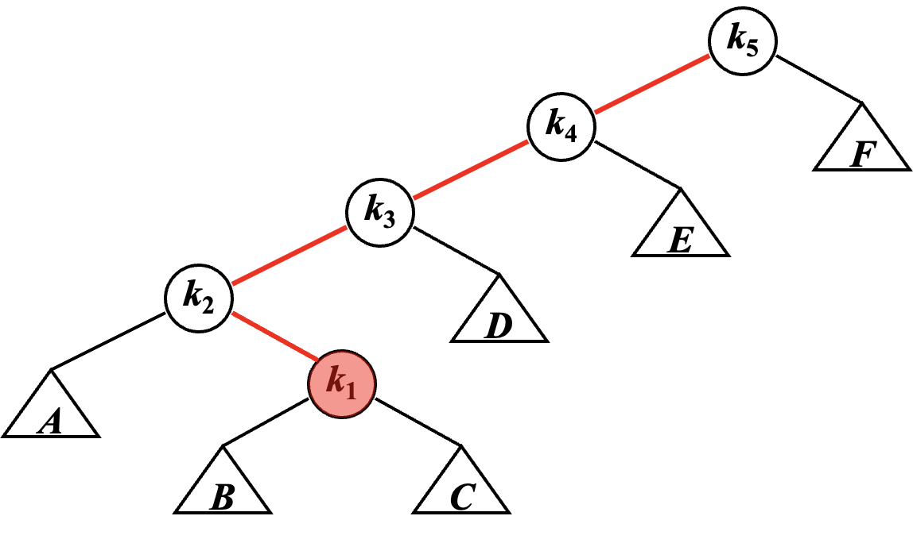
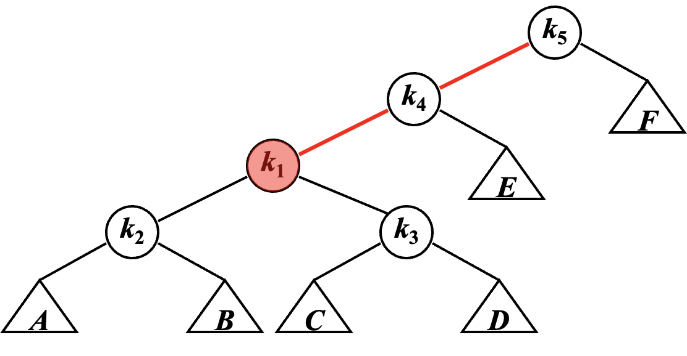

# Lecture 1 | AVL Trees & Splay Trees

!!! key-point "说明"
    原先安排在这一章节的摊还分析现在被迁移到了这个地方：[Topic 1 | Amortized Analysis](./Ex01.md)。

!!! info "阅读建议"
    因为没法在这里用代码写动画，所以我用 [Tab](https://facelessuser.github.io/pymdown-extensions/extensions/tabbed/?h=%3D%3D%3D#tabbed) 模拟了一下动画帧，可以手动切换这些标签来动态观察。一般这种内容的 Tab 标题都会是 `Frame {}`。

    === "Frame 1"
        Like
    === "Frame 2"
        Like this
    === "Frame 3"
        Like this!

## AVL 树

### 概念

!!! quote "link"
    OI Wiki: https://oi-wiki.org/ds/avl/

我们知道，对于一棵二叉搜索树，其对点的操作代价为 $O(\log n)$。然而在最坏情况下，它会退化成 $O(n)$，例如这是一棵只有左子树的链型二叉树，那么操作这里唯一的叶子节点就是 $O(n)$。

换句话来说，一棵二叉树的维护成本基本上与其高度正相关。因而一个很自然的想法是，如果我们想让一棵二叉树好维护，那么就希望它的高度尽可能低，而在点数固定的情况下，一种朴素的思想是让节点尽可能“均匀”地分布在树上。

!!! definition "height of a tree"
    **树的高度(Height of Tree)**等于其根节点到叶子节点的若干路径中，最大的距离（即边的数量），也就是深度最深的节点到根节点到距离。

    特别的，一棵空树的高度为 -1。

    > 说的通俗一些，就是树的层数。

---

#### AVL 树

而 AVL Tree 是一种**平衡(balanced)**的二叉搜索树，通过「高度」这个量，定义了「平衡」这件事。

!!! definition "AVL Tree"

    1. 一个空二叉树是一个 AVL 树；
    2. 如果二叉树 $T$ 是一个 AVL 树，则其左右子树 $T_l$ 和 $T_r$ 也都应该是 AVL 树，且有 $|h(T_l) - h(T_r)| \leq 1$；

    !!! definition "Balance Factor"
        一个节点的**平衡因子(Balance Factor)BF**用来描述一个节点的平衡状态，对于节点 $T_p$，它的左子树为 $T_l$，右子树为 $T_r$，则：

        $$
        BF(T_p) = h(T_l) - h(T_r)
        $$

    所以上面的第 2 条又可以写成：

    - 如果二叉树 $T$ 是一个 AVL 树，则其左右子树 $T_l$ 和 $T_r$ 也都应该是 AVL 树，且有 $BF(T_p) \in \{0, \pm 1\}$；

    > 说的通俗一些就是，AVL 树的每一个点都平衡，而平衡与否取决于节点的两个子树层数之差是否超过 1。

在这种定义下，AVL 树的高度可以证明为 $O(\log N)$，证明如下：

!!! proof "Height of AVL Trees"
    !!! inline note ""
        ```mermaid
        graph TD;
        A(("Root"))
        B[/"Left Subtree"\]
        C[/"Right Subtree"\]
        A === B
        A === C
        ```
    
    我们记 $n_h$ 是高度为 $h$ 的 AVL 树所包含的最少节点数，则有如下递推关系：

    $$
    n_h = \left\{
	    \begin{array}{l}
            1                       & (h = 0) \\
            2                       & (h = 1) \\
            n_{h-1} + n_{h-2} + 1   & (h > 1)
        \end{array}
    \right.
    $$

    发现 $n_h + 1$ 是 Fabnacci 数列。

    而对于如下斐波那契数列：

    $$
    F_i = \left\{
        \begin{array}{l}
            1                   & (i = 1) \\
            1                   & (i = 2) \\
            F_{i-1} + F_{i-2}   & (i > 2)
        \end{array}
    \right.
    $$

    其通项为：

    $$
    \begin{aligned}
        F_n &= \frac{1}{\sqrt{5}} \left( \left( \frac{1 + \sqrt{5}}{2} \right)^n - \left( \frac{1 - \sqrt{5}}{2} \right)^n \right) \\
            &\approx \frac{1}{\sqrt{5}} \left( \frac{1 + \sqrt{5}}{2} \right)^n \\
        \log{(F_n)} &\approx n
    \end{aligned}
    $$

    而 $n_h = F_{h+2}$，所以 $h \approx \log{(n_h)}$，也就是说 $h \approx \log{N}$。

---

#### 视角

而我们谈论 AVL 树时，我们希望以一个动态的视角来谈论 AVL 树，即讨论：某一棵树是否是 AVL 树、在某个操作后是否仍然是 AVL 树、如何将它重新变为 AVL 树。重点在于，讨论最后一个问题，即“重新变为 AVL 树”这个问题时，我们默认这棵树在一次其他操作之前是一棵 AVL 树。

实际上这是对问题的一种简化建模，它成为我们解决其他问题的最小单元和基础。

所以在这种模型下，我们需要定义两个东西：

!!! definition "Trouble Maker & Trouble Finder"
    以 🌰 来说明。
    
    !!! note ""
        === "Frame 1"
            下图为一个 AVL 树：

            ```mermaid
            graph TD;
            A(("8, BF=1"))
            B(("4, BF=0"))
            C(("9, BF=0"))
            D(("2, BF=0"))
            E(("6, BF=0"))
            A === B
            A === C
            B === D
            B === E
            ```
        
        === "Frame 2"
            现在我们插入 `5`：

            ```mermaid
            graph TD;
            A(("8, BF=2"))
            B(("4, BF=1"))
            C(("9, BF=0"))
            D(("2, BF=0"))
            E(("6, BF=1"))
            F(("5, BF=0"))
            A === B
            A === C
            B === D
            B === E
            E === F
            E === NULL
            ```

            我们发现，此时 `8` 的「平衡因子」变成了2，不再符合 AVL 树的要求，而这一切都是 `5` 的插入导致的——于是我们称像这里的 `8` 一样，由于某个点的插入，其「平衡因子」不再符合要求的点，为 Trouble Finder；而像这里的 `5` 一样，导致 Trouble Finder 出现的点，被称之为 Trouble Maker。

    形象地描述这件事就是，在动态插入 `5` 这个过程中，出现了一个 "Trouble"，导致这个树不再是 AVL 树，而 `5` 是这个 "Trouble" 的 "Maker"，`8` 是 "Finder"。

---

### 操作

本小节所需要讲的内容就是**[#视角](#视角)**中提到的“重新变为 AVL 树”这一视角，也就是 AVL 树的维护。

首先， 我们需要对 AVL 树的破坏情况进行分类，根据 "Trouble Finder"、"Related Trouble Finder's Child"、"Trouble Maker"这三个点的相对关系，分为 `LL`、`RR`、`LR`、`RL` 四种：

!!! note ""
    > 同心圆表示这个点是需要我们在后续操作中关注的。
    >
    > 此外，虽然实际情况下可能出现多个 Trouble Finder，但是为了简化问题，我们这里假设只有一个 Trouble Finder，或者说我们只关注**以「距离案发现场最近的 Trouble Finder」为根的子树**（这句话非常重要）。
    
    === "LL"
        ```mermaid
        flowchart TD
            A((("Trouble\nFinder")))
            B((("Left\nChild")))
            C(("Right\nChild"))
            D(("L Left\nChild"))
            DA[/"Left and Right Subtrees"\]
            E(("L Right\nChild"))
            EA[/"Left and Right Subtrees"\]
            F(("R Left\nChild"))
            FA[/"Left and Right Subtrees"\]
            G(("R Right\nChild"))
            GA[/"Left and Right Subtrees"\]
            H(("Trouble\nMaker"))
            A === B
            A === C
            B === D === DA === H
            B === E === EA
            C === F === FA
            C === G === GA
        ```
    === "RR"
        ```mermaid
        flowchart TD
            A((("Trouble\nFinder")))
            B(("Left\nChild"))
            C((("Right\nChild")))
            D(("L Left\nChild"))
            DA[/"Left and Right Subtrees"\]
            E(("L Right\nChild"))
            EA[/"Left and Right Subtrees"\]
            F(("R Left\nChild"))
            FA[/"Left and Right Subtrees"\]
            G(("R Right\nChild"))
            GA[/"Left and Right Subtrees"\]
            H(("Trouble\nMaker"))
            A === B
            A === C
            B === D === DA
            B === E === EA
            C === F === FA
            C === G === GA === H
        ```
    === "LR"
        ```mermaid
        flowchart TD
            A((("Trouble\nFinder")))
            B((("Left\nChild")))
            C(("Right\nChild"))
            D(("L Left\nChild"))
            DA[/"Left and Right Subtrees"\]
            E((("L Right\nChild")))
            EA[/"Left and Right Subtrees"\]
            F(("R Left\nChild"))
            FA[/"Left and Right Subtrees"\]
            G(("R Right\nChild"))
            GA[/"Left and Right Subtrees"\]
            H(("Trouble\nMaker"))
            A === B
            A === C
            B === D === DA
            B === E === EA === H
            C === F === FA
            C === G === GA
        ```
    === "RL"
        ```mermaid
        flowchart TD
            A((("Trouble\nFinder")))
            B(("Left\nChild"))
            C((("Right\nChild")))
            D(("L Left\nChild"))
            DA[/"Left and Right Subtrees"\]
            E(("L Right\nChild"))
            EA[/"Left and Right Subtrees"\]
            F((("R Left\nChild")))
            FA[/"Left and Right Subtrees"\]
            G(("R Right\nChild"))
            GA[/"Left and Right Subtrees"\]
            H(("Trouble\nMaker"))
            A === B
            A === C
            B === D === DA
            B === E === EA
            C === F === FA === H
            C === G === GA
        ```
    
    稍作解释，例如 `LR`，表示的是 Trouble Maker 在 Trouble Finder 的 L 子节点的 R 子树中。

    另外，对于我只在 `LR` 和 `RL` 中着重二级子节点，并不是笔误。之后会详细介绍。

---

#### LL & RR

!!! tip "废话"
    大部分教材都倾向于继续用“旋转”来概括这些方法，确实其实从抽象角度来讲至少 `LL` 和 `RR` 部分也还是像的，但是我觉得这并不利于记忆和理解这个过程，尤其是对于 `LR` 和 `RL` 的部分。
    
    所以在 `LL` 和 `RR` 部分，我还是会先介绍一下比较传统的，用“旋转”的方式来理解，之后我将尝试着用我自己的思路来讲。

##### “旋转”视角

`LL` 和 `RR` 这两种情况相对直观。由于它们的操作是对称的，所以我这里以 `LL` 为例。

```mermaid
    flowchart TD
        A((("Trouble\nFinder")))
        C[/"Right Subtree"\]

        subgraph SA["New Left Subtree"]
            
            subgraph SB["New L Left Subtree"]
                D[/"L Left Subtree"\]
                H(("Trouble\nMaker"))
            end

            B((("Left\nChild")))
            E[/"L Right Subtree"\]
        end
        
        A === B
        A === C
        B === D === H
        B === E
```

根据相关性质，我们得到这个模型有如下性质：

!!! feature "一些性质"

    1. $BF(\text{Trouble Finder}) = h(\text{New Left Subtree}) - h(\text{Right Subtree}) = 2$；
    2. $h(\text{New L Left Subtree}) - h(\text{L Right Subtree}) = 1$；
        - 如果此差为 0，则不应当成为 Trouble Maker，若此差为 2，则 Left Child 应当为 Trouble Finder；

现在我们希望在保留二叉搜索树的性质下，要让 $|BF(\text{Trouble Finder})|$ 变小，一个很自然的想法就是让 $h(\text{New Left Subtree})$ 去 +1，让 $h(\text{Right Subtree})$ 去 -1。

于是我们发现，这样的操作刚好：

!!! section "LL Single Rotation"

    > 在 Frame 2 和 Frame 3 之间添加的细线是为了表示这里 L Right Subtree 的转移方法，让 2 ~ 3 帧的“旋转”过程中更加清晰。

    > 此外，这里要素的命名都是基于 Frame 1 的，对于 Frame 4 来说 L Right Subtree 显然已经不是 L Right Subtree 了。

    === "Frame 1"
        ```mermaid
            flowchart TD
                A((("Trouble\nFinder")))
                B((("Left\nChild")))
                C[/"Right Subtree"\]
                D[/"L Left Subtree"\]
                H(("Trouble\nMaker"))
                E[/"L Right Subtree"\]
                
                A === B
                A === C
                B === D === H
                B === E
        ```
    === "Frame 2"
        ```mermaid
            flowchart TD
                A((("Trouble\nFinder")))
                B((("Left\nChild")))
                C[/"Right Subtree"\]
                D[/"L Left Subtree"\]
                E[/"L Right Subtree"\]
                H(("Trouble\nMaker"))
                
                A === B
                A --- E
                A === C
                B === D === H
                B === E
        ```
    === "Frame 3"
        ```mermaid
            flowchart TD
                A((("Trouble\nFinder")))
                B((("Left\nChild")))
                C[/"Right Subtree"\]
                D[/"L Left Subtree"\]
                E[/"L Right Subtree"\]
                H(("Trouble\nMaker"))
                
                B === D === H
                B --- E
                B === A
                A === E
                A === C
                
        ```
    === "Frame 4"
        ```mermaid
            flowchart TD
                A((("Trouble\nFinder")))
                B((("Left\nChild")))
                C[/"Right Subtree"\]
                D[/"L Left Subtree"\]
                E[/"L Right Subtree"\]
                H(("Trouble\nMaker"))
                
                B === D === H
                B === A
                A === E
                A === C
                
        ```
    > 你甚至能从整个框在 2 ~ 3 帧的变短感受到这个树的高度减少了x（逃）

那么还有一个问题是，如何证明这样变换能够保持 AVL 的性质呢？

我个人认为主要有两个维度，一是保持二叉搜索树的性质，二是保持平衡的性质，我的证明内容折叠起来了，建议读者可以先自己思考一下再展开看看我的想法。

??? proof "二叉搜索树性质的保持"
    { width=30% align=right }

    不知道读者是否发现，对于一个排列得当的二叉搜索树，如果我从左到右，使用一条竖直的扫描线扫描整个树，将会得到一个单调序列，这也正对应着这个二叉搜索树所维护的有序数列。

    基于这种论调，再回头看上面那个动态的过程，甚至是观察我在 2 ~ 3 帧画出来的这个三角形的旋转，就会发现这种旋转实际上只是在将节点上下移动，所以不改变二叉搜索树的性质。

??? proof "平衡的保持"

    让我们先回顾一下在上面给出的一些性质中的第 2 条： $h(\text{New L Left Subtree}) - h(\text{L Right Subtree}) = 1$。

    在仔细思考整个旋转过程中每一个 Subtree 的高度的变化，即可得到证明。    


而 RR Single Rotation 完全对称，所以不再赘述。

---

##### “换根”视角

现在我想尝试着用我自己的方式来理解这个问题。

首先让我们人力动画一下这个过程（划掉）：

!!! section "LL Single Rotation"

    > 此外，这里要素的命名都是基于 Frame 1 的，对于 Frame 4 来说 L Right Subtree 显然已经不是 L Right Subtree 了。

    === "Frame 1"
        ```mermaid
            flowchart TD
                A((("Trouble\nFinder")))
                B((("Left\nChild")))
                C[/"Right Subtree"\]
                D[/"L Left Subtree"\]
                H(("Trouble\nMaker"))
                E[/"L Right Subtree"\]
                
                A === B
                A === C
                B === D === H
                B === E
        ```
    === "Frame 2"
        ```mermaid
            flowchart TD
                A((("Trouble\nFinder")))
                B((("Left\nChild")))
                C[/"Right Subtree"\]
                D[/"L Left Subtree"\]
                H(("Trouble\nMaker"))
                E[/"L Right Subtree"\]
                
                A --- B
                A === C
                B === D === H
                B === E
        ```
    === "Frame 3"
        ```mermaid
            flowchart TD
                B((("Left\nChild")))
                D[/"L Left Subtree"\]
                E[/"L Right Subtree"\]
                H(("Trouble\nMaker"))
                A((("Trouble\nFinder")))
                C[/"Right Subtree"\]

                A === C
                B === D === H
                B === E
        ```
    === "Frame 4"
        ```mermaid
            flowchart TD
                B((("Left\nChild")))
                D[/"L Left Subtree"\]
                E[/"L Right Subtree"\]
                H(("Trouble\nMaker"))
                A((("Trouble\nFinder")))
                C[/"Right Subtree"\]

                A === C
                B === D === H
                A === E
        ```
    === "Frame 5"
        ```mermaid
            flowchart TD
                A((("Trouble\nFinder")))
                B((("Left\nChild")))
                C[/"Right Subtree"\]
                D[/"L Left Subtree"\]
                E[/"L Right Subtree"\]
                H(("Trouble\nMaker"))
                
                B === D === H
                B === A
                A === E
                A === C
                
        ```

首先，我们遇到的问题是什么？是 Trouble Maker 进来以后，Trouble Finder 发现 $h(T_l) - h(T_r) = 2$了，用通俗的话来说就是左子树太高了，然而在这种情况下，左子树依然还站在一个台子（Trouble Finder）上和 Trouble Finder 比身高，所以我们需要将它从台子上请下来。也就是说，既然左子树太高了，那么我们就不**希望**让它再成为谁的子树，因为成为谁的子树必然意味着这条路径会更长。

那么现在我们把它从台子上请下来，也就是说割裂它和 Trouble Finder 的亲子关系（对应 Frame 2）让它们同台“对抗”（这一步在 `LL` 和 `RR` 可能显得比较多余，但是在 `LR` 和 `RL` 就会让问题清晰很多）。

然而我们仍然需要让这个森林重新变回一个树，所以就需要重新从里面找到根节点，显然，只能选择 Trouble Finder **旁边** 的 Left Child。但是为了继续维护二叉搜索树的性质，所以我们需要将 L Right Subtree 移植到 Trouble Finder 必定空缺（因为这里原先是 Left Child）的左指针上。

OK，你可能觉得这个解释对于 LL Single Rotation 来说显得十分多此一举，但是这都是为了给后面做的铺垫，虽然这个方法看起来繁琐冗余，但是已经足以解释原先的 Single Rotation 无法解释的 LR & RL 操作方法。

---

#### LR & RL

首先我们需要知道为什么之前的方法不行，也是我觉得“旋转”这个做法在这个推进过程中比较割裂的地方：（对照 **[#旋转视角](#旋转视角)** 的内容阅读）我们发现，由于 LL 中的 Trouble Maker 在左侧子树上，所以在旋转过程中，相当于把它“拽”上来了。然而对于 L Right Subtree，无论是旋转前还是旋转后，为了维护二叉搜索树的性质，它都被接在了深度为 1 的节点上，换句话来说 L Right Subtree 贡献的高度并没有改变。对于 RL 的情况也是同理的。所以我们并不能使用 LL Single Rotation 的方法来解决这个问题。

!!! note "关于旋转视角"
    如果从旋转视角来考虑，确实也能考虑这个过程，但一方面过于复杂，一方面实际实现过程中也完全可以被优化，所以我希望使用换根的视角来理解这个问题。

那么我们换一个思路，用**[“换根”视角](#换根视角)**来看待这个问题：

!!! section "LR Rotation"
    > 这里两个 Subtree 接到同一个 Trouble Maker 的意思是 Trouble Maker 可以出现在两者任一中。

    === "Frame 1"
        ```mermaid
            flowchart TD
                A((("Trouble\nFinder")))
                B((("Left\nChild")))
                C[/"Right Subtree"\]
                D(("L Left\nChild"))
                DA[/"L Left Subtree"\]
                H(("Trouble\nMaker"))
                E((("L Right\nChild")))
                EA[/"L Left Subtree"\]
                EB[/"L Right Subtree"\]
                
                A === B
                A === C
                B === D === DA
                B === E === EA --- H
                E === EB --- H
        ```
    === "Frame 2"
        ```mermaid
            flowchart TD
                A((("Trouble\nFinder")))
                B((("Left\nChild")))
                C[/"Right Subtree"\]
                D(("L Left\nChild"))
                DA[/"L Left Subtree"\]
                H(("Trouble\nMaker"))
                E((("L Right\nChild")))
                EA[/"L Left Subtree"\]
                EB[/"L Right Subtree"\]
                
                A --- B
                A === C
                B === D === DA
                B --- E === EA --- H
                E === EB --- H
        ```
    === "Frame 3"
        ```mermaid
            flowchart TD
                
                B((("Left\nChild")))
                D(("L Left\nChild"))
                DA[/"L Left Subtree"\]
                H(("Trouble\nMaker"))
                E((("L Right\nChild")))
                EA[/"L Left Subtree"\]
                EB[/"L Right Subtree"\]
                A((("Trouble\nFinder")))
                C[/"Right Subtree"\]
                
                A === C
                B === D === DA
                E === EA --- H
                E === EB --- H
        ```
    === "Frame 4"
        ```mermaid
            flowchart TD
                
                B((("Left\nChild")))
                D(("L Left\nChild"))
                DA[/"L Left Subtree"\]
                H(("Trouble\nMaker"))
                E((("L Right\nChild")))
                EA[/"L Left Subtree"\]
                EB[/"L Right Subtree"\]
                A((("Trouble\nFinder")))
                C[/"Right Subtree"\]
                
                A === C
                B === D === DA
                E --- EA --- H
                E --- EB --- H
        ```
    === "Frame 5"
        ```mermaid
            flowchart TD
                
                D(("L Left\nChild"))
                B((("Left\nChild")))
                DA[/"L Left Subtree"\]
                E((("L Right\nChild")))
                EA[/"L Left Subtree"\]
                EB[/"L Right Subtree"\]
                H(("Trouble\nMaker"))
                A((("Trouble\nFinder")))
                C[/"Right Subtree"\]
                
                E === B
                E === A
                B === D === DA
                B === EA --- H
                A === EB --- H
                A === C
        ```

???+ extra "关于记忆"
    记忆这个操作如何做的话，我的记忆方法是这样的：

    === "Frame 1"
        ```mermaid
            flowchart TD
                A((("Trouble\nFinder")))
                B((("Left\nChild")))
                C[/"Right Subtree"\]
                D(("L Left\nChild"))
                DA[/"L Left Subtree"\]
                H(("Trouble\nMaker"))
                E((("L Right\nChild")))
                EA[/"L Left Subtree"\]
                EB[/"L Right Subtree"\]
                
                A === B
                A === C
                B === D === DA
                B === E === EA --- H
                E === EB --- H
        ```
    === "Frame 2"
        ```mermaid
            flowchart TD
                A((("Trouble\nFinder")))
                B((("Left\nChild")))
                C[/"Right Subtree"\]
                D(("L Left\nChild"))
                DA[/"L Left Subtree"\]
                H(("Trouble\nMaker"))
                E((("L Right\nChild")))
                EA[/"L Left Subtree"\]
                EB[/"L Right Subtree"\]
                
                A --- B
                A --- E
                A === C
                B === D === DA
                B --- E === EA --- H
                E === EB --- H
        ```
    === "Frame 3"
        ```mermaid
            flowchart TD
                A((("Trouble\nFinder")))
                B((("Left\nChild")))
                D(("L Left\nChild"))
                DA[/"L Left Subtree"\]
                H(("Trouble\nMaker"))
                E((("L Right\nChild")))
                EA[/"L Left Subtree"\]
                EB[/"L Right Subtree"\]
                C[/"Right Subtree"\]
                
                A --- B
                E --- B 
                E --- A
                B === D === DA
                B --- EA --- H
                A --- EB --- H
                A === C
        ```
    === "Frame 4"
        ```mermaid
            flowchart TD
                A((("Trouble\nFinder")))
                B((("Left\nChild")))
                D(("L Left\nChild"))
                DA[/"L Left Subtree"\]
                H(("Trouble\nMaker"))
                E((("L Right\nChild")))
                EA[/"L Left Subtree"\]
                EB[/"L Right Subtree"\]
                C[/"Right Subtree"\]
                
                E --- B 
                E --- A
                B === D === DA
                B --- EA --- H
                A --- EB --- H
                A === C
        ```

    用语言概括就是，找到关键的那三个点，然后把最下面的顶到上面去，剩下两个作为左右子树，原先的那个点的左右子树则对应地，左子树接到左边空缺的右子树上，右子树接到右边空缺的左子树上。

---

### 其他问题

!!! question "如果一个 Trouble 产生后，出现了多个 Trouble Finder，该如何处理？"

    首先，请回顾一下 **[#操作](#操作)** 中被加粗的这一句话，「以『距离案发现场最近的 Trouble Finder』为根的子树」。也就是说，我们现在已经有了解决最近的 Trouble Finder 的方案。

    感性的思考，AVL 的“平衡”可以由递归形式定义，具体来说衡量的是左右子树的“高度”差。当我们解决了一个 Trouble Finder，意味着我们让 Trouble Finder 的最高的那个子树高度 -1，这也意味着以 Trouble Finder 为根的那个子树高度 -1，这也意味着其所有父节点的平衡因子都会相应地变化。

    一个 Trouble 当且仅有一个 Trouble Maker，而且它必定是 Trouble Finder 所关注的那个“最长路径”的端点，这也意味着所有的子 Trouble Finder 都在对应的父 Trouble Finder 的“最长路径”上。而现在我们让子 Trouble Finder 唯一（如果不唯一，那在这个 Trouble Maker 到来之前就已经存在 Trouble 了）的最长路径也应当会 -1。而这必将导致其平衡因子的绝对值 -1。

---

## Splay 树

!!! quote "link"
    OI Wiki: https://oi-wiki.org/ds/splay/

Splay 树，即伸展树，想要解决的问题和 AVL 树类似，只不过 Splay 树希望达到的目标是在**摊还(Amortized)**复杂度$O(\log N)$的情况下完成大部分对点操作。

我们知道，为使 AVL 保持平衡，我们需要维护从根节点到 Trouble Maker 这条路径上所有点的平衡因子。而 Splay 则不再维护这些信息，这意味着我们无法保证 Splay 树的状态都是平衡的，但是我们希望它尽可能平衡。具体来说就是对于 $M$ 次任意操作，其时间复杂度都为 $O(M\log N)$，均摊下来这 $M$ 个操作每一个都需要 $O(\log N)$。

对于一个树，我们对其节点进行的操作可能是：**增**点、**删**点、**改**点、**查**点等等，而不同类型的操作开销可能不尽相同。简单的计算其平均值则忽略了这些操作之间互相的影响或者是操作频率的问题，所以我们这里使用**[摊还](#摊还)**复杂度来描述其效率。

> 关于摊还的问题我们还会在之后进一步深入。

那么说了这么多，Splay 是怎么实现这一目标的呢？

Splay 的核心思想就是，每当我们访问一个节点（比如查询某个点、插入某个点，甚至是删除某个点），我们就通过一系列操作将目标点转移到根部，形象上理解就是不断旋转整个树的构造，知道把点转到根部。

!!! eg ""
    例如我们查询点 $k_1$，则会通过旋转将它转到根。

    === "Frame 1"
        
    === "Frame 2"
        
    === "Frame 3"
        

    可以发现，Frame 1 ~ 2 就是我们前面提到过的 **[LR Rotation](#lr--rl)**，而 Frame 2 ~ 3 就是经过了两次 **[LL Rotation](#ll--rr)**。当然，在 Splay 里这些操作都有了新的名字。

这个例子只是为了给读者一个初始印象，之后我们将更详细、准确的介绍操作。

> （没玩过可能听不太懂）不知道大家有没有玩过那种电子游戏，就是有好多转盘，相邻转盘之间有交界处，这些交界点上都会有圆球，当一个转盘旋转的时候，其圆周上的球体都会跟着这个圆周转动。通过不停转动相邻的圆盘，我们可以实现把某个位置的圆球转移到另外一个位置。而 Splay 差不多是这么个感觉。

---

### 基本操作

首先我们做一个约定，对于任意一个节点 X，我们记其父节点为 P(Parent)，其父节点的父节点为 G(Grandparent)。

- 当我们访问到某个点 X 时：
    - 如果 P 是根节点，则直接进行一次 [Single Rotation](#ll--rr)，将 X 转到根节点；
    - 如果 P 不是根节点：
        - 当情况为 LR / RL 时，进行一次 [LR Rotation 或 RL Rotation](#lr--rl)，我们称之为 zig-zag；
        - 当情况为 LL / RR 时，进行两次 [Single Rotation](#ll--rr)，使得 X、P、G 的顺序逆转，像跷跷板一样，我们称之为 zig-zig；
    - 不断对 X 进行 Splay 操作，直到 X 成为根节点；


可以发现，其具体操作基本就和 AVL 树的相关操作有很大重合。

!!! feature "效果"
    Splaying not only moves the accessed node to the root, but also roughly halves the depth of most nodes on the path.

---

### 对点操作

由于 Splay Tree 除了在完成所有操作以后都需要进行一次 Splay 操作，其他部分都和 BFT 一样，所以这里只简单介绍一下 Splay 的部分。

!!! section "Find X"
    根据 BFT 的性质，可以在 $O(\log N)$ 的时间里找到 $X$，接下来通过旋转操作，将 $X$ 不断旋转至根，最终直接取出 Root 即为结果。   

!!! section "Remove X"
    根据 BFT 的性质，可以在 $O(\log N)$ 的时间里找到 $X$，接下来通过旋转操作，将 $X$ 不断旋转至根，接下来删除 Root 节点，并在维护 BFT 性质的情况下递归地合并左右子树即可。

!!! section "Find Max"
    根据 BFT 的性质，可以在 $O(\log N)$ 的时间里找到最大值，将它旋转到根部以后，可以发现它没有右子树，直接删掉就行。

---

### 摊还复杂度分析

!!! advice "前置阅读"
    关于摊还分析的基本知识，请查看 **[Topic 1 | Amortized Analysis](Ex01.md#摊还分析)**。

此处，我们将使用**势能法**来分析 Splay 的摊还复杂度，由于课件省略了很多细节上的解释，所以我这里会补充非常多内容。

!!! quote "reference"
    http://www2.hawaii.edu/~nodari/teaching/f19/scribes/notes06.pdf

开始分析之前，我们首先需要明确分析的目标：

对于 Splay，它不像我们在 **[Topic 1 | Amortized Analysis](Ex01.md#摊还分析)** 提到的那些案例一样，存在明显的减势和增势行为。对于 Splay 来说，所有我们提到的操作都依赖于将目标点旋转到根来实现，而这也成为其主要开销（部分常数操作显然被覆盖，插入之类的操作之所以能被忽略的原因，可以参考 ltgg 的**[这篇文章](https://www.yuque.com/27rabbit/gi2sf3/veonae)**）。其中我们会用到若干次 `zig`、`zig-zag`、`zig-zig` 的操作。

因此我们可以认为，我们要分析的目标为：

$$
T_{\text{rotate }x\text{ to root}} = T_{\text{zig}} + \sum{ {T_{\text{zig-zag}}}_i } + \sum{ {T_{\text{zig-zig}}}_i }
$$

> 上面三个部分每一个都有可能是 $0$，而 `zig` 最多只会发生一次！

接下来，我们需要设计一个势能函数 $\Phi(x)$，并且根据我们提到过的势能分析法的特性，$\Phi(x)$ 应该具有这么几个特征：

- 开销大的操作应当倾向让势能降，开销小的操作应当倾向让势能升；
- 势能高倾向于让某些操作开销大，势能低倾向于让某些操作开销小；
- $\Phi(final) > \Phi(0)$；

于是这里我们设计的势能函数为：

$$
\Phi(T) = \sum_{des \in T} \log Size(des) = \sum_{des \in T} Rank(des)\\
\begin{aligned}
    &\text{Where } des \text{ means the descendant of } T \text{,}\\
    &\text{and } Size(des) \text{ means the number of the nodes of } des \text{.} \\
    &\text{And we note } Rank(des) = \log Size(des) \approx Height(des) \text{.}
\end{aligned}
$$

用语言描述一下就是，对于某个子树 $T$，其势能函数 $\Phi(T)$ 等于<u>以所有它的后代为根</u>的子树的大小取对数以后求和。

!!! warning "Rank v.s. Height"
    这里需要注意的一个点是，虽然 $Rank(des) \approx Height(des)$，但是我们不应该用 $Height()$ 来代替 $Rank()$，主要原因是在旋转过程中，$Rank()$ 不会变化（因为 $Size()$ 不会变化），但是 $Height()$ 可能变化。换句话来说，如果选用 $Height()$ 作为势能函数，我们就不得已考虑整棵树，而非只需要考虑当前旋转涉及的子树。

关于正确性的说明，我会放在之后的过程中一个个插入，它们会被包裹在 `key-point` 文字框中，请注意这些内容。接下来我们就可以开始分析了，根据我们给定的目标：

$$
T_{\text{rotate }x\text{ to root}} = T_{\text{zig}} + \sum{ {T_{\text{zig-zag}}}_i } + \sum{ {T_{\text{zig-zig}}}_i }
$$

我们利用均摊分析，需要得到一个平滑上界：

$$
\hat{c}_{\text{rotate }x\text{ to root}} = \hat{c}_{\text{zig}} + \sum{ {\hat{c}_{\text{zig-zag}}}_i } + \sum{ {\hat{c}_{\text{zig-zig}}}_i }
$$

而我们需要证明 $\hat{c}_{\text{rotate }x\text{ to root}} = O(\log{N})$，现在我们需要分别分析 `zig`、`zig-zag`、`zig-zig`。

---

#### zig

!!! section "Amortized Analysis for Zig"
    

    $$
    \begin{aligned}
        {\hat{c}_{\text{zig}}}_i
        &= {c_{\text{zig}}}_i + \Phi_{i}(X) - \Phi_{i-1}(P) \\
        &= 1 + Rank_{i}(X) - Rank_{i-1}(X) +  Rank_{i}(P) - Rank_{i-1}(P)
    \end{aligned}
    $$

    观察配图，$X$ 多了 $P$ 和 $C$ 作为子嗣，而 $P$ 悲惨地失去了 $X$ 一族，甚至成了 $X$ 的后代，即 $X$ 盛 $P$ 衰，因此就有不等式：

    $$
    \left\{
        \begin{aligned}
            & Rank_{i}(X) - Rank_{i-1}(X) \geq 0\\
            & Rank_{i}(P) - Rank_{i-1}(P) \leq 0
        \end{aligned}    
    \right.
    $$

    所以我们可以做简单的缩放：

    $$
    \begin{aligned}
        {\hat{c}_{\text{zig}}}_i
        &= 1 + \underbrace{Rank_{i}(X) - Rank_{i-1}(X)}_{\geq 0} + \underbrace{Rank_{i}(P) - Rank_{i-1}(P)}_{\leq 0} \\
        &\leq 1 + Rank_{i}(X) - Rank_{i-1}(X)
    \end{aligned}
    $$

!!! key-point "为什么不是另外一种选择 / 为何这样缩放？"
    > 这一部分在 cy 的 PPT 里并没有详细说明，但是我认为这是这个分析方法成立一个非常重要的因素！

    也许你已经注意到了，又或者你了解了之后两种分析，又回过头来思考发现，这里其实存在另外一种更紧凑的缩放方法（甚至不能说“缩放”），观察到 $Size_{i}(X) =Size_{i-1}(P)$，所以：
    
    $$
    \begin{aligned}
        {\hat{c}_{\text{zig}}}_i
        &= 1 + Rank_{i}(P) - Rank_{i-1}(X) + \underbrace{Rank_{i}(X) - Rank_{i-1}(P)}_{= 0} \\
        &= 1 + Rank_{i}(P) - Rank_{i-1}(X)
    \end{aligned}
    $$

    但是这不便于我们之后的传递。还记得我们要求的目标吗？
    
    $$
    \hat{c}_{\text{rotate }x\text{ to root}} = \hat{c}_{\text{zig}} + \sum{ {\hat{c}_{\text{zig-zag}}}_i } + \sum{ {\hat{c}_{\text{zig-zig}}}_i }
    $$
    
    我们之后需要对各种 $\hat{c}$ 进行求和，而每一次的 $X,\;P,\;G$ 都是不同的，为了在求和的时候实现错位相减，我们必须保证缩放得到的结果具有一定的**传递性质**，或者说在求和过程中能够达到**裂项相消**的效果。

    而对于 Splay 来说，我们的操作传递，正是通过不断将我们关注的 $X$ 点**递归地向上旋转**实现的。换句话来说，$\Phi_{i}(X)$ 中的 $X$，就是 $\Phi_{i-1}(X)$ 中的 $X$，如此我们最终可以得到 $\Phi_{n}(X) - \Phi_{0}(X)$，而其中一个是根，一个是我们一开始打算操作的那个点。

    于是我们理想的缩放目标就是 $k(Rank_{i}(X) - Rank_{i-1}(X)) \;\; \text{where } k \text{ is fixed for all the terms}$。

    ---

    > 不过你可能又要提问了，`zig` 分析的结果里不是有个 ${c_{\text{zig}}}_i = 1$ 吗？
    > 
    > 这是因为 `zig` 最多只发生一次，所以这个常数是没有影响的。

!!! key-point "真的需要都缩放到相同的 k 吗"
    随之而来的，一个需要讨论的问题是「$\text{where } k \text{ is fixed for all the terms}$」真的重要吗，换句话来说，我们必须保证三个部分缩放出来都具有相同的 $k$ 吗？
    
    首先，重要肯定是重要的，只不过在这个问题中，由于我们旋转的方向都是向上，所以 $Rank_{i}(X) \geq Rank_{i-1}(X)$，因此我们只需要最后将它们一起都缩放到 $k_{overall}\max\{k_\text{zig}, k_\text{zig-zag}, k_\text{zig-zig} \}$ 就可以了。

---

#### zig-zag


!!! section "Amortized Analysis for Zig-Zag"
    

    $$
    \begin{aligned}
        {\hat{c}_{\text{zig-zag}}}_i 
        &= {c_{\text{zig-zag}}}_i + \Phi_{i}(X)- \Phi_{i-1}(G) \\
        &= 2 + Rank_{i}(X) - Rank_{i-1}(X) + Rank_{i}(P) - Rank_{i-1}(P) + Rank_{i}(G) - Rank_{i-1}(G)
    \end{aligned}
    $$

    观察配图，$X$ 又一次绝地反击，成为它爸爸和爷爷共同的爸爸；$G$ 损失最惨重，丢掉了 $A,\;B$ 两族子嗣。

    在这次的缩放中，根据我们之前在 `key-point` 里提到的，我们需要将它缩放到 $k(Rank_{i}(X) - Rank_{i-1}(X))$ 的形式，并且由于 `zig-zig` 会多次发生，所以我们也得想办法搞掉这里的 ${c_{\text{zig-zag}}}_i = 2$，否则最后就会出现一个 $2n$ 的 term，而我们的证明目标是 $\log{N}$，所以我们必须将这个 $2$ 消掉。而为了消除这个 $2$，我们需要先引入一个引理：

    !!! feature "Lemma 1"
        由于 $y = \log{x}$ 是单调的凸函数，所以有 $\frac{\log{x} + \log{b}}{2} \leq \log {\frac{a+b}{2}}$。

        而在 Splay 的均摊复杂度分析过程中，我们的 $\log{x}$ 指的是 $\log_2{x}$，因此有：

        $$
        \begin{aligned}
            \log{a} + \log{b} 
            &= 2\left( \frac{\log{a} + \log{b}}{2} \right) \\
            &\leq 2\left( \log{\frac{a+b}{2}} \right) \\
            &= 2\left( \log{(a+b)} - \log{2} \right) \\
            &= 2 \log{(a+b)} - 2 \\
        \end{aligned}
        $$

    看到这里出现了一个 $-2$ 我们就能长舒一口气了，这下 ${c_{\text{zig-zag}}}_i = 2$ 死到临头咯！
    
    接下来我们继续分析，对照配图看，我们可以继续分析得到这些相等或不等关系：

    $$
    \left\{
        \begin{aligned}
            Rank_{i}(X) &= Rank_{i-1}(G) \\
            Rank_{i}(P) + Rank_{i}(G)   &= \log{Size_{i}(P)} + \log{Size_{i}(G)} \\
                                        &\leq 2\log{\left(Size_{i}(P)+Size_{i}(G)\right)} - 2 & \text{(Lemma 1)}\\
                                        &\leq 2\log{\left(Size_{i}(P)+Size_{i}(G)+1\right)} - 2 \\
                                        &\leq 2\log{Size_{i}(X)} - 2 \\
                                        &\leq 2Rank_{i}(X) - 2 \\
            Rank_{i-1}(P) + Rank_{i-1}(X) &\geq 2Rank_{i-1}(X) \\
        \end{aligned}
    \right.
    $$

    于是我们可以实现缩放：

    $$
    \begin{aligned}
        {\hat{c}_{\text{zig-zag}}}_i 
        &= 2 + Rank_{i}(X) - Rank_{i-1}(X) + Rank_{i}(P) - Rank_{i-1}(P) + Rank_{i}(G) - Rank_{i-1}(G) \\
        &= 2 + \left( Rank_{i}(X) - Rank_{i-1}(G)\right ) 
             + \left( Rank_{i}(P) + Rank_{i}(G) \right)
             - \left( Rank_{i-1}(P) + Rank_{i-1}(X) \right) \\
        &\leq 2 + 0 + 2Rank_{i}(X) - 2 + 2Rank_{i-1}(X) \\
        &= 2\left(Rank_{i}(X) - Rank_{i-1}(X)\right)
    \end{aligned}
    $$

    皆大欢喜！

---

#### zig-zig

!!! section "Amortized Analysis for Zig-Zig"
    

    $$
    \begin{aligned}
        {\hat{c}_{\text{zig-zig}}}_i 
        &= {c_{\text{zig-zig}}}_i + \Phi_{i}(X)- \Phi_{i-1}(G) \\
        &= 2 + Rank_{i}(X) - Rank_{i-1}(X) + Rank_{i}(P) - Rank_{i-1}(P) + Rank_{i}(G) - Rank_{i-1}(G)
    \end{aligned}
    $$
    
    为了实现 `zig-zig` 的缩放，我们还需要对 Lemma 1 进行一个活用。对照配图，得到：

    $$
    \begin{aligned}
        Rank_{i}(G) + Rank_{i-1}(X) 
            &\leq 2\log{\left( 
                \underbrace{Size_{i}(G)}_{\mathbf{C}+\mathbf{D}+G}
              + \underbrace{Size_{i-1}(X)}_{\mathbf{A}+\mathbf{B}+X}
            \right)} - 2 & \text{Lemma 1} \\
            &\leq 2\log{\left( Size_{i}(G) + Size_{i-1}(X) + 1 \right)} - 2 & \\
            &= 2\log{\left( Size_{i}(X) \right)} - 2 \\
            &= 2Rank_{i}(X) - 2 \\
        Rank_{i}(G) 
            &\leq 2Rank_{i}(X) - Rank_{i-1}(X) - 2
    \end{aligned}
    $$

    > 这一步很难想，但是也非常关键。

    于是，我们有如下这些不等式：

    $$
    \left\{
        \begin{aligned}
            Rank_{i}(X) &= Rank_{i-1}(G) \\
            Rank_{i}(G) \leq 2Rank_{i}(X) - Rank_{i-1}(X) - 2 \\
            Rank_{i}(P) \leq Rank_{i}(X) \\
            Rank_{i-1}(P) \geq Rank_{i-1}(X)
        \end{aligned}
    \right.
    $$

    于是我们就可以对其进行<s>诡异</s>的缩放：

    $$
    \begin{aligned}
        {\hat{c}_{\text{zig-zig}}}_i 
        &= 2 + Rank_{i}(X) - Rank_{i-1}(X) + Rank_{i}(P) - Rank_{i-1}(P) + Rank_{i}(G) - Rank_{i-1}(G) \\
        &= 2 + \left( Rank_{i}(X) - Rank_{i-1}(G) \right)
             + Rank_{i}(G)
             + Rank_{i}(P)
             - Rank_{i-1}(P)
             - Rank_{i-1}(X) \\
        &\leq 2 + 0 
                + \left( 2Rank_{i}(X) - Rank_{i-1}(X) - 2 \right) 
                + Rank_{i}(X)
                - Rank_{i-1}(X)
                - Rank_{i-1}(X) \\
        &= 3\left( Rank_{i}(X) - Rank_{i-1}(X) \right)
    \end{aligned}
    $$

    😩 至此，我们总算是把牛鬼蛇神的 `zig-zig` 的证明也给搞定了。

---

#### 合并

!!! section "Amortized Analysis for Splay"
    至此，对于三种操作，我们都得到了它们的均摊上界：

    $$
    \begin{aligned}
        {\hat{c}_{\text{zig}}}_i &\leq 1 + Rank_{i}(X) - Rank_{i-1}(X) \\
        {\hat{c}_{\text{zig-zag}}}_i &\leq 2\left(Rank_{i}(X) - Rank_{i-1}(X)\right) \\
        {\hat{c}_{\text{zig-zig}}}_i &\leq 3\left(Rank_{i}(X) - Rank_{i-1}(X)\right)
    \end{aligned}
    $$

    根据我们在 `key-point` 框「真的需要都缩放到相同的 k 吗」中的内容，我们接下来可以将它们的 $k$ 都缩放为 $3$：

    $$
    \begin{aligned}
        {\hat{c}_{\text{zig}}}_i &\leq 1 + 3\left( Rank_{i}(X) - Rank_{i-1}(X) \right) \\
        {\hat{c}_{\text{zig-zag}}}_i &\leq 3\left( Rank_{i}(X) - Rank_{i-1}(X) \right) \\
        {\hat{c}_{\text{zig-zig}}}_i &\leq 3\left( Rank_{i}(X) - Rank_{i-1}(X) \right)
    \end{aligned}
    $$

    于是，我们就可以得到最终的均摊上界：

    $$
    \begin{aligned}
        \hat{c}_{\text{rotate }x\text{ to root}} 
            &= \hat{c}_{\text{zig}} + \sum{ {\hat{c}_{\text{zig-zag}}}_i } + \sum{ {\hat{c}_{\text{zig-zig}}}_i } \\
            &= O(1) + 3\left( Rank_{N}(X) - Rank_{0}(X) \right) \\
            &= O(\log{N})
    \end{aligned}
    $$

    > 可以仔细想想求和式是如何“相消”得到最后的式子的，这里的 $\sum {\hat{c}_\text{...}}_i$ 的 $i$ 并不是在求和式中各自连续的，但是三个 term 放在一起，则可以囊括 $i\in\{1,2,...,N\}$