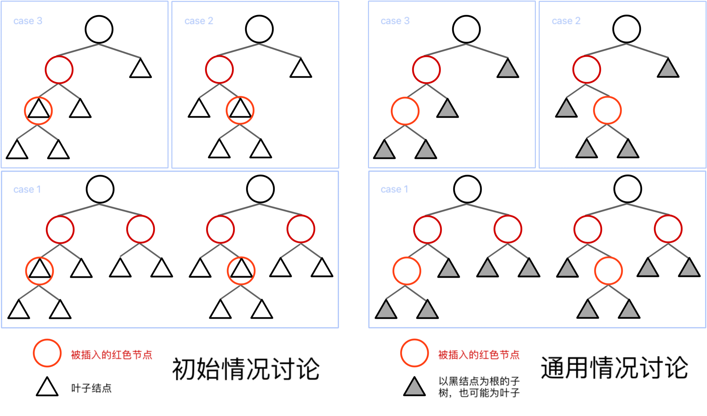
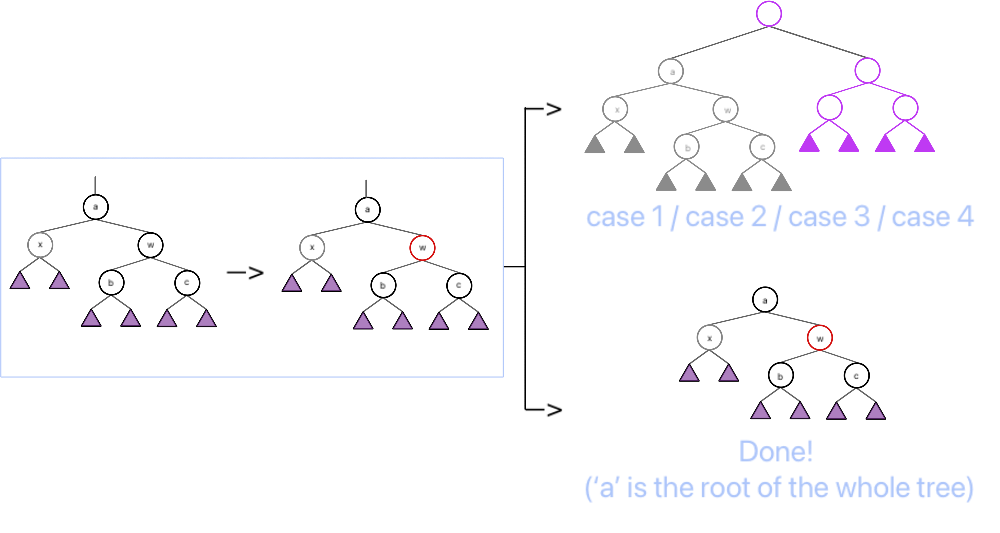
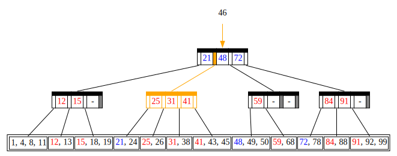
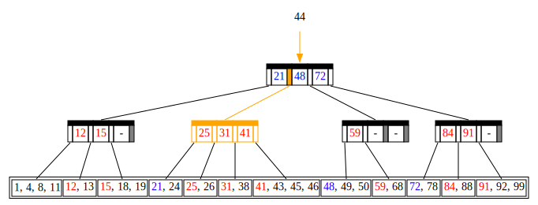

# Lecture 2 | Red Black Tree & B+ Tree

!!! info "说明"
    而为了提高笔记整理效率，可能会考虑用更多的引用和更简单的语言。如果您觉得有哪里说的不够清楚，请直接在评论区狠狠 blame 我！

---

## 红黑树

!!! quote "link"
    OI Wiki: https://oi-wiki.org/ds/rbtree/
    
    Wikipedia: https://en.wikipedia.org/wiki/Red%E2%80%93black_tree

---

### 概念

顾名思义，**红黑树(Red Black Tree)**就是一种节点分类为红黑两色的，比较平衡的二叉搜索树。只不过不同于 AVL 树，红黑树的“平衡”性质是通过**黑高(black height)**来定义的。接下来依次给出红黑树的定义和黑高的定义。

!!! definition "Red Black Tree"
    <center>
        
    </center>

    红黑树是满足如下性质的一种二叉搜索树：

    !!! feature "Properties of RBTree"

        !!! extra \@cy's PPT
            1. Every node is either red or black.
            2. The root is black.
            3. Every leaf (`NIL`) is black.
            4. if a node is red, then both its children are black.
            5. For each node, all simple paths from the node to descendant leaves contain the same number of black nodes.

        > ch 老师说，希望我们能把这五条性质熟练记住，<s>怎么可能（逃）</s>。

        !!! warning "说明"
            由于这里的“叶子结点”被重新定义了，为了描述方便，我现在称所有两个子结点都是 `NIL` 的结点为**末端结点**（也就是通俗意义上的叶子结点）。而这个定义**只是我自己说说的**！

        ??? extra "\@Wiki"
            6. Every node is either red or black.
            7. All `NIL` nodes (figure above) are considered black.
            8. A red node does not have a red child.
            9. Every path from a given node to any of its descendant `NIL` nodes goes through the same number of black nodes.


        ??? extra "\@OI Wiki"

            1. 每一个节点要么是**红**色，要么是**黑**色；
            2. `NIL` 节点（空叶子节点）为**黑**色；
            3. **红**色节点的子节点必须为**黑**色；
            4. 从根节点到 `NIL` 节点的每条路径上的**黑**色节点数量相同；

!!! definition "black height, bh"
    特定节点的黑高，等于该节点到叶结点到简单路径中（**不包括自身**），黑色节点到数量。


接下来为了加深理解，有一些辨析可以做：

!!! note ""
    === "T1"
        === "题面"
            下图的红黑树是否合法？

            
        === "答案"
            
            不合法。

            `16` 号节点的右儿子是一个黑叶子，而这个叶子到根的路径上只有 3 个黑节点，而其他叶子到根都有 4 个黑节点。

            所以我们需要**警惕只有一个非叶儿子的红色节点**。
    === "T2"
        === "题面"
            下图的红黑树是否合法？

            
        === "答案"
            
            合法。

    ---

    根据 T1 的解析，我们得到这样一个结论：

    **合法红黑树不存在只有一个非叶子节点的红色节点！**

    or

    **合法红黑树的红色节点的两个子节点一定都是叶子或都不是叶子！**

此外，关于红黑树的高，我们有如下性质：

!!! feature "property about height of RBTree"
    一个有 $N$ 个内部节点（不包括叶子结点）的红黑树，其高度最大为 $2\log_2 (N+1)$。

    ??? proof "the proof of the property"
        > [关于黑高和点数的关系](https://stackoverflow.com/questions/70944386/maximum-height-of-a-node-in-a-red-black-tree)。
        
        1. 首先我们有 $N \geq 2^{bh}-1$，也就是 $bh \leq \log_2 (N+1)$；
        2. 然后显然有 $2 bh(Tree) >= h(Tree)$

---

### 操作

!!! warning "提醒"
    **我们这里介绍的都是 bottom-up 的思路**，不同于 AVL 树，红黑树是存在 top-down 的操作方法的，而这也是红黑树一个非常强大的优势。但是我们不在这里详细展开。

同 AVL 树的调整操作类似，红黑树的调整操作也是左右对称的，所以我们也仍然只讨论一侧。

以及，由于我们并不确定附近的节点是否真的有子节点

---

#### 插入

我们知道，对**黑高**有贡献的只有黑色节点，因此 `NIL` 节点被一个**红色**节点置换并不会改变一颗红黑树的黑高，然而对于红色节点，却有着红色结点不能相邻的限制。

因此，“插入”操作的主要思路就是，先将整个红黑树当作一个普通的二叉搜索树，将目标数据插入到树的末端（也就是置换一个 `NIL` 节点），并将它染为红色，再调整使之在保证**黑高不变**的情况下，满足**红色节点不能相邻**的要求。

现在，我们记这个被插入的节点为 `x`，任意一个节点 `node` 的父节点为 `node.p`，则：

1. 如果 `x.p` 是黑色的，那么我们不需要做任何调整；
2. 如果 `x.p` 是红色的，那么我们需要进行调整；
   - 此时因为原来的树符合红黑树的性质，`x.p.p` 显然是黑色的；

根据这些讨论，我们就能列举出来一个红色的点被插入后，在 `2.` 的情况下所有的**初始情况**，即下面第一张图。

{ loading=lazy }

由于红黑树的操作中，有一部分需要进行递归转移，而其中中间步骤出现了很多同构的结构，所以为了化简 pipeline，我们对其进行一下统一，也就是上面第二张图。

!!! tip "提示"
    我需要先做一个解释，如果看不懂可以暂时忽略，看 case 1 的处理时再会过来看这一条。
    
    这里的橙色结点，也就是标为“被插入的红色节点”的结点，实际过程中并不一定指的是客观上，被插入的那个点，也可能是在 case 1 向上递归时，简化的原来那颗子树。

    换句话来说，这里的“被插入的红色节点”，实际上可能是指「**导致调整出现的红根子树**」。

接下来我们来讨论各种情况要怎么处理。

!!! warning "说明"
    这里 case 1 ~ case 3 的编号主要是为了和课程 ppt 对标，但是接下来你会发现我是按照 case 3 -> case 1 来介绍操作的，这是因为我觉得这样安排更合理，而非排版混乱。

???+ section "Insertion / case 3"
    对于 case 1， 我们高兴地发现，这样的一次染色和一次旋转刚好能让这棵子树完成调整！

    

???+ section "Insertion / case 2"
    对于 case 2，我们可以直接进行一个 Rotation 操作将它转化为 case 3。

    

???+ section "Insertion / case 1"
    对于 case 1，图中的两种情况是等价的。所以我们只展示其中一种。

    我们只需要将图中的根节点**染红**，将根的两个子节点**染黑**，类似于将黑节点“下放”。

    
    
    此时可以保证这整个子树必定是黑高不变（我们暂时包括根节点）、红点不邻的。然而我们并不知道这个根的父亲是否是红色节点，倘若其根的父亲是红色节点，那么我们还需要向上递归，继续调整。若这子树的根没有父节点，则直接染黑红根即可。但倘若子树根节点的父亲是黑节点，那么我们就调整完毕了。

    倘若之前没有理解「Insertion / case 3」前面的说明，那么现在就可以回去再看看了。

在这三个过程中，我们观察到，只有 case 1 的转化会导致我们递归向上，而 case 2 向 case 3 的转化并不会导致我们改变关注的子树的范围。

为了更清晰地看出各个方法之间的转化关系，于是我们可以画一个状态机：

!!! key-point ""

    === "不分离初始状态"
        ```mermaid
        graph LR;
        A["case 1"]
        B["case 2"]
        C["case 3"]
        D(["finish"])

        A ===>|"C"| B --->|"R"| C
        A ===>|"C"| A --->|"C"| D
        A ===>|"C"| C --->|"C&R"| D
        ```

    === "分离初始状态"
        ```mermaid
        graph LR;
        A(["case 1 (initial)"])
        AA["case 1"]
        B(["case 2 (initial)"])
        BB["case 2"]
        C(["case 3 (initial)"])
        CC["case 3"]
        D(["finish"])

        A ===>|"C"| AA ===>|"C"| BB
        AA ===>|"C"| AA --->|"C"| D
        AA ===>|"C"| CC

        A --->|"C"| D
        A ===>|"C"| BB --->|"R"| CC
        A ===>|"C"| CC --->|"C&R"| D
        B --->|"R"| CC
        C --->|"C&R"| D
        ```

    注意，状态机中的**粗线**表示转换过程中，我们关注的“子树”向上攀升了一级；而**细线**表示我们关注的子树仍然是这一层的那一棵。以及，`C` 表示染色操作，`R` 表示旋转操作。

    其中，任何一个情况都可以作为一个初始情况。所以可以数出，到达 finish 的路径中，最多出现 2 次 Rotation（case 2 -> case 3 -> finish）。

---

#### 删除

关于删除操作，下面这个视频讲的很清晰！只不过我个人感觉它的 case 1 不是很清楚。

👉 **[红黑树快速入门 - 04删除](https://www.bilibili.com/video/BV1uZ4y1P7rr/?spm_id_from=333.880.my_history.page.click&vd_source=13807e82155f985591ed6f1b4e3434ed)**

首先，如果我们要删除的结点出度为 2（不算 `NIL`），那么可以将它与左子树的最大值或者右子树的最小值的**值互换**（颜色不换）；如果要删除的结点出度为 1（不算 `NIL`），则可以直接用它唯一的非叶子节点替换它。可以证明在二叉搜索树里这些操作是可行的。此时我们要删除的点的所有情况就都被转化到末端结点了，也就是说现在我们要删的结点的两个子节点都是叶结点。

于是，我们把所有情况都转化为了**删除末端结点**的情况。

接下来我们来考虑这个末端结点的颜色。如果这个末端结点是**红色**节点，那么我们知道，**直接删除**这个节点是没有问题的（[#插入](#插入)的第一句话）；而如果这个末端结点是**黑色**的，那么显然，直接删除是不行的。

因此，现在我们只需要讨论删除一个**黑色**的**末端结点**（其两个子节点都是 `NIL`）该如何操作。

!!! warning "说明"
    虽然我想尽可能拟合 cy 的 ppt，但是我第一遍实在没看懂，所以 case 的编号我就按照上面那个视频来了。

    这是 case 序号的对应关系：

    |my|cy's||my|cy's||
    |---|---|---|---|---|---|
    |**case 1**|case 2||**case 2**|case 4||
    |**case 3**|case 3||**case 4**|case 1||

我们根据情况，将情况分为四种：

<center>{ width=90% }{ loading=lazy }</center>

需要做一下简单说明，类比我们在**[#插入](#插入)**，在删除过程中也存在需要向上递归的情况。与「被插入的红色节点」类似的，我们这里的「需要被删除的目标点」，也应当被看作「导致调整出现的子树」，更进一步的，可以定义成「**由于删除结点，黑高 -1 的子树**」，请记住这个定义，这会让之后的递归操作变得自然。

!!! question "何时删除那个结点？"
    虽然我们对「需要被删除的目标点」进行了递归的扩展定义，但是在第一层我们就可以直接将它删掉了。而这个点被删除造成的影响，已经由「**由于删除结点，黑高 -1 的子树**」继承了。

类似于我们在「Insertion / case 3」里提到的“下放”黑节点，删除操作的思路基本上是“上放”黑节点，或者说“吸纳”黑节点。这个“吸纳”的行为，指的是一个黑点，原来只为右子树中的所有路径提供了黑高，现在通过将黑色转移到父亲节点，同时为左子树的所有路径也提供了黑高。

接下来我们逐个分析变化：

!!! section "Deletion / case 1"
    虽然大部分教程都把 case 1 当作一个 case，但是我觉得完全可以把它按照 a 节点的红黑，分为两种情况。

    

    !!! section "Deletion / case 1.1" 
        当 a 为**红**根时，由于 x 贡献了（相对于原红黑树）-1 的黑高，为了保证整个子树贡献的黑高不变，我们考虑把 w 的黑高“上放”到 a 上，也就是从下面“吸纳”上来。

        

    !!! section "Deletion / case 1.2"
        当 a 为**黑**根时，我们没有空余的位置来“吸纳” w 的黑高，但是左子树和右子树的不平衡是必须解决的，而我们绝不能寄希望于“在不知道有没有红色节点的 b 和 c 的子树中去寻找红色节点”这个想法。
        
        所以我们可以仿照「Insertion / case 3」，将整个树标记为灰色——「**由于删除结点，黑高 -1 的子树**」，然后进一步根据其父亲的情况递归到其他 case。其中，当我们递归到 a 是整个树的根时可以退出，因为这相当于整个树的黑高 -1，不影响红黑性质。

        

!!! section "Deletion / case 2"
    画不动图了，先语言描述一下。
    
    1. 将 w 染为 a 的颜色，再将 a 和 c 染成黑色；
    2. 将 a 左旋，使 w 成为这个子树新的根，a 成为 w 的左儿子，b 成为 a 的右儿子；
    3. 调整结束；

!!! section "Deletion / case 3"
    画不动图了，先语言描述一下。

    1. 交换 b 和 w 的颜色；
    2. 将 w 右旋，使 b 成为 a 的右儿子，w 成为 b 的右儿子，b 的右儿子成为 w 的左儿子；
    3. 此时情况转化为 case 2；

!!! section "Deletion / case 4"
    画不动图了，先语言描述一下。

    1. 交换 a 和 w 的颜色；
    2. 将 a 左旋，使 w 成为这个子树新的根，a 成为 w 的左儿子，b 成为 a 的右儿子；
    3. 此时根据子树 a 的情况，转化为 case 1.1 / case 2 / case 3；


!!! key-point ""

    === "区分 case 1.1 和 case 1.2"
        ```mermaid
        graph LR;
        A1["case 1.1"]
        A2["case 1.2"]
        B["case 2"]
        C["case 3"]
        D["case 4"]
        E["finish"]

        A1 --->|"C"| E
        A2 ===>|"C"| A1
        A2 ===>|"C"| A2
        A2 ===>|"C"| B
        A2 ===>|"C"| C
        A2 ===>|"C"| D
        C --->|"C&R"| B --->|"C&R"| E
        D ===>|"C&R"| A1
        D ===>|"C&R"| B
        D ===>|"C&R"| C
        ```
    === "不区分 case 1.1 和 case 1.2"
        ```mermaid
        graph LR;
        A["case 1"]
        B["case 2"]
        C["case 3"]
        D["case 4"]
        E["finish"]

        A --->|"C\nfrom case 1.1"| E
        A ===>|"C\nfrom case 1.2"| A
        A ===>|"C\nfrom case 1.2"| B
        A ===>|"C\nfrom case 1.2"| C
        A ===>|"C\nfrom case 1.2"| D
        C --->|"C&R"| B --->|"C&R"| E
        D ===>|"C&R\nto case 1.1 "| A
        D ===>|"C&R"| B
        D ===>|"C&R"| C
        ```
    
    注意，状态机中的**粗线**表示转换过程中，我们关注的“子树”向上或向下转移了一级（由 case 4 出发时下降，由 case 1.2 出发时上升）；而**细线**表示我们关注的子树仍然是这一层的那一棵。以及，`C` 表示染色操作，`R` 表示旋转操作。

    其中，任何一个情况都可以作为一个初始情况。所以可以数出，到达 finish 的路径中，最多出现 3 次 Rotation（case 4 -> case 3 -> case 2 -> finish）。

---

根据前面状态机的相关内容，我们不难得到这张表格，它统计的是 Rotation 在不同数据结构、不同操作中出现的数量：

|Option|AVL Tree|RB Tree|
|----|----|----|
|Insertion|$\leq 2$|$\leq 2$|
|Deletion|$O(\log N)$|$\leq 3$|

---

## B+ Tree

!!! quote "link"
    OI Wiki: https://oi-wiki.org/ds/bplus-tree/
    
    Wiki: https://en.wikipedia.org/wiki/B%2B_tree

---

### 概念

B+ 树是一种用树状形式维护有序数列比较信息的数据结构，其增改操作拥相对于二叉树结构更加稳定的对数时间复杂度，通常用于数据库和操作系统的文件系统中。

!!! definition "B+ Tree"
    
    如下图就是一颗 $M=4$ 的 B+ 树，可以对照着这个例子来理解性质。

    

    更一般地来说，B+ 树满足如下性质：

    !!! feature "property of B+ Tree"
        \@cy's PPT

        1. The root is either a leaf or has between $2$ and $M$ children.
        2. All nonleaf nodes (except the root) have between $\lceil M/2 \rceil$ and M children.
        3. All leaves are at the same depth.
        
        > Assume each nonroot leaf also has between $\lceil M/2 \rceil$ and $M$ children.

    所有真实的数据都被存储在叶子结点中，形成一个有序的数列。而非叶子结点中第 `i` 个键值等于其第 `i+1` 棵子树的最小值（在上图中表现为颜色相同的一对上下结点），因此非叶结点最多存 $M-1$ 个值。

    ??? tip "发现"
        于是我们发现这样一个性质：在存储数值不重复的情况下，非叶结点存储的键值都不相同。

        证明很简单，对于任意一个非叶子结点，它存储的值必定不会被它的子节点存储（如果它的子节点不是叶子），因为它存的是它的子节点的第一个子树的最小值，而它的子节点存的是第二个子树开始的最小值。

    我们称这样的树为一个 $M$ 阶(order) B+ 树。对于常见的 $M$，比如一棵 $4$ 阶 B+ 树，我们也称之为一棵 2-3-4 树，一般 $M$ 的选择为 3 或 4。

    特别说明，对于 B+ 树，将它的叶子结点拼接起来，实际上就是一个有序数列。

抽象地来说就是，我们把一个数列相对均匀的分为 $m$ 块，然后把分界的数拿出来。当我们去查找或插入时，只需要和这些边界数进行比较，就知道它应该放在哪一块里。再不断细化粒度，用类似于“$m$ 分”的思想来找到目标位置。

在我看来这个定义非常清晰，就是将整个序列按照不同粒度划分，然后由大到小进行逼近。

!!! feature "depth of B+ Tree"
    由于它在空间最浪费的情况下是一棵 $\lceil M/2 \rceil$ 叉树，所以 B+ 树的深度是 $O(\lceil \log_{\lceil M/2 \rceil} N \rceil)$。

---

### 操作

由于 B+ 树的性质十分自然，所以它的操作从思想层面上来说也非常简单。其更多的难度在于实现上。

!!! tip "关于实现的建议"
    由于 B+ 树关于内部节点和叶子的定义十分割裂（虽然红黑树叶也很割裂，但是毕竟红黑树的叶子不需要什么操作，但是 B+ 树需要），所以在实现过程中会遇到一些麻烦。

    我个人建议，如果你十分熟悉 oop，那么可以尝试用多态来解决这个问题。反正我实现 B+ 树的时候对 cpp 的 oop 我说不上十分熟练，所以我直接无脑使用 `struct` with tag 实现了。

    而在开始写代码之前，我**强烈建议**大家按照我下面做图的格式，模拟一遍各个操作！并在模拟过程中，观察数据的流动以及节点的结构变化。

此外，在讨论这些操作时，先让我们忽略如何从空建立起一个 B+ 树。

---

#### 查找

和二叉树的查找十分相似，所以这里只模拟一下举个例子。


例如，我们在上面这棵树中找 `43` 这个值，橙色部分表示我们的焦点。

!!! section "Find(43)"
    === "Frame 1"
        
        
        我们发现有 $21 \leq 43 < 48$，所以顺着标识的橙色指针向下。
    === "Frame 2"
        

        我们发现有 $41 \leq 43$，所以顺着标识的橙色指针向下。
    === "Frame 3"
        

        已经走到叶子结点，最后发现我们要找的 `43`。

---

#### 插入

插入的方法也相对朴素简单，就是找到该插入的地方以后插入即可。

只不过需要注意一件事，当这个插入，导致了 B+ 树的性质不再成立时，即导致其父节点的子节点数量为 $M+1$ 时，我们需要将这个结点平均分裂成两个，此时显然有两个子树的节点数量都不小于 $\lceil M+1 \rceil$。但这还不够，分裂导致父节点的父节点的子节点变多，所以我们还得向上递归。

依然是进行一个模拟，我们模拟插入 `46` 和 `44`。

!!! section "Insert(46), no split"
    === "Frame 1"
        
        
        同查找，略。
    === "Frame 2"
        
        
        同查找，略。
    === "Frame 3"
        

        找到要塞的位置了，发现要塞的地方是 `45` 的后面，插入以后发现一共 4 个数，而 $M=4$，不需要分裂。

!!! section "Insert(44), split"
    === "Frame 1"
        
        
        同查找，略。
    === "Frame 2"
        
        
        同查找，略。
    === "Frame 3"
        

        找到要塞的位置了，发现要塞的地方是 `45` 的前面，插入以后发现一共 5 个数，而 $M=4$，需要分裂！
    === "Frame 4"
        

        向上递归，我们悲痛地发现，这个节点在分裂后有了 `5` 个子节点，不得不再次分裂。
    === "Frame 5"
        

        向上递归，我的老天爷呀，怎么还没到头！这下我们要分裂根部了！
    === "Frame 6"
        

        由于根部被裂开了，所以我们需要添加一个新的根，这也意味着树的层数增高了。

        现在，我们终于完成了插入。

