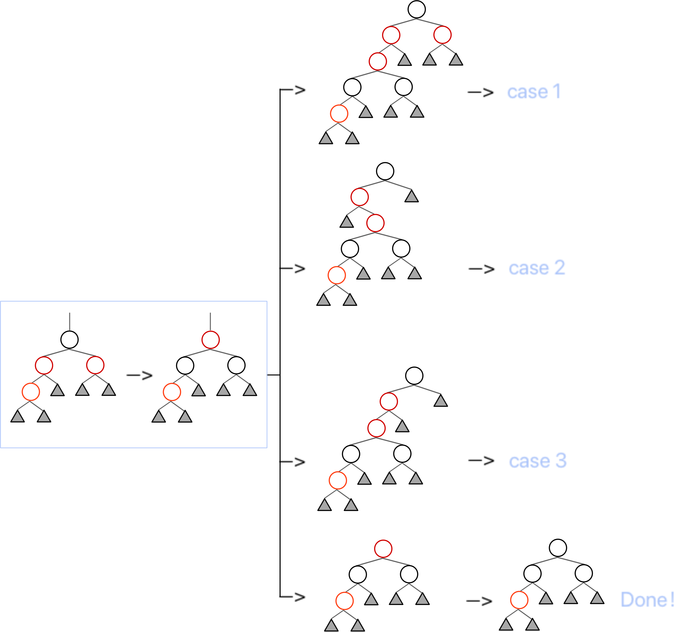
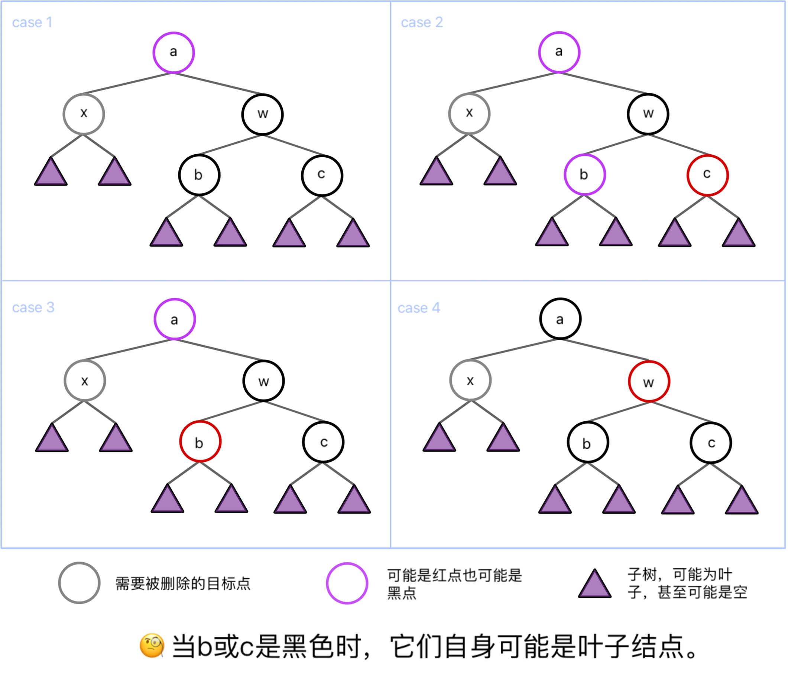

# Lecture 2 | Red Black Tree & B+ Tree

!!! info "说明"
    上一节使用的用 Tab 绘图的方式时间成本太高了，所以我应该会放弃使用这种画图的方法。

    而为了提高笔记整理效率，可能会考虑用更多的引用和更简单的语言。如果您觉得有哪里说的不够清楚，请直接在评论区狠狠 blame 我！

---

## 红黑树

!!! quote "link"
    OI Wiki: https://oi-wiki.org/ds/rbtree/
    
    Wikipedia: https://en.wikipedia.org/wiki/Red%E2%80%93black_tree

---

### 概念

顾名思义，**红黑树(Red Black Tree)**就是一种节点分类为红黑两色的，比较平衡的二叉搜索树。只不过不同于 AVL 树，红黑树的“平衡”性质是通过**黑高(black height)**来定义的。接下来依次给出红黑树的定义和黑高的定义。

!!! definition "Red Black Tree"
    

    红黑树是满足如下性质的一种二叉搜索树：

    !!! feature "Properties of RBTree"

        \@cy's PPT
        
        1. Every node is either red or black.
        2. The root is black.
        3. Every leaf (`NIL`) is black.
        4. if a node is red, then both its children are black.
        5. For each node, all simple paths from the node to descendant leaves contain the same number of black nodes.

        > ch 老师说，希望我们能把这五条性质熟练记住，~~但是让我记住编号是不可能的~~。

        !!! warning "说明"
            由于这里的“叶子结点”被重新定义了，为了描述方便，我现在称所有两个子结点都是 `NIL` 的结点为**末端结点**。而这个定义**只是我自己说说的**！

        ??? extra "\@Wiki"
           1. Every node is either red or black.
           2. All `NIL` nodes (figure above) are considered black.
           3. A red node does not have a red child.
           4. Every path from a given node to any of its descendant `NIL` nodes goes through the same number of black nodes.


        ??? extra "\@OI Wiki"

           1. 每一个节点要么是**红**色，要么是**黑**色；
           2. `NIL` 节点（空叶子节点）为**黑**色；
           3. **红**色节点的子节点必须为**黑**色；
           4. 从根节点到 `NIL` 节点的每条路径上的**黑**色节点数量相同；

!!! definition "black height, bh"
    特定节点的黑高，等于该节点到叶结点到简单路径中（**不包括自身**），黑色节点到数量。


接下来为了加深理解，有一些辨析可以做：

!!! note ""
    === "T1"
        === "题面"
            下图的红黑树是否合法？

            
        === "答案"
            
            不合法。

            `16` 号节点的右儿子是一个黑叶子，而这个叶子到根的路径上只有 3 个黑节点，而其他叶子到根都有 4 个黑节点。

            所以我们需要**警惕只有一个非叶儿子的红色节点**。
    === "T2"
        === "题面"
            下图的红黑树是否合法？

            
        === "答案"
            
            合法。

    ---

    根据 T1 的解析，我们得到这样一个结论：

    **合法红黑树不存在只有一个非叶儿子的红色节点！**

此外，关于红黑树的高，我们有如下性质：

!!! feature "property about height of RBTree"
    一个有 $N$ 个内部节点（不包括叶子结点）的红黑树，其高度最大为 $2\log_2 (N+1)$。

    ??? proof "the proof of the property"
        > [关于黑高和点数的关系](https://stackoverflow.com/questions/70944386/maximum-height-of-a-node-in-a-red-black-tree)
        
        1. 首先我们有 $N \geq 2^{bh}-1$，也就是 $bh \leq \log_2 (N+1)$；
        2. 然后显然有 $bh(Tree) >= h(Tree)$

---

### 操作

!!! warning "提醒"
    **我们这里介绍的都是 bottom-up 的思路**，不同于 AVL 树，红黑树是存在 top-down 的操作方法的，而这也是红黑树一个非常强大的优势。但是我们不在这里详细展开。

同 AVL 树的调整操作类似，红黑树的调整操作也是左右对称的，所以我们也仍然只讨论一侧。

以及，由于我们并不确定附近的节点是否真的有子节点

---

#### 插入

我们知道，对**黑高**有贡献的只有黑色节点，因此 `NIL` 节点被一个**红色**节点置换并不会改变一颗红黑树的黑高，然而对于红色节点，却有着红色结点不能相邻的限制。

因此，“插入”操作的主要思路就是，先将整个红黑树当作一个普通的二叉搜索树，将目标数据插入到树的末端（也就是置换一个 `NIL` 节点），并将它染为红色，再调整使之在保证**黑高不变**的情况下，满足**红色节点不能相邻**的要求。

现在，我们记这个被插入的节点为 `x`，任意一个节点 `node` 的父节点为 `node.p`，则：

1. 如果 `x.p` 是黑色的，那么我们不需要做任何调整；
2. 如果 `x.p` 是红色的，那么我们需要进行调整；
   - 此时因为原来的树符合红黑树的性质，`x.p.p` 显然是黑色的；

根据这些讨论，我们就能列举出来一个红色的点被插入后，在 `2.` 的情况下所有的**初始情况**，即下面第一张图。

<center></center>

由于红黑树的操作中，有一部分需要进行递归转移，而其中中间步骤出现了很多同构的结构，所以为了化简 pipeline，我们对其进行一下统一，也就是上面第二张图。

接下来我们来讨论各种情况要怎么处理。

!!! warning "说明"
    这里 case 1 ~ case 3 的编号主要是为了和课程 ppt 对标，但是接下来你会发现我是按照 case 3 -> case 1 来介绍操作的，这是因为我觉得这样安排更合理，而非排版混乱。

???+ section "Insertion / case 3"
    对于 case 1， 我们高兴地发现，这样的一次染色和一次旋转刚好能让这棵子树完成调整！

    

???+ section "Insertion / case 2"
    对于 case 2，我们可以直接进行一个 Rotation 操作将它转化为 case 3。

    

???+ section "Insertion / case 1"
    对于 case 1，图中的两种情况是等价的。所以我们只展示其中一种。

    我们只需要将图中的根节点**染红**，将根的两个子节点**染黑**，类似于将黑节点“下放”。

    
    
    此时可以保证这整个子树必定是黑高不变（我们暂时包括根节点）、红点不邻的。然而我们并不知道这个根的父亲是否是红色节点，倘若其根的父亲是红色节点，那么我们还需要继续调整。若这子树的根没有父节点，则直接染黑红根即可。但倘若子树根节点的父亲是黑节点，那么我们就调整完毕了。

在这三个过程中，我们观察到，只有 case 1 的转化会导致我们递归向上，而 case 2 向 case 3 的转化并不会导致我们改变关注的子树的范围。

为了更清晰地看出各个方法之间的转化关系，于是我们可以画一个状态机：

!!! key-point ""

    === "不分离初始状态"
        ```mermaid
        graph LR;
        A["case 1"]
        B["case 2"]
        C["case 3"]
        D(["finish"])

        A ===>|"C"| B --->|"R"| C
        A ===>|"C"| A --->|"C"| D
        A ===>|"C"| C ===>|"C&R"| D
        ```

    === "分离初始状态"
        ```mermaid
        graph LR;
        A(["case 1 (initial)"])
        AA["case 1"]
        B(["case 2 (initial)"])
        BB["case 2"]
        C(["case 3 (initial)"])
        CC["case 3"]
        D(["finish"])

        A ===>|"C"| AA ===>|"C"| BB
        AA ===>|"C"| AA --->|"C"| D
        AA ===>|"C"| CC

        A --->|"C"| D
        A ===>|"C"| BB --->|"R"| CC
        A ===>|"C"| CC ===>|"C&R"| D
        B --->|"R"| CC
        C ===>|"C&R"| D
        ```

注意，状态机中的**粗线**表示转换过程中，我们关注的“子树”向上攀升了一级；而**细线**表示我们关注的子树仍然是这一层的那一棵。以及，`C` 表示染色操作，`R` 表示旋转操作。

---

#### 删除

关于删除操作，下面这个视频讲的很清晰！

👉 **[黑树快速入门 - 04删除](https://www.bilibili.com/video/BV1uZ4y1P7rr/?spm_id_from=333.880.my_history.page.click&vd_source=13807e82155f985591ed6f1b4e3434ed)**

首先，如果我们要删除的结点是不是一个末端结点，也就是说它的两个儿子都不是叶子结点，那么可以将它与左子树的最大值或者右子树的最小值的**值互换**（颜色不换），可以证明在二叉搜索树里这个操作是可行的。此时我们要删除的点就被转化到末端结点了，也就是说现在我们要删的结点的两个子节点都是叶结点。

于是，我们把所有情况都转化为了**删除末端结点**的情况。

接下来我们来考虑这个末端结点的颜色。如果这个末端结点是**红色**节点，那么我们知道，**直接删除**这个节点是没有问题的（[#插入](#插入)的第一句话）；而如果这个末端结点是**黑色**的，那么显然，直接删除是不行的。

因此，现在我们只需要讨论删除一个**黑色**的**末端结点**（其两个子节点都是 `NIL`）该如何操作。

!!! warning "说明"
    虽然我想尽可能拟合 cy 的 ppt，但是我实在没看懂，所以 case 的编号我就按照上面那个视频来了。

我们根据情况，将情况分为四种：



接下来我们逐个分析变化。


---

## B+ Tree