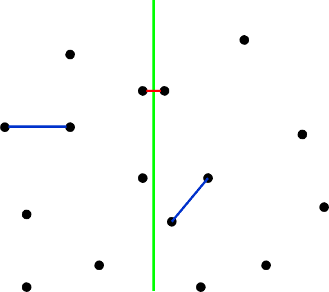

# Lecture 7 | Divide & Conquer

~~感觉这几节课上的内容都挺宽泛的啊x~~

---

## 概述

!!! quote "link"
    Wikipedia: https://en.wikipedia.org/wiki/Divide-and-conquer_algorithm

套用 Wiki 上的说法，**分治法(Divide-and-conquer algorithm)**属于一种算法范型，它的基本思想是将一个问题分解为若干个规模较小的相同问题，然后递归地解决这些子问题，最后将这些子问题的解合并得到原问题的解，一个比较经典的案例就是归并排序。

本节的重点实际上也并不是聚焦于分治本身，而是其复杂度分析。

---

### 【案例】二维最近点问题

二维最近点问题，在课件上的名字是 Closet Points Problem，对起内容进行描述：

!!! definition "Closet Points Problem"
    给定平面上的 n 个点，找出其中距离最近的两个点。

    

---

#### 朴素

最朴素的做法当然是枚举所有的点对，一共需要 $C_{N}^{2} = {{N}\choose{2}} = \frac{N(N-1)}{2}$ 即复杂度为 $O(N^2)$。

---

#### 分治

现在我们类比最大子序列和问题的分治做法。

??? extra "最大子序列和的分治做法"
    1. 将序列分为左右两部分，分别求解最大子序列和；
    2. 求解跨越中点的最大子序列和；
    3. 比较三者的大小，取最大值；

我们可以将整个平面分为两个部分，即如图中绿色线将点对划分为两个部分。

 { width=75% } 

接下来我们同样分为这么三步：

1. 将点对分为左右两部分，分别求解最近点对；
2. 寻找跨越分界线的点对，从中寻找最近点对；
3. 比较三者的大小，取最小值；

显然，我们现在需要解决的就是要如何设计第二步的实现，以求更优的复杂度。

首先我们假设在第一步中，我们求得两边求得的最小距离中较小的那个为 $\delta$，换句话来说，如果答案在第二步中被更新，那么它的距离需要小于 $\delta$。而我们知道，在第二步中被拿出来的点对，一定是一个在分界线左侧一个在分界线 $L$ 右侧。朴素的来想，在距离分界线 $\delta$ 以外的点对中，我们是不需要考虑的。而在距离分界线 $\delta$ 以内的点，都存在成为答案点对点可能。

 { width=75% } 

如图，现在我们知道，只有落在两条深绿色之间的点才可能会更新答案。

现在我们需要做的是，从分界线左侧的区域里拿一个点，和分界线右边的一个点做匹配，然后取所有结果中的最小点。不过这件事仍然可以优化——在二维的数据中，仅对一个纬度做约束往往会导致事情变得不那么稳定，所以我们同样考虑在另外一个方向做约束。

也是基于范围约束的考虑。假设我们以左侧的点为基准，从上往下做遍历这些点，那么对于点 $p_{l_i}$，具有能够更新答案的， $\mathop{dis} (p_{l_i}, p_{r_j}) \leq \delta$ 的 $p_{r_j}$，一定有 $\mathop{dis\parallel bound}(p_{l_i}, p_{r_j}) \leq \delta$（直角三角形斜边最长）。

因此，对于选定点 $p_{l_i}$，其所有可能导致答案更新的点都被框定在一个 $2\delta \times \delta$ 的矩形中。

而更奇妙的是，这个由参数 $\delta$ 指定的矩形，巧妙地约束了落在矩形中的点的最大数量。

  

在这样一个区域中，我们需要约束所有落在 $\delta \times \delta$ 的 L 区域中的点，互相的距离都大于等于 $\delta$，对 R 区域中的点也有相同的约束。不难发现，在最理想最理想的情况下——闭区间、允许点重合的情况下，这个矩形最多也只能放八个点（两边各四个）：

  

而更一般的情况下，最多也只能放六个点（两边各三个）。

无论如何，我们可以得到结论，在这种情况下，对于每一个选定的 $p_{l_i}$，寻找其可能导致答案更新的点的复杂度都是常数级的。

而枚举这些“选定点”，也就是枚举 $p_{l_i}$，其复杂度（撑死）是 $O(N)$。

于是我们能得到这个分治的时间复杂度计算递推公式：

$$
T(N) = \underbrace{2\; T(\frac{N}{2})}_{\text{Step 1. divide}} + \underbrace{O(N)}_{\text{Step 2. across}} = O(N\log N)
$$

而我们接下来要解决的就是，如何通过这个递推式得到结果。

---

在开始接下来的内容之前，我们需要给出更一般的，我们想要解决的问题，即求解时间复杂度递推公式形如下式的算法的时间复杂度：

$$
T(N) = aT(\frac{N}{b}) + f(N)
$$

例如，上面的最近点对问题，就是 $a = 2,\; b = 2,\; f(N) = O(N)$ 的情况。

---

### 代换法

**代换法(substitution method)**的思路非常直白，首先我们通过某些手段（~~比如大眼观察法👀~~）来得到一个预设的结果，接下来通过代入、归纳的方法来证明这个结果。

> 大胆猜测，小心求证！

!!! eg "🌰"
    === "题面"
        求解复杂度：

        $$
        T(N) = 2\; T(\frac{N}{2}) + N
        $$
    === "解答"
        **预设**：
        
        $$
        T(N) = O(N\log N)
        $$

        **代入**：

        - 对于足够小的 $m < N$，有：

        $$
        T(\frac{m}{2}) = O(\frac{m}{2}\log \frac{m}{2}) \leq c \frac{m}{2}\log \frac{m}{2}
        $$

        - 将上式代入：

        $$
        T(m) = 2\; T(\frac{m}{2}) + m
        $$

        - 得：

        $$
        T(m) \leq 2\; c \frac{m}{2}\log \frac{m}{2} + m \leq c m \log m \text{ for } c \geq 1
        $$

        对于足够小的 $m = 2$ 式子就可以成立，由归纳法得结论成立。

不过很显然，在某些情况下我们求证了一个复杂度的假设成立，但它并不一定足够紧，这是猜解法的通病。

---

### 递归树法

**递归树法(recursion-tree method)**的思路是，我们通过画出递归树来分析算法的时间复杂度，实际上和直接数学推理的区别不是很大，主要就是通过观察递归过程中数据增长的模式来进行分析。

??? extra "some mathematical tools"
    $$
    a^{\log_b N} = \exp^{\frac{\ln N}{\ln b} \ln a} = \exp^{\frac{\ln a}{\ln b} \ln N} = N^{\log_b a}
    $$

就类似于直接展开式子，只不过通过树状图的形式或许更加直观。

对于一个递推式，我们将它不断展开以后，其形式大概会是这样：

$$
T(N) = ... = 
\underbrace{\sum_{leaf_i}^{leaves}T(N_{leaf_i})}_{conquer}
+ 
\underbrace{\sum_{node_i}^{non-leaf-nodes}f(N_{node_i})}_{combine}
$$

其中，$N_{leaf_i}$ 都足够小，可以认为 $T(N_{leaf_i})$ 都是常数，于是上式又可以变化为：

$$
T(N) = ... = 
\underbrace{c\; N_{leaves}}_{conquer}
+ 
\underbrace{\sum_{node_i}^{non-leaf-nodes}f(N_{node_i})}_{combine}
$$

具体来说解释其含义，combine 部分就是在每一次“分治”的处理时间，如合并当前的子问题分治后的结果，体现在递推式的 $f(N)$ 部分；而 conquer 部分指的是当“分治”的“治”在“分”的末端的体现，即对于足够小的规模的问题，不再需要继续“分”的时候，对其处理的开销。

实际上在代码层面这两部分未必有区别，不过在数学意义上，对于一个递推式子求解我们一般是需要“首项”的，或者说是“最底层”的，而这个“最底层”的部分就是 conquer 部分。

接下来结合 🌰 来分析一下：

!!! eg "🌰"
    

    > From cy's ppt.
    >
    > `\underbrace` 下面那个等式的证明在上面的 "some mathematical tools"。

    可以发现，此情况下 $a = 3,\; b = 4,\; f(N) = \Theta(N^2)$，也就是说每次分为 $3$ 个子问题，子问题的规模是 $\frac{N}{4}$，而合并开销为 $\Theta{N^2}$。

    此时由于分治的策略是相对均匀的，所以我们可以认为得到的是一个完美三叉树。

    显然，树的深度为 $\log_4 N$，每个分治节点的 combine 开销已经标注在图的节点位置，横向箭头标记的是对该层所有节点的开销的求和。特别的，对于最底层，即叶子层，它表示的是 conquer 部分的开销（虽然我个人觉得没必要区分这俩）。

    于是我们可以根据下式的形式，对其进行求和，得到图片中下方的式子。

    $$
    T(N) = ... = 
    \underbrace{c\; N_{leaves}}_{conquer}
    + 
    \underbrace{\sum_{node_i}^{non-leaf-nodes}f(N_{node_i})}_{combine}
    $$

---

### 主方法

!!! link "link"
    OI Wiki: https://oi-wiki.org/basic/complexity/#主定理-master-theorem

    Wikipedia: https://en.wikipedia.org/wiki/Master_theorem_(analysis_of_algorithms)

**主方法(master method)**之所以叫“主”，是因为它分析的是 combine 和 conquer 部分孰为主导。

!!! definition "Form 1"
    对于形如 $T(N)=aT(N/b)+f(N)$ 的递推式：

  1. 若 $f(N)=O(N^{(\log_b{a})-\varepsilon}), \text{ for }\varepsilon>0$，那么 $T(N)=\Theta(N^{\log_b{a}})$；
   2. 若 $f(N)=\Theta(N^{\log_b{a}})$，那么 $T(N)=\Theta(N^{\log_b{a}}\log{N})$；
   3. 若 $f(N)=\Omega(N^{(\log_b{a})+\varepsilon}), \text{ for }\varepsilon>0$ 且 $af(\frac{N}{b})<cf(N), \text{ for } c<1 \text{ and } \forall N > N_0$，那么 $T(N)=\Theta(f(N))$；

??? eg "examples for form 1"
    - 【eg1】$a = b = 2,\; f(N) = N$；
        - $f(N) = N = \Theta(N^{\log_2{2}})$，适用于情况 2；
        - 因此得到结果 $T(N) = \Theta(N \log N)$；
    - 【eg2】$a = b = 2,\; f(N) = N \log N$；
        - $f(N) = N \log N$，虽然 $N \log N = \Omega(N^{\log_2{2}})$，但是 $N \log N \neq \Omega(N^{(\log_2{2}) - \varepsilon})$，所以不适用于情况 3；
            - 具体来说，$\lim \limits_{N\to \infty} \frac{N \log N}{N^{1+\varepsilon}}=\lim \limits_{N\to \infty} \frac{\log N}{N^{\varepsilon}} = 0 \text{ for fixed } \varepsilon > 0$；
            - 这个例子体现出了 $\varepsilon$ 的一定作用；

!!! proof "proof for form 1"
    - [ ] 咕咕咕

!!! definition "Form 2"
    - [ ] 咕咕咕