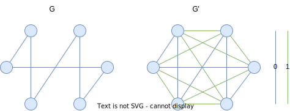

# Lecture 10 | NP Completeness

!!! info "导读"
    由于本节涉及较多概念，并且知识树长的很蓬松，所以我决定尝试非线性组织内容，因此本文的阅读顺序可能也并不会是线性的。
    
    所有提到的、并且本文会介绍的相关内容，都会以**[链接和放大镜🔍](#lecture-10--np-completeness)**的形式出现。推荐使用鼠标中键等方式打开新标签页查看，方便回溯。

    > 推荐的阅读顺序是，顺着读下去，每次出现 🔍 都进行深度优先搜索式的学习，直至看完全文。
    > 
    > 其中，在 **[相关概念](#相关概念)** 之后的部分，我会保证在前面都有提及，而其之前的内容，推荐都在顺序阅读中涉及。
    
---

## 概述

!!! quote "Links"
    OI Wiki: https://oi-wiki.org/misc/cc-basic/

    Wikipedia: https://en.wikipedia.org/wiki/P_versus_NP_problem

    Wikipedia: https://en.wikipedia.org/wiki/NP-completeness

    Wikipedia: https://en.wikipedia.org/wiki/NP-hardness

根据问题的难度，由不同的定义划分，问题可以分为：

**P** 问题(polynomial time)、**NP** 问题(nondeterministic polynomial time)、**NPC** 问题(NP complete)、**NPH** 问题(NP hard)。除此之外 ，我们还需要额外了解不可计算问题(undecidable)。

由于不可计算问题比较特殊，所以我先放在前面介绍。

??? definition "Undecidable Problem"

    !!! quote "Links"
        Wikipedia: https://en.wikipedia.org/wiki/Undecidable_problem

    **不可判定问题(undecidable problem)**是一类特殊的[决定性问题](https://en.wikipedia.org/wiki/Decision_problem)，它的特点是我们无法设计一个算法来求解它的结果。

    其中一个比较典型的例子就是**[停机问题🔍](#halting-problem)**。

我们可以用这样一张图来表示其他几个概念的关系：

<center>
    { width=60% }
</center>

> Source: https://en.wikipedia.org/wiki/NP-hardness

可以粗浅的按照图中的“Complexity”轴来理解其中的转化关系，接下来给出它们的详细定义：

!!! definition "P"
    P 取自 polynomial time，指的是可以用**[确定型图灵机🔍](#图灵机)**在**多项式**时间内**解决**的问题。
    
    也就是我们通常意义下所说的，可以在**多项式**时间内**解决**的问题。

!!! definition "NP"
    NP 即 nondeterministic polynomial time，指的是可以用**[非确定型图灵机🔍](#图灵机)**在**多项式**时间内**解决**的问题。这个说法等价于可以用**[确定型图灵机🔍](#图灵机)**在**多项式**时间内**验证**（判断答案是否正确）。
    
    也就是我们通常意义下所说的，可以在**多项式**时间内**验证**的问题。

!!! definition "NPC"
    NPC 即 NP complete，NP 完全，是 NP 中最难的**决定性**问题（并不是无限定词的最难的问题！）。而我们称满足如下条件的问题为 NPC 问题：

    1. 是一个 NP 问题；
    2. 所有 NP 问题都可以**[多项式时间归约🔍](#多项式时间归约)**为该问题；

    由 2 可以有结论，所有的 NPC 问题难度相同——一旦有一个 NPC 问题被解决，那么所有 NPC 问题，乃至所有 NP 问题都能被解决。

    如果我们试图证明一个问题是 NPC 问题，我们可以通过这种手段：

    1. 判定该问题是一个 NP 问题；
    2. 判定一个已知的 NPC 问题可以**[多项式时间归约🔍](#多项式时间归约)**为该问题，或者说判定该问题是 NPH 问题；

    > 第一个被证明是 NPC 的问题是 **[Circuit-SAT🔍](#circuit-sat)** 问题。

!!! extra "P ?= NP & NPC"
    关于 P 和 NP 的关系，我们仍然不知道 P 是否能等于 NP，即我们仍然不知道是否存在多项式算法可以解决一切 NP 问题。

    而其中的关键就是，如果我们能找到 NPC 问题的多项式解法，那么就可以证明 P = NP。

!!! definition "NPH"
    NPH 即 NP hard，NP 困难，它不一定需要是 NP 问题。而所有 NP 问题都可以**[多项式时间归约🔍](#多项式时间归约)**为 NPH 问题。

也就是说 $NPC = NP \cap NPH$。

---

## 课内案例

接下来的内容都是课件中提到的一些具体问题和案例。

---

### Halting Problem

!!! quote "Links"
    Wikipedia: https://en.wikipedia.org/wiki/Halting_problem

停机问题是一个典型的不可计算问题，它指的是，对于任意一个程序，我们无法设计一个算法来判断它是否会在有限时间内停机（即判断程序是否会死循环）。

我们通过反证法可以证明：

假设存在函数 `willHalt(func F)` 可以判断函数 F 是否会停机，如果会，则返回 `true`，否则返回 `false`。那么我们可以构造一个这样的函数 `foo()`：

```cpp
void foo() {
    if ( willHalt(foo) ) {
        while (true) {} // Endless loop.
    }
    return;
}
```

接下来，如果我们想知道 `foo()` 是否会停机，就会执行 `willHalt(foo)`。然而在 `foo()` 内部也有一个 `willHalt(foo)`，如果它认为 `foo()` 会停机，则构造一个死循环；而如果它认为 `foo()` 不会停机，则选择让它立刻停机，于是这里就产生了矛盾。

理解上面这段内容的关键就是，这里虽然不存在事实意义上的“死循环”，但可以理解为这里存在一个逻辑上的递归，而这种“逻辑上的递归”，正是导致停机问题成为一个不可计算问题的原因。

---

### Hamilton Cycle Problem

!!! quote "links"
    Wikipedia: https://en.wikipedia.org/wiki/Hamiltonian_path_problem

    OI Wiki: https://oi-wiki.org/graph/hamilton

!!! definition "哈密顿回路问题"
    给定一个图，判断是否存在一条路径，使得它经过图中的每个点恰好一次，且最后回到起点。
    
哈密顿回路问题是一个 NPC 问题。

---

### Traveling Salesman Problem

!!! quote "Links"
    Wikipedia: https://en.wikipedia.org/wiki/Travelling_salesman_problem

!!! definition "旅行商问题"
    旅行商问题有**两种**定义，其中前者是 NPH，而被称为“判定版本”的后者是 NPC。

    === "原始定义"
        给定一个**完全**图，判断是否存在一条路径，使得它经过图中的每个点恰好一次，且最后回到起点，且路径**长度最短**。

        > "Given a list of cities and the distances between each pair of cities, what is the shortest possible route that visits each city exactly once and returns to the origin city?"
        > 
        > From Wikipedia

        该版本的 TSP 问题是一个 NPH 问题，常常出现在组合优化的语境中。

    ===+ "判定版本"
        给定一个**完全**图，判断是否存在一条路径，使得它经过图中的每个点恰好一次，且最后回到起点，且路径**长度不超过** $k$。

        该版本的 TSP 问题是一个 NPC 问题，常常出现在复杂度理论的语境中。

    !!! warning "需要注意，接下来我们谈论的都是判定版本的 TSP！"

---

#### 判定版本的 NPC 证明

现在，假设我们已知 [Hamilton Cycle Problem](#hamilton-cycle-problem) 问题是一个 NPC 问题，尝试通过**[多项式时间归约🔍](#多项式时间归约)**的方式来证明 TSP 也是一个 NPC 问题。

!!! quote "Recommended Reading"
    https://opendsa-server.cs.vt.edu/ODSA/Books/Everything/html/hamiltonianCycle_to_TSP.html


首先回顾证明 NPC 的步骤：

1. 判定该问题是一个 NP 问题；
2. 判定一个已知的 NPC 问题可以**[多项式时间归约🔍](#多项式时间归约)**为该问题，或者说判定该问题是 NPH 问题；

代入到这个问题中，也就是我们需要证明：

1.  TSP 是一个 NP 问题；
2.  Hamilton Cycle Problem 可以**[多项式时间归约🔍](#多项式时间归约)**为 TSP；

!!! proof "TSP is NP"
    证明 TSP 是一个 NP 问题即证明 TSP 的解可以在多项式时间内被验证。而验证一个解是 TSP 问题的解，需要证明下面两个点：

    1. 这条路径经过了所有节点恰好一次；
    2. 这条路径长度不超过$k$；

    显然，这两条都只需要 $O(N)$ 的开销就能验证。

    于是，我们得到结论：$\text{TSP} \in \text{NP}$。

!!! proof "TSP is NPH"
    要证明 TSP 是一个 NPH 问题，我们可以通过证明 Hamilton Cycle Problem(HCP) 可以**[多项式时间归约🔍](#多项式时间归约)**为 TSP。

    为此，我们需要对比 HCP 和 TSP 的差异。

    以 HCP 为基础描述 TSP，实际上就是在一张**完全图**上寻找**总长不超过** $k$ 的哈密顿环路，具体来说：

    | HCP | TSP |
    |:---:|:---:|
    |图 $G(V,E)$|完全图 $G'(V',E')$ |
    |无边权|有边权|
    |  -  |$\sum v_i \leq k$|

    而为了证明 $\text{HCP} \leq_p \text{TCP}$，我们设计一个**多项式时间**的方法 `f()` 实现 $G(V,E) \to G'(V',E')$，具体来说，它做这些事：

    1. 连接 $G$ 中所有没连上的边，使 $G$ 成为一张无权完全图；
    2. 对于无权完全图中的每一条边 $v^c_i$，如果在 $G$ 中也有这条边，那么令它边权为 0，否则令它边权为 1，于是得到有权完全图 $G'(V',E')$；

    
    > 右图中所有的蓝边边权都为 0，绿边边权都为 1。

    由于完全图的边数为 $\frac{n(n-1)}{2}$，所以这个步骤显然是多项式时间的。

    接下来，我们发现，原问题为在 $G$ 上寻找哈密顿环，等价于在 $G' = f(G)$ 上做 $k = 0$ 的 TSP。由此证明 $\text{HCP} \leq_{p} \text{TSP}$，即 $\text{TSP} \in \text{NPH}$。
    
综上所述，由于 $\text{TSP} \in \text{NP}$ 且 $\text{TSP} \in \text{NPH}$，所以 $\text{TSP} \in \text{NPC}$。

---

### Circuit-SAT

!!! quote "Links"
    Wikipedia: https://en.wikipedia.org/wiki/Circuit_satisfiability_problem

Circuit-SAT 又叫 circuit satisfiability problem，它是最早被证明是 NPC 的问题，即通过 NPC 问题的定义证明。

其具体描述如下：

!!! definition "Circuit-SAT"
    Circuit-SAT 即为确定给定布尔电路是否具有使输出为真的输入分配的决策的问题。

    
    > Source: https://en.wikipedia.org/wiki/Circuit_satisfiability_problem

    上图中，左侧电路满足条件，右侧电路不满足条件。

    ---

    或者，更抽象的来说，是判断一个具有 $n$ 个布尔变量的布尔表达式是否具有结果为 True 的解。

---

#### 3-SAT

!!! quote "Links"
    Wikipedia: https://en.wikipedia.org/wiki/Boolean_satisfiability_problem#3-satisfiability

3-SAT 指的是 Circuit-SAT 问题的一个特例，它对布尔电路，或者说布尔表达式的形式有特殊要求，具体来说，它要求布尔表达式形如：

$$
(x_1 \vee x_2 \vee x_3) \wedge (x_4 \vee x_5 \vee x_6) \wedge \cdots \wedge (x_{n-2} \vee x_{n-1} \vee x_n)
$$

- 变量是否重复、是否取非不是重点，$x_1$ 可以和 $x_6$ 是同一个变量，也可以是某个变量的非，重点是这里的三个一组的形式。

---

### A formal-language Framework

- [ ]TODO: Finish this part.

---

## 相关概念

!!! info "说明"
    以下部分的内容是为了进一步说明上文中部分内容而介绍的概念，并不具有组织结构。

---

### 图灵机

!!! quote "Links"
    Wikipedia: https://en.wikipedia.org/wiki/Turing_machine

    Wikipedia: https://en.wikipedia.org/wiki/Nondeterministic_Turing_machine

图灵机有一些变体，而我们在这里引入图灵机是为了介绍 P/NP，只介绍**确定型图灵机**和**非确定型图灵机**。

> 图灵机由一个**无限长的纸带**和一个**读写头**组成。纸带被划分为一个个**格子**，每个格子上有一个**符号**，读写头可以在纸带上移动，读写头可以读取当前格子上的符号，也可以改变当前格子上的符号。图灵机的**状态**是一个有限集合，每个状态都有一个**转移函数**，转移函数的输入是当前状态和当前格子上的符号，输出是下一个状态、下一个格子上的符号和读写头的移动方向。

更本质的来说，图灵机是一种**计算模型**，我们可以用它来表示任何有限逻辑数学过程。确定型图灵机与我们常规理解的计算机逻辑类似，即下一步要做什么可以根据当前状态确定。而非确定型图灵机则类似于能够进行无限并行，并且最终总是选择通向正确答案的方向的那条路（有点类似于它能开平行宇宙，并且总是让你观测到正确的那一个平行宇宙）。

---

### 多项式时间归约

!!! quote "Links"
    Wikipedia: https://en.wikipedia.org/wiki/Polynomial-time_reduction

我们引入 P/NP 等这些概念，是为了衡量问题的复杂程度，而如何在具体的“问题”间传递、比较这种“复杂程度”，就是**多项式时间归约(polynomial reduce)**的目的。

```mermaid
graph LR;
A["问题 A"]
B["问题 B"]
A ===>|"多项式时间转化"| B
```

如果我们能在多项式时间的复杂度内，将问题 A 转化为问题 B，则称问题 A 可以**多项式时间归约(polynomial reduce)**为 B，记为 $A \leq_{p} B$，表示 A 不会比 B 难。

而采取数学语言来描述，则是：

$$
\begin{aligned}
A \leq_{p} B 
\;\;\Leftrightarrow\;\;
& \exist f() \text{ which runs in polynomial time}, \\
& s.t.    \;\; \forall x \in A,\; f(x) \in B \\
& \text{and}\; \forall f(x) \in B,\; y \in A
\end{aligned}
$$