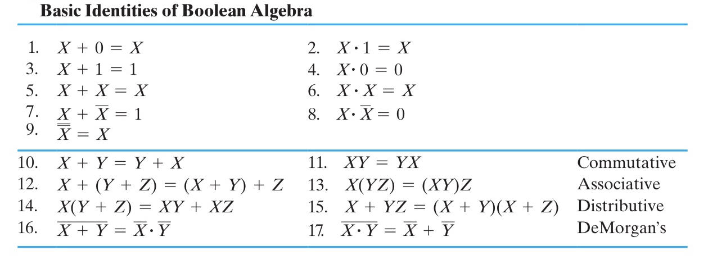
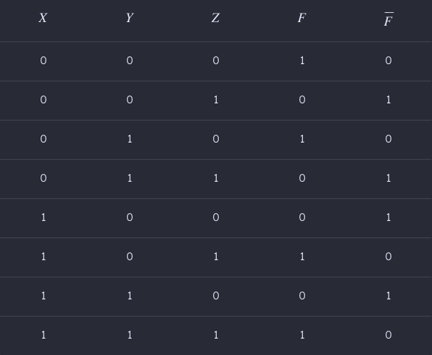
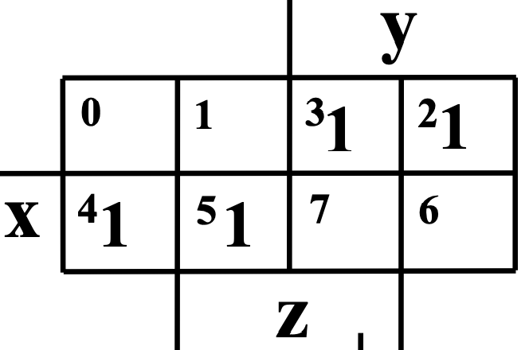
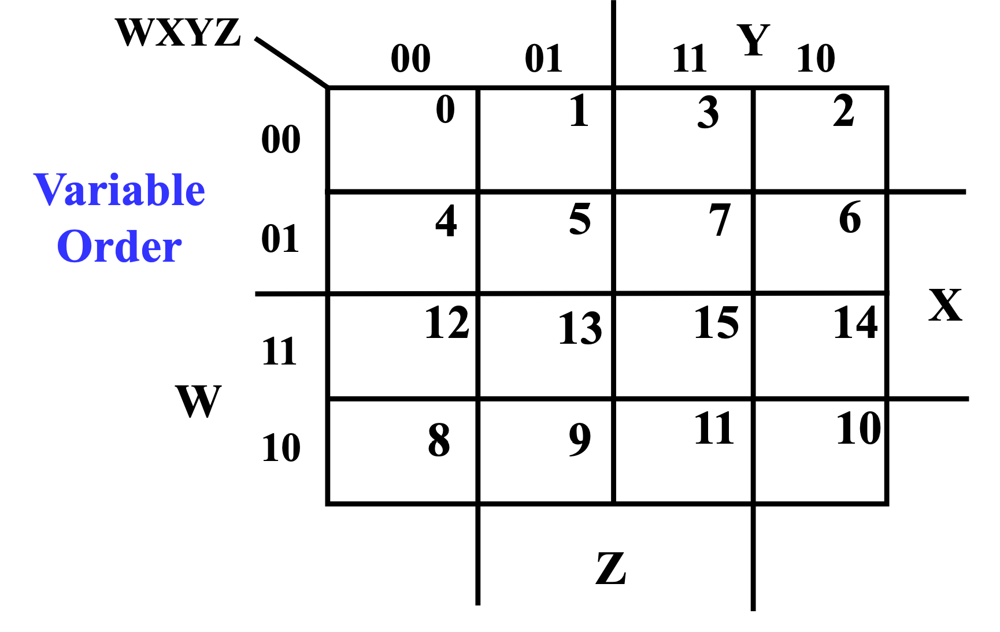
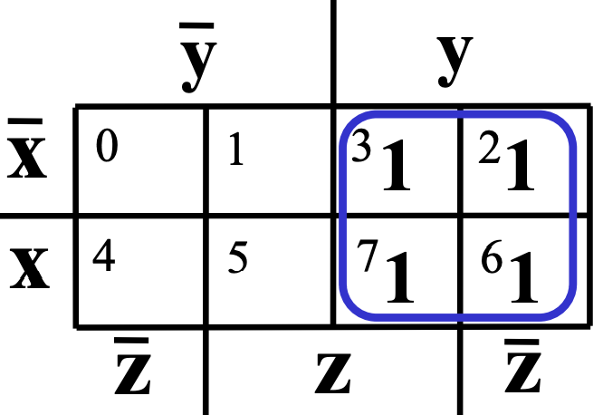
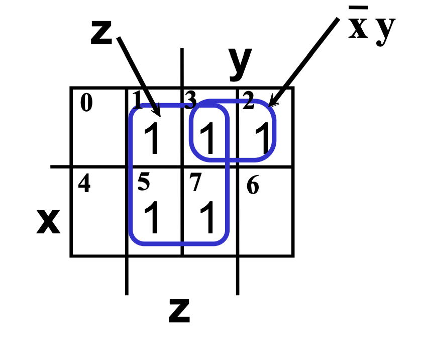
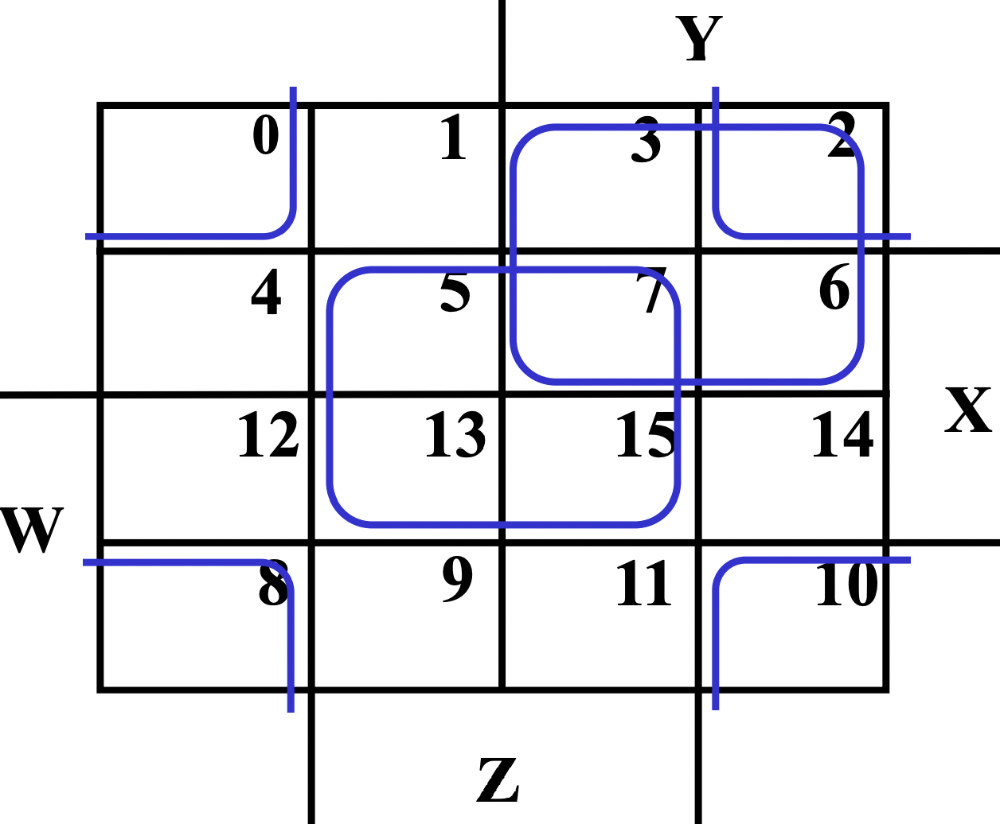
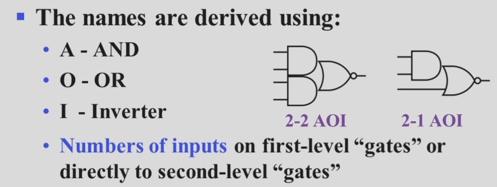
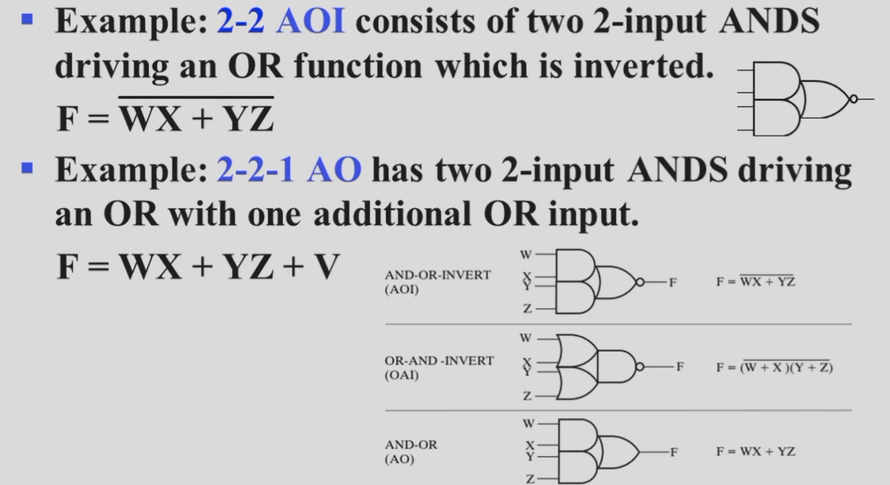

# Chap 2 Combinational Logic Circuits

## 逻辑运算

逻辑运算的对象是布尔变量，也就是 0/1 二值。

主要的运算就是 **与(AND)**，**或(OR)**，**非(NOT)**，**异或(XOR)**，以及 **与非(NAND)**，**同或(NOR)**。

!!! note "高维"
    多输入的异或和同或被称为奇函数和偶函数。

    可以用它们来实现奇校验和偶校验。

    而且观察其卡诺图的形状（棋盘形），可以发现，它们是天然优化的，即不可优化的。

运算规则挺简单的，在此略去。

比较基础的，需要了解与或非的符号表示。

- `A` `AND` `B` 可写作 $A\cdot B$ 或者 $AB$；
- `A` `OR` `B` 可写作 $A+B$；
- `NOT A` 可写作 $\overline{A}$；

由此可以进行一些组合，例如：

- `A` `XOR` `B` 可写作 $\overline{A+B}$；
- `A` `NAND` `B` 可写作 $\overline{A\cdot B}$；

再次还需要提到的是 **德·摩根定律(De Morgan's Laws)**，其表述为：

- $\overline{A+B} = \overline{A}\cdot\overline{B}$；
- $\overline{A\cdot B} = \overline{A}+\overline{B}$；

## 逻辑门

逻辑门是在硬件层面上实现布尔代数的逻辑单元。其操作对象为高低电平。


> 如图，(a)中绘制了三个常用逻辑门的符号；(b)中则描述了这些运算在 **时序图(timing diagram)** 中的状态；(c)则描述了在延时（见下）效应下的时序图。
> 
> 还有一个注意点是，非门其实更多的被称为 inverter，而非 NOT。

但是由于是物理层面的实现，所以会有一些逻辑运算层面不会出现的问题，比如 **延时(delay)**。

!!! note ""
    
    > Source: https://en.wikipedia.org/wiki/Signal_propagation_delay#Electronics

延时的长短与很多因素有关，取决于逻辑门的实现技术。而且通常来说，对于不同运算参数，其延时也会有不同。

此外，与门和或门可能有更多的输入引脚，如下：


至此，给出了 AND, OR, NOT 三个门的符号表示，类似上一小节提到的那样，我们也可以利用这三个基础的门电路来构成其他的门电路（虽然通常来说，我们可能是通过 NAND + NOT 来实现 AND 的）。

于是又引申出一个概念——**通用门(universal gate)**。一个功能完全的，能够表示其他所有门的逻辑门被称为通用门，在我们学过的逻辑门中，NAND 和 NOR 都是通用门。

!!! quote "推荐阅读"
    - Title: Universal Logic Gates
    - URL: https://www.electronics-tutorials.ws/logic/universal-gates.html
    
    > Universal Logic gates can be used to produce any other logic or Boolean function with the NAND and NOR gates being minimal

## 布尔代数

> literal \~ 字面量，也就是“变量”。

### 运算律



这张图片总结了布尔运算中的运算律，个人感觉最需要强化记忆的是 15 条，因为布尔代数借用了普通代数的符号，但第 15 条在普通代数中并不成立，所以对于习惯这套符号的人来说可能不太 straightfoward。

在记忆这套运算规律的时候，我个人的一个想法是，一定要建立 **与** 和 **或** 是对等的观念。我们习惯用“真”去理解这两个运算，但是实际上如果你以“假”为主体去分析这两个运算，会发现和“真”是完全对称的。换言之， **与** 和 **或** 是完全对称的运算，而非像他们借用的符号 $\times$ 和 $+$ 那样存在非对称关系。

但是让这件事变得又没那么简单的事情是，虽然 **与** 和 **或** 是对等的，但是我们在借用普通代数符号体系的同时，又人为地给他们添加了优先级（但是这也是必要的，否则表达式就会充满括号）。

优先级从高到低依次为：

1. 括号 / ()；
2. 非 / NOT / $\overline A$；
3. 与 / AND / $\cdot$；
4. 或 / OR / $+$；

个人感觉，这一种思路并不直觉，尤其是借用普通代数的符号体系以后更加混淆，所以可能需要一些练习来摆脱这些“刻板印象”。

### 运算律推广

除此之外，从上面提到的运算律中还能推广出如下几个模型：


> 我们再次发现，与 和 或 在逻辑上是对称的。

### 对偶法则

**对偶法则(duality rule)**: 一个表达式的 **对偶(dual)** 为，将所有的 **与** 和 **或** 对调得到的式子（注意！需要保证参与运算的顺序不能变，比如 **一般情况下** $A\cdot B$ 会被对偶为 $(A+B)$ 以保证运算顺序）。

!!! note "eg"
    - $X+XY$ 和 $X(X+Y)$ 对偶；
    - $X(Y+Z)$ 和 $X+YZ$ 对偶；

而一般情况下，除非某个表达式是 **自对偶(self-dual)** 的，那么它的表现都与原表达式不同。

对偶表达式具有如下性质：

- 如果 F 的对偶是 G，那么 F 也是 G 的对偶，即对偶关系是对成的；
- 如果表达式 F 和 G 等价，那么他们的对偶也等价；

### 互补函数

一个 **函数的互补(complement of a function)** 指的是，将它的对偶函数中每一个变量都取反得到的函数，而该函数正好等于原函数的非。

!!! note "eg"
    原函数：$F=\overline{A}B+C\overline{B}$；
    其互补函数：$\overline{F}=(A+\overline{B})(\overline{C}+D)$；

### 替代法则

**替代法则(substitution rules)**: 如果将一个等式中 **所有的** **某个变量** 都替换为同一个表达式，则等式依然成立。

!!! note "eg"
    - 原等式：$X(Y+Z)=XY+XZ$；
    - 如果使用 $X+YZ$ 替换所有的 $X$，则：
    - 修改后的等式 $(X+YZ)(Y+Z)=(X+YZ)Y+(X+YZ)Z$ 依然成立；


### 一致性定理

在简化逻辑表达式的时候，**一致性定理(consensus theorem)** 也很有用：

$$
XY+\overline{X}Z+YZ=XY+\overline{X}Z
$$

其证明的第一步是这样的：
$XY+\overline{X}Z+YZ=XY+\overline{X}Z+(X+\overline{X})YZ$，那后面就很简单了。本质上这个等式是利用了裂项，需要将其中最本质的部分，最小的粒度给裂开来，然后再慢慢消掉。

## 标准形式

由于本质上相等的布尔表达式实际上有很多种写法，而且随着变量越来越复杂，他们之间的比较会很困难。所以我们需要定义一种形式，使得所有相同的表达式都能比较方便的“化简”为同一个形式，同时也能辨别出两个表达式是不同的。这就引入了 **标准形式(Standard Forms)**，他们分别为 **最小项之和 SOM(Sum of Minterms)** 和 **最大项之积 POM(Product of Maxterms)**。

为了方便描述，在继续之前，我们先给出这样一张 🌰 真值表。

|🌰 Index|X|Y|Z|Output|
|:-------:|:-:|:-:|:-:|:-:|
|0 / `000`|`0`|`0`|`0`|`0`|
|1 / `001`|`0`|`0`|`1`|`0`|
|2 / `010`|`0`|`1`|`0`|`1`|
|3 / `011`|`0`|`1`|`1`|`0`|
|4 / `100`|`1`|`0`|`0`|`1`|
|5 / `101`|`1`|`0`|`1`|`1`|
|6 / `110`|`1`|`1`|`0`|`0`|
|7 / `111`|`1`|`1`|`1`|`1`|

> 数值是随便搓的，请留意为什么为要在 Index 特地写出二进制的表述。

在开始之前，我需要强调，我们引入 SOM 和 POM 的目的是寻找一种比较典型的 **表达**，使得他们能够 **确定** 一张真值表。即，知道这种 **表达** 我们就足够写出这张真值表，反之亦然。

---

### 最小项之和 SOM

课本中对最小项的描述是：

> A product term in which all the variables appear exactly once, either complemented or uncomplemented, is called *minterm*. 
> 
> Its characteristic property is that it represents exactly one combination of binary variable values in the truth table.

用我的话来说，最小项之和就是挑出真值表中所有结果是 `1` 的最小项（*比较模糊但直观，所以请先囫囵吞枣，我在“追加说明”会进一步说明*）。显然，在最小项之和的含义就是，一旦字面量取值的组合匹配了这几个“最小项”的其中一项，那么结果就是 `1`，符合了 OR 的“有1得1”的规则。

我们使用符号 $m_{idx}$ 来表示一个最小项，其中 $idx$ 表示描述的那一项在真值表的序号，同时这个下标的二进制也能反映出字面量的组合。

例如，在 🌰 中，output 为 `1` 的项有：`010` `100` `101` `111` 这四项，那么我们需要挑出来的最小项表达就分别是 $m_{2}=\overline{X}Y\overline{Z}, \; m_{4}=X\overline{Y}\overline{Z}, \; m_{5}=X\overline{Y}Z, \; m_{7}=XYZ$。

???+ tip "追加说明（简单，但是建议看一看）"
    > 或许您觉得最小项的得到非常的自然且简单，我建议您也尝试着看一看追加说明，因为这对理解最大项挺有帮助的。

    那么什么是“列举”呢？让我们再看一眼上面对最小项之和的描述：“一旦字面量取值的组合匹配这几个‘最小项’的其中一项，那么结果就是真”，追本溯源，在最小项中，我们就需要做到只有当一个电路的状态是特定组合时，其返回值为 `1`。

    具体来说，比如，对于 🌰 中的 $m_{5}=X\overline{Y}Z$，也可以通过这样一种更啰嗦的方式表达出来是这样的：

    ```c
    if(X == 1 && Y == 0 && Z == 1){
        Output = 1;
    } else {
        Output = 0;
    }
    ```

    （循序渐进）我们可以将它变化为这样：

    ```c
    if(X == 1 && (!Y) == 1 && Z == 1){
        Output = 1;
    } else {
        Output = 0;
    }
    ```

    而这个逻辑表达式，实际上已经和 $m_5=X\overline{Y}Z$ 一模一样了。

    在这里给出一个总结性的表述：<u>所谓的“挑出”，就是对于选定的一个字面量取值的组合，给出一个特定的表达式，使得只有这种组合的结果是 $f$，而对于任何其他取值的组合，该表达式的结果都是 $\overline{f}$，即实现了该表达式能 **唯一表达** 这个取值组合。</u>

至此，我们得到了 🌰 所对应的 SOM：

$$
\begin{array}{l}
    F(X,Y,Z)
    & = \sum m(2,4,5,7) \\
    & = m_2+m_4+m_5+m_7 \\
    & = \overline{X}Y\overline{Z}+X\overline{Y}\,\overline{Z}+X\overline{Y}Z+XYZ
\end{array}
$$

再次归纳，使用通俗的话来说，最小项之和更像是“枚举了所有 `1` 的可能”，只要匹配了这个“和”中的某一项（*事实上不做化简的话你也只能满足一项的值取到 `1`*），表达式的值就会变成 `1`；而一个都不匹配的，自然就只能得到 `0`。

---

### 最大项之积 POM

就像我之前不断不断不断强调的，所谓的 `1` 和 `0` 都只是人为定义的，摆脱潜意识里对这两者之一的倾向（例如我本人就一直很倾向于以 `1` 为主体研究问题）会对理解最大项之积和逻辑表达式化简很有帮助。

而最大项之积——以我个人的愚见——就是以 `0` 为主体来研究真值表的特征的。

课本中对最大项的描述是：

> A sum term that contains all the variables in complemented or uncomplemented form is called a maxterm.

与最小项对比，无非是把 "product term" 换成了 "sum term"，也就是把 AND 换成了 OR。

而最大项之积，就是挑出所有结果为 `0` 的最大项（*同样的，这里的“挑出”也很模糊，我也会在追加说明中再次说明*），再做 AND。以 `1` 为主体描述 AND 是“都1出1”，而以 `0` 为主体描述 AND 则是“有0出0”，这与 OR 的“有1出1”也是高度对称的（反之亦然）。也就是说，最大项之积的含义是，在最大项之积中，只要字面量取值的组合匹配这几个“最大项”的其中一项，整个表达式的结果就会变成 `0`。

类似的，我们使用符号 $M_{idx}$ 来表示一个最大项，其中 $idx$ 表示描述的那一项在真值表的序号，同时这个下标的二进制也能反映出字面量的组合。

例如，在 🌰 中，output 为 `0` 的项有：`000` `001` `011` `110` 这四项，那么我们需要挑出来的最小项表达就分别是 $M_{0}=X+Y+Z, \; M_{1}=X+Y+\overline{Z}, \; M_{3}=X+\overline{Y}+\overline{Z}, \; M_{6}=\overline{X}+\overline{Y}+Z$。可以检验，只有代入他们对应的那一行真值表组合时，他们才会得到 `0`。


???+ tip "追加说明"

    同样的，回顾最大项之积的描述：“在最大项之积中，只要字面量取值的组合匹配这几个‘最大项’的其中一项，整个表达式的结果就会变成 `0`”。

    具体来说，比如，对于 🌰 中的 $M_6=\overline{X}+\overline{Y}+Z$，我们可以如下描述：

    ```c
    if(X == 1 && Y == 1 && Z == 0){
        Output = 0;
    } else {
        Output = 1;
    }
    ```

    回顾最大项的目的是满足这个分支条件的情况下输出 `0`，也就是说我们需要表达 `(X == 1 && Y == 1 && Z == 0)` 这个逻辑条件。但由于最大项的实现形式是 `OR`，所以我们需要将 `&&` 的式子以 `||` 的形式表达。

    当然，你可以选择使用各种运算律来化简，但是不妨想一想 `AND` 和 `OR` 的运算特征，前者是“有0出0”，后者是有`1出1`。而对于 `AND` 来说，想要做到条件筛选，就需要每一个条件都是 `1`，最后如果筛选成功结果就是 `1`；对于 `OR` 来说，就是每一个条件都是 `0`，如果筛选成功结果就是 `0`。也就是说对于或，我们可以这样表示：

    ```c
    // The '!(...)' means if the result of the formula is '0', it will 
    // be what we want.
    if( !(X == 0 || Y == 0 || Z == 1) ){
        Output = 0;
    } else {
        Output = 1;
    }
    ```

    这也正对应了 $M_6=\overline{X}+\overline{Y}+Z$。

    再次给出这个总结性的表述：<u>所谓的“挑出”，就是对于选定的一个字面量取值的组合，给出一个特定的表达式，使得只有这种组合的结果是 $f$，而对于任何其他取值的组合，该表达式的结果都是 $\overline{f}$，即实现了该表达式能 **唯一表达** 这个取值组合。</u>

至此，我们得到了 🌰 所对应的 POM：

$$    
\begin{array}{l}
    F(X,Y,Z)
    & = \prod M(0,1,3,6) \\
    & = M_0M_1M_3M_6 \\
    & = (X+Y+Z)(X+Y+\overline{Z})(X+\overline{Y}+\overline{Z})(\overline{X}+\overline{Y}+Z)
\end{array}
$$

同样再次归纳，使用通俗的话来说，最大项之积更像是“枚举了所有 `0` 的可能”，只要匹配了这个“积”中的某一项，表达式的值就会变成 `0`；而一个都不匹配的，自然就只能得到 `1`。

与最小项相比，一个枚举了所有的 `1` 的可能，一个枚举了所有是 `0` 的可能，对于一个二值表达式来说，两种 **表达** 都是充要的。

---

此时，我们还能发现：

例如：$M_5 = \overline{X} + Y + \overline{Z} = \overline{ X\overline{Y}Z } = \overline{m}_5$

---

### 练习

接下来，我们将通过一些例子来进一步强化这些理解，并且挖掘一些神奇的特性。

!!! note ""
    === "题面"
        请分别写出如下真值表中 $F$ 和 $\overline{F}$ 的 SOM 和 POM。
        <figure markdown></figure>
    === "答案"
        答案：
        $$
        \begin{array}{l}
            F(X,Y,Z)
            & = \sum m(0,2,5,7) \\
            & = \overline{X}\,\overline{Y}\,\overline{Z} + \overline{X}Y\overline{Z} + X\overline{Y}Z + XYZ \\
            & = \prod M(1,3,4,6) \\
            & = (X+Y+\overline{Z})(X+\overline{Y}+\overline{Z})(\overline{X}+Y+Z)(\overline{X}+\overline{Y}+Z)
        \end{array}
        $$
        $$
        \begin{array}{l}
            \overline{F}(X,Y,Z)
            & = \sum m(1,3,4,6) \\
            & = \overline{X}\,\overline{Y}Z + \overline{X}YZ + X\overline{Y}\,\overline{Z} + XY\overline{Z} \\
            & = \prod M(0,2,5,7) \\
            & = (X+Y+Z)(X+\overline{Y}+Z)(\overline{X}+Y+\overline{Z})(\overline{X}+\overline{Y}+\overline{Z})
        \end{array}
        $$
        于是我们发现一件很有意思的事情，$F$ 的 SOM 的下标与 $\overline{F}$ 的 POM 的下标是一样的；当然对于 $F$ 的 POM 和 $\overline{F}$ 的 SOM 也是一样的。这又双印证了对称性。

> 之后的练习等我做了再添加x 如果做了的话x 😋

---

## 电路实现与优化

!!! info "引入"
    我们当然可以直接通过标准形式来得到对应的电路，但是在实际情况中，这样做会导致成本过高以及电路复杂（因为门太多了），所以我们需要对电路进行优化。在这里，我们介绍通过 **卡诺图(Karnaugh map)** 来优化逻辑电路的方法。

    不过再开始“优化”的话题之前，我们需要定义什么是“优”，也就是给出一个电路成本的衡量依据，即 **成本标准(cost criteria)**。

---

### 成本标准

在成本标准中，我们需要介绍的主要有三种标准，分别是：

- 按照字面量字面量计(literal cost)：$L$
- 按门输入计，不计非门(gate-input cost)：$G$
- 按门输入计，计非门(gate-input cost with NOTs)：$GN$

---

#### 按照字面量字面量计

很直白，就是按照表达式中有多少字面量来计算，例如：

- $F = BD + A\overline{B}C + A\overline{C}\,\overline{D}$ 中 $L = 8$；
- $F = ABC+\overline{A}\,\overline{B}\,\overline{C}$ 中 $L = 6$；
- $F = (A+B+C)(\overline{A}+\overline{B} + \overline{C})$ 中 $L = 6$；

可以想象，虽然这种计算方法非常的简单，但是感觉不太靠谱。比如，后面两个例子，虽然他们的 literal cost 是一样的，但是显然开销不太一样（因为一个是 3+3 一个是 2+2+2）。所以我们需要一个更合适的计算方法。

---

#### 按门输入计

按照门输入计就是按照逻辑门输入引脚的总个数来计算，这里的输入并不仅仅是直接来自于字面量输入的那些引脚，也包括字面量做运算后得到的结果作为输入传入下一级逻辑门的引脚。

!!! warning "注意"
    虽然非门也是门，但是我们通常不把非门直接计入 gate-input cost，所以接下来提到的“输入引脚”默认是不包含非门的输入引脚的。


例如这张对应表达式 $F = A+BC+\overline{B}\,\overline{C}$ 的图中：

- 绿色原点表示一级输入引脚；
- 蓝色方点表示二级输入引脚；
- 黑色三角表示非门的输入引脚；

也就是说，这里一共有 5 + 2 = 7 个输入引脚，以及 2 个非门输入引脚。

从表达式来看，它可以看作是每一层运算的参数数量求和，不过我们忽略非门。

例如，式子 $F=AB+\overline{B}C+C\overline{D}$ 中，最顶层的运算是一个三输入或运算，所以有 3 个输入；接下来有三个二输入与运算，所以各计 2 个输入，一共 2 * 3 = 6 个输入，一共是 9 个输入。

当然，实际上从底层往上数更方便：
- A 和 B 各自算一个，AB 整体算一个，一共 3 个；
- 一共有三组类似 AB 的结构，所以一共是 3 * 3 = 9 个；
- 即 $G=9$；

总之，就是类似于在做算式化简，每做一次化简都需要计入一次操作数的数量。

而对于 gate-input cost with NOTs，只要再额外计入非门的输入即可。例如上面那个式子：

- 发现有两个被非了的字面量，所以要额外计 2 个，一共是 11 个；
- 即 $GN=11$；

!!! warning "注意"
    如果出现了比如 $F=\overline{A}B+\overline{A}C$ 的情况，非门只需要计 1 个，因为我们实际上是把非了以后的东西当作了一个字面量再用的，在实际电路中，我们只需要非一次，之后只需要把这个输出值拿走去用就行。

接下来放几道例题。

!!! note ""
    === "题面"
        计算 $F=ABC+\overline{A}\,\overline{B}\,\overline{C}$ 的 $L$、$G$、$GN$。
    === "答案"
        - $L = 6$；
        - $G = 8$；
        - $GN = 11$；

!!! note ""
    === "题面"
        计算 $F=(A+\overline{C})(\overline{B}+C)(\overline{A}+B)$ 的 $L$、$G$、$GN$。
    === "答案"
        - $L = 6$；
        - $G = 9$；
        - $GN = 12$；

!!! note ""
    === "题面"
        计算 $F=(A+\overline{B})(A+D)(B+C+\overline{D})(\overline{B}+\overline{C}+D)$ 的 $L$、$G$、$GN$。
    === "答案"
        - $L = 10$；
        - $G = 14$；
        - $GN = 17$；

        这里需要注意，出现了重复的被非了的字面量，不要重复计算！

!!! note ""
    === "题面"
        计算 $F=BD+A\overline{B}C+A\overline{B}\,\overline{D}+AB\overline{C}$ 的 $L$、$G$、$GN$。
    === "答案"
        - $L = 11$；
        - $G = 15$；
        - $GN = 18$；

        这里同样需要注意，出现了重复的被非了的字面量，不要重复计算！

!!! note ""
    === "题面"
        计算 $F=\overline{A}\,\overline{C}(B+\overline{D})+AC(B+\overline{D})$ 的 $L$、$G$、$GN$。
    === "答案"
        - $L = 8$；
        - $G = 12$；
        - $GN = 15$；

        这里同样需要注意，出现了比较复杂的逻辑运算，以 $\overline{A}\,\overline{C}(B+\overline{D})$ 为例，自顶向下是：⓵三输入与门，⓶二输入或门；所以应该是 $1^{\overline{A}} + 1^{\overline{C}} + 1^{B} + 1^{\overline{D}} + 1^{B+\overline{D}} + 1^{\overline{A}\,\overline{C}(B+\overline{D})}$，即 6。

### 卡诺图

---

#### 卡诺图的思想

优化逻辑表达式最直白的思想就是减少门电路，也就是去减少 gate-input cost。那么要如何做呢？

我们考虑到逻辑运算律中的这个推广：$XY+X\overline{Y}=X(Y+\overline{Y})=X$，也就是说，如果两个最小项只差一个字面量的非，那么他们是可以合并的；当然，对称的，根据$(X+\overline{Y})(X+Y)=X+Y\overline{Y}=X$，我们也可以得到这个结论对最大项也成立。

是不是觉得“只差一个”很耳熟？是的！我们想到了格雷码！假设我们将 n 个字面量排列成一个 n bits 的向量，那么只需要按照格雷码排序，一旦发现有相邻的最小项，我们就可以合并他们。

但这还不够充分，例如在一个有三个字面量的逻辑表达式中，“与一个表达式相邻”的表达式其实有三个，但是用线性的表示方法又没法很好的表示这一点，所以我们想到将它写成一张二维的表，即将字面量拆成两组 bit 向量，各自按照格雷码排列，形成一张二维表，这就是 **卡诺图(Karnaugh map)**，也叫 **K-map**。


可以发现，任意两个相邻的格子都只差一个字面量的非，而且是充要的，即所有“相邻”都可以在这张图表现出来。

!!! tip "说明"
    由于格雷码的性质是一个在“满”状态下 **环状成立** 的性质，所以卡诺图也需要用“环状”的思路去看，这里可以联想一下行列式的形象化计算方法，将这张表当作一个无限扩展的表格。

!!! question "思考题"
    在这里，也可以尝试着感受一下两个字面量的情况下，即实际上“相邻也只有2个”的情况下，也可以使用“4个相邻”的卡诺图。事实上，三个字面量也只有“3个相邻”，但是为什么可以用明明有“4个相邻”的卡诺图来实现呢？

---

#### 卡诺图的局限性

然而，上面的说法其实很牵强。因为一张二维表中，能与一个元素相邻的元素最多只有四个，也就是说我们撑死也只能用卡诺图表示 4 个字面量的情况（当然更多的变量也有处理的方法，但是多少有点麻烦了）。因此，实际上卡诺图只能用于化简非常简单的逻辑表达式。

!!! quote "cm 老师如是说"
    更多情况下，卡诺图实际上只适合我们做题。但是其思路是非常有意思的。

---

#### 卡诺图的结构

这里我们以 3 元的逻辑表达式为例，2 元和 4 元的思路是一样的。

同样，举一个 🌰 ：$F(X,Y,Z) = \sum m(2,3,4,5)$

首先我们按照比特向量的形式把最小项写出来：

|值|X|Y|Z|
|-|-|-|-|
|2|0|1|0|
|3|0|1|1|
|4|1|0|0|
|5|1|0|1|

接下来，我们来绘制卡诺图，我们将 bit 向量 `[x, y, z]` 拆成 `[x]` 和 `[y, z]` 做如下表格：

||**`yz` = `00`**|**`yz` = `01`**|**`yz` = `11`**|**`yz` = `10`**|
|:-:|:-:|:-:|:-:|:-:|
|**`x` = `0`**|0|0|1|1|
|**`x` = `1`**|1|1|0|0|

另外一种标注表格的方式是这样，它可能更清晰：

{width=300px}

但是他们的本质都是格雷码。

4 元字面量的卡诺图则长这个样子：

{width=500.px}

---

#### 使用卡诺图优化

已经讲了思想和卡诺图的结构，那么到底要如何利用卡诺图进行优化呢？

让我们回顾优化的方法，即合并相邻两项，也就是找到卡诺图中相邻的部分。但是这不够，我们还要思考是不是能合并已经相邻的部分，比如：

我们通过卡诺图，首先合并了 $WXYZ$ 和 $WXY\overline{Z}$，$WX\overline{Y}Z$ 和 $WX\overline{Y}\,\overline{Z}$，分别得到了 $WXY$ 和 $WX\overline{Y}$，显然这两个东西也是可以合并的；而在卡诺图上，这表现为两个相邻的 `1*2` 的矩形。

总而言之，这种迭代合并的行为最终可以划归为这样一个行为：

我们在卡诺图中寻找若干 **极大** 的 **2 幂矩形**，即元素个数为 2 的幂次（自然边长也都为 2 的幂次）的矩形，而每一个矩形所覆盖的元素都应该是 **最小项**/最大项（一般都是做最小项）。需要注意，“循环”的性质仍然满足，即第一列和最后一列，第一行和最后一行也可以认为是相邻的。


例如：

{width=300.px}

例如：

{width=300.px}

再例如：

{width=500.px}

都是合理的卡诺图划分。

在得到这些划分后，我们就可以很方便地将这些项拎出来，写出它们的表达式。

而至于如何拎出来——不难发现，如果一个方框中，某一个字面量的值既可以是 `0`，又可以是 `1` 时（这里指的是输入的值，并非输出结果），在这个优化项的结果中就可以不用写出这个字面量；反之，如果这个字面量 $X$ 的值都是 `0`，则结果中会包含 $\overline{X}$，如果都是 `1`，则结果中会包含 $X$。

!!! note ""
    === "题面"
        利用卡诺图优化 $F(X,Y,Z) = \sum m(0,1,2,4,6,7)$ 的结果。
    === "答案"
        画出这个表达式对应的卡诺图：

        {width=300.png}

        然后划出其中的极大最小项优化项：

        {width=300.png align=left}

        写出来是：

        - 绿：$x=0,\;y=0,\;z=0/1$
            - 所以是：$\overline{X}\,\overline{Y}$；
        - 蓝：$x=0/1,\;y=0/1,\;z=0$
            - 所以是：$\overline{Z}$；
        - 红：$x=1,\;y=1,\;z=0/1$
            - 所以是：$XY$

        综上所述，优化结果是 $F = \overline{X}\,\overline{Y} + \overline{Z} + XY$

---

#### 不定项

!!! quote "推荐阅读"
    https://www.geeksforgeeks.org/dont-care-x-conditions-in-k-maps/

**不定项(don't cares)** 指的是需要化简的逻辑函数中，没有给出定义的几项，它们可能是：
  
- 输入组合不会出现；
- 输入组合的输出不被使用；

对于这种项，在卡诺图中用 X 来表示，在最小项之和中用 $\sum d(...)$ 表示。我们可以随意定义它们的输出，此时就可以利用这些项来方便我们的优化——当我们画出来的极大矩阵越大，成本就越低。

例如，我们定义一个函数，当输入的 BCD 码表示的数字大于等于 5 时返回 `1`，则它可以通过这样的形式来优化：


根据结果，写出优化后的表达式为：$F(W,X,Y,Z) = W + XY + XZ$。

---

!!! tip "由卡诺图得到乘积结果"
    尽管我们不停强调 与 和 或 是对称的，但是仍然有很多操作是鉴于我们对 `1` 的偏爱才会顺手的（你会发现，把乘除换成我们完全不熟悉的符号，你甚至可能无从下手）。
    
    所以，在卡诺图的问题中，如果要利用卡诺图得到 $F$ 优化后的乘积形式，我们还是建议从将问题转化为求 $\overline{F}$ 优化后的和形式，然后再对其取反过，利用德·摩根定律来得到结果。

    ??? note "eg"
        

---

#### 蕴含项、主蕴含项与基本主蕴含项

**蕴含项(implicant)** 分为 **主蕴含项(prime implicant)** 和 **基本主蕴含项(essential prime implicant)**。

- 在卡诺图中，一个蕴含项就是任意一个包含 $2^n$ 个 `1` 的单元；
- 而主蕴含项则是在卡诺图中的 **极大** 蕴含项；
- 基本主蕴含项是包含 只被它覆盖的 `1` 的主蕴含项；


> 如图，左侧的两个主蕴含项因为包括了 ⓵ 和 ⓶ 这两个唯一的 `1`，所以是基本主蕴含项；
> 
> 而右侧的蕴含项则是一个冗余的蕴含项；

!!! warning "注意"
    对于任意函数，主蕴含项一定存在，但是基本主蕴含项不一定存在。

!!! note "🤔"
    正因为有主蕴含项的存在，对于一个任意函数，优化的多解结果总有一部分是不变的（只不过没有主蕴含项的时候这部分为零）。

---

!!! tip "麦克拉奎因算法"

---

## 经典组合电路

!!! note "引入"
    在实际设计中，我们有一些现成的组合电路能够使用，来方便我们设计。

    不过我没有全写出来；

--- 

### 三态门

**三态缓冲器(3-State Buffer)**

除了输入和输出，它还有一个 **使能端(enable)** 来控制输出。

所谓的三态指的是：

- 当使能端为 `1`，且输入为 `1` 时，输出为 `1`；
- 当使能端为 `1`，且输入为 `0` 时，输出为 `0`；
- 当使能端为 `0`，输出为 `z`(浮动，高阻态)；


!!! note "作用"
    我们可以用三态门来解决多路输出互联的问题。正如在 [ICS](https://www.yuque.com/isshikixiu/codes/ics) 笔记中提到的，可以让多个输入在同一时刻只有一个被输出到总线中——实现的手段就是通过电路来使同一时刻只有一个使能端为 `1`。

---

### 复杂门

通过一些基本门组合出来的门，它们的表示方法大致如下：




