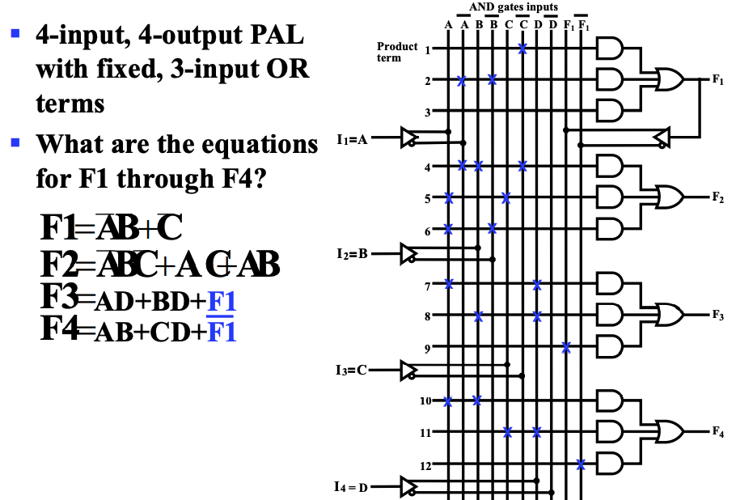

# Chap 5 Digital Hardware Implementation

---

- [ ] TODO: Finish this.

---

## 可重编程技术

**可重编程技术(programmable implementation technologies)**

直接更改电路来修改电路功能被称为硬编程，而可重变成技术让我们能够不更改硬件布线的情况下，实现**逻辑功能的重新编辑**。

!!! example "FPGA"
    [现场可编程逻辑门阵列(Field Programmable Gate Array)FPGA](https://zh.wikipedia.org/zh-cn/%E7%8E%B0%E5%9C%BA%E5%8F%AF%E7%BC%96%E7%A8%8B%E9%80%BB%E8%BE%91%E9%97%A8%E9%98%B5%E5%88%97)
    - [查找表(lookup table)LUT](https://zh.m.wikipedia.org/zh-hans/%E6%9F%A5%E6%89%BE%E8%A1%A8)

可重编程在硬件层面有三种实现手段：

- 控制连接来实现；
    - Mask programing
    - Fuse
    - Anti-fuse
- 控制门级电路电压；
    - Single-bit storage element
    - Stored charge on a floating gate
        - Erasable
        - Electrically erasable
        - Flash (as in Flash Memory) 
- 使用查找表(LUT)；
    - Storage elements for the function
        - 比如使用一个 `MUX`，并将输入端接内存，通过修改内存的值来修改 `MUX` 的行为，进而实现函数重编程

课程中介绍的可重编程的器件主要有如下四种：

- 只读内存 Read Only Memory (ROM) 
- 可编程阵列逻辑 Programmable Array Logic (PAL^Ⓡ^)
- 可编程逻辑阵列 Programmable Logic Array (PLA)
- Complex Programmable Logic Device (CPLD) or Field-Programmable Gate Array(FPGA)

前三者都只能重写一次，如下是它们的重写内容：

---

!!! info "引入"
    由于之后出现的电路图会非常庞大，所以需要引入一些逻辑符号。

### 逻辑符号介绍

!!! example "Buffer"
    
    > 简化表示一个变量的自身和其非；

!!! example "Wire connecting"
    在可编程逻辑电路中，线的连接不再只有单纯的连通和不连通的关系：

    对于两条相交导线：
    
    - 如果没有特殊符号，则表示这个交叉点 is not connected ；

    

    - 如果有一个 ❌，则表示这个交叉点 programmable；

    

    - 如果只有一个加粗的点，则表示这个交叉点 not programmable；

    

特别的，如果一个元器件的所有输入都是 programmable，我们也可以选择把这个 ❌ 画到逻辑门上（如下图 e 和 f）。

---

### ROM

ROM 的基本结构如下：

而 ROM 的大小如下计算（以上图为例）：

$$
\begin{array}{rl}
    ROM\;\;size\;\;&=\;\;address\;\;width\;\;\times\;\;word\;\;width&\\
                   &=\;\;2^2\;\;\times\;\;4\;\;=\;\;16\;\;bit&
\end{array}
$$

???+ example "eg"
    更清晰的表示其内部逻辑的，可以将 ROM 写成这样：

    

---

### PAL

可重编程输入组合来得到固定输出。

其具有一个缺陷是，因为表达函数的方法不是通过 SOM 或者 POM 的形式，所以不一定能够完备表达函数。

在此基础上的一个改进是，通过将一个既有的 PAL 输出当作输入，输入到另外一个函数中，来弥补项不足的问题。

???+ example "eg"
    

---

### PLA 

与 PAL 的区别在于，在输出的时候也能对输出组合进行重编程。

其同 PAL 一样具有一个缺陷是，因为表达函数的方法不是通过 SOM 或者 POM 的形式，所以不一定能够完备表达函数。

在基础上一个改进是在输出的时候再做一次异或，以产生新的项，来弥补项不足的问题。

可以发现，出现了新的项。

