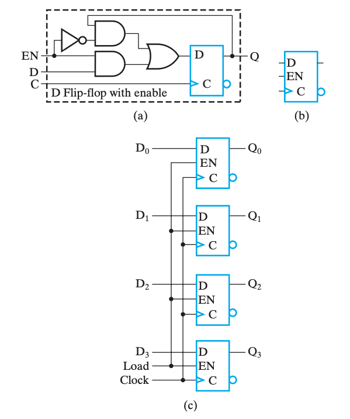
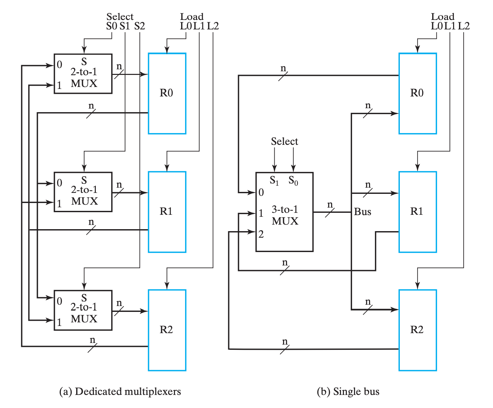
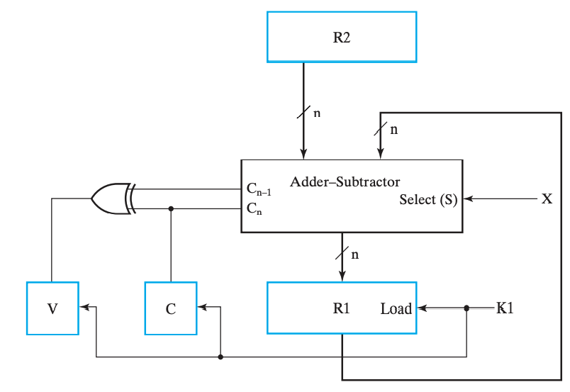
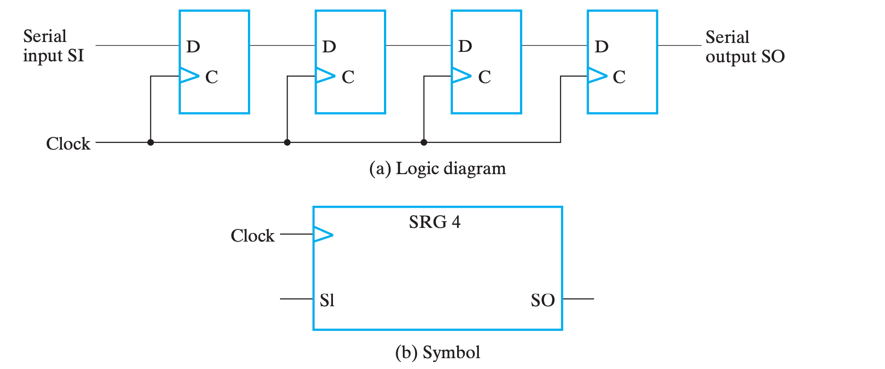
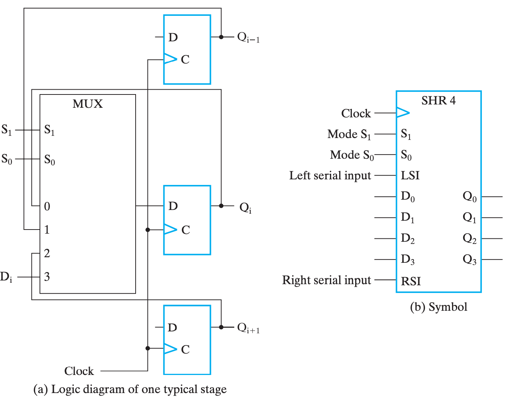
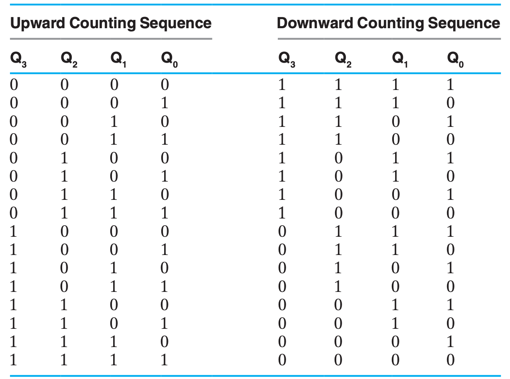
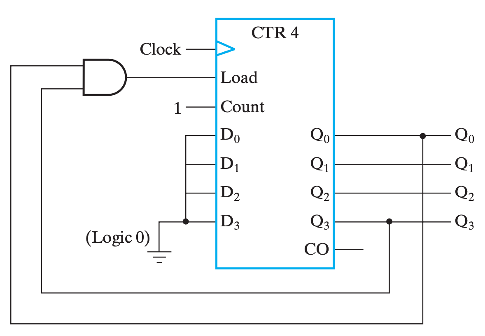

# Chap 6 Registers & Register Transfers

## 寄存器

**寄存器(registers)** 粗略的来说就是一堆触发器以及对应的状态控制电路，用来实现多位数据的存储等操作。

其中有一种特殊的寄存器叫 **[计数器(counter)](#计数器)**，非常直白的，它的行为就是随着时钟周期不断在固定的状态序列中循环。更形象的，一般是实现自动的计数功能，像电子时钟那样。

> Registers are useful for storing and manipulating information; counters are employed in circuits that sequence and control operations in a digital system.

实现寄存器一个最直白的想法就是公用控制线路和分列数据线路来控制多个触发器，如下图是使用 D `FF` 实现的一个 4-bit register：

我们称新数据被写入寄存器的操作为 **载入(load)**，而如果载入操作在同一个时钟脉冲中完成，我们称之是 **并行(parallel)** 的。

---

### 保持

但是我们发现，如图的寄存器在每个时钟都允许载入，换句话来说每个时钟周期都会改变为输入。但是我们希望即使我们不管它它也能保持之前的值，主要有两个方案。

!!! tip "方案 A"
    其中一个做法是需要选择性的让它跟随时钟脉冲切换状态。做法就是将 Control 信号修改为 $C = \overline{Load} + Clock$，如此而来，当 $Load = 0$ 时，始终有 $C = 0$，脉冲消失，寄存器无法被载入。如下图，这种技术叫 **门控时钟(clock gating)**。

    

    !!! warning "clock skew"
        然而，在门控时钟技术中，由于添加了一个额外的逻辑门，时钟脉冲到达 Control 的时候会出现额外的传播延时，即 **时钟偏移(clock skew)**。而这微小的延时会导致在整个同步系统中，不同组件得到的时钟脉冲有偏差，而这是我们所不希望看到的。所以在实际设计中，我们应当避免或尽可能缩小时钟偏移。

!!! tip "方案 B"
    另外一个做法是，在不希望它修改的时候，不断将它的输入载入，也就是保持不变。我们可以通过一个 `MUX` 来实现这个功能，用 `EN` 使能端来选择是载入新值还是保持之前的值，如下图。

    

---

## 寄存器单元

!!! info "小节导读"
    本小节在书本中的位置靠后，但是考虑到内容的连续性我决定提前，本节内容会涉及一些之后的内容，实际上的绝对性知识较少，可以粗看过留下印象即可，大部分知识需要通过案例分析和实践获得，是类似于设计指导思想的内容。

**寄存器单元(Register Cell)** 是寄存器的个体单元，主要包括一个 `FF` 及实现其组合逻辑的组合电路。

> A single-bit cell of an iterative combinational circuit, connected to a flip-flop that provides the output, forms a two-state sequential circuit called a register cell

对于 n bits 的寄存器单元，我们可以通过实现其 1 bit 的寄存器单元，并复制 n 份实现。

设计寄存器单元时，我们需要对寄存器单元进行定义。而指定(Specify)一个寄存器单元的功能的主要有这些方面：

- 寄存器的功能函数；
    - 一般指寄存器传输；
- 控制信号构成；
    - 有哪些控制信号、是否编码、如何决定是否 Load 等；
- 寄存器的输入数据；
    - 有哪些输入数据、是否需要预先处理等；

在实际实现时，分为 `MUX` 实现和时序逻辑实现两种方法。

前者就是 **[#基于 Mux 实现传输](#基于-mux-实现传输)** 中将要提到的那样，关于上面哪些内容在该小节中的体现如下图；

也就是通过分别实现逻辑，然后通过控制信号选择数据输入来实现。

而后者按照时序电路的设计方法，确定状态图后根据状态变化设计时序电路，设计优化决定状态转移方程实现，具体可以参考 **[第四章#时序电路设计](Chap04.md#时序电路的设计)**。

---

## 寄存器传输

!!! warning "说明"
    把 transfer 翻译为“传输”是我脑瓜一拍的行为，我并不知道翻译成什么比较合适，如果读者有更好的翻译，请告诉我！

一个复杂系统除了信息的存储还需要信息的传输和处理，换句话来说，为了实现灵活、复杂的计算，我们需要信息之间能够广泛地交互。大部分电子系统设计中，都会有一个 **控制单元(Control Unit)** 来负责指挥（决定指令的序列） **数据通路(Datapath)** 进行数据处理。

> Datapaths are defined by their registers and the operations performed on binary data stored in the registers.

对于寄存器自身而言，它可能实现 载入(load)、清空(clear)、位移(shift)（关于这里的shift的含义我存疑） 和 计数(count) 等。此外，对于那些寄存器中的数据进行移动了的加工，被称为 **寄存器传输操作(Register Transfer Operations)**，它们主要包含这三个部分：

1. 系统中的寄存器集合；
2. 对于数据的操作；
3. 监督操作序列的控制；

其中，最基础的那部分操作被称为 **微操作(microoperation)**，它们是实现复杂操作的基础，例如将 R1 的数据载入 R2，将 R1 和 R2 相加，或是自增 R1 等。它们通常以比特向量为载体并行实现的。

!!! warning "Note that:"
    > the term “microoperation,” as used here, does not refer to any particular way of producing the control signals: specifically, it does not imply that the control signals are generated by a control unit based on a technique called microprogramming.

---

### 寄存器传输操作 & 寄存器传输语言

对于简单的时序逻辑系统，我们可以使用状态机等方式来描述它们的行为，但是对与规模更大的系统来说，这是一件很痛苦的事情。所以我们引入了一种专注于行为逻辑的语言来描述寄存器传输中的逻辑行为：**寄存器传输语言(Register Transfer Language)RTL**。

通常具有特殊功能的寄存器都会用其名称缩写大写表示，例如 AR(Address Register)，PC(Program Counter)，IR(Instruction Register) 或者更普通的 R2(Register 2)。

> [Little-endian & Big-endian](https://www.geeksforgeeks.org/little-and-big-endian-mystery/)

我们有时候也会用这些形式来图形化的表示寄存器：

此外，常见操作用 RTL 表示方法和符号如下：

需要额外说明的是，如果我们想表达条件语句，例如我们想表达：

$$
if\, (K_1 = 1) \,then\, (R2 \leftarrow R1)
$$

则可以写为：

$$
K_1 : R2 \leftarrow R1
$$

---

## 寄存器传输的实现

!!! info "引入"
    如何实现寄存器所存储的数据之间的处理与交互是本章节的核心命题。如果说 **[微操作](#微操作及其实现)** 处理的是数据之间的处理，那 **[寄存器传输](#寄存器传输)** 则着眼于数据之间的交互。
    
    换句话来说，如何把数据给到别的寄存器、如何获取别的寄存器给到的数据、如何传输和选择这些数据，就是本小节要解决的问题。

    特别的，寄存器传输的实现可以直接实现 **[转移](#转移)** 操作。

### 基于 MUX 实现传输

对于一个单一寄存器，它的 **输入** 可能有多种来源，例如其它寄存器，又或者是其他操作的结果。总而言之，它的输入很可能是不唯一的，而同一时刻我们只能接受一个来源的输入。因此，我们需要使用 `MUX` 来对输入进行选择。

一个简单 🌰 如下：

用语言来描述这个总体架构就是，我们通过一系列 one-hot 编码（不确定，也许可能都为零？我感觉取决于 **[保持](#保持)** 的实现。）来表示选择哪个输入源（下图中 $K_0\sim K_{n-1}$），再通过 `Encoder` 将它们编码作为 `MUX` 的输入选择信号（下图中 $S_m \sim S_0$），从多个输入源（下图中 0 \sim k \sim (n-1)$）中选择对应的源，并输出，给到 R0；此外，将选择信号都或起来，作为 R0 的 Load 信号输入。

> 其中 `MUX` 的 $k \sim (n-1)$ 实现了 **[转移](#转移)** 操作。

!!! summary "小结"

    换句话来说，`MUX` 实现主要的实现了 **多对一** 的数据传输问题。如果我们单单使用 `MUX` 来完成寄存器之间的数据交互（假设所有寄存器都能相互传输数据），那将这个模型（图例在[下一小节](#基于总线实现传输)）抽象后，我们得到的将是一张“**[完全图](https://zh.wikipedia.org/zh-cn/%E5%AE%8C%E5%85%A8%E5%9C%96)**”，然而它肉眼可见的开销大。

    而总线则非常巧妙地优化了这个问题（并不是上位替代关系）。

---

### 基于总线实现传输

在[上一小节](#基于-mux-实现传输)的小结中我们已经提到了 `MUX` 实现的优劣，也提到了 **总线(bus)** 传输的优势，那么它具体来说其实现方法有两种——通过共有 `MUX` 实现，或通过三态门实现。

---

#### 共有 MUX 实现

让我们以三个寄存器的模型为例，对比通过专有 `MUX` 实现和通过 **单一总线(single bus)** 实现的区别：

首先对总线实现进行说明，同样是使用 `MUX`，但此时 `MUX` 不再是某个寄存器的 **专有逻辑(dedicated logic)**，而是三个寄存器共同使用的 **共有逻辑(shared logic)**。总线中的 `MUX` 在所有寄存器的输入中选择其中一个，并将它输出，给到所有寄存器；而总线通过控制 Load 信号来选择让哪个（或哪些）寄存器得到这个信号。

接下来进行对比，以总线实现为主体，与 `MUX` 实现对比：

- 优势：
    - 电路更精简，成本更低，随着寄存器增加这个特点更加明显；
- 劣势：
    - 同一时刻内总线只能传输一个数据，即只有一个数据源(source)；
        - 同一时钟周期内只有一个数据能传输到别的地方，例如交换操作就需要至少两个 bus 才能实现；

而因为这些特点，我们需要评估我们的需求，选择合适的结构来实现。

---

#### 三态门实现

三态门的相关内容已经在前面介绍，传输门在 **[这里](Chap02.md#三态门)** ，关于本小节的知识，可以重点关注 **[#三态门/碎碎念](Chap02.md#三态门)**。

而关于总线的实现，引用一句我在 **[#三态门/碎碎念](Chap02.md#三态门)** 里写的话：

> 只要我们让导线的若干输入中只有一个三态门不在「高阻态」，就能够优雅地实现多路输出互联。

实际上，所谓的三态门实现原理上和 `MUX` 实现无二，只不过我们是通过三态门来实现「路由」这个逻辑而已，也就是书上所说的：

> Three-state buffer outputs can be connected together to form a multiplexed output line.

与 `MUX` 实现相对比，三态门实现方式如下：

进行简单说明，\(c) 中对三态门的表示进行了简化，含义参考 \(a)。它想表达的主要含义是，当 `EN` 为 `1` 时，表示输出；反之表示输入（当然，真正决定是否读入寄存器的还是 `LD`）。

??? question "个人疑惑"
    书中的表述是：

    > If the three-state buffers are enabled, then the lines are outputs; if the three-state buffers are disabled, then the lines can be inputs.

    但是看 \(a) 的表达，不管 `EN` 是什么，它应当都有输入才对，真正决定是否输入进来的应该还是 `LD`？

对比来看，三态门的实现大大降低了总线的实现成本，精简了电路的实现，所以通常来说更常用。

??? note "个人想法"
    虽然书中说三态门的接线比 `MUX` 的少了一半，但我觉的三态门只是把线分岔的地方移动到了寄存器附近，换句话来说不如说是节省了导线的长度。但是随着输入的增加，`MUX` 的结构会越来越复杂且需要重新设计，但三态门只需要量的增加就行了，所以确实是更加吸引人。（当然，虽然书中没说，但是我觉得 Enable 必须 at most one-hot，而这部分的逻辑对于两个实现方法来说是一样的）

---

## 微操作及其实现

> A microoperation is an elementary operation performed on data stored in registers or in memory.

微操作一般分为这四种：

1. 转移，transfer microoperations，将数据从一个寄存器转移到另外一个寄存器；
2. 算术，arithmetic microoperations，对数据的算术运算操作；
3. 逻辑，logic microoperations，对数据的逻辑运算操作；
4. 位移，shift microoperations，对数据的位移操作；

> A given microoperation may be of more than one type. For example, a 1s complement operation is both an arithmetic microoperation and a logic microoperation.

---

### 转移

不改变数据本身，只是从一个寄存器中把数据移动到另外一个寄存器。

将 R0 中的数据转移到 R1 中，用 RTL 表示就是 $R0 \leftarrow R1$。

这一部分的实现途径在 **[寄存器传输的实现](#寄存器传输的实现)** 已经阐述。

---

### 算术

> Multiplication and division are not listed in Table 6-3. Multiplication can be represented by the symbol * and division by /. These two operations are not included in the basic set of arithmetic microoperations because they are assumed to be implemented by sequences of basic microoperations. However, multiplication can be considered as a microoperation if implemented by a combinational circuit. In such a case, the result is transferred into a destination register at the clock edge after all signals have propagated through the entire combinational circuit

!!! example "加减法器"
    就像我们之前学过的，用加法器实现加减法器，在 RTL 和模块逻辑电路的维度下，可以这么表示：

    $$
    \begin{array}{l}
        &\overline{X}K_1:R_1\leftarrow R_1 + R_2 \\
        &XK_1:R_1\leftarrow R_1 + \overline{R_2} + 1
    \end{array}
    $$

    

!!! warning "注意"
    对于如上出现的形式如：$condition: reg \leftarrow options one regs$ 的表达式，`:` 左侧出现的 `+` 表示或，右侧的则表示加（“乘”也是这样）！

相对应的，加减法的实现可以通过加减法器实现，乘法可以用 **[位移](#位移)** 操作实现，而除法相对复杂。

!!! note "乘法实现的<u>大致</u>思路"
    假设我们需要计算 $a \cdot b$，且 $a$，$b$ 都是整数，则可以将 $b$ 写成二进制形式 $(b_{n-1}b_{n-2}...b_1b_0)_2$，于是：

    $$
    \begin{aligned}
        a \cdot b &= a \cdot (b_{n-1}b_{n-2}...b_1b_0)_2 \\
                  &= a \cdot \left[ (b_{n-1}0...00)_2 + \cdot (0b_{n-2}...00)_2 + ... + \cdot (00...b_10)_2 + \cdot(00...0b_0)_2 \right]\\
                  &= a \cdot \sum_{i = 0} ^{n-1} b_i \cdot 2^{i} \\
                  &= \left(a \cdot \sum_{i = 0} ^{n-1} b_i\right) \;\mathrm{<<}\; i \;\;\; \text{where "<<" means "Shift Left"}
    \end{aligned}
    $$

    于是就可以通过 **[位移](#位移)** 的相关知识来实现。

---

### 逻辑

逻辑运算的实现相比算术更加直接，因为大部分逻辑都可以通过逻辑门来实现。

---

!!! note ""
    而承担逻辑和算术运算的硬件模块，一般被称为 **ALU**。

---

### 位移

位移的实现通过 **位移寄存器(Shift Register)SHR** 实现。

!!! info "引入"
    位移操作从本质上来讲，是通过 **触发器随着时钟脉冲，将串行数据一位一位地移动** 实现的。但是如果读者尚未理解其实现原理，阅读以下内容刚开始可能会觉得有些莫名其妙，但是请先阅读 **[串行实现](#串行实现)** 和 **[并行化](#并行化)** 的内容，知道它们的行为后，可以先暂时跳过 **[双向位移寄存器](#双向位移寄存器)**，再来看本节末尾的总结，也许能够让您明白它究竟是怎么实现的。

#### 串行实现

位移操作最简单的实现只需要与输入数相同位数的触发器实现。它的基本结构如下：

> 四个触发器首尾相连，最前面 **串行输入(Serial Input)SI** 数据，末端得到 **串行输出(Serial Output)SO**，在不同时钟周期的偏差下，连续读入的 n bits 即为不同位数位移的结果。

!!! example "串行位移操作实现的模拟解释"
    假设现在我们有 4 个 `FF` 首尾相连，现在串行输入 `1001` 这 4bits 的数据（当然，完全输入需要 4 个时钟周期）。

    假设第 1 个周期结束后，`1001` 最右侧的 `1` 被存在了第一个 FF，则：

    |周期|待输入|FF1|FF2|FF3|FF4|SO|
    |:--:|--:|:--:|:--:|:--:|:--:|:--:|
    |1|`100`|`1`|?|?|?|`1???`|
    |2|`10`|`0`|`1`|?|?|`01??`|
    |3|`1`|`0`|`0`|`1`|?|`001?`|
    |4| |`1`|`0`|`0`|`1`|`1001`|
    |5| |?|`1`|`0`|`0`|`?100`|
    |6| |?|?|`1`|`0`|`??10`|
    |7| |?|?|?|`1`|`???1`|

    这里的 SO 指的是从当前轮次开始，读入 4bits 数据得到的串行输出结果，这里的 4bits 当然是对应输入的 4bits。

    可以发现，在第四轮前后的结果分别是左移和右移的结果，当然，如果是要考虑具有实际计算价值的位移，我们当然需要填充 `?` 的值，不过这都是小事情。

---

#### 并行化

并行化主要有两个方面，即 **并行输出(parallel output)** 和 **并行载入(parallel load)**，分别对应着 在同一个时间周期内 **得到每一个 `FF` 的结果** 和 **对每一个 `FF` 载入数据**。

并行输出的实现非常简单，只需要给每一个 `FF` 的输出引出一条线就行了，它与串行输出可以直接同时存在；而并行输入则与串行输入冲突，一次只能实现其中一个，所以需要一些控制电路：

> 看起来有点复杂，但是实际上逻辑还是很清晰的。
>
> - 纵向观察右侧的四个 `FF`，可以发现基本上就是串行位移实现，只不过其输入不再是直接从上一个 `FF` 那边拿来的；
> - 四个 `FF` 的输入是类似的，所以我们仅关注最上面的那三个与门和一个或门，表示数据输入有三个可能的来源；
>     1. 第一个与门，$F_i=Shift \cdot SI$（对于后面几个 `FF`，则是 $F_i=Shift \cdot FF_{i-1}$），可以发现，此时电路的行为与 **串行位移实现** 一致；
>         - 即 $Shift$ 为 `1` 时，`SHR` 表现为「**每个周期执行一次位移**」；
>     2. 第二个与门，$F_i=\overline{Shift} \cdot Load \cdot D_i$，此时电路的行为是使用比特向量对每一个 `FF` 赋值，即 **并行载入**；
>         - 即 $\overline{Shift} \cdot Load$ 为 `1` 时，`SHR` 表现为「**并行载入**」；
>     3. 第三个与门，$F_i=\overline{Shift} \cdot \overline{Load} \cdot Q_i$，此时电路的行为是保持上一周期的结果；
>         - 即 $\overline{Shift} \cdot \overline{Load}$ 为 `1` 时，`SHR` 表现为「**保持**」；
>
> 总和来说，就是：
>
> $$
> \begin{array}{rl}
>       Shift :& Q\leftarrow \mathrm{sl}\; Q \\   
>       \overline{Shift}\cdot Load :& Q\leftarrow D \\   
>       \overline{Shift}\cdot \overline{Load} :& Q\leftarrow Q
> \end{array}
> $$
> 
> 

---

#### 双向位移寄存器

上面介绍的位移寄存器随着时钟周期的供给，只能不可逆、单向地进行位移，这种位移寄存器称为 **无向位移寄存器(Unidirectional SHR)**；对应的，如果能够支持可控制的左移右移，则被称为 **双向位移寄存器(Bidirectional SHR)**。

其行为如下：

$$
\begin{array}{rl}
    \overline{S_0} \cdot \overline{S_1} :& Q \leftarrow Q\\
    S_0 \cdot \overline{S_1} :& Q\leftarrow\mathrm{Sl}\; Q \\
    \overline{S_0} \cdot S_1 :& Q\leftarrow\mathrm{Sr}\; Q \\
    S_0 \cdot S_1:& Q\leftarrow D
\end{array}
$$

其单元实现如下：

> 其本质上就是添加了一个 `MUX` 来选择下一个时钟是继承 $(i+1)$、$(i-1)$、$D_i$ 还是 $Q$。

---

!!! note "综合阐述"
    代码意义上的位移一般指的是一个双目操作，即可以指定位移多少位，这个参数被称为 **位移量(Shift Amount)**。
    
    但在硬件层面的实现上，这个多少“位”只能通过循环和已经实现的、**有限种** 确定位移量的位移实现，在我们提到的实现中，指的就是我们硬件只实现「一位位移」，并通过循环实现「任意位位移」，而这个“循环”，就是在时钟周期下，`FF` 不断继承上一个 `FF` 的值来实现的。

    而并行与串行实现无非是体现这个特征的两种实现方法而已。

    ???- tip "关于并行和串行"
        这是一个题外话，我暂时不知道放哪里，刚好这里提到了就在这里说了。

        实际上，虽然看起来并行的效率会比串行高很多，但是实际上很多高速传输设备或协议用的都是串行。这是因为，并行单次传输线路多，线路之间的距离小，干扰大，所以相对来说正常工作所下对频率的要求更高；而串行由于可以使用更高的频率工作，所以在某些情况下效率更高。

---

## 计数器

计数器(counter) 是什么，已经在 **[#寄存器](#寄存器)** 中解释了，根据实现原理，主要分为 **行波计数器(Ripple Counter)** 和 **同步计数器(Synchronous Counter)** 两种。

---

### 行波计数器

行波计数器的主要思想就是将一个不断自反的 `FF` 的输出直接或间接作为下一个 `FF` 的时钟脉冲。由于形成一次脉冲需要一对 `0`&`1`，所以前一个 `FF` 取反两次才能引起下一个 `FF` 取反一次，如果下一个 `FF` 是在上一个 `FF` 的输出从 `1` 变 `0` 时触发，那两个 `FF` 的变化刚好对应于二进制自增的进位规律：`(0,0)`，`(0,1)`，`(1,0)`，`(1,1)`，`0,0`，...

于是，一个 4-Bit 行波计数器的逻辑图就如下：

{ width=200px }
> - 上图中，下一个 `FF` 的时钟来自于上一个 `FF` 的输出取反，也就是对于上升沿触发的 `FF` 来说，下一个 `FF` 会在上一个 `FF` 的输出从 `1` 到 `0` 时自反，所以是 **正向计时(Upward Counting)**；
> - 反之，如果下一个 `FF` 的时钟来自于上一个 `FF` 的直接输出，也就是对于上升沿触发的 `FF` 来说，下一个 `FF` 会在上一个 `FF` 的输出从 `0` 到 `1` 时自反，所以是 **逆向输出(Downward Counting)**；

可以发现，行波计数器的优点是电路简单，成本低；但是缺点也很明显，既然它与同步计数器相区分，就说明它不是同步电路，每一个 `FF` 都会有传播延时，随着计数范围增大，总传播延时也会增加，而为了让电路正常工作，时钟频率也要因此下降。

由于这些，书上对行波计数器的评价是多数情况下行波加法器只会在低功耗电路中被采用。

---

### 同步计数器

同步计数器从实现自增的原理上来说，和行波计数器也是类似的，同样是在上一个 `FF` 完成一次翻转的时候让下一个 `FF` 变化。只不过同步计数器不是控制时钟，而是控制「`FF` 内的值是否取反」来实现，而它是通过异或门来实现的。

我们知道，$0 \;\mathrm{XOR}\; X = X$，而 $1 \;\mathrm{XOR}\; X = \overline{X}$。因此，我们可以控制 `XOR` 的某个输入是 `0` 还是 `1` 来实现取反还是保持的切换。

> 不过需要区分的是，行波计数器是在上一个 `FF` 变化完才影响下一个的，所以是 `1` 变 `0` 时需要进位；而同步计数器的所有 `FF` 是一起变化的，所以只有在前面都是 `1` 时候，表示下一刻它们都要进位了，当前 `FF` 才进位。
>
> 也就是说，行波计数器是建立在前一个 `FF` 的结果进行变化；而并行加法器是建立在上一刻所有关联 `FF` 的状态，对下一状态的预判。

在这基础上，同步计数器的 **自增器(incrementer)** 有两种不同的实现方法：

> (b) 的蓝色部分替换 (a) 的蓝框部分为第二种。两种分别为 门串行实现 和 门并行实现。
>
> 两种实现其实原理都是一样的，只不过门串行牺牲某些情况下的运行效率，节约了门成本；而门并行提高x了门成本，减少了某些情况下的门延迟。

当然，既然使用的是自增器，那么实现的自然就是正向计数器。为了实现逆向计数器，我们则需要将自增器换为自减器。做法只不过是将异或门的控制信号取反。

具体来说，输入函数变为：

$$
\begin{array}{rl}
    D_{A0} = & Q_0 \oplus EN \\
    D_{A1} = & Q_1 \oplus \left(
        (Q_0 \cdot \overline{S} + \overline{Q_0} \cdot S) \cdot EN
    \right) \\
    D_{A2} = & Q_2 \oplus \left(
        (Q_0 \cdot Q_1 \cdot \overline{S} + \overline{Q_0} \cdot \overline{Q_1} \cdot S) \cdot EN
    \right) \\
    D_{A3} = & Q_3 \oplus \left(
        (Q_0 \cdot Q_1 \cdot Q_2 \cdot \overline{S} + \overline{Q_0} \cdot \overline{Q_1} \cdot \overline{Q_2} \cdot S) \cdot EN
    \right)
\end{array}
$$

> 从这个表达式也可以略微感受到门串行和门并行的区别究竟在哪里，它们使用同一个表达式，只不过用不同的方式来实现多位 `AND` 运算。

---

#### 同步载入

这里同步载入的含义可以同 **[位移寄存器的并行载入](#并行化)** 类比，其主要目的是将计数器的当前值设为一个我们需要的数字。

以门串行实现为例，添加功能控制逻辑后的设计如下：

---

### 任意计数序列

现在让我们回归计数器的行为：<u>随着时钟周期不断在固定的状态序列中循环</u>。也就是说，这个序列未必需要是整数自增自减序列。而实现某一序列的计数行为，实际上只要设计好有限状态和状态之间的转移即可。

当然，这个话题太过宽泛，我们在这里具体讨论的还是整数自增序列，只不过限制了上下界。书上提供的案例是 BCD 码的循环计数，那我们也跟着这个案例来。

---

#### BCD 码循环计数

首先我们需要根据时序电路的设计规则，搞清楚状态序列，显然，根据 BCD 码的定义，我们可以毛毛地认为它是下确界为 `0`，上确界为 `9` 的 4 比特整数序列。换句话说，我们需要实现一个计数到 `9` 后下一个状态是 `0` 的 4 比特计数器。

于是我们可以当计数器的输出为 `9` 时，下一周期让计数器载入 `0`：

> 按理来说这里应该是 $Load = Q_0\cdot\overline{Q_1}\cdot\overline{Q_2}\cdot Q_3$，以对应 `9D=1001B`，但是由于自增过程中，`1001` 是第一个满足 `1??1` 的组合，所以可以直接简化为 $Load = Q_0\cdot Q_3$。

如上是修改上确界的方法，而修改下确界的方法则是修改 $D_i$ 序列，例如上图中 $D$ 接地，所以下确界是 `0000B`。

!!! example "Mod N 计数器"
    实际上，我们可以把 BCD 码循环计数器看作是特殊的 Mod N 计数器，即 N = 10 的 Mod N 计数器。

    或许你会想，实现 Mod N 计数器能不能在满足输出条件后直接使用 `Clear` 输入。但是请不要忘记了，`Clear` 也好，`Set` 也罢，它们都是异步操作。我们没有必要也不应该使用异步操作，所以最好的做法还是使用 `Load`。

---

## 寄存器传输的控制

!!! error "未完成"

Control Unit

- Programmable sys
    - instructions (usually stored in memory RAM/ROM)
    - program counter
- Nonprogrammable sys
    - focus on this
    - State machine diagrams for Control Unit design.

1. Write a detailed system specification.
2. Define all external data and control input signals, all external data, control, and status output signals, and the registers of the datapath and control unit.
3. Find a state machine diagram for the system including the register transfers in the datapath and in the control unit.
4. Define internal control and status signals. Use these signals to separate output conditions and actions, including register transfers, from the state diagram flow and represent them in tabular form.
5. Draw a block diagram of the datapath including all control and status inputs and outputs. Draw a block diagram of the control unit if it includes register transfer hardware.
6. Design any specialized register transfer logic in both the control and datapath.
7. Design the control unit logic.
8. Verify the correct operation of the combined datapath and control logic. If verification fails, debug the system and reverify it.

重点看书上的例子。

