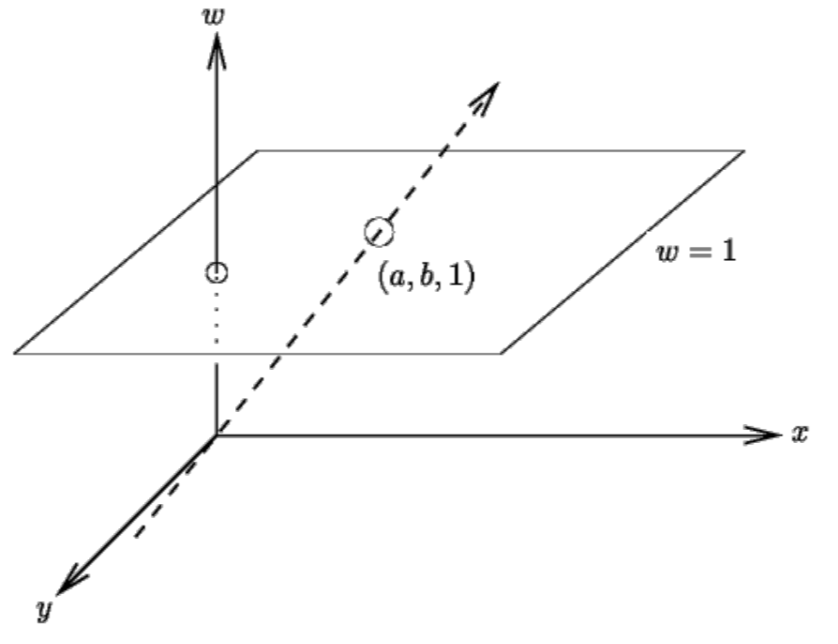
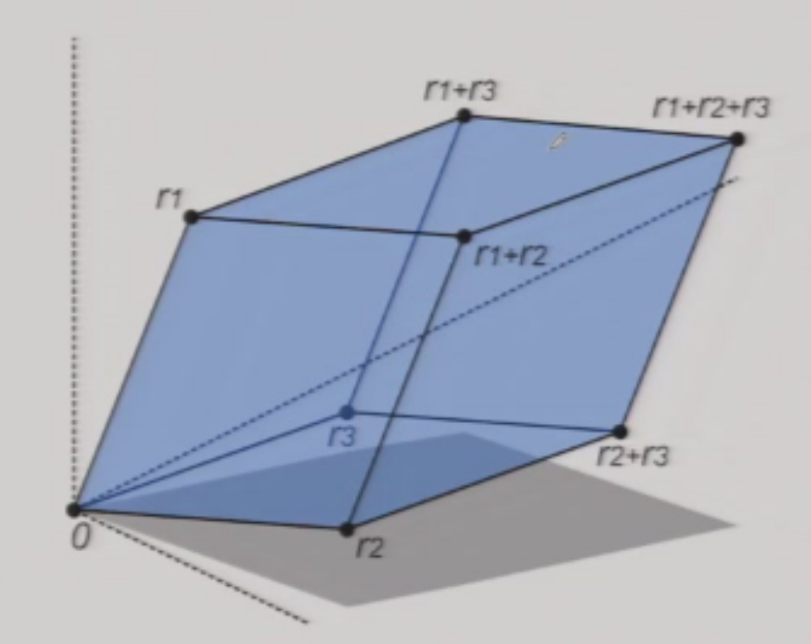
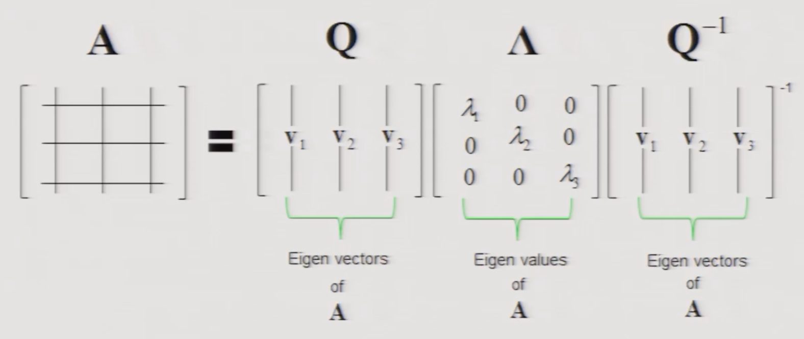
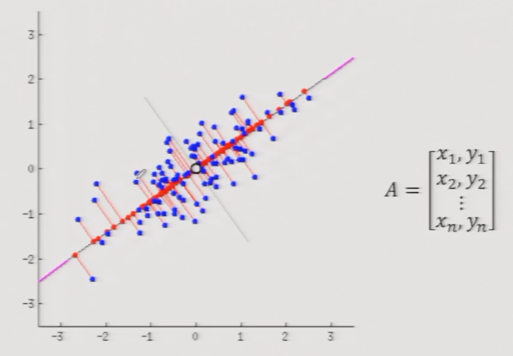

# Lecture 1 | Introduction

## CV 的主要任务

- 三维重建 / Reconstruction
- 图像理解 / Understanding
- 图像合成 / Synthesis

---

## CV 的应用

??? eg "Application Examples"
    - Face Reconstruction and Recognition
    - Face ID
    - Vending Machine with Face Detection
    - DeepFake
    - Augmented reality
    - Factory Automation
    - Vision Inspection
    - Optical Character Recognition(OCR)
    - Video Surveillance
    - Human Computer Interaction: Optical Mouse
    - Human Computer Interaction: Motion Sensing Games
    - Visual Effects (VFX)
    - Digital Human
    - VR Tour
    - Visual Localization and Navigation
    - Autonomous Navigation: Space Exploration
    - Robot Perception
    - Autonomous Driving
    - Augmented Reality
    - Free Viewpoint Video
    - Medical Image Analysis
    - ......

---

## 学术圈概况

CV 领域的几个顶会

- **CVPR** (Computer Vision and Pattern Recognition)
- **ICCV** (International Conference on Computer Vision)
- **ECCV** (European Conference on Computer Vision)

图形学相关的顶会

- ACM SIGGRAPH

---

## 课程概述

- 课程目标
    - 学习计算机视觉相关的知识
    - 学会「用数学描述与解决问题」
    	- `Linear Algebra` / `Optimization` / `Geometry`
- 课程资源
    - 教材：[https://szeliski.org/Book/](https://szeliski.org/Book/)     
&nbsp;

- 课程计划
    - Basics. (Lec.02 – Lec.04)
    - Reconstruction. (Lec.05 – Lec.09) 
    - Understanding. (Lec.10 – Lec.12)
    - Synthesis. (Lec. 13 – Lec.14)

!!! note "Note"
    - 作为后续课程的基础，需要复习线性代数的相关知识，它将贯穿整个课程；
    - 需要熟悉涉及的词汇，之后会若干次提到；

## 线代复习

### 线性变换

首先，一个矩阵左乘一个向量：

- 代数上，结果向量的每一项相当于原向量的一个加权求和；
- 几何上，结果向量相当于原向量做几何变换得到的新向量；

在这种基础上，矩阵乘法可以认为是一系列向量（右侧矩阵）经过同一个变换得到新的一系列向量。

- 那么反过来的，我们也可以通过观察某些点在变换后的位置来感受这个“变换”的具体内容；
- 更特别的，我们可以发现，变换矩阵（左侧矩阵）的每一列，就相当于对应的单位基（例如第 $2$ 列对应 $\vec{a}(0,1)$ 向量）经过这个变换（右乘这个变换矩阵）得到的结果；

!!! tip "Tips"
    实际上，从单位矩阵的角度也可以很好的理解这件事：

    $$
    \begin{bmatrix}
        a & b \\
        c & d
    \end{bmatrix}
    \begin{bmatrix}
        1 & 0 \\
        0 & 1
    \end{bmatrix}
    =
    \begin{bmatrix}
        a & b \\
        c & d
    \end{bmatrix}
    $$

!!! note ""
    我们来试着运用上面的技巧求一个旋转变换对应的变换矩阵。

    === "题面"
        {width="100px" align="left"}
        假设该矩阵让目标图形顺时针旋转 $\theta$ ，则其表达式为？
    === "答案"
        {width="144px" align="left"}
   
        我们做此分析：

        - 对于参考点 $(1,0)$，经过旋转后位置变化为 $(\cos\theta,-\sin\theta)$；
        - 对于参考点 $(0,1)$，经过旋转后位置变化为 $(\sin\theta,\cos\theta)$；

        因此，根据上面提到的技巧，旋转对应的变换矩阵为：

        $$
        R_{\theta,clockwise} = 
        \begin{bmatrix}
            \cos\theta & \sin\theta \\ 
            -\sin\theta & \cos\theta
        \end{bmatrix}
        $$

        特别的，如果是逆时针，结果就是：

        $$
        R_{\theta,anti-clockwise} = 
        \begin{bmatrix}
            \cos\theta & -\sin\theta \\ 
            \sin\theta & \cos\theta
        \end{bmatrix}
        $$        

---

### 仿射变换与齐次坐标

**仿射变换(Affine Transformations)** 主要包括两个部分，即线性变换和平移（换言之，仿射变换并不是线性变换），其数学表述为：

$$
\begin{bmatrix} 
    x' \\
    y' 
\end{bmatrix}
=
\begin{bmatrix} 
    a & b \\ 
    c & d
\end{bmatrix} 
\begin{bmatrix} 
    x \\ 
    y 
\end{bmatrix}
+
\begin{bmatrix} 
    t_x \\ 
    t_y 
\end{bmatrix}
$$

为了让仿射变换也能写成 $a=Mb$ 的形式以简化运算，我们可以用 $n+1$ 维向量来表示 $n$ 维点，即使用**齐次坐标(homogenous coordinates)**：

$$
\begin{bmatrix}
    x'\\
    y'\\
    1
\end{bmatrix}
\cong
\begin{bmatrix}
    a & b & t_x \\
    c & d & t_y \\
    0 & 0 & 1
\end{bmatrix}
\begin{bmatrix}
    x \\
    y \\
    1
\end{bmatrix}
$$

!!! question "为什么是 “1”"
    这里我们不禁抛出一个疑问，为什么齐次坐标添加的维度中要填入 1 呢？它有什么含义吗？它不能是 2 或者别的什么东西吗？

    答案是，它可以是别的东西，或者说我们需要对定义进行一个扩展，以使齐次坐标有更大的用处。

    #### 齐次坐标的扩展性质

    例如，$(x,y)$ 对应的齐次坐标为 $(x,y,1)$，如果你把它想象成三维空间中的点，会发现，如果改变 1 的值，得到的点的轨迹会是若干张平行的平面，也就是说他们在三维空间下是相互独立的。

    此时，我们就可以人为的定义一个每一个平面内的点的映射关系（我们只考虑第一象限），从原点引一条射线，直线上与每一个平面的交点我们都认为对应着二维平面上的同一点。

    {width=320px align=right}
    
    换句话来说，**我们用 $n+1$ 维空间中 从原点发出的一条 <u>射线</u> 来<u>描述</u> $n$ 维空间中的一个<u>点</u>。**
    
    于是我们可以用下面的式子来概括扩展定义：

    - $\begin{bmatrix}x\\y\\k\end{bmatrix}$ 等价于 $\begin{bmatrix}x/k\\y/k\\1\end{bmatrix}$，当然，$k\not=0$；

    而引入这种想法后，我们就知道为什么通过齐次坐标化就能把平移变成线性变换——我们可以将 $n$ 维**点**的**平移**看作 $n+1$ 维**射线**的**旋转**，而旋转显然是一个线性变换。

    而关于该性质的其他应用，可以看 Lecture 2 的[第二小节](./Lec02.md#应用齐次坐标)。

---

### 逆变换

线性变换 $T$ 的**逆变换(Inverse Transform)**就是其变换矩阵的逆 $T^{-1}$，显然，并不是所有变换都是可逆的。

形象地理解，一个变换矩阵如果不满秩（不可逆），那么就会有几个基在变换中合并，或者说多个点被映射为同一个点，导致无法还原。

---

### 行列式的几何含义

{width=360px}

**行列式(Determinant)** 的值等于这个方阵中的向量对应的 平行图形/几何体/... 的 面积/体积/...

---

### 特征值和特征向量

**特征向量(eigenvector)**和**特征值(eigenvalue)**的定义如下：

对于矩阵 $A\in R^{N\times N}$，如果有向量 $v\in R^{N}$ 和实数 $\lambda \not = 0$，满足：

$$
Av = \lambda v
$$

则称 $v$ 是矩阵 $A$ 的特征向量，对应的特征值为 $\lambda$。

从几何变换的角度来理解这个定义式，可以描述为：向量 $v$ 经过变换 $A$ 得到的结果，等于直接对 $v$ 进行缩放（而没有改变方向）。

!!! tip "工程计算方法"
    令人惊喜的是，我们在实际运用时，可以直接使用数学库中的**特征值分解(eigen decomposition)**方法，其大致会做这样一件事：
    
    
    
    将矩阵 $A$ 分解为 $Q\Lambda Q^{-1}$，其中 $Q$ 中的每一列即为 $A$ 的特征向量，对角阵 $\Lambda$ 中的第 $i$ 项就是第 $i$ 个特征向量的特征值。

!!! note "特征值与特征向量的应用：主成分分析(principal component analysis)"
    {width=310px align=right}

    **主成分(principal component)**等于协方差矩阵的 特征值最大的 那个特征向量。
    
    - 如图，我们要从图中找到一个方向，使得所有数据点在这个方向上的投影，方差最大（换言之，找到这些数据的一个“方向”）；
    - 记所有数据点为 $A$，则 $A^{T}A$ 为**协方差矩阵(covariance matrix)**，其特征向量中，特征值最大的那个，就是这组数据的主成分；
