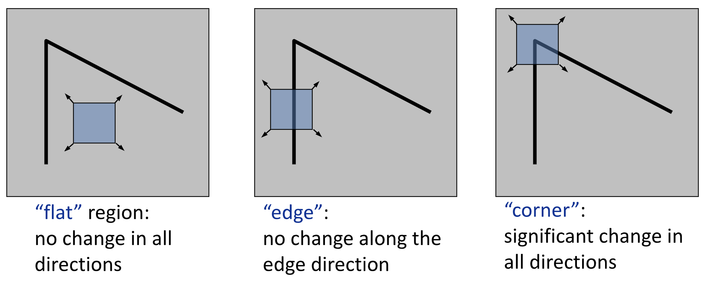

# Lecture 5 | Feature Matching and Motion Estimation

!!! warning "注意"
    本文尚未完全整理好！

## 图像特征匹配 image matching

本节的课题是 **特征匹配(feature matching)**，关键在于找到图片见点和点的匹配关系。该问题是很多问题的基石，例如：

!!! summary "applications"
    - Image alignment / Panoramas
    - 3D reconstruction
    - Motion tracking
    - Object recognition
    - Indexing & database retrieval
    - Robot navigation
    - ...

feature matching 的主要环节是：

1. Detection: 找到 **兴趣点(interest points)**
2. Description: 提取每个兴趣点周围的向量 **特征描述符(feature descriptor)**
3. Matching: 决定两个视角下特征描述符的关联并匹配

---

### Detection

首先第一个问题是如何选择 interest points / feature points。

- 它需要 唯一性uniqueness

接下来是这个 uniqueness 的数学定义：

Local measures of uniqueness:

像任何方向滑动窗口，在任何方向都会产生较大变化的那个区域相比之下 uniqueness 更强

然而这个定义仍然不够足以建模，因此我们进一步地赋予其数学意义：

根据梯度的分布，我们可以大致观察到图形的特征。进一步的，我们利用数学工具去分析这些点的分散度和分散方向。于是我们采用主成分分析(Principle Component Analysis)

对于上面的三种情况，它们做主成分分析后得到的结果是：

可以发现，第三个情况的两个特征值都很大。

更一般的，我们通过判断特征值的大小情况来判断一个区域是否包含一个 角(corner)，又或者是一些 边(edge)，甚至是平面(flag)：

> Corner detection.

逻辑判断->数值计算：Harris operator:

$$
f = \frac{\lambda_1\lambda_2}{\lambda_1+\lambda_2} = \frac{determinant(H)}{trace(H)}
$$

这里的一个特性是，对于二维矩阵来说，我们实际上并不需要按照之前的步骤，进行主成分分析以后再得到，而是可以直接通过这个公式得到。

而这个 $f$ 就叫做 corner response。

??? question "reminder"
    $$
    det\left(\begin{bmatrix}
        a & b\\
        c & d
    \end{bmatrix}\right) = ad-bc
    \;\;\;\;\;
    trace\left(\begin{bmatrix}
        a & b\\
        c & d
    \end{bmatrix}\right) = a+d
    $$

综合起来，这个方法叫作：

#### Harris detector

1. Compute derivatives at each pixel.
2. Compute covariance matrix H in a Gaussian window around each pixel.
3. Compute corner response function f.
4. Threshold f.
5. Find local maxima of response function (nonmaximum suppression).

一个关键问题是特征匹配的可重复问题（因为同一个点不一定在两张图里都是 interest point，所以只有重复的点才能匹配）

我们希望这些 repeatable 的点的 response 在 image transformation 中具有一定的不变性。

transformation
- 强度变化
- 几何变化
    - 旋转
    - 放大缩小
    - 平移

>  **Partially** invariant to affine intensity change.
> Corner response is invariant w.r.t. translation.
> Corner response is invariant w.r.t. image rotation.
> Corner response is **NOT** invariant to scaling

所以我们在使用这个方法的过程中需要注意尺度，即窗口的大小选定。

一种方案是，不断尝试不同的 window size，然后取得 response 曲线，假设 response 的大小只与 scale 有关，则曲线都应该是单峰的，而取出这个峰值，就可以当他为对应的 scale 以及对应的 response。

不过实际情况是固定窗口大小，改变图片的大小，再在得到的图像金字塔上进行这个方法的计算，即对不同分辨率的图片上分别实现一次这个方法。（相当于提高了一个维度）

---

#### 斑点检测 Blob detector

Blobs(area) are good features.

类似于找边，我们可以使用滤波器。

!!! note "Laplacian 算子"
    （二阶导求和）

使用 Laplacian of Gaussian Filter(LoG)，是一个中间负，两边正的滤波器(形状类似，相反亦可)，是高斯函数的拉普拉斯算子。

实际上也等效于先对图片作高斯模糊（减小噪声影响），再计算其拉普拉斯算子。

而它的 scale 的选择，则和角点检测的方法是一致的。

又或者可以使用 Difference of Gaussian(DoG)

即将 Laplacian of Gaussian Filter 替换为一个两个高斯函数做差得到的 Filter，相对来说效率更高。

---

### Description

选定匹配点后，我们需要考虑如何描述。

一种朴素的思想是将窗口内的像素作为一个向量进行比较，但是这样做对误差过于敏感。

更好的做法是 SIFT descriptor，不是使用像素值，而是使用梯度的分布（0~2派的分布直方图）作为一个描述。
此时小的平移和缩放都不会对它产生很大影响，而旋转会导致直方图的循环平移，不过这是很好处理的。

Scale Invariant Feature Transform(SIFT)包括detector:

特点：比较鲁棒，效率也相对高

---

### Matching

检测重复性纹理：Ratio score，比较最接近的两种匹配，如果比值接近1，说明并不可靠，只能丢掉

Mutual nearest neighbor
相互最相似的点更可靠。

### Learning based matching

## 运动估计 motion estimation

运动的成因：

- 相机运动 x 场景运动

Motion estimation problems:

- Feature-tracking 稀疏
- 光流 Optical flow 稠密

而两个问题都可以使用 Lucas-Kanade method 解决。

运动估计问题的定义：

视频的两帧，关键点的变化量。

不同于关键点匹配，动作估计中存在对时序关系的捕捉。

LK method 假设：

1. Small motion 相邻帧运动距离小
2. Brightness constancy 相邻帧的点的亮度倾向于不变
3. Spatial coherence 相邻的点倾向于运动类似

使用公式表述：

### The brightness constancy

$$
I(x,y,t) = I(x+u, y+v, t+1)
$$

为了求解 u 和 v，LK Method 对其作泰勒展开：

$$
I(x+u,y+v,t+1) \approx I(x,y,t) + I_x\cdot u + I_y \cdot v + I_t \\
I(x+u,y+v,t+1) - I(x,y,t) = I_x\cdot u + I_y \cdot v + I_t \approx 0 \\
\nabla I \cdot \begin{bmatrix}
    u & v
\end{bmatrix}^T + I_t = 0
$$

于是得到了关于 u 和 v 的一个较简单的等式。

然而未知元有 2，等式有 1，所以无法求解。

!!! question "PPT 里那个u' v'的例子是什么意思？"

**孔径问题(Aperture problem)**

solution:

More equation

利用假设 Spatial coherence，我可以利用窗口内的大量像素都带入上面那个等式求解 u 和 v。

但是这下方程数又大于变量数了，于是我们转化问题，把解方程的问题转化为优化问题。

$$
Ad=b \rightarrow \min\limits_d ||Ad-b||^2
$$

**Least squares solution(前面提到过的最小二乘法的近似解)** for d given by $(A^TA)d = A^Tb$.

*在这里补一个公式

!!! tip "而这个公式有解恰好意味着它是个角点。"

理论上我们对假设1的要求是，两帧之间的运动差距应该小于一个像素，然而这个条件非常苛刻。所以我们的做法是先对图片进行模糊/缩小处理，像素足够“大”之后就可以满足这个假设1。然而只根据这个条件来计算也不行，所以我们要在像素金字塔上进行逐层次的做法。