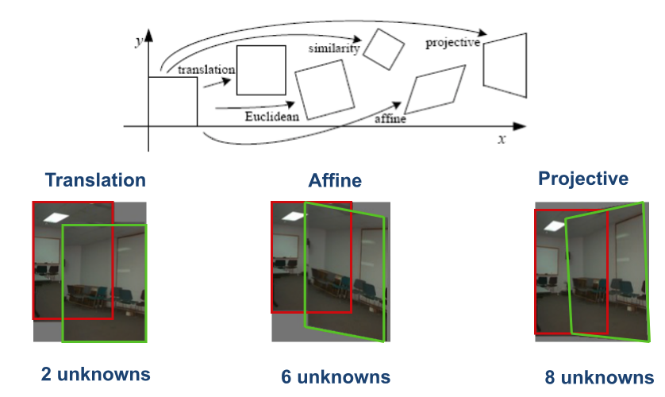

# Lecture 6 | Image Alignment and Stitching

!!! warning "注意"
    本文尚未完全整理好！

## 图像拼接

所谓的图像拼接，模式上就是寻找若干图片的共同部分，并将画面内容进行拼接和延展，其本质是求解图像之间的变换关系，也就是一个模式拟合的问题。应用上比如 全景图(panorama) 或 360°VR等。

!!! note "投影平面/曲面"
    常见的图像拼接有比如将平行的景象在平面上投影和拼接，也有将水平环绕的的景象在柱面上投影和拼接等。区别在于需要对图像内容的表达进行一个“变换”，但实际变化方法不会有大区别，仍然是先检测相同部分再求解变换关系。

    在这里需要做的一个特别说明是，在之后详细介绍“变换”的过程中，我们会解释为什么手机拍摄广角照片时，会要求拍摄者只做视角变化而不做位移。

!!! note "过程概述"
    我们这里考虑的图像拼接问题，更多指的是两张图片拥有共同刻画目标的情况下进行拼接，即两张照片存在交集。

    首先，我们通过 **[图像特征匹配](Lec05.md)** 相关技术，找到这两张图片的共同部分，接下来通过转化为优化问题，求解这些共同部分如何实现转化（相当于在做“对齐”）。

- 图像拼接的两个方面：
    - 将两张图片对齐，找到重合的部分 image warping (change shape of image)
        - 一般来说是 参数化parametric 或者说 全局global 的 warping，由一个含有参数的方程决定：$p' = T(p)$；
            - 
            - translation / affine / projective
            -  
            - 除了能够用仿射变换描述的变换，还有投影变换(Projective Transformation)，或者说单应变换(Homography)，它无法用仿射变换描述。
                - 单应矩阵在平面图形中也是一个 3*3 的矩阵，但是没有必须为 0 的元素约束（区别于齐次坐标）：
                - $\begin{bmatrix}x'_i \\ y'_i \\ 1 \end{bmatrix} \cong \begin{bmatrix} h_{00} & h_{01} & h_{02} \\ h_{10} & h_{11} & h_{12} \\ h_{20} & h_{21} & h_{22} \end{bmatrix}\begin{bmatrix}x_i \\ y_i \\ 1\end{bmatrix}$，由于 $h_{22}$ 实际上可以是任意实数，所以实际上的自由度为 8，所以为了让解具有唯一性，我们约束 $||\bmatrix{h_{00} & h_{01} & ... & h_{21} & h_{22}}||_2 = 1$，这样就能保证自由度为 8 且对应的解唯一；
                - 实际上，可以理解为它是在三维空间下，相机 **不平移只旋转** 的一个视角变化，即 change projection plane；
                    - 如果相机平移且旋转，那情况非常复杂，甚至不一定具有点点对应关系；
                    - 但是有一个特殊情况，就是我观测到场景本身就是平面（或者特别远的景观），场景不存在遮挡，这个时候也可以使用 homography；
                    - 如上就是为什么手机拍摄全景照片时要求不要移动只转动相机
                - 如上变换都有逆变换；
                - 实际操作过程中，我们使用逆变换（正向变换的话像素位置可能不对），即对于每一个需要找的像素点，我们去找变换前的坐标，并根据这个坐标来进行插值，一般使用双线性插值；
    - 计算如何对齐合并这两个图片 image stitching
        - 即给定两张图像，如何计算上一步提到的 T；
        - 步骤：
            1. image matching(each match gives an equation);
            2. solve T from the obtained matches;
        - 例如，对于 afine transformations，有六个自由度，需要六个方程三对匹配关系（每一对匹配关系提供两个方程，分别是关于 x 和关于 y 的）；
            - 它们具有矩阵形式： （抄麦哥笔记）
            - 实际过程中我们并不会直接去“解方程”，而是去做一个“尽量相等”的一个最小二乘问题，这个问题的解有一个解析解：$t = (A^TA)^{-1}A^Tb$；
        - 再例如对于 homography，有八个自由度就需要八个方程四对匹配关系；
        - 对于优化问题：$\mathop{min}_h ||Ah||^2 \;\;\; s.t. ||h|| = 1$，其解 $\hat{h}$ 为 $A_TA$ 特征值最小的特征向量；
        - 此外，还要关注如何处理 outliers：使用 [RANSAC](Lec04.md#随机抽样一致)； 
            - 即，利用小部分匹配关系计算出 T，然后拿去检验其他的匹配关系； 
    - 然而上面这些做法都是将图片投影到一个平面上，也就是说将图像拼接为一个更大都平面图像；但是在全景这种案例中，这么做会让边缘拉伸越来愈明显（近大远小），所以对于这种案例，我们要先将它投射到柱面上，然后在柱面上进行拼接，TODO:公式记得抄上来；
    - 还有一个问题是误差累积，导致 **漂移(drift)**，解决办法就是最后一张和第一张之间也计算一次 T 来进行约束，这种想法叫回路闭合； 

拼接过程中会出现边界，而这个边界我们是可以人为选择的，比如我们可以选择让它差距最小的地方成为边界，又或者是一个图割问题；
