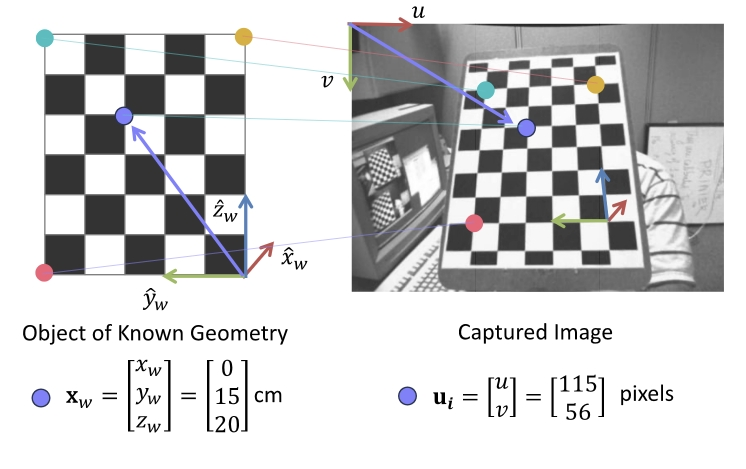
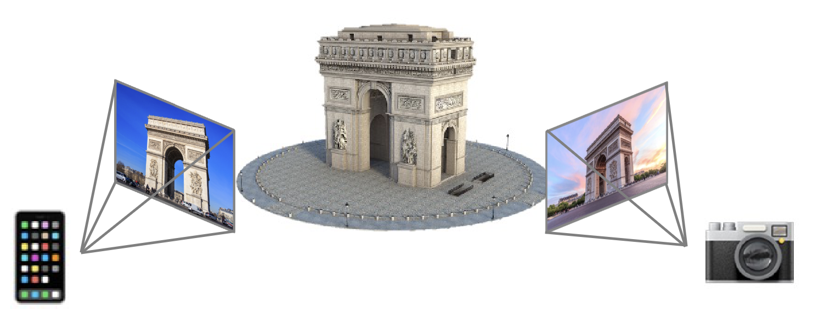
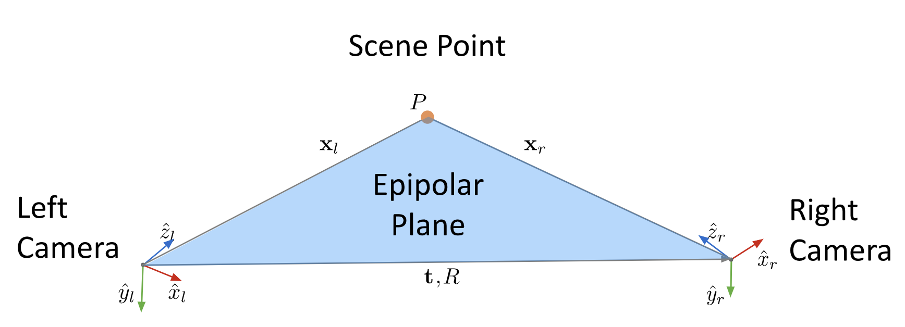
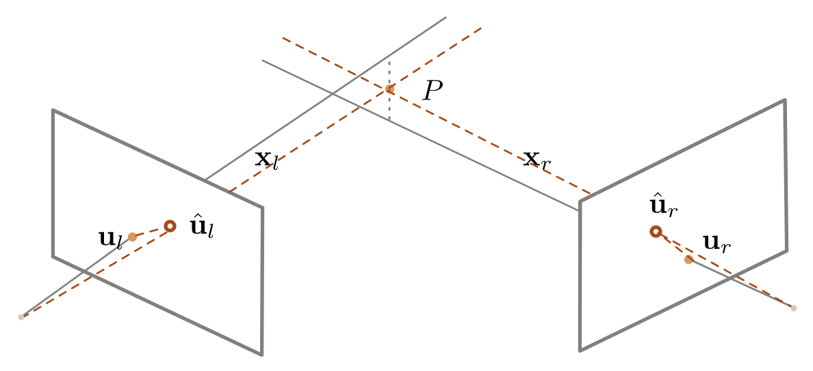
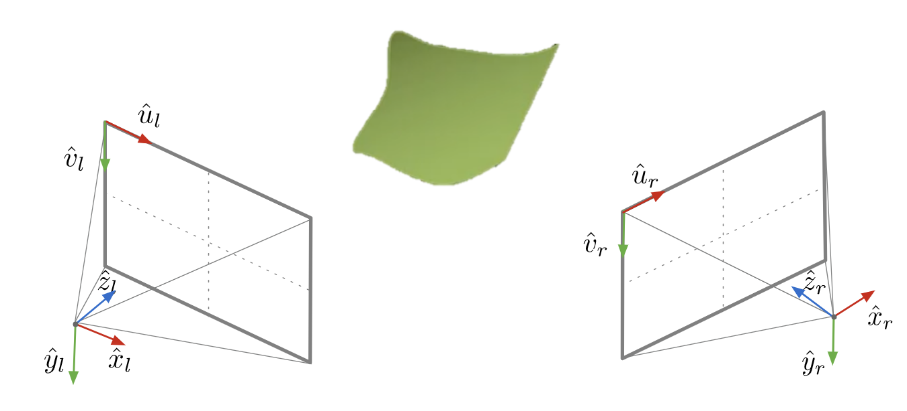
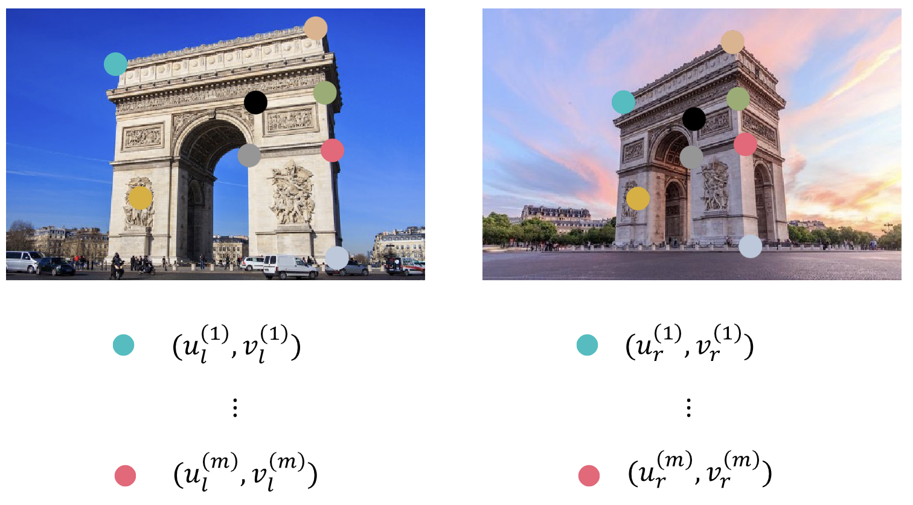
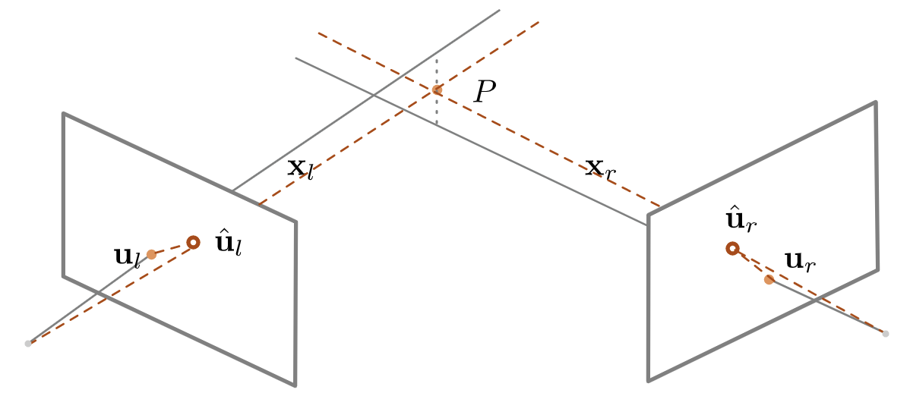

# Lecture 7 | Structure From Motion

!!! tip "前言"
    个人感觉这一章的内容虽然脉络清晰，但是需要不断引入新的内容，如果直接采用“用到什么讲什么”的顺序阐述，可能会有些杂乱，不方便知识索引和复习，所以我大致按照拓扑排序的顺序排列内容，倾向于完整地介绍一下前置，再引入之后的内容并阶段性小结，可能看起来比较唐突，但是大概对回头查知识点比较方便。

!!! warning "说明"
    本文中提到的所有的「成像平面」指的都是我们的简化几何模型中的虚拟成像平面，并不是物理意义上小孔成像所在的那个成反向倒立像的平面！

**运动推断结构(Structure from Motion)SfM**用于估计二维图像中的三维结构，通过相机运动（平移、旋转）引起的画面变化来计算其反应的 3D 结构。

> 在机器人领域，一个相关的领域是 [同时定位与地图构建(Simultaneous Localization and Mapping)SLAM](https://zh.wikipedia.org/wiki/%E5%90%8C%E6%97%B6%E5%AE%9A%E4%BD%8D%E4%B8%8E%E5%9C%B0%E5%9B%BE%E6%9E%84%E5%BB%BA)。

!!! key-point "三个关键问题"
    1. 如何描述相机的投影行为，也就是**[相机模型](Lec02.md#透视投影)**的相关内容，本小结指透视模型；
    2. 如何通过图像求解相机参数，这个过程被称为**相机标定(Camera Calibration)**，以及如何求解相机的空间位置与朝向，这个过程被称为**位置估计(Pose Estimation)**；
    3. 如何利用若干视角进行重建；

    其中，第一个命题的内容已经在**[第二讲](Lec02.md)**中涉及，所以不再展开。

---

## 相机标定与位置估计

**相机标定(Camera Calibration)**即求解相机用来描述相机模型的自身参数，换句话来说就是求解相机的**内参(Intrinsic Parameters)**；而**位置估计(Pose Estimation)**求解相机的空间位置以及朝向，与内参相对应的，就是求解相机的**外参(Extrinsic Parameters)**。

---

### 成像过程的建模

!!! info "视觉定位问题"
    首先，为了展开之后的内容，我们需要定义**视觉定位问题(Visual Localization Problem)**：给定一个已知的三维模型，从某个位置对其进行拍摄，求解拍摄位置和视角。

    而为了展开视觉定位问题，我们首先需要对相机成像这个过程进行一个数学建模——更详细的来说，是建模一个空间 3D 点与相机上特定像素区域的转化关系。

首先让我们回顾一下**[投影模型的可视化表示](Lec02.md#可视化表示)**中的相关内容：

!!! summary "回顾"

    { align=right width=50% }
    
    我们可以发现，小孔成像的模型视图其实还是比较麻烦的。现在我们把这个定角相似对折，变成 A 字型相似来表示这个模型，以简化不必要的信息，同时也能更清晰地表示透视关系。
    
    规定我们讨论的问题中物距总是大于像距，则可以将像表示为相机中心到物体的放射连线中的**截面**。
    
    它比较好地表达了透视关系，即 <u>相机中心</u> <u>物点B</u> <u>像点B'</u> 始终共线。这也是在之后的内容中更加常见的可视化表现方法。

它提供了一种将相机模型成像原理可视化的方法，接下来我们将它放到 3D 空间中：

这张图大致描述了：在特定**位置**有着特定**朝向**的**相机模型**如何拍到已知 3D 景象的**特定画面**，但需要注意的是，这里的「Picture」代表的是 Image Plane，也就是成像平面，此时「坐标」的单位是长度，如毫米——与以「像素」为基本单元的“图片”有一定区别。

也就是说，从 3D 中的某一个点，到图片上的某块像素区域，有大致如下几个阶段：

```mermaid
graph LR
    A[3D 景象] --> B[2D 成像平面] --> C[像素图像];
```

不过需要注意的一点是，我们在**[相机模型](Lec02.md#透视投影)**中介绍的一系列建模，是建立在以相机为参考系的情况下的，而在**视觉定位问题**中，我们拥有的 3D 景象信息肯定不是通过**相机坐标(Camera Coordinates)**来表示的，而是用**世界坐标(World Coordinates)**，显然，这里只包括平移和旋转，也就是经过一次**[仿射变换](Lec01.md#仿射变换与齐次坐标)**。

我们对上面那个流程图的结果进行一个改进：

```mermaid
graph LR
    A["(世界坐标) 3D 景象"] --> B["(相机坐标) 3D 景象"] --> C["(成像平面) 2D 映射"] --> D["(传感器平面) 像素图像"];
```

---

#### 世界坐标 to 相机坐标

为了实现世界坐标向相机坐标的转换，我们需要知道相机坐标在世界坐标中的方向与位置，不难发现，实际上这就要求我们知道相机的外参。

更进一步的，实际上我们就是寻找一种变换，能够实现世界坐标系下的坐标向相机坐标系下坐标的转换：

$$
\underbrace{\;\mathbf{x}_w = \begin{bmatrix}
    x_w \\
    y_w \\
    z_w
\end{bmatrix}\;}_{\text{World Coordinates}}
\xrightarrow{\text{Rotation & Movement}}
\underbrace{\;\mathbf{x}_c = \begin{bmatrix}
    x_c \\
    y_c \\
    z_c
\end{bmatrix}\;}_{\text{Camera Coordinates}}
$$

我们定义外参 $(R,\mathbf{c}_w)$，分别代表「从世界坐标向相机坐标的旋转矩阵」和「在世界坐标系下的相机的中心坐标」，则变换后的坐标即为：

$$
\mathbf{x}_c = R(\mathbf{x}_w - \mathbf{c}_w) = R \mathbf{x}_w - R \mathbf{c}_w = R \mathbf{x}_w + \mathbf{t},\ \ \text{ where } \mathbf{t} = -R \mathbf{c}_w
\\ \text{i.e.} \;\;
\mathbf{x}_c = \begin{bmatrix} x_c \\ y_c \\ z_c \end{bmatrix}
=
\begin{bmatrix}
	r_{11} & r_{12} & r_{13} \\
	r_{21} & r_{22} & r_{23} \\
	r_{31} & r_{32} & r_{33} \\
\end{bmatrix}
\begin{bmatrix}
	x_w \\ y_w \\ z_w
\end{bmatrix}
+
\begin{bmatrix}
	t_x \\ t_y \\ t_z
\end{bmatrix}
$$

> 
> - 说明：
>     1. $(\mathbf{x}_w - \mathbf{c}_w)$ 可以理解为从相机中心指向目标点的一个向量；
>     2. 旋转矩阵 $R$ 单位正交；
> 

当然，我们可以将它使用齐次坐标统一：

$$
\mathbf{\tilde x}_c = \begin{bmatrix} x_c \\ y_c \\ z_c \\ 1\end{bmatrix}
=
\underbrace{\begin{bmatrix}
	r_{11} & r_{12} & r_{13} & t_x \\
	r_{21} & r_{22} & r_{23} & t_y\\
	r_{31} & r_{32} & r_{33} & t_z\\
	0 & 0 & 0 & 1
\end{bmatrix}}_{\text{Extrinsic Matrix}}
\begin{bmatrix}
	x_w \\ y_w \\ z_w \\ 1
\end{bmatrix}
$$

!!! key-point "外参矩阵"
    其中，新得到的这个 4*4 的矩阵就被称为**外参矩阵(Extrinsic Matrix)**，也被写作：

    $$
    M_{ext} =
    \begin{bmatrix}
        R_{3\times 3} & \mathbf{t} \\
        \mathbf{0}_{1\times 3} & 1
    \end{bmatrix}
    =
    \begin{bmatrix}
        r_{11} & r_{12} & r_{13} & t_x \\
        r_{21} & r_{22} & r_{23} & t_y\\
        r_{31} & r_{32} & r_{33} & t_z\\
        0 & 0 & 0 & 1
    \end{bmatrix}
    \\ or \\
    M_{ext} =
    \begin{bmatrix}
        R_{3\times 3} & \mathbf{t} \\
    \end{bmatrix}
    =
    \begin{bmatrix}
        r_{11} & r_{12} & r_{13} & t_x \\
        r_{21} & r_{22} & r_{23} & t_y\\
        r_{31} & r_{32} & r_{33} & t_z\\
    \end{bmatrix}
    $$

---

#### 相机坐标 to 成像平面

{ align=right width=50% }

实际上这一步就是我们在**[相机模型](Lec02.md#透视投影)**介绍过的内容，我们在上一步已经做好了齐次坐标的铺垫，所以这一步格外简单。

$$
\begin{bmatrix}
	\mathbf{x}_{i_{1 \times 2}} \\ 1
\end{bmatrix}
\cong
\begin{bmatrix}
	f & 0 & 0 & 0 \\
	0 & f & 0 & 0 \\
	0 & 0 & 1 & 0
\end{bmatrix}
\begin{bmatrix}
	x_c \\
	y_c \\
	z_c \\
	1
\end{bmatrix}
$$

!!! warning "注意"
    这里 3*4 的矩阵还不是内参矩阵！

---

#### 成像平面 to 传感器平面

之前说过，成像平面上的内容和传感器平面上的内容最大的不同就是计量单位不同，所以我们需要将长度信息转化为像素信息；此外，中心坐标也需要变换。

假设 $m_x$ 和 $m_y$ 分别是单位长度上的像素密度（以 px/mm 为例），$(c_x,c_y)$ 分别是在成像平面下传感器平面的中心坐标，则：

$$
\left\{
    \begin{aligned}
	    u &= m_x \cdot x_i + c_x\\
	    v &= m_y \cdot y_i + c_y
    \end{aligned}
\right.
$$

带入上一节的结果，得到（注意，这里的“齐次坐标”是上一节带来的，这一节的计算并不需要齐次坐标）：

$$
\begin{bmatrix}
    u \\
    v \\
    1
\end{bmatrix}
=
...
\cong
\begin{bmatrix}
    u' \\
    v' \\
    z_c
\end{bmatrix}
=
\underbrace{{\begin{bmatrix}
    m_x f & 0 & c_x & 0 \\
    0 & m_y f & c_y & 0 \\
    0 & 0 & 1 & 0
\end{bmatrix}}}_{\text{Intrinsic Matrix}}
\begin{bmatrix}
    x_c \\
    y_c \\
    z_c \\
    1
\end{bmatrix}
$$

!!! key-point "内参矩阵"
    这里得到的，包含 $f$ 和 $m$ 的矩阵才是**内参矩阵(Intrinsic Matrix)**，也被写作：

    $$
	M_{int} = 
	\begin{bmatrix}
		m_x f & 0 & c_x & 0 \\
		0 & m_y f & c_y & 0 \\
		0 & 0 & 1 & 0
	\end{bmatrix}
	\\
    or
	\\
	K = 
	\begin{bmatrix}
		m_x f & 0 & c_x \\
		0 & m_y f & c_y \\
		0 & 0 & 1
	\end{bmatrix}
	$$

---

### 内参矩阵、外参矩阵与投影矩阵

简单总结上面几个步骤与内参外参矩阵的关系，就是下面这张流程图：

```mermaid
graph LR
    subgraph EM["Using Extrinsic Matrix"]
        A["Coordinate Transformation"]
    end
    subgraph IM["Using Intrinsic Matrix"]
        B["Perspective Projection"]
        C["Image Plane to Image Sensor Mapping"]
    end
    A ---> B
    B ---> C
```

---

#### 内参矩阵

我们在上面提到的内参矩阵长这样：

$$
M_{int} = 
\begin{bmatrix}
	m_x f & 0 & c_x & 0 \\
	0 & m_y f & c_y & 0 \\
	0 & 0 & 1 & 0
\end{bmatrix}
\\
or
\\
K = 
\begin{bmatrix}
	m_x f & 0 & c_x \\
	0 & m_y f & c_y \\
	0 & 0 & 1
\end{bmatrix}
$$

其中主要有 4 个自由度：$m_x f$、$m_y f$、$c_x$、$c_y$。

然而实际上未必如此，由于畸变等可能存在的原因，实际的内参矩阵，或者是求解出来的内参矩阵并不一定形如此，我们在后面会提到，由于某些性质分解出来的内参矩阵，更多的是一个右上三角阵，即第一行第二列的元素未必为零。

---

#### 外参矩阵

我们在上面提到的外参矩阵长这样：

$$
M_{ext} =
\begin{bmatrix}
    R_{3\times 3} & \mathbf{t} \\
    \mathbf{0}_{1\times 3} & 1
\end{bmatrix}
=
\begin{bmatrix}
    r_{11} & r_{12} & r_{13} & t_x \\
    r_{21} & r_{22} & r_{23} & t_y\\
    r_{31} & r_{32} & r_{33} & t_z\\
    0 & 0 & 0 & 1
\end{bmatrix}
\\ or \\
M_{ext} =
\begin{bmatrix}
    R_{3\times 3} & \mathbf{t} \\
\end{bmatrix}
=
\begin{bmatrix}
    r_{11} & r_{12} & r_{13} & t_x \\
    r_{21} & r_{22} & r_{23} & t_y\\
    r_{31} & r_{32} & r_{33} & t_z\\
\end{bmatrix}
$$

其中主要有 12 个自由度，包含了旋转矩阵 $R$ 和旋转后的位移向量 $\mathbf{t}$。

类似于上一节提到的旋转矩阵，这里的旋转矩阵同样拥有 正交 和 $||R||_2^2 = 1$ 的性质。

---

#### 投影矩阵

总结应用两个矩阵的两个阶段：

!!! section "Camera to Pixel: Intrinsic Matrix" 
    $$
    \mathbf{\tilde{u}} = M_{int} \mathbf{\tilde{x}}_c \;\;\;\;i.e.\;\;\;\;
    \begin{bmatrix}
		u' \\ v' \\ z_c
	\end{bmatrix}
	=
	\begin{bmatrix}
		f_x & 0 & c_x & 0 \\
		0 & f_y & c_y & 0 \\
		0 & 0 & 1 & 0
	\end{bmatrix}
	\begin{bmatrix}
		x_c \\
		y_c \\
		z_c \\
		1
	\end{bmatrix}
    $$

!!! section "World to Camera: Extrinsic Matrix" 
    $$
    \mathbf{\tilde{x}}_c = M_{ext} \mathbf{\tilde{x}}_w \;\;\;\;i.e.\;\;\;\;
    \begin{bmatrix} x_c \\ y_c \\ z_c \\ 1\end{bmatrix}
	=
	\begin{bmatrix}
		r_{11} & r_{12} & r_{13} & t_x \\
		r_{21} & r_{22} & r_{23} & t_y\\
		r_{31} & r_{32} & r_{33} & t_z\\
		0 & 0 & 0 & 1
	\end{bmatrix}
	\begin{bmatrix}
		x_w \\ y_w \\ z_w \\ 1
	\end{bmatrix}
    $$

而将它们结合，我们就得到了完整的**投影矩阵(Projection Matrix)**$P$：

$$
\mathbf{\tilde u} = M_{int}M_{ext} \mathbf{\tilde x}_w = P \mathbf{\tilde x} \;\;\;\; i.e. \;\;\;\;
\begin{bmatrix}
	u \\ v \\ 1
\end{bmatrix}
\cong
\begin{bmatrix}
	u' \\ v' \\ z_c
\end{bmatrix}
=
\underbrace{\begin{bmatrix}
	p_{11} & p_{12} & p_{13} & p_{14} \\
	p_{21} & p_{22} & p_{23} & p_{24} \\
	p_{31} & p_{32} & p_{33} & p_{34}
\end{bmatrix}}_{\text{Projection Matrix } P}
\begin{bmatrix}
	x_w \\
	y_w \\
	z_w \\
	1
\end{bmatrix}
$$

---

### 相机标定与位置估计

根据**[投影矩阵](#投影矩阵)**我们得到了像素点与 3D 景物世界坐标的转化关系，而相机标定与位置估计就是利用这个关系式求解投影矩阵。所以这就要求我们同时知道若干点的像素点位置和 3D 景物世界坐标，一般来说相机标定与位置估计是这么实现的：

!!! section "步骤一"

    { align=right width=20% }

    给定一个几何特性已知的标定板，人为定义其世界坐标系。

    ---

    由于坐标都是由我们人为给定的，所以我们可以按照尽可能方便的原则进行规划。此外，为了方便之后的计算，标定板的内容一般是简单明了的。

    例如图中，定义世界坐标系后，每一格的边长为 5cm，所以紫色点的坐标为 $(0, 15, 20) cm$。

    

!!! section "步骤二"
    
    寻找特定关键点的对应关系，也就是做**[特征匹配](Lec05.md#图像特征匹配)**，即若干点对，每一个点对都是一个 3D 点和一个 2D 点的对应。

    ---

    需要说明的一点是，我们已知的特征匹配是建立在两张二维图片上的，而现在要做的是 3D 到 2D 的匹配。一种想法是，我们可以将 3D 景象按照我们希望的方法映射为 2D 景象，例如在这个问题中我们可以直接拿这个标定板的 zy 平面来进行特征匹配。

    

!!! section "步骤三"

    根据刚刚得到的若干对兴趣点，建立方程，求解投影矩阵。

    ---

    每一对关键点可以分别根据 $u$ 和 $v$ 建立两个等式：
    
    $$
    \underbrace{\begin{bmatrix}
        u^{(i)} \\
        v^{(i)} \\
        1
    \end{bmatrix}}_{known}
    = 
    \underbrace{\begin{bmatrix}
        p_{11} & p_{12} & p_{13} & p_{14} \\
        p_{21} & p_{22} & p_{23} & p_{24} \\
        p_{31} & p_{32} & p_{33} & p_{34}
    \end{bmatrix}}_{unknown}
    \underbrace{\begin{bmatrix}
        x_w^{(i)} \\
        y_w^{(i)} \\
        z_w^{(i)} \\
        1
    \end{bmatrix}}_{known}
    \\
    i.e. \;\;\;\;
    \left\{
    \begin{aligned}
	    u^{(i)} &= \frac{p_{11}x_w^{(i)} + p_{12}y_w^{(i)} + p_{13}z_w^{(i)} + p_{14}}{p_{31}x_w^{(i)} + p_{32}y_w^{(i)} + p_{33}z_w^{(i)} + p_{34}} \\
	    v^{(i)} &= \frac{p_{21}x_w^{(i)} + p_{22}y_w^{(i)} + p_{23}z_w^{(i)} + p_{24}}{p_{31}x_w^{(i)} + p_{32}y_w^{(i)} + p_{33}z_w^{(i)} + p_{34}}
    \end{aligned}
    \right.
    $$

    
    由于投影矩阵有 12 个自由度，所以至少需要 6 对关键点 12 个等式。

!!! section "步骤四"

    将若干方程重新排列为矩阵形式，方便之后的计算。

    ---

    将步骤三得到的式子同分移项，形成 $f(...) = 0$ 的形式，再将 12 个式子结合在一起就得到了下面这个庞大的矩阵方程：

    $$
    \begin{bmatrix}
        x_w^{(1)} & y_w^{(1)} & z_w^{(1)} & 1 & 0 & 0 & 0 & 0 & -u_1x_w^{(1)} & -u_1y_w^{(1)} & -u_1z_w^{(1)} & -u_1 \\
        0 & 0 & 0 & 0 &  x_w^{(1)} & y_w^{(1)} & z_w^{(1)} & 1 & -v_1x_w^{(1)} & -v_1y_w^{(1)} & -v_1z_w^{(1)} & -v_1 \\
        \vdots & \vdots & \vdots & \vdots & \vdots & \vdots & \vdots & \vdots & \vdots & \vdots & \vdots & \vdots \\ 
        x_w^{(i)} & y_w^{(i)} & z_w^{(i)} & 1 & 0 & 0 & 0 & 0 & -u_ix_w^{(i)} & -u_iy_w^{(i)} & -u_iz_w^{(i)} & -u_i \\
        0 & 0 & 0 & 0 &  x_w^{(i)} & y_w^{(i)} & z_w^{(i)} & 1 & -v_ix_w^{(i)} & -v_iy_w^{(i)} & -v_iz_w^{(i)} & -v_i \\
        \vdots & \vdots & \vdots & \vdots & \vdots & \vdots & \vdots & \vdots & \vdots & \vdots & \vdots & \vdots \\ 
        x_w^{(n)} & y_w^{(n)} & z_w^{(n)} & 1 & 0 & 0 & 0 & 0 & -u_nx_w^{(n)} & -u_ny_w^{(n)} & -u_nz_w^{(n)} & -u_n \\
        0 & 0 & 0 & 0 &  x_w^{(n)} & y_w^{(n)} & z_w^{(n)} & 1 & -v_nx_w^{(n)} & -v_ny_w^{(n)} & -v_nz_w^{(n)} & -v_n \\
    \end{bmatrix}
    \begin{bmatrix}
        p_{11} \\ p_{12} \\ p_{13} \\ p_{14} \\
        p_{21} \\ p_{22} \\ p_{23} \\ p_{24} \\
        p_{31} \\ p_{32} \\ p_{33} \\ p_{34}
    \end{bmatrix}
    =
    \begin{bmatrix}
        0 \\ 0 \\ 0 \\ 0 \\
        0 \\ 0 \\ 0 \\ 0 \\
        0 \\ 0 \\ 0 \\ 0
    \end{bmatrix}
    $$

    我们将其简写，也就是 $A\mathbf{p} = 0$。

!!! section "步骤五"
    求解 $A\mathbf{p} = 0$ 得到 $\mathbf{p}$。

    ---

    类似于上一节的操作，这里得到的 $mathbf{p}$ 也有多种可能，所以我们要对它进行约束，一般有两种选择：

    - 令 $p_{34} = 1$；
    - 令 $||p|| = 1$；
  
    一般我们选择后者，也就是让 $mathbf{p}$ 的长度为 1，此时自由度削减为 11，仍然需要六对关键点。

    接下来，我们将求解方程 $A\mathbf{p} = 0$ 转化为 $\mathop{minimize} \limits_\mathbf{p} ||A\mathbf{p}||^2 \;\; \text{ such that } ||\mathbf{p}||^2 = 1$ 的优化问题，由于和之前的一样，所以不再赘述。

!!! note "分解投影矩阵"
    
    根据**[投影矩阵](#投影矩阵)**的相关内容我们知道：
    $$
    \begin{bmatrix}
        p_{11} \\ p_{12} \\ \vdots \\
        p_{33} \\ p_{34}
    \end{bmatrix}
    \rightarrow
    P = 
    \begin{bmatrix}
	    p_{11} & p_{12} & p_{13} & p_{14} \\
	    p_{21} & p_{22} & p_{23} & p_{24} \\
	    p_{31} & p_{32} & p_{33} & p_{34}
    \end{bmatrix}
    =
    \begin{bmatrix}
		f_x & 0 & c_x & 0 \\
		0 & f_y & c_y & 0 \\
		0 & 0 & 1 & 0
	\end{bmatrix}
    \begin{bmatrix}
		r_{11} & r_{12} & r_{13} & t_x \\
		r_{21} & r_{22} & r_{23} & t_y\\
		r_{31} & r_{32} & r_{33} & t_z\\
		0 & 0 & 0 & 1
	\end{bmatrix}
    $$

    通常来说，将一个矩阵分解为两个特定矩阵是不现实的，但是此处的内参矩阵的子式具有“上三角阵”这个性质，外参矩阵中旋转矩阵子式具有“正交”这个性质，而且观察 0 的分布，我们发现 $[p_{11} \sim p_{33}]$ 由 $KR$ 得到。所以我们恰好可以使用**[QR 分解](https://zh.wikipedia.org/zh-hans/QR%E5%88%86%E8%A7%A3)**来实现：

    $$
    \begin{bmatrix}
        p_{11} & p_{12} & p_{13} \\
        p_{21} & p_{22} & p_{23} \\
        p_{31} & p_{32} & p_{33}
    \end{bmatrix}
    =
    \begin{bmatrix}
        f_x & 0 & c_x \\
        0 & f_y & c_y \\
        0 & 0 & 1
    \end{bmatrix}
    \begin{bmatrix}
        r_{11} & r_{12} & r_{13} \\
        r_{21} & r_{22} & r_{23} \\
        r_{31} & r_{32} & r_{33} \\
    \end{bmatrix}
    = KR
    $$

    需要注意的是，使用 QR 分解得到的三角阵并不一定具有第一行第二列元素为 0 的性质。

    此时，我们已经知道了除了 $t_x,t_y,t_z$ 以外的所有未知元了，所以当然可以回过来继续求它们。

    $$
    \because
    \begin{bmatrix}
        p_{14} \\ p_{24} \\ p_{34}
    \end{bmatrix}
    =
    \begin{bmatrix}
        f_x & 0 & c_x \\
        0 & f_y & c_y \\
        0 & 0 & 1
    \end{bmatrix}
    \begin{bmatrix}
        t_x \\ t_y \\ t_z
    \end{bmatrix}
    = K \mathbf{t} \\
    \therefore
    \mathbf{t} = K^{-1} 
    \begin{bmatrix}
        p_{14} \\ p_{24} \\ p_{34}
    \end{bmatrix}
    $$

---

!!! warning "注意"
    需要特别注意的一点是，在我们上面涉及的讨论中，我们都没有考虑畸变带来的影响。

---

### 多点透视成像问题

**多点透视成像问题(Perspective-n-Point Problem)**，即 PnP 问题，指的是已知内参求外参的视觉定位问题。

常见的解决方案有如下几种。

!!! section "DLT Direct Linear Transform"
    也就是上面提到的做法。

!!! section "P3P"
    至少需要 3 组对应关系才能求解相机位置，此外，我们还需要一个额外的点来保证答案的唯一性（否则一般来说会有四个解）

    其主要思路是根据图像，使用余弦定律进行求解。

    **[懒得写了，直接贴麦哥的笔记了！](https://sakuratsuyu.github.io/Note/Computer_Science_Courses/ICV/7_Structure_from_Motion/#p3p)**

!!! section "PnP"
    n > 3 的情况的做法。

    转化为优化问题，求解理论和实际的点误差——**重投影误差(reprojection error)**最小时的外参，注意将齐次坐标转化为二维坐标。

    Initialized by P3P, optimized by Gauss-Newton。

    **[懒得写了，直接贴麦哥的笔记了！](https://sakuratsuyu.github.io/Note/Computer_Science_Courses/ICV/7_Structure_from_Motion/#pnp)**

!!! section "EPnP"
    目前最受欢迎的做法，O(N) 十分高效也十分准确，大概是用四个控制点表示其他点。

    **[懒得写了，直接贴麦哥的笔记了！](https://sakuratsuyu.github.io/Note/Computer_Science_Courses/ICV/7_Structure_from_Motion/#epnp)**

---

!!! info "说明"
    本节接下来的内容，讲的是如何三维重建得到稀疏的点云，而如何得到稠密的三维重建，将成为下一节的重点。

---

## 双目三维重建

**双目视觉(Stereo Vision)**：已知两个相机的内参，根据两张图像求解两个相机的外参和目标的 3D 结构。

---

### 对极几何

在**[前一节](#相机标定与位置估计)**我们介绍了如何在「3D 景象模型已知」的情况下，对相机进行标定或进行未知估计，但我们仍然不知道如何从 2D 图片中重建出 3D 模型。

让我们考虑双目三维重建中的情形——两个相机下不同景象之间显然是存在一定的几何关系的，而**对极几何(Epipolar Geometry)**着眼于下面这三个目标之间的几何关系：两个相机中心 $O_L$ 和 $O_R$，以及景物中的某个空间点 $X$（或者 $P$）。

!!! quote "WIKI page"
    https://en.wikipedia.org/wiki/Epipolar_geometry

    { align=right }
    
    > Epipolar geometry is the geometry of stereo vision. When two cameras view a 3D scene from two distinct positions, there are a number of geometric relations between the 3D points and their projections onto the 2D images that lead to constraints between the image points. These relations are derived based on the assumption that the cameras can be approximated by the pinhole camera model.
    >
    > 对极几何是立体视觉的几何学。当两个摄像机从两个不同的位置查看 3D 场景时，3D 点与它们在 2D 图像上的投影之间存在许多几何关系，导致图像点之间存在约束。这些关系是基于相机可以用针孔相机模型近似的假设导出的。
    > 
    > ——Wiki

首先，我们需要介绍对极几何中的几个概念，我们将借助上图进行说明。

!!! definition "基线"
    **基线(Baseline)**是两个相机中心的连线，即 $OO'$。

!!! definition "对极点"
    **对极点(Epipole)**指的是：其中一个相机的**相机中心**在 另外一个相机的**成像平面上**的投影点，即 $e_l$ 和 $e_r$，且他们在既定的具体双目模型下是唯一的。

!!! definition "对极面"
    **对极面(Epipolar Plane)**指的是两个相机中心 $O_L$ 和 $O_R$，以及景物中的某个空间点 $X$ 这三个点所确定的空间平面。

    其中有一个性质，对极面总是经过相机中心连线 $O_L O_R$，所以对于某个景物中的点 $X_i$，其对极面都是唯一的。（显然，反过来不成立。）

!!! definition "对极线"
    **对极线(Epipolar Line)**是关于动点 $X$ 来说的，体现为对极面与成像平面的交线。

    假设我们只知道 $X_L$ 而不知道 $X_R$，那么 $X$ 可能在 $O_L X_L$ 这条线上的任一点；而这条线在 $R$ 平面上的投影就是一条对极线，它的含义是可能的 $X_R$ 的轨迹。

    此外，对极线有一个性质：对极线必定经过对极点，而经过对极点的任意一条直线（当然得在成像平面上）都可以是对极线。
    
    👉 [WIKI](https://en.wikipedia.org/wiki/Epipolar_geometry#Epipolar_line)。

!!! summary "其他说明"
    图中还需要额外解释的就是 $X_L$ 和 $X_R$，它们分别是景物中的某个空间点 $X$ 在两个成像平面上的像。

---

#### 极线约束

现在我们关注对极面，着眼于解决下面这样一个问题。

其中两侧的相机理所当然的都拥有自己的坐标系，现在我们寻找一种变换，使得：$\mathbf{x}_l = R\mathbf{x}_r + \mathbf{t}$，其中 $\mathbf{t} = \overrightarrow{O_r O_l}$（图中貌似标错了方向），$\mathbf{x}_l = \overrightarrow{O_l P}$ 而 $\mathbf{x}_r = \overrightarrow{O_r P}$ 。

下面开始 ~~变魔法~~ 进行一些变化：

???+ section "形式 ② 推理过程"
    首先，在同一个（任何一个）笛卡尔坐标系中，都有 $\mathbf{x}_l \cdot (\mathbf{t} \times \mathbf{x}_l) = 0$。

    具体来说，$\mathbf{t}$ 和 $\mathbf{x}_l$ 都是对极面内的两个不平行（我们假定这一点恒成立）的向量，那么 $\mathbf{t} \times \mathbf{x}_l$ 的结果必然是一个垂直于对极面的向量。而这个向量必然垂直于对极面上任意一个向量，所以上式结果为 $0$。而将这个式子写成矩阵向量运算的形式，就是：

    $$
    \begin{bmatrix}
        x_l & y_l & z_l
    \end{bmatrix}
    \left(
    \begin{bmatrix}
        0    & -t_z & t_y  \\
        t_z  & 0    & -t_x \\
        -t_y & t_x  & 0
    \end{bmatrix}
    \begin{bmatrix}
        x_l \\
        y_l \\
        z_l
    \end{bmatrix}
    \right)
    = 0
    \;\;\;\;\;\left( 1 \right)
    $$  

    ---
    
    类似的，我们将 $\mathbf{x}_l = R\mathbf{x}_r + \mathbf{t}$ 也写成矩阵和向量运算的形式：

    $$
    \begin{bmatrix}
        x_l \\
        y_l \\
        z_l        
    \end{bmatrix}
    =
    \begin{bmatrix}
        r_{11} & r_{12} & r_{13} \\
        r_{21} & r_{22} & r_{23} \\
        r_{31} & r_{32} & r_{33}
    \end{bmatrix}
    \begin{bmatrix}
        x_r \\
        y_r \\
        z_r
    \end{bmatrix}
    +
    \begin{bmatrix}
        t_x \\
        t_y \\
        t_z
    \end{bmatrix}
    \;\;\;\;\;\left( 2 \right)
    $$

    ---

    我们将 $(2)$ 式带入 $(1)$ 式，得到：

    $$
    \begin{bmatrix}
        x_l & y_l & z_l
    \end{bmatrix}
    \begin{bmatrix}
        0    & -t_z & t_y  \\
        t_z  & 0    & -t_x \\
        -t_y & t_x  & 0
    \end{bmatrix}
    \left(
    \begin{bmatrix}
        r_{11} & r_{12} & r_{13} \\
        r_{21} & r_{22} & r_{23} \\
        r_{31} & r_{32} & r_{33}
    \end{bmatrix}
    \begin{bmatrix}
        x_r \\
        y_r \\
        z_r
    \end{bmatrix}
    +
    \begin{bmatrix}
        t_x \\
        t_y \\
        t_z
    \end{bmatrix}    
    \right)
    = 0
    $$

    稍作变化（把含 $t$ 的方阵拿到括号里面）：

    $$
    \begin{bmatrix}
        x_l & y_l & z_l
    \end{bmatrix}
    \left(
    \begin{bmatrix}
        0    & -t_z & t_y  \\
        t_z  & 0    & -t_x \\
        -t_y & t_x  & 0
    \end{bmatrix}
    \begin{bmatrix}
        r_{11} & r_{12} & r_{13} \\
        r_{21} & r_{22} & r_{23} \\
        r_{31} & r_{32} & r_{33}
    \end{bmatrix}
    \begin{bmatrix}
        x_r \\
        y_r \\
        z_r
    \end{bmatrix}
    +
    \underbrace{
        \begin{bmatrix}
            0    & -t_z & t_y  \\
            t_z  & 0    & -t_x \\
            -t_y & t_x  & 0
        \end{bmatrix}
        \begin{bmatrix}
            t_x \\
            t_y \\
            t_z
        \end{bmatrix}
    }_{\mathbf{t} \times \mathbf{t} = 0}
    \right)
    = 0
    $$
    
    我们开心的发现里面出来了一个 $0$，把它摘掉以后就变成了：

    $$
    \begin{bmatrix}
        x_l & y_l & z_l
    \end{bmatrix}
    \underbrace{
        \begin{bmatrix}
            0    & -t_z & t_y  \\
            t_z  & 0    & -t_x \\
            -t_y & t_x  & 0
        \end{bmatrix}
        \begin{bmatrix}
            r_{11} & r_{12} & r_{13} \\
            r_{21} & r_{22} & r_{23} \\
            r_{31} & r_{32} & r_{33}
        \end{bmatrix}
    }_{\text{Essential Matrix E}}
    \begin{bmatrix}
        x_r \\
        y_r \\
        z_r
    \end{bmatrix}
    = 0
    $$
    
    ##### 本征矩阵

    更进一步化简，我们可以把中间两个矩阵合起来，得到**本征矩阵(Essential Matrix)**$E$：

    $$
    E=T_{\times}R=
    \begin{bmatrix}
        e_{11} & e_{12} & e_{13} \\
        e_{21} & e_{22} & e_{23} \\
        e_{31} & e_{32} & e_{33}
    \end{bmatrix}
    $$

    于是我们就得到：

    $$
    \begin{bmatrix}
        x_l & y_l & z_l
    \end{bmatrix}
    \begin{bmatrix}
        e_{11} & e_{12} & e_{13} \\
        e_{21} & e_{22} & e_{23} \\
        e_{31} & e_{32} & e_{33}
    \end{bmatrix}
    \begin{bmatrix}
        x_r \\
        y_r \\
        z_r
    \end{bmatrix}
    = 0
    \;\;\;\text{i.e.} \;\;\;
    \mathbf{x}_l^T E \mathbf{x}_r = 0
    $$

    !!! key-point "本征矩阵的性质"
        由于 Essential Matrix 的定义具有如下特征：

        
        > $T_{\times}$ 反对称(Skew-Symmetric)，$R$ 正交(Orthonormal)。

        所以我们可以使用**奇异值分解(Singular Value Decomposition)**或者说 SV 分解来去耦合。

也就是说，我们将求解这个问题：

> 形式 ①：寻找一种变换，使得：$\mathbf{x}_l = R\mathbf{x}_r + \mathbf{t}$，其中 $\mathbf{t} = \overrightarrow{O_r O_l}$；

利用对极几何的相关内容，转换为了：

> 形式 ②：求解 $E$ 使得 $\mathbf{x}_l^T E \mathbf{x}_r = 0$，其中 $E = T_{\times}R$，其中 $T$ 是 $\mathbf{t}$ 的矩阵形式；

然而我们并不知道 $\mathbf{x}_l$ 和 $\mathbf{x}_r$，所以还需要进一步变化。

???+ section "形式 ③ 推理过程"
    根据**[透视投影](Lec02.md#透视投影)**的相关内容，我们可以得到：

    $$
    \small
    \begin{aligned}
        \text{Left Camera} && \text{Right Camera}
        \\
        z_l 
        \begin{bmatrix}
        u_l \\ v_l \\ 1
        \end{bmatrix}
        & =
        \underbrace{
        \begin{bmatrix}
        f_x^{(l)} & 0 & o_x^{(l)} \\
        0 & f_y^{(l)} & o_y^{(l)} \\
        0 & 0 & 1
        \end{bmatrix}
        }_{K_l}
        \begin{bmatrix}
        x_l \\ y_l \\ z_l
        \end{bmatrix}
        &
        z_r 
        \begin{bmatrix}
        u_r \\ v_r \\ 1
        \end{bmatrix}
        &=
        \underbrace{
        \begin{bmatrix}
        f_x^{(r)} & 0 & o_x^{(r)} \\
        0 & f_y^{(r)} & o_y^{(r)} \\
        0 & 0 & 1
        \end{bmatrix}
        }_{K_r}
        \begin{bmatrix}
        x_r \\ y_r \\ z_r
        \end{bmatrix}
        \\
        \mathbf{x}_l^T &=
        \begin{bmatrix}
        u_l & v_l & 1
        \end{bmatrix}
        z_l (K_l^{-1})^T
        & \mathbf{x}_r &= 
        K_r^{-1} z_r
        \begin{bmatrix}
        u_r \\ v_r \\ 1
        \end{bmatrix}
    \end{aligned}
    $$

    ---

    将上式带入到形式 ② 得到：

    $$
    \begin{bmatrix}
        x_l & y_l & z_l
    \end{bmatrix}
    \begin{bmatrix}
        e_{11} & e_{12} & e_{13} \\
        e_{21} & e_{22} & e_{23} \\
        e_{31} & e_{32} & e_{33}
    \end{bmatrix}
    \begin{bmatrix}
        x_r \\
        y_r \\
        z_r
    \end{bmatrix}
    = 0
    $$
    
    就变成了：

    $$
    \begin{bmatrix}
        u_l & v_l & 1
    \end{bmatrix}
    z_l (K_l^{-1})^T
    \begin{bmatrix}
        e_{11} & e_{12} & e_{13} \\
        e_{21} & e_{22} & e_{23} \\
        e_{31} & e_{32} & e_{33}
    \end{bmatrix}
    K_r^{-1} z_r
    \begin{bmatrix}
        u_r \\ v_r \\ 1
    \end{bmatrix}
    = 0
    $$

    ##### 基本矩阵

    我们可以将常数 $z_l$ 和 $z_r$ 约掉，并且合并中间的三个矩阵，得到：

    $$
    \begin{bmatrix}
        u_l & v_l & 1
    \end{bmatrix}
    \underbrace{
        (K_l^{-1})^T
        \begin{bmatrix}
            e_{11} & e_{12} & e_{13} \\
            e_{21} & e_{22} & e_{23} \\
            e_{31} & e_{32} & e_{33}
        \end{bmatrix}
        K_r^{-1}
    }_{\text{Fundamental Matrix F}}
    \begin{bmatrix}
        u_r \\ v_r \\ 1
    \end{bmatrix}
    = 0
    $$

    于是得到了**基本矩阵(Fundamental Matrix)**$F$：

    $$
    F = (K_l^{-1})^T E K_r^{-1} 
      = (K_l^{-1})^T 
        \begin{bmatrix}
            e_{11} & e_{12} & e_{13} \\
            e_{21} & e_{22} & e_{23} \\
            e_{31} & e_{32} & e_{33}
        \end{bmatrix}
        K_r^{-1}
      = \begin{bmatrix}
            f_{11} & f_{12} & f_{13} \\
            f_{21} & f_{22} & f_{23} \\
            f_{31} & f_{32} & f_{33}
        \end{bmatrix}
    $$
    
    这就是我们的形式 ③。
    
这时，我们发现，$\mathbf{u}_l$ 和 $\mathbf{u}_r$ 终于是我们已知的东西了，这下我们可以求解基本矩阵 $F$，而由于两个相机的内参矩阵也是已知的，所以我们还可以倒过来接着得到本征矩阵 $E$，最后通过 SV 分解得到我们想要的 $R$ 和 $\mathbf{t}$。

具体来说，求解基本矩阵、本征矩阵、坐标变换的步骤如下：

???+ section "求解步骤"
    对于关键点 $i$，我们需要求解：

    $$
    \begin{bmatrix}
        u_l^{(i)} & v_l^{(i)} & 1
    \end{bmatrix}
    \begin{bmatrix}
        f_{11} & f_{12} & f_{13} \\
        f_{21} & f_{22} & f_{23} \\
        f_{31} & f_{32} & f_{33}
    \end{bmatrix}
    \begin{bmatrix}
        u_r^{(i)} \\ v_r^{(i)} \\ 1
    \end{bmatrix}
    = 0
    $$

    将其展开：

    $$
    \left( f_{11} u_r^{(i)} + f_{12} v_r^{(i)} + f_13 \right) u_l^{(i)} +
    \left( f_{21} u_r^{(i)} + f_{22} v_r^{(i)} + f_23 \right) v_l^{(i)} +
    f_{31} u_r^{(i)} + f_{32} v_r^{(i)} + f_33 = 0.
    $$

    ---

    接下来将所有的 $m$ 组方程合再同一个矩阵里（我们至少需要额外的 8 个方程，之后会说）：

    $$
    \underbrace{
        \begin{bmatrix}
            u_l^{(1)}u_r^{(1)} & u_l^{(1)}v_r^{(1)} & u_l^{(1)} & v_l^{(1)}u_r^{(1)} & v_l^{(1)}v_r^{(1)} & v_l^{(1)} & u_r^{(1)} & v_r^{(1)} & 1 \\
            \vdots & \vdots & \vdots & \vdots & \vdots & \vdots & \vdots & \vdots & \vdots \\ 
            u_l^{(i)}u_r^{(i)} & u_l^{(i)}v_r^{(i)} & u_l^{(i)} & v_l^{(i)}u_r^{(i)} & v_l^{(i)}v_r^{(i)} & v_l^{(i)} & u_r^{(i)} & v_r^{(i)} & 1 \\
            \vdots & \vdots & \vdots & \vdots & \vdots & \vdots & \vdots & \vdots & \vdots \\ 
            u_l^{(m)}u_r^{(m)} & u_l^{(m)}v_r^{(m)} & u_l^{(m)} & v_l^{(m)}u_r^{(m)} & v_l^{(m)}v_r^{(m)} & v_l^{(m)} & u_r^{(m)} & v_r^{(m)} & 1 \\
        \end{bmatrix}
    }_{A: \text{ Known }}
    \underbrace{
        \begin{bmatrix}
            f_{11} \\ f_{12} \\ f_{13} \\
            f_{21} \\ f_{22} \\ f_{23} \\
            f_{31} \\ f_{32} \\ f_{33} \\
        \end{bmatrix}
    }_{\mathbf{f}: \text{ Unknown }}
    =
    \begin{bmatrix}
        0 \\ 0 \\ 0 \\ 0 \\ 0 \\ 0 \\ 0 \\ 0 \\ 0
    \end{bmatrix}
    \\
    \text{i.e.} \;\;\;\; A\mathbf{f}=0
    $$

    当然，像之前一样，由于这个方程可以解出 $k\mathbf{f}, \forall k\in \text{Z}$，所以我们需要给 $\mathbf{f}$ 一个约束，在这里我们取 $||\mathbf{f}||^2 = 1$，于是问题就又变成了：

    $$
    \mathop{minimize} \limits_{\mathbf{f}} ||A\mathbf{f}||^2 \text{ such that } ||\mathbf{f}||^2 = 1
    $$

    > 为了求解 $F$ 中的 9 个未知数，我们已经有一个确定的约束方程是 $||\mathbf{f}||^2 = 1$，所以还需要额外 8 个方程。

    ---

    求解得到 $F$ 以后，根据 $E = K_l^T F K_r$ 得到 $E$。

    ---

    前面也已经说过，对 $E$ 进行 SV 分解就可以得到 $R$ 和 $T_{\times}$，对 $T_{\times}$ 重排列就得到了 $\mathbf{t}$。

---

#### 三角测量

我们知道，如果假设数据都是准确的，那么 $O_l X_l$ 和 $O_r X_r$ 应当相交于空间点 $X$。而三角测量描述的就是如何通过这样一个过程得到空间点 $X$。

我们在 [极线约束](#极线约束) 里已经知道了 $\mathbf{x}_l$ 和 $\mathbf{x}_r$ 的变换关系，也就是说我们现在已经有了 $O_l X_l$ 和 $O_r X_r$ 的方程了。那么应当能够解出这个 $X$，不过由于实际数据有误差，所以我们可能只能通过优化的方法得到近似解。

具体的推理步骤如下：

???+ section "求解步骤"

    首先我们使用齐次坐标改写变换方程，并最终写成关于 $\mathbf{u}$ 的形式 
    $$
    \begin{aligned}
        \text{Left Camera}
        \\
        \because
        \begin{bmatrix}
            u_l \\ v_l \\ 1
        \end{bmatrix}
        &=
        \begin{bmatrix}
            f_x^{(l)} & 0 & o_x^{(l)} & 0 \\
            0 & f_y^{(l)} & o_y^{(l)} & 0 \\
            0 & 0 & 1 & 0
        \end{bmatrix}
        \begin{bmatrix}
            x_l \\ y_l \\ z_l \\ 1
        \end{bmatrix}
        ,\ \ 
        \begin{bmatrix}
            x_l \\ y_l \\ z_l \\ 1
        \end{bmatrix}
        =
        \begin{bmatrix}
            r_{11} & r_{12} & r_{13} & t_x \\
            r_{21} & r_{22} & r_{23} & t_y \\
            r_{31} & r_{32} & r_{33} & t_z \\
            0 & 0 & 0 & 1
        \end{bmatrix}
        \begin{bmatrix}
            x_r \\ y_r \\ z_r \\ 1
        \end{bmatrix}
        \\
        \therefore
        \begin{bmatrix}
            u_l \\ v_l \\ 1
        \end{bmatrix}
        &=
        \begin{bmatrix}
            f_x^{(l)} & 0 & o_x^{(l)} & 0 \\
            0 & f_y^{(l)} & o_y^{(l)} & 0 \\
            0 & 0 & 1 & 0
        \end{bmatrix}
        \begin{bmatrix}
            r_{11} & r_{12} & r_{13} & t_x \\
            r_{21} & r_{22} & r_{23} & t_y \\
            r_{31} & r_{32} & r_{33} & t_z \\
            0 & 0 & 0 & 1
        \end{bmatrix}
        \begin{bmatrix}
            x_r \\ y_r \\ z_r \\ 1
        \end{bmatrix}
        \\
        \text{i.e. } \mathbf{\tilde u}_l &= 
        P_l \mathbf{\tilde x}_r
        \\
        \text{Right Camera}
        \\
        \begin{bmatrix}
            u_r \\ v_r \\ 1
        \end{bmatrix}
        &=
        \begin{bmatrix}
            f_x^{(r)} & 0 & o_x^{(r)} & 0 \\
            0 & f_y^{(r)} & o_y^{(r)} & 0 \\
            0 & 0 & 1 & 0
        \end{bmatrix}
        \begin{bmatrix}
            x_r \\ y_r \\ z_r \\ 1
        \end{bmatrix}
        \\
        \text{i.e. } \mathbf{\tilde u}_r &= 
        M_{int_r} \mathbf{\tilde x}_r
    \end{aligned}
    $$

    稍作总结，就是得到了下面这两个关系：

    $$
    \mathbf{\tilde u}_l = P_l \mathbf{\tilde x}_r
    \\
    \begin{bmatrix}
        u_r \\ v_r \\ 1
    \end{bmatrix}
    =
    \begin{bmatrix}
        m_{11} & m_{12} & m_{13} & m_{14} \\
        m_{21} & m_{22} & m_{23} & m_{24} \\
        m_{31} & m_{32} & m_{33} & m_{34} \\
    \end{bmatrix}
    \begin{bmatrix}
        x_r \\ y_r \\ z_r \\ 1
    \end{bmatrix}
    \\ \\
    \mathbf{\tilde u}_l = M_{int_r} \mathbf{\tilde x}_r
    \\
    \begin{bmatrix}
    u_l \\ v_l \\ 1
    \end{bmatrix}
    =
    \begin{bmatrix}
    p_{11} & p_{12} & p_{13} & p_{14} \\
    p_{21} & p_{22} & p_{23} & p_{24} \\
    p_{31} & p_{32} & p_{33} & p_{34} \\
    \end{bmatrix}
    \begin{bmatrix}
    x_r \\ y_r \\ z_r \\ 1
    \end{bmatrix}
    $$

    我们发现，除了 $\mathbf{x}_r$ 的部分都是已知的，此时我们就可以「联立」这两个方程，将他们重排列为如下形式：

    $$
    \underbrace{
    \begin{bmatrix}
        u_r m_{31} - m_{11} & u_r m_{32} - m_{12} & u_r m_{33} - m_{13} \\ 
        v_r m_{31} - m_{21} & v_r m_{32} - m_{22} & v_r m_{33} - m_{23} \\ 
        u_l p_{31} - p_{11} & u_l p_{32} - p_{12} & u_l p_{33} - p_{13} \\  
        v_l p_{31} - p_{21} & v_l p_{32} - p_{22} & v_l p_{33} - p_{23}
    \end{bmatrix}
    }_{A_{4\times 3}}
    \underbrace{
    \begin{bmatrix}
        x_r \\ y_r \\ z_r
    \end{bmatrix}
    }_{\mathbf{x}_r}
    =
    \underbrace{
    \begin{bmatrix}
        m_{14} - m_{34} \\
        m_{24} - m_{34} \\  
        p_{14} - p_{34} \\ 
        p_{24} - p_{34}
    \end{bmatrix}
    }_{\mathbf{b}}
    $$

    我们已知 $A_{4 \times 3}$ 和 $\mathbf{b}$，需要求 $\mathbf{x}_r$。

    我们之前已经提到，由于实际数据存在误差，所以我们没发直接求其解析解，而是可以使用最小二乘的结论，得到：
    
    $$
    \mathbf{x}_r = (A^TA)^{-1}A^T\mathbf{b}
    $$

    ---

    还有一种改进，就是将它转化成最小化**再投影误差(Reprojection Error)**的优化问题。

    换句话来说，就是求一个 $X$ 使得它在两个成像平面上的投影和实际的投影之间的误差最小。

    

    定义再投影误差为：

    $$
    cost(P) = dist(\mathbf{u}_l, \cap{\mathbf{u}_l})^2 + dist(\mathbf{u}_r, \cap{\mathbf{u}_r})^2
    $$

---

### 具体步骤

!!! eg "前提"
    两个相机的**[内参矩阵](#内参矩阵)**$K$ 已知。

    这意味着我们可以根据这些参数将相机成像可视化，如下图。

    其中下标为 $l$ 的表示左侧相机的相关关键点，下标为 $r$ 的表示右侧相机的相关关键点。

    

!!! section "步骤一"
    对两张图片进行 [关键点匹配](./Lec05.md#图像特征匹配)，找到至少 8 对匹配特征。

    ---

    「为什么需要 8 对」这个问题我们在 [#极线约束/求解过程](#极线约束) 中已经说明。

    

!!! section "步骤二"

    按照 [#极线约束/求解过程](#极线约束) 提到的步骤，求解两个相机坐标的变换参数 $R$ 和 $\mathbf{t}$。

!!! section "步骤三"
    
    接下来对于每一对匹配的关键点，按照 [#三角测量](#三角测量) 提到的方法，求解空间点 $X_i$。

于是我们就得到了所有匹配的关键点计算得到的空间点，最终得到一份稀疏的空间点云。

---

## 多目三维重建

Sequential SfM：

1. 从其中两张开始，对场景进行重建
2. 之后不断拿出新的图像，根据已知计算 camera pose，再进一步优化之前重建出来的 3D 点，以及增加一些新的点
3. 使用集束优化进一步优化和调整

---

### 集束优化

**集束优化(Bundle Adjustment)**也就是在多目情况下，对于所有点的 再投影误差 优化问题：

$$
\mathop{minimize} \limits_\mathbf{P} E(P_{proj}, \mathbf{P}) = \sum^m_{i=1}\sum^n_{j=1} dist(u_j^{(i)}, P_{proj}^{(i)}\mathbf{P}_j)^2
$$

其求解可以使用 LM algorithm。

---

!!! extra "A modern SfM system: COLMAP"

    - GitHub Repo: https://github.com/colmap/colmap

    > COLMAP is a general-purpose Structure-from-Motion (SfM) and Multi-View Stereo (MVS) pipeline with a graphical and command-line interface. It offers a wide range of features for reconstruction of ordered and unordered image collections. 

    