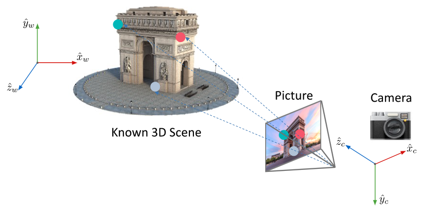
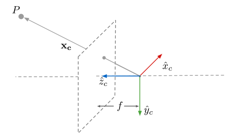
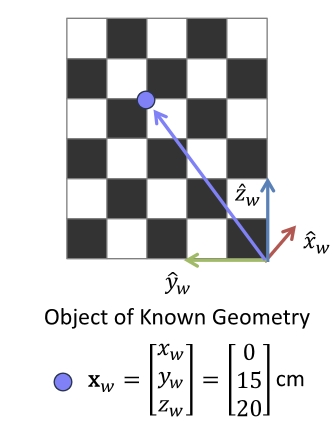

# Lecture 7 | Structure From Motion

!!! warning "注意"
    本文尚未完全整理好！

!!! tip "前言"
    个人感觉这一章的内容虽然脉络清晰，但是需要不断引入新的内容，如果直接采用“用到什么讲什么”的顺序阐述，可能会有些杂乱，不方便知识索引和复习，所以我大致按照拓扑排序的顺序排列内容，倾向于完整地介绍一下前置，再引入之后的内容并阶段性小结，可能看起来比较唐突，但是大概对回头查知识点比较方便。

**运动推断结构(Structure from Motion)SfM** 用于估计二维图像中的三维结构，通过相机运动（平移、旋转）引起的画面变化来计算其反应的 3D 结构。

> 在机器人领域，一个相关的领域是 [同时定位与地图构建(Simultaneous Localization and Mapping)SLAM](https://zh.wikipedia.org/wiki/%E5%90%8C%E6%97%B6%E5%AE%9A%E4%BD%8D%E4%B8%8E%E5%9C%B0%E5%9B%BE%E6%9E%84%E5%BB%BA)。

!!! info "三个关键问题"
    1. 如何描述相机的投影行为，也就是 **[相机模型](Lec02.md#透视投影)** 的相关内容，本小结指透视模型；
    2. 如何通过图像求解相机参数，这个过程被称为 **相机标定(Camera Calibration)**，以及如何求解相机的空间位置与朝向，这个过程被称为 **位置估计(Pose Estimation)**；
    3. 如何利用若干视角进行重建；

    其中，第一个命题的内容已经在 **[第二讲](Lec02.md)** 中涉及，所以不再展开。

---

## 相机标定与位置估计

**相机标定(Camera Calibration)** 即求解相机用来描述相机模型的自身参数，换句话来说就是求解相机的 **内参(Intrinsic Parameters)**；而 **位置估计(Pose Estimation)** 求解相机的空间位置以及朝向，与内参相对应的，就是求解相机的 **外参(Extrinsic Parameters)**。

---

### 成像过程的建模

!!! info "视觉定位问题"
    首先，为了展开之后的内容，我们需要定义 **视觉定位问题(Visual Localization Problem)** ：给定一个已知的三维模型，从某个位置对其进行拍摄，求解拍摄位置和视角。

    而为了展开视觉定位问题，我们首先需要对相机成像这个过程进行一个数学建模——更详细的来说，是建模一个空间 3D 点与相机上特定像素区域的转化关系。

首先让我们回顾一下 **[投影模型的可视化表示](Lec02.md#可视化表示)** 中的相关内容：

!!! summary "回顾"

    { align=right }
    
    我们可以发现，小孔成像的模型视图其实还是比较麻烦的。现在我们把这个定角相似对折，变成 A 字型相似来表示这个模型，以简化不必要的信息，同时也能更清晰地表示透视关系。
    
    规定我们讨论的问题中物距总是大于像距，则可以将像表示为相机中心到物体的放射连线中的 **截面**。
    
    它比较好地表达了透视关系，即 <u>相机中心</u> <u>物点B</u> <u>像点B'</u> 始终共线。这也是在之后的内容中更加常见的可视化表现方法。

它提供了一种将相机模型成像原理可视化的方法，接下来我们将它放到 3D 空间中：

这张图大致描述了：在特定 **位置** 有着特定 **朝向** 的 **相机模型** 如何拍到已知 3D 景象的 **特定画面**，但需要注意的是，这里的「Picture」代表的是 Image Plane，也就是成像平面，此时「坐标」的单位是长度，如毫米——与以「像素」为基本单元的“图片”有一定区别。

也就是说，从 3D 中的某一个点，到图片上的某块像素区域，有大致如下几个阶段：

```mermaid
graph LR
    A[3D 景象] --> B[2D 成像平面] --> C[像素图像];
```

不过需要注意的一点是，我们在 **[相机模型](Lec02.md#透视投影)** 中介绍的一系列建模，是建立在以相机为参考系的情况下的，而在 **视觉定位问题** 中，我们拥有的 3D 景象信息肯定不是通过 **相机坐标(Camera Coordinates)** 来表示的，而是用 **世界坐标(World Coordinates)**，显然，这里只包括平移和旋转，也就是经过一次 **[仿射变换](Lec01.md#仿射变换与齐次坐标)**。

我们对上面那个流程图的结果进行一个改进：

```mermaid
graph LR
    A["(世界坐标) 3D 景象"] --> B["(相机坐标) 3D 景象"] --> C["(成像平面) 2D 映射"] --> D["(传感器平面) 像素图像"];
```

---

#### 世界坐标 to 相机坐标

为了实现世界坐标向相机坐标的转换，我们需要知道相机坐标在世界坐标中的方向与位置，不难发现，实际上这就要求我们知道相机的外参。

更进一步的，实际上我们就是寻找一种变换，能够实现世界坐标系下的坐标向相机坐标系下坐标的转换：

$$
\underbrace{\;\mathbf{x}_w = \begin{bmatrix}
    x_w \\
    y_w \\
    z_w
\end{bmatrix}\;}_{\text{World Coordinates}}
\xrightarrow{\text{Rotation & Movement}}
\underbrace{\;\mathbf{x}_c = \begin{bmatrix}
    x_c \\
    y_c \\
    z_c
\end{bmatrix}\;}_{\text{Camera Coordinates}}
$$

我们定义外参 $(R,\mathbf{c}_w)$，分别代表「从世界坐标向相机坐标的旋转矩阵」和「在世界坐标系下的相机的中心坐标」，则变换后的坐标即为：

$$
\mathbf{x}_c = R(\mathbf{x}_w - \mathbf{c}_w) = R \mathbf{x}_w - R \mathbf{c}_w = R \mathbf{x}_w + \mathbf{t},\ \ \text{ where } \mathbf{t} = -R \mathbf{c}_w
\\ \text{i.e.} \;\;
\mathbf{x}_c = \begin{bmatrix} x_c \\ y_c \\ z_c \end{bmatrix}
=
\begin{bmatrix}
	r_{11} & r_{12} & r_{13} \\
	r_{21} & r_{22} & r_{23} \\
	r_{31} & r_{32} & r_{33} \\
\end{bmatrix}
\begin{bmatrix}
	x_w \\ y_w \\ z_w
\end{bmatrix}
+
\begin{bmatrix}
	t_x \\ t_y \\ t_z
\end{bmatrix}
$$

> 
> - 说明：
>     1. $(\mathbf{x}_w - \mathbf{c}_w)$ 可以理解为从相机中心指向目标点的一个向量；
>     2. 旋转矩阵 $R$ 单位正交；
> 

当然，我们可以将它使用齐次坐标统一：

$$
\mathbf{\tilde x}_c = \begin{bmatrix} x_c \\ y_c \\ z_c \\ 1\end{bmatrix}
=
\underbrace{\begin{bmatrix}
	r_{11} & r_{12} & r_{13} & t_x \\
	r_{21} & r_{22} & r_{23} & t_y\\
	r_{31} & r_{32} & r_{33} & t_z\\
	0 & 0 & 0 & 1
\end{bmatrix}}_{\text{Extrinsic Matrix}}
\begin{bmatrix}
	x_w \\ y_w \\ z_w \\ 1
\end{bmatrix}
$$

!!! note "外参矩阵"
    其中，新得到的这个 4*4 的矩阵就被称为 **外参矩阵(Extrinsic Matrix)**，也被写作：

    $$
    M_{ext} =
    \begin{bmatrix}
        R_{3\times 3} & \mathbf{t} \\
        \mathbf{0}_{1\times 3} & 1
    \end{bmatrix}
    =
    \begin{bmatrix}
        r_{11} & r_{12} & r_{13} & t_x \\
        r_{21} & r_{22} & r_{23} & t_y\\
        r_{31} & r_{32} & r_{33} & t_z\\
        0 & 0 & 0 & 1
    \end{bmatrix}
    \\ or \\
    M_{ext} =
    \begin{bmatrix}
        R_{3\times 3} & \mathbf{t} \\
    \end{bmatrix}
    =
    \begin{bmatrix}
        r_{11} & r_{12} & r_{13} & t_x \\
        r_{21} & r_{22} & r_{23} & t_y\\
        r_{31} & r_{32} & r_{33} & t_z\\
    \end{bmatrix}
    $$

---

#### 相机坐标 to 成像平面

{ align=right width=400px }

实际上这一步就是我们在 **[相机模型](Lec02.md#透视投影)** 介绍过的内容，我们在上一步已经做好了齐次坐标的铺垫，所以这一步格外简单。

$$
\begin{bmatrix}
	\mathbf{x}_{i_{1 \times 2}} \\ 1
\end{bmatrix}
\cong
\begin{bmatrix}
	f & 0 & 0 & 0 \\
	0 & f & 0 & 0 \\
	0 & 0 & 1 & 0
\end{bmatrix}
\begin{bmatrix}
	x_c \\
	y_c \\
	z_c \\
	1
\end{bmatrix}
$$

!!! warning "注意"
    这里 3*4 的矩阵还不是内参矩阵！

---

#### 成像平面 to 传感器平面

之前说过，成像平面上的内容和传感器平面上的内容最大的不同就是计量单位不同，所以我们需要将长度信息转化为像素信息；此外，中心坐标也需要变换。

假设 $m_x$ 和 $m_y$ 分别是单位长度上的像素密度（以 px/mm 为例），$(c_x,c_y)$ 分别是在成像平面下传感器平面的中心坐标，则：

$$
\left\{
    \begin{aligned}
	    u &= m_x \cdot x_i + c_x\\
	    v &= m_y \cdot y_i + c_y
    \end{aligned}
\right.
$$

带入上一节的结果，得到（注意，这里的“齐次坐标”是上一节带来的，这一节的计算并不需要齐次坐标）：

$$
\begin{bmatrix}
    u \\
    v \\
    1
\end{bmatrix}
=
...
\cong
\begin{bmatrix}
    u' \\
    v' \\
    z_c
\end{bmatrix}
=
\underbrace{{\begin{bmatrix}
    m_x f & 0 & c_x & 0 \\
    0 & m_y f & c_y & 0 \\
    0 & 0 & 1 & 0
\end{bmatrix}}}_{\text{Intrinsic Matrix}}
\begin{bmatrix}
    x_c \\
    y_c \\
    z_c \\
    1
\end{bmatrix}
$$

!!! note "内参矩阵"
    这里得到的，包含 $f$ 和 $m$ 的矩阵才是 **内参矩阵(Intrinsic Matrix)**，也被写作：

    $$
	M_{int} = 
	\begin{bmatrix}
		m_x f & 0 & c_x & 0 \\
		0 & m_y f & c_y & 0 \\
		0 & 0 & 1 & 0
	\end{bmatrix}
	\\
    or
	\\
	K = 
	\begin{bmatrix}
		m_x f & 0 & c_x \\
		0 & m_y f & c_y \\
		0 & 0 & 1
	\end{bmatrix}
	$$

---

### 内参矩阵、外参矩阵与投影矩阵

简单总结上面几个步骤与内参外参矩阵的关系，就是下面这张流程图：

```mermaid
graph LR
    subgraph EM["Using Extrinsic Matrix"]
        A["Coordinate Transformation"]
    end
    subgraph IM["Using Intrinsic Matrix"]
        B["Perspective Projection"]
        C["Image Plane to Image Sensor Mapping"]
    end
    A ---> B
    B ---> C
```

---

#### 内参矩阵

我们在上面提到的内参矩阵长这样：

$$
M_{int} = 
\begin{bmatrix}
	m_x f & 0 & c_x & 0 \\
	0 & m_y f & c_y & 0 \\
	0 & 0 & 1 & 0
\end{bmatrix}
\\
or
\\
K = 
\begin{bmatrix}
	m_x f & 0 & c_x \\
	0 & m_y f & c_y \\
	0 & 0 & 1
\end{bmatrix}
$$

其中主要有 4 个自由度：$m_x f$、$m_y f$、$c_x$、$c_y$。

然而实际上未必如此，由于畸变等可能存在的原因，实际的内参矩阵，或者是求解出来的内参矩阵并不一定形如此，我们在后面会提到，由于某些性质分解出来的内参矩阵，更多的是一个右上三角阵，即第一行第二列的元素未必为零。

---

#### 外参矩阵

我们在上面提到的外参矩阵长这样：

$$
M_{ext} =
\begin{bmatrix}
    R_{3\times 3} & \mathbf{t} \\
    \mathbf{0}_{1\times 3} & 1
\end{bmatrix}
=
\begin{bmatrix}
    r_{11} & r_{12} & r_{13} & t_x \\
    r_{21} & r_{22} & r_{23} & t_y\\
    r_{31} & r_{32} & r_{33} & t_z\\
    0 & 0 & 0 & 1
\end{bmatrix}
\\ or \\
M_{ext} =
\begin{bmatrix}
    R_{3\times 3} & \mathbf{t} \\
\end{bmatrix}
=
\begin{bmatrix}
    r_{11} & r_{12} & r_{13} & t_x \\
    r_{21} & r_{22} & r_{23} & t_y\\
    r_{31} & r_{32} & r_{33} & t_z\\
\end{bmatrix}
$$

其中主要有 12 个自由度，包含了旋转矩阵 $R$ 和旋转后的位移向量 $\mathbf{t}$。

类似于上一节提到的旋转矩阵，这里的旋转矩阵同样拥有 正交 和 $||R||_2^2 = 1$ 的性质。

---

#### 投影矩阵

总结应用两个矩阵的两个阶段：

!!! note "Camera to Pixel: Intrinsic Matrix" 
    $$
    \mathbf{\tilde{u}} = M_{int} \mathbf{\tilde{x}}_c \;\;\;\;i.e.\;\;\;\;
    \begin{bmatrix}
		u' \\ v' \\ z_c
	\end{bmatrix}
	=
	\begin{bmatrix}
		f_x & 0 & c_x & 0 \\
		0 & f_y & c_y & 0 \\
		0 & 0 & 1 & 0
	\end{bmatrix}
	\begin{bmatrix}
		x_c \\
		y_c \\
		z_c \\
		1
	\end{bmatrix}
    $$

!!! note "World to Camera: Extrinsic Matrix" 
    $$
    \mathbf{\tilde{x}}_c = M_{ext} \mathbf{\tilde{x}}_w \;\;\;\;i.e.\;\;\;\;
    \begin{bmatrix} x_c \\ y_c \\ z_c \\ 1\end{bmatrix}
	=
	\begin{bmatrix}
		r_{11} & r_{12} & r_{13} & t_x \\
		r_{21} & r_{22} & r_{23} & t_y\\
		r_{31} & r_{32} & r_{33} & t_z\\
		0 & 0 & 0 & 1
	\end{bmatrix}
	\begin{bmatrix}
		x_w \\ y_w \\ z_w \\ 1
	\end{bmatrix}
    $$

而将它们结合，我们就得到了完整的 **投影矩阵(Projection Matrix)** $P$：

$$
\mathbf{\tilde u} = M_{int}M_{ext} \mathbf{\tilde x}_w = P \mathbf{\tilde x} \;\;\;\; i.e. \;\;\;\;
\begin{bmatrix}
	u \\ v \\ 1
\end{bmatrix}
\cong
\begin{bmatrix}
	u' \\ v' \\ z_c
\end{bmatrix}
=
\underbrace{\begin{bmatrix}
	p_{11} & p_{12} & p_{13} & p_{14} \\
	p_{21} & p_{22} & p_{23} & p_{24} \\
	p_{31} & p_{32} & p_{33} & p_{34}
\end{bmatrix}}_{\text{Projection Matrix } P}
\begin{bmatrix}
	x_w \\
	y_w \\
	z_w \\
	1
\end{bmatrix}
$$

---

### 相机标定与位置估计

根据 **[投影矩阵](#投影矩阵)** 我们得到了像素点与 3D 景物世界坐标的转化关系，而相机标定与位置估计就是利用这个关系式求解投影矩阵。所以这就要求我们同时知道若干点的像素点位置和 3D 景物世界坐标，一般来说相机标定与位置估计是这么实现的：

!!! example "步骤一"

    { align=right width=160px }

    给定一个几何特性已知的标定板，人为定义其世界坐标系。

    ---

    由于坐标都是由我们人为给定的，所以我们可以按照尽可能方便的原则进行规划。此外，为了方便之后的计算，标定板的内容一般是简单明了的。

    例如图中，定义世界坐标系后，每一格的边长为 5cm，所以紫色点的坐标为 $(0, 15, 20) cm$。

    

!!! example "步骤二"
    
    寻找特定关键点的对应关系，也就是做 **[特征匹配](Lec05.md#图像特征匹配)**，即若干点对，每一个点对都是一个 3D 点和一个 2D 点的对应。

    ---

    需要说明的一点是，我们已知的特征匹配是建立在两张二维图片上的，而现在要做的是 3D 到 2D 的匹配。然而这不重要，因为我们可以将 3D 景象按照我们希望的方法映射为 2D 景象，例如我们可以直接拿这个标定板的 zy 平面来进行特征匹配。

    

!!! example "步骤三"

    根据刚刚得到的若干对兴趣点，建立方程，求解投影矩阵。

    ---

    每一对关键点可以分别根据 $u$ 和 $v$ 建立两个等式：
    
    $$
    \underbrace{\begin{bmatrix}
        u^{(i)} \\
        v^{(i)} \\
        1
    \end{bmatrix}}_{known}
    = 
    \underbrace{\begin{bmatrix}
        p_{11} & p_{12} & p_{13} & p_{14} \\
        p_{21} & p_{22} & p_{23} & p_{24} \\
        p_{31} & p_{32} & p_{33} & p_{34}
    \end{bmatrix}}_{unknown}
    \underbrace{\begin{bmatrix}
        x_w^{(i)} \\
        y_w^{(i)} \\
        z_w^{(i)}
    \end{bmatrix}}_{known}
    \\
    i.e. \;\;\;\;
    \left\{
    \begin{aligned}
	    u^{(i)} &= \frac{p_{11}x_w^{(i)} + p_{12}y_w^{(i)} + p_{13}z_w^{(i)} + p_{14}}{p_{31}x_w^{(i)} + p_{32}y_w^{(i)} + p_{33}z_w^{(i)} + p_{34}} \\
	    v^{(i)} &= \frac{p_{21}x_w^{(i)} + p_{22}y_w^{(i)} + p_{23}z_w^{(i)} + p_{24}}{p_{31}x_w^{(i)} + p_{32}y_w^{(i)} + p_{33}z_w^{(i)} + p_{34}}
    \end{aligned}
    \right.
    $$

    
    由于投影矩阵有 12 个自由度，所以至少需要 6 对关键点 12 个等式。

!!! example "步骤四"

    将若干方程重新排列为矩阵形式，方便之后的计算。

    ---

    将步骤三得到的式子同分移项，形成 $f(...) = 0$ 的形式，再将 12 个式子结合在一起就得到了下面这个庞大的矩阵方程：

    $$
    \begin{bmatrix}
        x_w^{(1)} & y_w^{(1)} & z_w^{(1)} & 1 & 0 & 0 & 0 & 0 & -u_1x_w^{(1)} & -u_1y_w^{(1)} & -u_1z_w^{(1)} & -u_1 \\
        0 & 0 & 0 & 0 &  x_w^{(1)} & y_w^{(1)} & z_w^{(1)} & 1 & -v_1x_w^{(1)} & -v_1y_w^{(1)} & -v_1z_w^{(1)} & -v_1 \\
        \vdots & \vdots & \vdots & \vdots & \vdots & \vdots & \vdots & \vdots & \vdots & \vdots & \vdots & \vdots \\ 
        x_w^{(i)} & y_w^{(i)} & z_w^{(i)} & 1 & 0 & 0 & 0 & 0 & -u_ix_w^{(i)} & -u_iy_w^{(i)} & -u_iz_w^{(i)} & -u_i \\
        0 & 0 & 0 & 0 &  x_w^{(i)} & y_w^{(i)} & z_w^{(i)} & 1 & -v_ix_w^{(i)} & -v_iy_w^{(i)} & -v_iz_w^{(i)} & -v_i \\
        \vdots & \vdots & \vdots & \vdots & \vdots & \vdots & \vdots & \vdots & \vdots & \vdots & \vdots & \vdots \\ 
        x_w^{(n)} & y_w^{(n)} & z_w^{(n)} & 1 & 0 & 0 & 0 & 0 & -u_nx_w^{(n)} & -u_ny_w^{(n)} & -u_nz_w^{(n)} & -u_n \\
        0 & 0 & 0 & 0 &  x_w^{(n)} & y_w^{(n)} & z_w^{(n)} & 1 & -v_nx_w^{(n)} & -v_ny_w^{(n)} & -v_nz_w^{(n)} & -v_n \\
    \end{bmatrix}
    \begin{bmatrix}
        p_{11} \\ p_{12} \\ p_{13} \\ p_{14} \\
        p_{21} \\ p_{22} \\ p_{23} \\ p_{24} \\
        p_{31} \\ p_{32} \\ p_{33} \\ p_{34}
    \end{bmatrix}
    =
    \begin{bmatrix}
        0 \\ 0 \\ 0 \\ 0 \\
        0 \\ 0 \\ 0 \\ 0 \\
        0 \\ 0 \\ 0 \\ 0
    \end{bmatrix}
    $$

    我们将其简写，也就是 $A\mathbf{p} = 0$。

!!! example "步骤五"
    求解 $A\mathbf{p} = 0$ 得到 $\mathbf{p}$。

    ---

    类似于上一节的操作，这里得到的 $mathbf{p}$ 也有多种可能，所以我们要对它进行约束，一般有两种选择：

    - 令 $p_{34} = 1$；
    - 令 $||p|| = 1$；
  
    一般我们选择后者，也就是让 $mathbf{p}$ 的长度为 1，此时自由度削减为 11，仍然需要六对关键点。

    接下来，我们将求解方程 $A\mathbf{p} = 0$ 转化为 $\mathop{minimize} \limits_\mathbf{p} ||A\mathbf{p}||^2 \;\; \text{ such that } ||\mathbf{p}||^2 = 1$ 的优化问题，由于和之前的一样，所以不再赘述。

!!! example "分解投影矩阵"
    
    根据 **[投影矩阵](#投影矩阵)** 的相关内容我们知道：
    $$
    \begin{bmatrix}
        p_{11} \\ p_{12} \\ \vdots \\
        p_{33} \\ p_{34}
    \end{bmatrix}
    \rightarrow
    P = 
    \begin{bmatrix}
	    p_{11} & p_{12} & p_{13} & p_{14} \\
	    p_{21} & p_{22} & p_{23} & p_{24} \\
	    p_{31} & p_{32} & p_{33} & p_{34}
    \end{bmatrix}
    =
    \begin{bmatrix}
		f_x & 0 & c_x & 0 \\
		0 & f_y & c_y & 0 \\
		0 & 0 & 1 & 0
	\end{bmatrix}
    \begin{bmatrix}
		r_{11} & r_{12} & r_{13} & t_x \\
		r_{21} & r_{22} & r_{23} & t_y\\
		r_{31} & r_{32} & r_{33} & t_z\\
		0 & 0 & 0 & 1
	\end{bmatrix}
    $$

    通常来说，将一个矩阵分解为两个特定矩阵是不现实的，但是此处的内参矩阵的子式具有“上三角阵”这个性质，外参矩阵中旋转矩阵子式具有“正交”这个性质，而且观察 0 的分布，我们发现 $[p_{11} \sim p_{33}]$ 由 $KR$ 得到。所以我们恰好可以使用 **[QR 分解](https://zh.wikipedia.org/zh-hans/QR%E5%88%86%E8%A7%A3)** 来实现：

    $$
    \begin{bmatrix}
        p_{11} & p_{12} & p_{13} \\
        p_{21} & p_{22} & p_{23} \\
        p_{31} & p_{32} & p_{33}
    \end{bmatrix}
    =
    \begin{bmatrix}
        f_x & 0 & c_x \\
        0 & f_y & c_y \\
        0 & 0 & 1
    \end{bmatrix}
    \begin{bmatrix}
        r_{11} & r_{12} & r_{13} \\
        r_{21} & r_{22} & r_{23} \\
        r_{31} & r_{32} & r_{33} \\
    \end{bmatrix}
    = KR
    $$

    需要注意的是，使用 QR 分解得到的三角阵并不一定具有第一行第二列元素为 0 的性质。

    此时，我们已经知道了除了 $t_x,t_y,t_z$ 以外的所有未知元了，所以当然可以回过来继续求它们。

    $$
    \because
    \begin{bmatrix}
        p_{14} \\ p_{24} \\ p_{34}
    \end{bmatrix}
    =
    \begin{bmatrix}
        f_x & 0 & c_x \\
        0 & f_y & c_y \\
        0 & 0 & 1
    \end{bmatrix}
    \begin{bmatrix}
        t_x \\ t_y \\ t_z
    \end{bmatrix}
    = K \mathbf{t} \\
    \therefore
    \mathbf{t} = K^{-1} 
    \begin{bmatrix}
        p_{14} \\ p_{24} \\ p_{34}
    \end{bmatrix}
    $$

---

!!! warning "注意"
    需要特别注意的一点是，在我们上面涉及的讨论中，我们都没有考虑畸变带来的影响。

---

### 多点透视成像问题

**多点透视成像问题(Perspective-n-Point Problem)**，即 PnP 问题，指的是已知内参求外参的视觉定位问题。

常见的解决方案有如下几种。

!!! note "DLT Direct Linear Transform"
    也就是上面提到的做法。

!!! note "P3P"
    至少需要 3 组对应关系才能求解相机位置，此外，我们还需要一个额外的点来保证答案的唯一性（否则一般来说会有四个解）

    其主要思路是根据图像，使用余弦定律进行求解。

    **[懒得写了，直接贴麦哥的笔记了！](https://sakuratsuyu.github.io/Note/Computer_Science_Courses/ICV/7_Structure_from_Motion/#p3p)**

!!! note "PnP"
    n > 3 的情况的做法。

    转化为优化问题，求解理论和实际的点误差——**重投影误差(reprojection error)** 最小时的外参，注意将齐次坐标转化为二维坐标。

    Initialized by P3P, optimized by Gauss-Newton。

    **[懒得写了，直接贴麦哥的笔记了！](https://sakuratsuyu.github.io/Note/Computer_Science_Courses/ICV/7_Structure_from_Motion/#pnp)**

!!! note "EPnP"
    目前最受欢迎的做法，O(N) 十分高效也十分准确，大概是用四个控制点表示其他点。

    **[懒得写了，直接贴麦哥的笔记了！](https://sakuratsuyu.github.io/Note/Computer_Science_Courses/ICV/7_Structure_from_Motion/#epnp)**

---

## 三维重建

### 双目三维重建

根据两张图片重建

**双目视觉(Stereo Vision)**：已知内参，根据两个图像求解目标的 3D 结构和两个相机的外参。

1. 已知两个相机的内参
2. 寻找可靠的对应关系
3. 寻找两个相机的相对变化关系 $(t,R)$：A to B
    - 对极几何(Epipolar Geometry)
    - 对极点 Epipole，另外一个相机出现在本相平面上的位置
    - 对极平面 Epipolar Plane of Scene Point P
    - ......
    - 推导得到 Epipolar Constraint
    - 本征矩阵 Essential Matrix E，可分解，使用 SV 分解， Singular Value Decomposition
    - 然而我们并不知道 xl... 和 xr...，可是实际上我们并不在乎“深度”，只需要知道他们的方向即可
    - 于是经过一次变换，我们得到基本矩阵 Fundamental Matrix F
    - 接下来，使用 n 对对应关系求解 F 即可
4. 根据已知寻找 3D 点
    - 直接最小二乘法
    - 或做最小化再投影误差的优化问题

### 多目三维重建

根据多张图片重建

Sequential SfM：

1. 从其中两张开始，对场景进行重建
2. 之后不断拿出新的图像，根据已知计算 camera pose，再进一步优化之前重建出来的 3D 点，以及增加一些新的点
3. 进一步优化和调整
    - **集束优化(Bundle Adjustment)** LM algorithm

## COLMAP 

