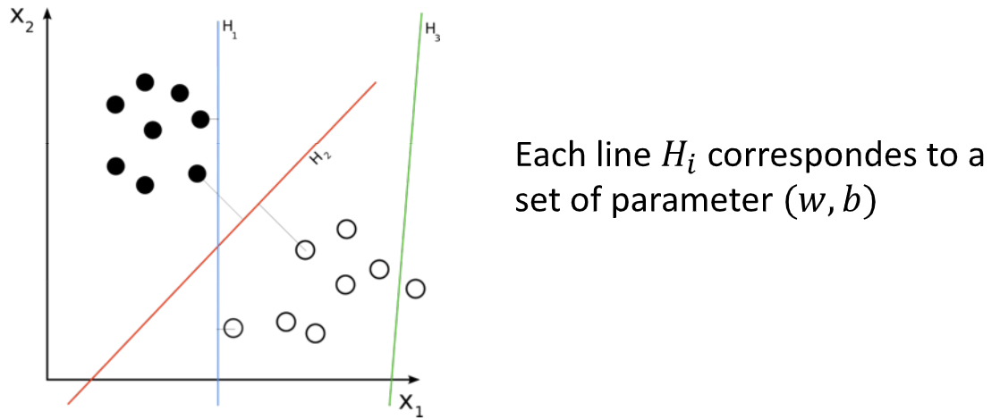

# Lecture 9 | Deep Learning

!!! warning "注意"
    本文尚未完全整理好！

## 机器学习概述

!!! info "说明"
    本课程不会详细介绍关于机器学习的所有知识，但仍然对基础概念有所要求，所以在此仅做概念性对简介。

**机器学习(Machine Learning)ML** 粗略的来说就是通过对大量数据进行学习，在一定规则下生成程序，对于机器学习来说，学习出来的这个“程序”结果是**模型(model)**。

而如果用来学习的是**被标注过的数据(labeled data)**，则称之为**(有)监督(的)学习(supervised learning)**。

无论是机器学习技术还是传统的编程技术，都是为了解决某个问题而存在的。而解决一个复杂问题——正如我们之前强调的——需要对问题进行抽象建模。而一个机器学习学习出来的**模型(model)**可以被视作一个关于输入和输出的描述：

$$
\text{Input } X \rightarrow f_w \rightarrow \text{Output } Y
$$

而根据这里提到的“输出”的不同，按照连续与离散，我们将所解决的问题区分为**回归(regression)问题（结果 $y$ 是连续的数值）**和**分类(classification)问题（结果 $y$ 是离散的标签）**，

更具题的来说，一般机器学习的 pipeline 是这样的：

1. 对问题进行定义；
2. 收集（和处理）用来学习的数据集；
3. 对问题建模，并设计模型；
    - 抽象地来说是决定输入输出的关联形式；
4. 模型训练；
    - 设计损失函数来评估模型的效果；
    - 用优化技术求解使模型效果最好的参数；
5. 模型测试；
    - 也就是用测试数据集测试它的表现；

---

## 线性分类器

**线性分类器(Linear Classifier)**最早叫**感知机(Perceptron)**，它是 ML 中一个最简单也是最基本的构成。

$$
y = f(x, W) = W x + b \\
\begin{aligned}
  & \text{where } x \text{ means inputs, such as image, } \\
  & y \text{ means outputs, such as the class of the object, } \\
  & \text{and } W \text{ is the parameters matrix.}
\end{aligned}
$$

可以发现，其数学描述就解释了它为什么叫「线性」分类器。

更详细的解释不在这里展开，可以查看 [cs231n 笔记](../D1SJ_cs231n/index.md)的相关介绍

!!! question "何时输出比较大？"
    输出大，或者说对于某行大，换句话来说就是分类到这一行的可能性更大，一般是 $x$ 与 $W$ 的对应行相似时。

    这里有一个特殊的概念是**决策边界(Decision Boundary)**：
    
    - $w^Tx+b = 0$
    - It's a line in 2D, a plane in 3D or hyperplane ...

    

---

### Training

如何找到最佳的参数？

- loss function
- optimization problem

最小二乘法的缺点

- 容易收到噪声影响
- 对于 classifier 的问题，很难用“做差”来描述得分与类别的关系——让他从任意数映射到一个 `[0,1]`，sigmoid，可以理解成“概率”。i.e. softmax operator: $.....$

评价两个概率分布是否相似，常用的是交叉差，cross entropy as loss function

$$
S \sim S(y) \\
D(S,L) = -\sum_i L_i \log S_i
$$

## Neural Networks

线性分类最早叫感知机，perceptron

然而有些分类可能是非线性的，如图

这种时候我们可能会使用一个函数将它与线性分类映射起来，这种函数一般叫激活函数 activation functions

- ReLU
- Sigmoid

多类别表示

### 多层感知机 Multi-layer perceptron

$$
\sigma \text{ is a nonlinear transform.}
f(x) = \sigma(w^T x + b)
$$

hidden layers

> 如果没有非线性激活函数，最后等价于一个单层线性感知机

Neural Networks

深度神经网络 Deep Neural Networks 层数多 => 

- 表达能力 ⬆️
- 参数 ⬆️
- 训练数据 ⬆️ 成本 ⬆️ 
- 优化问题求解难度 ⬆️

全连层 Fully connected layer 

- 单层参数量巨大（W 大）

## Convolution Neural Networks

> What is CNN?
> What is convolution?
> Layer Types:
> 1. Convolutional layer
> 2. Pooling layer
> 3. Fully-connected layer

在 CV 中，有时候图像的局部特征就够我们进行分类。这意味着我们可能不需要让网络连上所有的部分。

1 个网络 -> 3 个网络，with weight sharing，因为 3 个网络都是用来识别同样的东西的，或者说功能相同。

$$
y = \sigma(x \otimes w + b)
$$

padding & pooling & stride

好处是参数比全连层少很多

感受野 Receptive fields

- 层数越多，一般越大
-  P69

### 池化层

把不同地饭的结果结合在一起，将响应图的多个结果合并为同一个

---

CNN 一般过程 

 P71

CNN 经典网络：AlexNet, VGG, 

---

不同 channel 单独做 ----> [Batch Normalization](#batch-normalization)

## Training Neural Networks

虽然我们没法找到一个非常好的方法设计一个“最佳”的网络，但是如何寻找其中最好的参数则是有一系列严格的方法。

loss function

- classification: cross-entropy
- regression: L2 loss

optimization

最小化 loss function，使用各种梯度下降

This training method is called 后向/反向传播 back-propagation

$$
\mathbf{w}^{t+1} = \mathbf{w}^t - \eta_t\frac{\partial L}{\partial \mathbf{w}}\mathbf{w}^t 
$$

求梯度-》复合函数求导-》链式法则

对于现在的深度学习工具来说，反向传播与求导等过程都可以自动实现，也就是说我们只需要设计好网络结构和 loss function 即可，而优化部分则可以通过工具实现。

随机梯度下降，随机的采样一部分点，$\Omega$ @P86，

### Architecture & hyper-parameters

无法通过那些能够自动计算的权重，涉及到网络设计的一些内容的一些参数，成为超参数 hyper-parameters。

方法：试（当然不是用手试x）！

How to prevent overfitting?
• Cross validation and early stop
• Regularization or dropout
• Data augmentation

> 如何评价结果“好”还是“不好”？
>
> 如何分割数据集？(cross validation: train & validation & test)

Data split idea * 3

 P89（cs231n also）

> 一种违和感，validation 参与自动反馈，test 难道不算一种人为反馈吗？

### 正则化

增加约束以减少 over fit 

### Dropout

训练时忽略一部分响应，测试的时候仍然使用

> 旭宝：Dropout说的简单一点就是：我们在前向传播的时候，让某个神经元的激活值以一定的概率p停止工作，这样可以使模型泛化性更强，因为它不会太依赖某些局部的特征。

> 统计上等效于 L2
>
> 我：因为每个点都有可能概率性失效，泛化性更强，这也要求某一个特征的contributes会被“分摊”开来，所以效果上有点像L2的那种让权重更小

### 数据增广 Data augmentation

overfit 及数据太少训练太多，所以我们可以通过对已有数据变换来“造”一些数据出来，比如翻转、拉伸……

### Batch Normalization

对多个 channel 对结果进行归一化操作

Reduce internal covariate shift，以减少 channal 之间的发散性，更稳定更收敛

> For more: https://web.eecs.umich.edu/~justincj/teaching/eecs498/FA2020/

### Deep Learning Frameworks

- Caffe 老东西
- TF 开发者更喜欢
- PyTorch 研究者更喜欢

## Network Architectures

早期不受欢迎：效果差 & 可接受性差

### ResNet

假设数据量够大，是不是层数越多越好？

- 难训练，“梯度消失”，层数太多以后，到后面梯度就很小了，下降不下去了
- 但是为什么会变差呢？
  - 如何设计增加层数而至少不变差呢？
    - ResNet: $H(x) = F(x) + x$
    - 残差学习 residual learning

### DenseNet

更加稠密的链接，本层取决于前面所有层

### MobileNets

速度快

---

NAS: Neural Architecture Search 自动化网络结构设计，learning to learn

## why deep learning is powerful?

End-to-end learning，端到端学习