# [大二秋冬] 计算机视觉导论 | I2CV

!!! info "课程信息"
	- 本文为课程《计算机视觉导论》的课程笔记，课程主要介绍计算机视觉的基础理论和基本方法。
	- **智云链接**：[🔗](https://classroom.zju.edu.cn/coursedetail?course_id=30737&tenant_code=112)
	- **授课**：周晓巍
	- **教材**：[📙](https://szeliski.org/Book/)

---

## Lecture 1 | Introduction

### CV 的主要任务

- 三维重建 / Reconstruction
- 图像理解 / Understanding
- 图像合成 / Synthesis

---

### CV 的应用

??? note "Application Examples"
    - Face Reconstruction and Recognition
    - Face ID
    - Vending Machine with Face Detection
    - DeepFake
    - Augmented reality
    - Factory Automation
    - Vision Inspection
    - Optical Character Recognition(OCR)
    - Video Surveillance
    - Human Computer Interaction: Optical Mouse
    - Human Computer Interaction: Motion Sensing Games
    - Visual Effects (VFX)
    - Digital Human
    - VR Tour
    - Visual Localization and Navigation
    - Autonomous Navigation: Space Exploration
    - Robot Perception
    - Autonomous Driving
    - Augmented Reality
    - Free Viewpoint Video
    - Medical Image Analysis
    - ......

---

### 学术圈概况

CV 领域的几个顶会

- **CVPR** (Computer Vision and Pattern Recognition)
- **ICCV** (International Conference on Computer Vision)
- **ECCV** (European Conference on Computer Vision)

图形学相关的顶会

- ACM SIGGRAPH

---

### 课程概述

- 课程目标
    - 学习计算机视觉相关的知识
    - 学会「用数学描述与解决问题」
    	- `Linear Algebra` / `Optimization` / `Geometry`
- 课程资源
    - 教材：[https://szeliski.org/Book/](https://szeliski.org/Book/)     
&nbsp;

- 课程计划
    - Basics. (Lec.02 – Lec.04)
    - Reconstruction. (Lec.05 – Lec.09) 
    - Understanding. (Lec.10 – Lec.12)
    - Synthesis. (Lec. 13 – Lec.14)

!!! note "Note"
    - 作为后续课程的基础，需要复习线性代数的相关知识，它将贯穿整个课程；
    - 需要熟悉涉及的词汇，之后会若干次提到；

### 线代复习

#### 线性变换

首先，一个矩阵左乘一个向量：

- 代数上，结果向量的每一项相当于原向量的一个加权求和；
- 几何上，结果向量相当于原向量做几何变换得到的新向量；

在这种基础上，矩阵乘法可以认为是一系列向量（右侧矩阵）经过同一个变换得到新的一系列向量。

- 那么反过来的，我们也可以通过观察某些点在变换后的位置来感受这个“变换”的具体内容；
- 更特别的，我们可以发现，变换矩阵（左侧矩阵）的每一列，就相当于对应的单位基（例如第 $2$ 列对应 $\vec{a}(0,1)$ 向量）经过这个变换（右乘这个变换矩阵）得到的结果；

!!! note "Tips"
    实际上，从单位矩阵的角度也可以很好的理解这件事：

    $$
    \begin{bmatrix}
        a & b \\
        c & d
    \end{bmatrix}
    \begin{bmatrix}
        1 & 0 \\
        0 & 1
    \end{bmatrix}
    =
    \begin{bmatrix}
        a & b \\
        c & d
    \end{bmatrix}
    $$

!!! note ""
    我们来试着运用上面的技巧求一个旋转变换对应的变换矩阵。

    === "题面"
        {width="100px" align="left"}
        假设该矩阵让目标图形顺时针旋转 $\theta$ ，则其表达式为？
    === "答案"
        {width="144px" align="left"}
   
        我们做此分析：

        - 对于参考点 $(1,0)$，经过旋转后位置变化为 $(\cos\theta,-\sin\theta)$；
        - 对于参考点 $(0,1)$，经过旋转后位置变化为 $(\sin\theta,\cos\theta)$；

        因此，根据上面提到的技巧，旋转对应的变换矩阵为：

        $$
        R_{\theta,clockwise} = 
        \begin{bmatrix}
            \cos\theta & \sin\theta \\ 
            -\sin\theta & \cos\theta
        \end{bmatrix}
        $$

        特别的，如果是逆时针，结果就是：

        $$
        R_{\theta,anti-clockwise} = 
        \begin{bmatrix}
            \cos\theta & -\sin\theta \\ 
            \sin\theta & \cos\theta
        \end{bmatrix}
        $$        

---

#### 仿射变换与齐次坐标

**仿射变换(Affine Transformations)** 主要包括两个部分，即线性变换和平移（换言之，仿射变换并不是线性变换），其数学表述为：

$$
\begin{bmatrix} 
    x' \\
    y' 
\end{bmatrix}
=
\begin{bmatrix} 
    a & b \\ 
    c & d
\end{bmatrix} 
\begin{bmatrix} 
    x \\ 
    y 
\end{bmatrix}
+
\begin{bmatrix} 
    t_x \\ 
    t_y 
\end{bmatrix}
$$

为了让仿射变换也能写成 $a=Mb$ 的形式以简化运算，我们可以用 $n+1$ 维向量来表示 $n$ 维点，即使用 **齐次坐标(homogenous coordinates)**：

$$
\begin{bmatrix}
    x'\\
    y'\\
    1
\end{bmatrix}
=
\begin{bmatrix}
    a & b & t_x \\
    c & d & t_y \\
    0 & 0 & 1
\end{bmatrix}
\begin{bmatrix}
    x \\
    y \\
    1
\end{bmatrix}
$$

!!! question "为什么是 “1”"
    这里我们不禁抛出一个疑问，为什么齐次坐标添加的维度中要填入 1 呢？它有什么含义吗？它不能是 2 或者别的什么东西吗？

    答案是，它可以是别的东西，或者说我们需要对定义进行一个扩展，以使齐次坐标有更大的用处。

    ##### 齐次坐标的扩展性质

    例如，$(x,y)$ 对应的齐次坐标为 $(x,y,1)$，如果你把它想象成三维空间中的点，会发现，如果改变 1 的值，得到的点的轨迹会是若干张平行的平面，也就是说他们在三维空间下是相互独立的。

    此时，我们就可以人为的定义一个每一个平面内的点的映射关系（我们只考虑第一象限），从原点引一条射线，直线上与每一个平面的交点我们都认为对应着二维平面上的同一点。

    {width=320px align=right}
    
    换句话来说，**我们用 $n+1$ 维空间中 从原点发出的一条 <u>射线</u> 来<u>描述</u> $n$ 维空间中的一个<u>点</u>。**
    
    于是我们可以用下面的式子来概括扩展定义：

    - $\begin{bmatrix}x\\y\\k\end{bmatrix}$ 等价于 $\begin{bmatrix}x/k\\y/k\\1\end{bmatrix}$，当然，$k\not=0$；

    而引入这种想法后，我们就知道为什么通过齐次坐标化就能把平移变成线性变换——我们可以将 $n$ 维 **点** 的 **平移** 看作 $n+1$ 维 **射线** 的 **旋转**，而旋转显然是一个线性变换。

    而关于该性质的其他应用，可以看 Lecture 2 的[第二小节](#应用齐次坐标)。

---

#### 逆变换

线性变换 $T$ 的 **逆变换(Inverse Transform)** 就是其变换矩阵的逆 $T^{-1}$，显然，并不是所有变换都是可逆的。

形象地理解，一个变换矩阵如果不满秩（不可逆），那么就会有几个基在变换中合并，或者说多个点被映射为同一个点，导致无法还原。

---

#### 行列式的几何含义

{width=360px}

**行列式(Determinant)** 的值等于这个方阵中的向量对应的 平行图形/几何体/... 的 面积/体积/...

---

#### 特征值和特征向量

**特征向量(eigenvector)** 和 **特征值(eigenvalue)** 的定义如下：

对于矩阵 $A\in R^{N\times N}$，如果有向量 $v\in R^{N}$ 和实数 $\lambda \not = 0$，满足：

$$
Av = \lambda v
$$

则称 $v$ 是矩阵 $A$ 的特征向量，对应的特征值为 $\lambda$。

从几何变换的角度来理解这个定义式，可以描述为：向量 $v$ 经过变换 $A$ 得到的结果，等于直接对 $v$ 进行缩放（而没有改变方向）。

!!! tip "工程计算方法"
    令人惊喜的是，我们在实际运用时，可以直接使用数学库中的 **特征值分解(eigen decomposition)** 方法，其大致会做这样一件事：
    
    
    
    将矩阵 $A$ 分解为 $Q\Lambda Q^{-1}$，其中 $Q$ 中的每一列即为 $A$ 的特征向量，对角阵 $\Lambda$ 中的第 $i$ 项就是第 $i$ 个特征向量的特征值。

!!! note "特征值与特征向量的应用：主成分分析(principal component analysis)"
    {width=310px align=right}

    **主成分(principal component)** 等于协方差矩阵的 特征值最大的 那个特征向量。
    
    - 如图，我们要从图中找到一个方向，使得所有数据点在这个方向上的投影，方差最大（换言之，找到这些数据的一个“方向”）；
    - 记所有数据点为 $A$，则 $A^{T}A$ 为 **协方差矩阵(covariance matrix)**，其特征向量中，特征值最大的那个，就是这组数据的主成分；

---

## Lecture 2 | Image Formation

??? summary "Todays"
    - Camera and lens
    - Geometric image formation
    - Photometric image formation

### 相机与光学原理

#### 小孔成像

如果我们直接拿一块平面来记录自然界的光信息，不难发现，由于光线是向四面八方传播的，所以接收到的信息也乱七八糟，所以我们需要通过一个小孔，也就是如今的 **光圈(aperture)** 来对光线进行一个过滤。这就是早期 **针孔摄像机(pinhole camera)** 的原理。

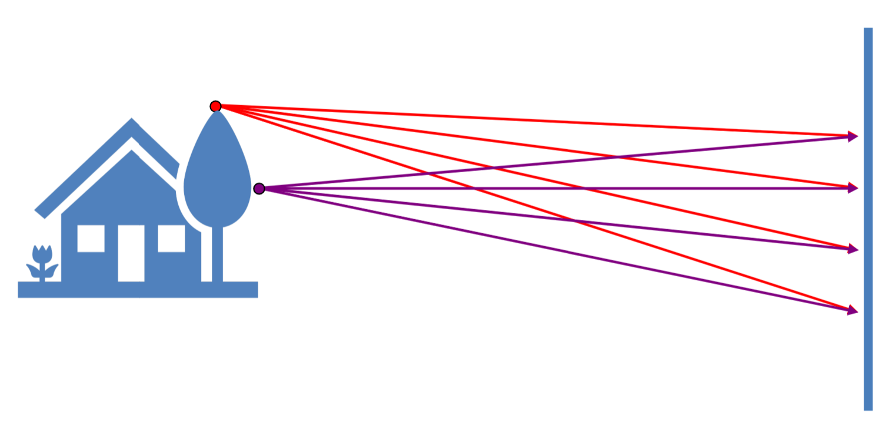{width=300px}   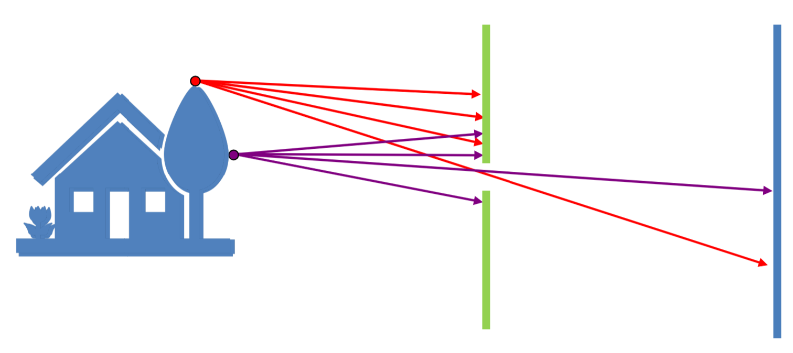{width=326px}

这也就是我们很早就学过的，小孔成像原理。而光圈越小，成像也会越来越清楚，但也不能太小，否则会导致亮度不足<s>甚至衍射</s>。

#### 透镜

凸透镜具有汇聚光线的作用，在满足特定光学几何关系的前提下具有和小孔成像类似的效果，但是能够汇聚更多的光线。

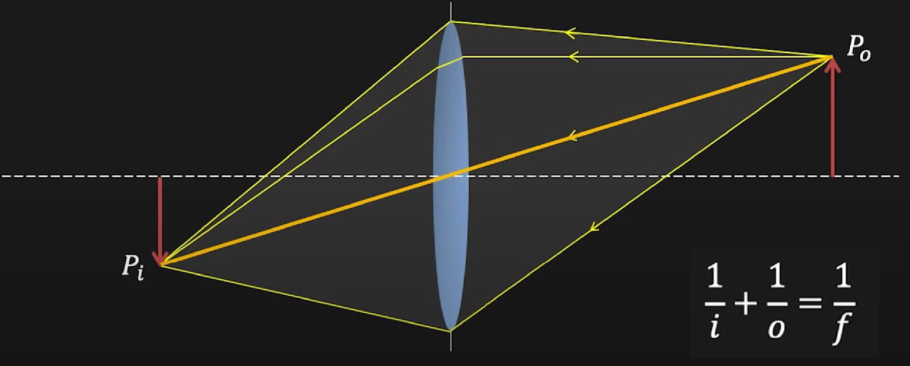
> Source: https://fpcv.cs.columbia.edu/

对于薄凸透镜，有高斯成像公式：

$$
\frac{1}{i} + \frac{1}{o} = \frac{1}{f}
$$

其中 $i$ 为 **像距(img dis)**，$o$ 为 **物距(obj dis)**，$f$ 为 **焦距(focal len)**。

而对于平行光，或者说 $o\to +\infty$ 时，就会有 $i=f$。通过这种方法，我们可以通过测量平行光透过凸透镜汇聚的位置来测量焦距。

同时再引入一个 **放大率(Magnification)**：$m=\frac{h_i}{h_o}=\frac{i}{o}$。

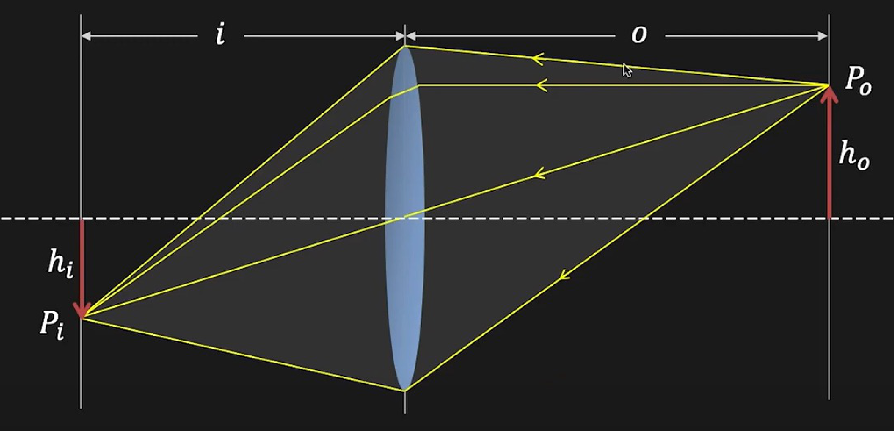
> Source: https://fpcv.cs.columbia.edu/

#### 视野 FoV(field of view)

焦距和底片的线度共同决定了 FoV 的大小。

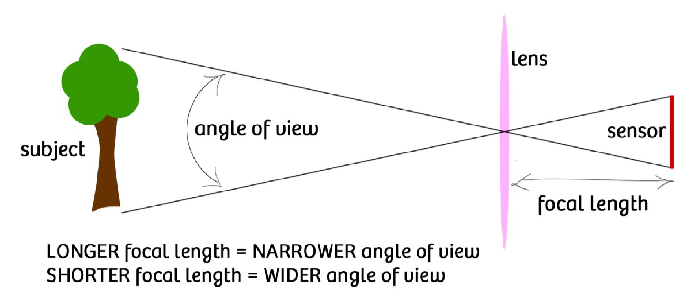
> Source: https://snapsnapsnap.photos/

可以发现，焦距的大小会影响视野的大小和放大率的大小。

50mm/46° 与人的视野相近，因此它被称为 **标准镜头(standard lens)**.

此外，即使在画面中保证一个物体的大小不变，选用不同的焦距也会导致画面的变化——背景的大小，通过下面这张图的三个画面我们可以很清晰的感受到这一点。

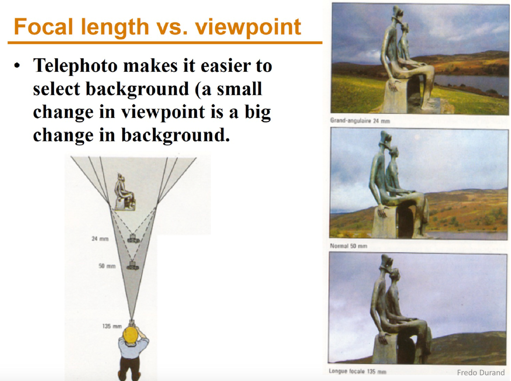

此外，传感器的大小，或者说底片的大小，也会影响 FoV。而且一般来说，越大的底片能够提供更高的分辨率。

#### F 数

**F 数(F-Number)** 用来描述光圈的相对大小，其定义式为 $N=\frac{f}{D}$。

#### 对焦

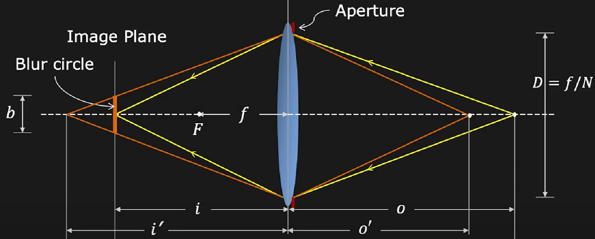
> Source: https://fpcv.cs.columbia.edu/

由相似三角形，没有对上焦而形成的 **光斑(Blur Circle)** 的计算公式为：

$$
\begin{align}
    &\because \frac{b}{D}=frac{|i'-i|}{i'} \\
    &\therefore b = \frac{D}{i'}|i'-i|\;,\;\;\;b \propto D \propto \frac{1}{N}
\end{align}
$$

而对焦，就是将失焦的内容重新汇聚到底片上。

---

#### 景深 DoF

根据上一小节得到的结论，理论上我们好像只有清晰成像一个特定平面上的内容，但是实际上相机上会有一段距离上的内容都是清晰的，这段距离就是 **景深 DoF(Depth of Field)**。而之所以有景深，是因为底片的感光元件是有极限的，当光斑小雨这个极限时，拍摄出来的就仍然是清晰的。

而景深的大小可以这么计算：

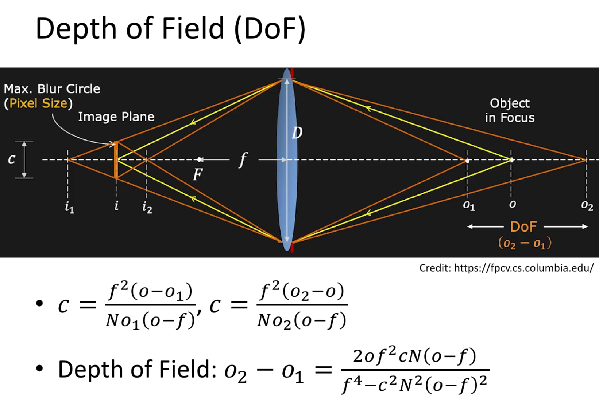

我们可以发现，景深的大小 大致与 光圈大小、物像 正相关，与 焦距 负相关。

---

- distortion 畸变
  - 透视畸变
    - 移轴镜头
  - 枕型畸变（长焦常见）
  - 桶型畸变（短焦常见）
- 正交投影

!!! info "引言"
    由于我们考虑的是成像问题，所以更多的是在描述三维真实信息与二维平面信息之间的互相表达。

    而这种“描述”需要基于一个投影模型。或者说说一种映射关系，简单来说就好像“点光源投影”和“平行光源投影”。

    但是需要注意，无论是哪一种模型，由于我们将三维信息通过 **不可逆的线性变换** 压缩到了二维信息，所以一定是存在信息缺失的。通常来说，指的是深度缺失。

### 透视投影

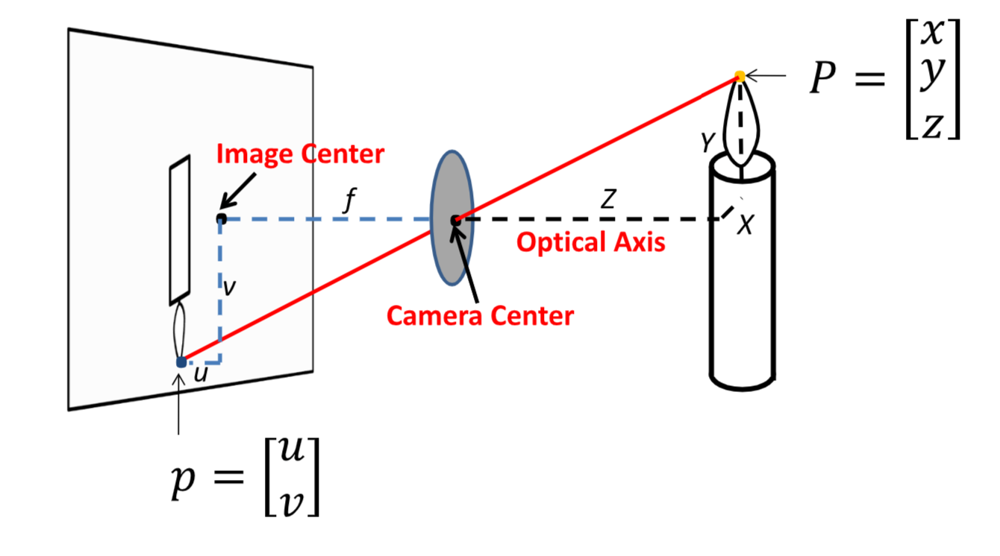

如图是 3D 坐标通过透视投影到 2D 坐标到示意图。其中 $x,y,Z$ 用来描述空间坐标信息，方便起见，我们用他们表示相对于 **相机中心(camera center)** 的正交坐标，其中 $Z$ 和 **光轴(optical axis)** 方向相同，我们也可以称之为深度。

同时，光轴应当垂直于成像平面，而光轴与成像平面的交点为 **图像中心(img center)**。

可以发现，$P$ 与 $p$ 的关系如下：

$$
p = 
\begin{bmatrix}
    u \\
    v
\end{bmatrix}
=
\begin{bmatrix}
    \frac{f}{Z}\cdot x \\
    \frac{f}{Z}\cdot y
\end{bmatrix}
$$

那有没有办法将 $p$ 和 $P$ 通过线性变化放在同一个等式里呢？

换句话来说，有没有办法使得如下等式成立？

$$
A
\begin{bmatrix}
    x \\
    y \\
    z
\end{bmatrix}
\overset{?}=
\begin{bmatrix}
    \frac{f}{Z}\cdot x \\
    \frac{f}{Z}\cdot y
\end{bmatrix}
$$

很可惜，由于式子中出现了 $\frac{1}{Z}$，即除法，它并不是个线性变换。所以即使我们扩展 $p$ 和 $P$ 的维度我们没法直接将它变成线性变换。

但是你也看到了，我用的词是“直接”，所以我们接下来可以：

#### 应用齐次坐标

让我们回顾齐次坐标的 [扩展性质](#齐次坐标的扩展性质)，将它应用于此式：

$$
\begin{bmatrix}
    \frac{f}{Z}\cdot x \\
    \frac{f}{Z}\cdot y \\
    1
\end{bmatrix}
\cong
\begin{bmatrix}
    f \cdot x \\
    f \cdot y \\
    Z
\end{bmatrix}
$$

于是我们发现，虽然我们没法找到 $A$ 使得：

$$
A
\begin{bmatrix}
    x \\
    y \\
    Z \\
    1
\end{bmatrix}
\overset{?}=
\begin{bmatrix}
    \frac{f}{Z}\cdot x \\
    \frac{f}{Z}\cdot y \\
    1
\end{bmatrix}
$$

成立，但是我们可以找到 $A=\begin{bmatrix}f & 0 & 0 & 0 \\ 0 & f & 0 & 0 \\ 0 & 0 & 1 & 0\end{bmatrix}$ 使得：

$$
\begin{bmatrix}
    f & 0 & 0 & 0 \\ 
    0 & f & 0 & 0 \\ 
    0 & 0 & 1 & 0
\end{bmatrix}
\begin{bmatrix}
    x \\
    y \\
    Z \\
    1
\end{bmatrix}
=
\begin{bmatrix}
    f \cdot x \\
    f \cdot y \\
    Z
\end{bmatrix}
\cong
\begin{bmatrix}
    \frac{f}{Z}\cdot x \\
    \frac{f}{Z}\cdot y \\
    1
\end{bmatrix}
$$

于是，我们就成功的通过线性变换将 $P$ 和 $p$ 统一了起来。

---

#### 可视化表示

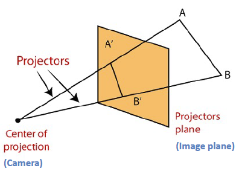{ align=right }

我们可以发现，小孔成像的模型视图其实还是比较麻烦的。现在我们把这个定角相似对折，变成 A 字型相似来表示这个模型，以简化不必要的信息，同时也能更清晰地表示透视关系。

规定我们讨论的问题中物距总是大于像距，则可以将像表示为相机中心到物体的放射连线中的 **截面**。

它比较好地表达了透视关系，即 <u>相机中心</u> <u>物点B</u> <u>像点B'</u> 始终共线。这也是在之后的内容中更加常见的可视化表现方法。

#### 信息缺失

由于在透视投影系统中，物体的真实线度大小与图像线度大小的比例由深度决定，但深度又不能直接从图中获取，所以有时候我们无法比较图像中两个物体的真实线度差。换句话来说，长度信息和角度信息是丢失的。

（多数情况下，我们需要以一些东西来做参考系，判断 A 和 B 的深度信息，再分析他们的实际线度大小关系。）

然而仍然有些性质是保留的，例如直线仍然是直线，但是实际上，如果你能想象的话，虽然直线仍然是直线，但是它的“线密度”不一样了。

所以，如果是曲线，它虽然不会变成折线，但是特征可能已经变了，比如圆是会扭曲的。

#### 灭点与灭线

在透视中一个很有意思的现象是 **灭点(vanishing point)** 和 **灭线(vanishing line)**。

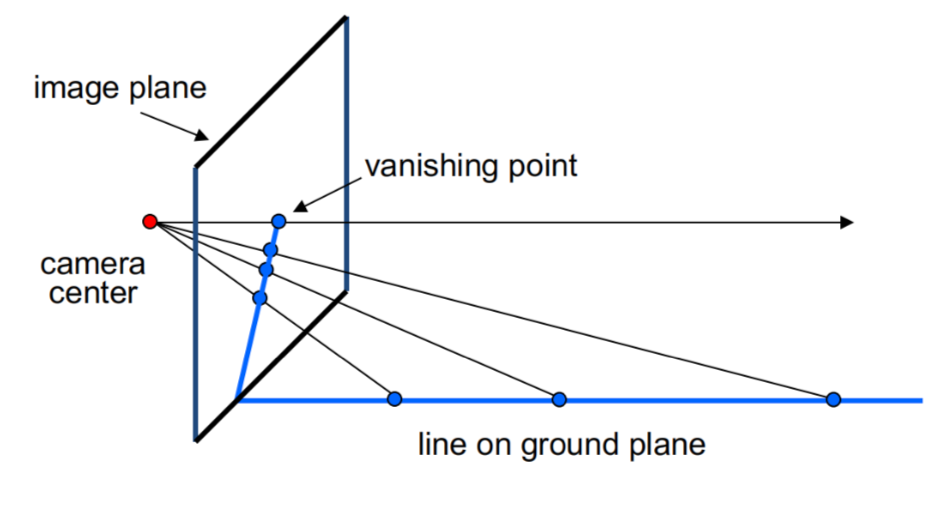{width=400px align=left }

可以发现，在图像中一条不断衍生的直线，在像中最终会终结于一个点，这个点就是“灭点”。几何上，灭点与相机中心的连线应当平行于该直线。

而现实中相互平行的两条直线，最终会在图像中终止于同一个灭点。

灭点未必在图像中，甚至可能无限远。

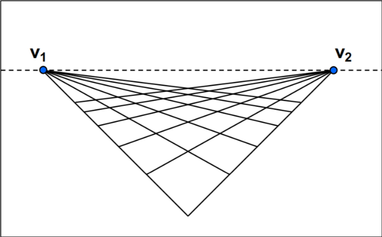{width=380px align=right}

刚才提到，平行线共享灭点这意味着有多少组平行线就有多少灭点。

如果我们将一个平面像棋盘那样，划出两组平行线，那么就会得到两个灭点，如图中的 $v_1$ 和 $v_2$。这意味着，对于一个平面，我们可以从中取出无数组平行线，因而无限大的平面会产生无数多的灭点，而这些灭点连成线就成了“灭线”。常见的灭线就比如照片上的海天界线。

因此，如果说灭点象征了一组平行线，那灭线就是象征了一块平面。而我们就可以通过看平面上的内容出现在灭线以上还是灭线一下，来判断平面在我们的相机中心以下还是以上（可以思考一下为什么）。

!!! tip "Interesting Try"
    === "题面"
        观察如下图片，判断 🪂(跳伞者) 在 📷 以上还是以下，并阐明理由。

        
    === "答案"
        显然，🪂(跳伞者) 在 📷 以下，直接依据是 人 在 天际线 以下，具体理由如下：
        
        - 引理：
          - 平面的灭线高低于平面高低是一致的，灭线更高的平面实际上也更高；
          - 平面上的内容总是在灭线的同一侧，而在哪一侧则体现了平面位置与相机中心的关系；
        - 说明：
          - 我们假想一个 🪂 所在的平面 $p$，由常识，这个平面肯定高于地平面，因而假想平面 $p$ 的灭线一定高于天际线；
          - 🪂 低于天际线，而假想平面 $p$ 的灭线一定高于天际线，所以 🪂 一定在 $p$ 的灭线以下；
          - 所以 🪂 在 📷 以下；
        - 附加：
          - 所以，如果 🪂 在天际线以上，我们就没法根据天际线来判断 🪂 和 📷 的相对位置了，因为我们无法通过不等式的传递性得到 🪂 和假想平面 $p$ 的灭线的相对关系；
#### 透视畸变

在拍摄较大的物体时，比如建筑物，如果建筑物的墙面没有和底片平行，则会出现透视畸变。

在建筑拍摄方面，我们的解决办法是下移传感器，使底片中心在光轴交点以下，这种镜头称为移轴镜头。

另外一种透视畸变体现在曲线的形变上，也就是我们常感受到的，站在边上的人脸总是更大一点。而这种畸变在断镜头下更常见，所以人像更多用的是长焦镜头（其一原因，其他的还有 FoV 小所以背景更干净等）。

#### 枕型畸变和桶型畸变

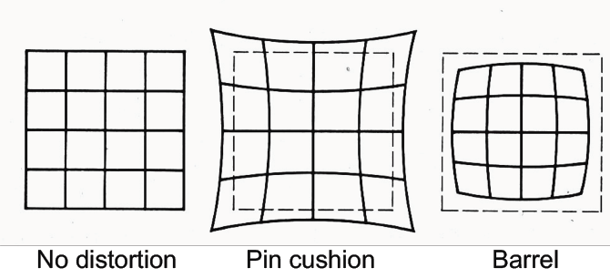

$$
\begin{align}
r^2 & = {x'}_n^2 + {y'}_n^2 \\
{x'}_d & = {x'}_n(1 + \kappa_1 r^2 + \kappa_2 r^4) \\
{y'}_d & = {y'}_n(1 + \kappa_1 r^2 + \kappa_2 r^4) \\
\end{align}
$$

而这种照片的纠正办法就是拍摄格点照片，然后通过数学方法来还原。

### 正交投影

正交投影的含义就是，直接抹掉深度信息，三维点 $P$ 到二维点 $p$ 的映射规则如下：

$$
\begin{bmatrix}
    1 & 0 & 0 \\
    0 & 1 & 0 
\end{bmatrix}
\begin{bmatrix}
    x \\
    y \\
    z
\end{bmatrix}
=
\begin{bmatrix}
    x \\
    y 
\end{bmatrix}
$$

也就是平行光源投影。

---

## Lecture 3 | Image Processing

## Lecture 4 | Model Fitting and Optimization

## Lecture 5 | Feature Matching and Motion Estimation

## Lecture 6 | Image Alignment and Stitching

## Lecture 7 | Structure From Motion

## Lecture 8 | Depth Estimation

## Lecture 9 | 3D Reconstruction

## Lecture 10 | Deep Learning

## Lecture 11 | Recognition

## Lecture 12 | Computational Photography 1

## Lecture 13 | Computational Photography 2

