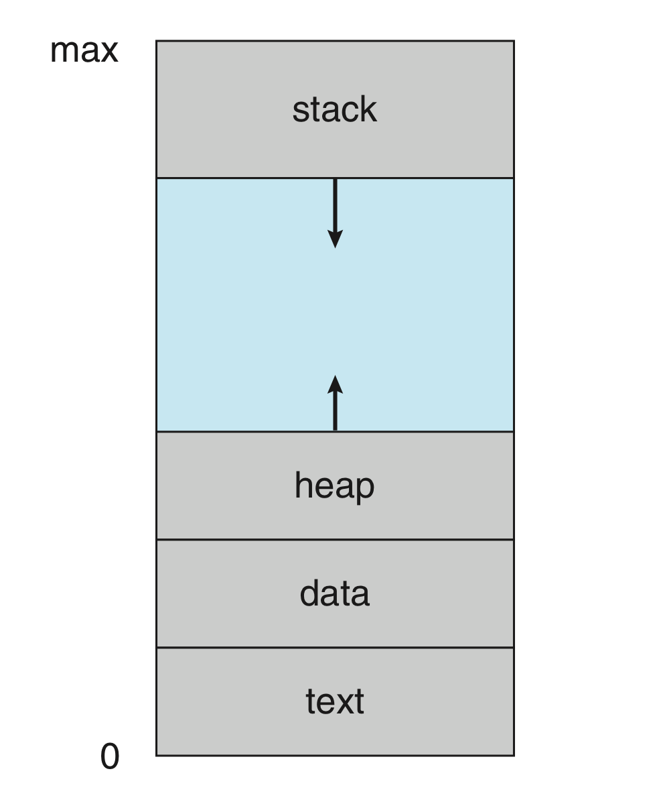

# Section 0: 总览 | Overview [未完成]

<!-- 草稿部分 -->

---

## 实际上课本上这一章涉及的东西

- Intro
    - 何为 OS？
        - 
        - 抽象视角
            - 用户与硬件的中介
            - 用“资源”去理解问题
                - CPU
                - mem
                - storage
                - I/O
                - ...
            - 从 User 和 System 两个视角来看（从顶层和底层两个方向看）（感觉简略一点）
                - > 用户需要资源解决问题，硬件提供资源，OS 向用户提供调度资源的统一方式，并协调、维护、分配硬件资源
                - User
                    - 易用性
                    - 资源利用率
                    - 辅助用户更好地控制资源
                - System
                    - 资源分配器 Resources Allocator
                        - 程序/用户索取资源，OS 处理冲突和分配资源
                    - 高效 & 公平
            - 实际上没有标准答案  
            - > The common functions of controlling and allocating resources are then brought together into one piece of software: the operating system.
        - 具体视角
            - 软件
            - 管理硬件
            - 应用程序的基础
            - kernel 一直运行的一个程序
            - 在 kernel 之外的程序被分为 system program 和 application program
            - > The operating system includes the always running kernel, middleware frameworks that ease application development and provide features, and system programs that aid in managing the system while it is running.
    - 插入了计算机系统的结构（补充前置？）
        - [device drivers](https://en.wikipedia.org/wiki/Device_driver)
        - 
        - 中断（或许从这里拿出来，因为 trap 是后面又重新提到了）
            - 因为频繁，所以需要快速
            - 外中断和内中断
                - 内中断 / trap / exception / system call
                - 区分内外：来自 CPU 执行指令内部还是外部 P17 有个分类图，可以抄一下
            - 中断向量表 - 随机访问实现加速（不够用了，可以变成 chain，速度和容量的一个 trade off）
            - 处理中断前需要存储当前状态以便处理完中断后恢复状态
            - 不可屏蔽(nonmaskable)中断和可屏蔽(maskable)中断，后者在运行某些重要的程序时可以被屏蔽
                - > 一般来说，不可屏蔽中断是用来处理一些重要的错误，比如内存出错，而可屏蔽中断则是用来处理一些外设的请求，比如键盘输入。
            - 中断也有优先级
        - 存储结构
            - DRAM, EEPROM, ...
            - ref to （放哪里合理吗？）
        - I/O
            - ref to （放哪里合理吗？）
            - DMA
    - 计算机架构
        - （一张定义表）
            - CPU 执行指令的硬件
            - Processor 包含一个或多个 CPU 的芯片
            - Core CPU 的基础计算单元
            - Multicore 一个 CPU 上有多个 Core
            - Multiprocessor 多个 processor
        - 单处理器系统
            - 1 *  general-purpose processor + n * special-purpose processors(limited inst set with no processes)
        - 多处理器系统
            - 主流
            - n * processors, each has a **single**-core CPU
            - 增加吞吐量，但是 N 个处理器提升的效率小于 N，协作 带来开销
            - SMP(symmetric mul pro)（貌似不重要）
                - 
                - own reg, own cache, shared mem
                - N 个处理器各自分立，互不干扰，因此可以无忧无虑地同时进行 N 个线程；但是容易出现 A 忙死 B 闲死的情况；
                - 后来多处理器系统中也包含了多核系统；相比单核多处理器系统更快，因为 on-chip communication is faster then between-chip communication，而且更省电；
                    - Dual-core design 
                    - own regs, own local(L1) cache, shared L2 cache（主流）
                - more @ 
            - NUMA（貌似不重要）
                - > 增加 CPU 带来的性能增幅受到总线带宽限制，一种解决方法是使用 NUMA 设计；
                - CPU 通过 shared system interconnnect 连接，每个 CPU 有自己的 local mem（with small fast local bus），但是可以访问其他 CPU 的 mem
                - !
                - 缺点也很明显，访问非 local 的东西时会比较慢
        - 集群
            - some individual systems(or nodes) joined together,
            - 高可用服务（冗余），高性能计算（并行）
            - 对称和不对称
            - 
    - OS 程序的执行
        - bootstrap program -> OS kernel
        - 计算机需要同时处理多个程序的能力（并行）
            - multiprogramming 
                - 核心思想是在内存中保存多个程序的代码，即**在内存中保存多个进程**，然后执行其中一个，每当出现 CPU 需要 idle 的情况（如等待 IO 操作完成）时，就切换到另外一个进程去，这样保证 CPU 始终 busy
                - 但是如果只是这样，那它也只是能利用了 IO 等待时间，但是用户体验还是很糟糕
                - 甘特图做题
            - multitasking
                - 是 multiprogramming 的一个逻辑**扩展**，它通过**频繁**地在多个进程间切换来实现并行，带来相对更快的响应时间
                - （如果可以能贴一下十万个冷笑话里超人的那个片段）
                    - https://www.youtube.com/watch?v=uD29J203FFI
                    - 4:09 - 4:48
                    - 尤其是过马路那一段很形象
            - 同时保存多个进程这件事需要我们对内存有一定的管理机制，包括引入了虚拟内存来解决 resp time 的事(这个可能需要解释一下，不这么做就需要等 mem 足够大了才能跑这个 program)，这件事在  会讲
            - 而如何决定要执行哪一个进程，包括如何才能让进程之间互不干扰，这件事将在  讲
            - 此外，多个进程可能会操作同一份数据，这些事情会在  和  讲
        - dual-mode (multi-mode) operation
            - user mode, kernel mode（实际上工业界有更多的类型，但是大致可以分为这两类）
            - mode bit
            - 
            - 这场图同时也揭示了 trap 的应用模式
            - 某些可能对系统造成损害的指令被称为 privileged inst，只有在 kernel mode 下能被执行
            - 它说它会在 2.3 更详细的介绍 system call
        - 为了防止一个程序一直跑下去（死循环等）一直占用一块资源，可以使用 timer 定时发出一个 interrupt，当发现 interrupt 的时候，类似于出现了一个“超时”操作，可能是失败了又或者需要跟多时间，总之通过引入了一个 timer 可以有效避免死循环占着茅坑不拉屎
    - 资源管理
        - 进程管理
        - 内存管理
        - 文件系统管理
        - 大容量存储管理
        - 缓存管理
        - IO 管理
    - 安全与保护 / 虚拟化 / 分布式系统
        - 跳过
- 系统调用(System Call)
    - 系统调用提供系统服务的接口
    - 运行时刻环境(Run-time environment)RTE，常说的配环境
    - 类型
        - Process control
            - create process, terminate process
            - load, execute
            - get process attributes, set process attributes
            - wait event, signal event
            - allocate and free memory
        - File management
            - create file, delete file
            - open, close
            - read, write, reposition
            - get file attributes, set file attributes
        - Device management
            - request device, release device
            - read, write, reposition
            - get device attributes, set device attributes
            - logically attach or detach devices
        - Information maintenance
            - get time or date, set time or date
            - get system data, set system data
            - get process, file, or device attributes
            - set process, file, or device attributes
        - Communications
            - create, delete communication connection
            - send, receive messages
            - transfer status information
            - attach or detach remote devices
        - Protection
            - get file permissions
            - set file permissions
    - 
- 系统服务(System Services)（没细看，暂时不管）
    - 在 application 以下，OS 以上
    - system utilities
- 链接器和加载器(Linker and Loader)
    - 
    - DDLs: required @ run-time
- OS structures
    - 两个设计流派
        - 宏内核(Monolithic Kernel)
            - 一堆功能都在 kernel 里面
            - 优点：高效
            - 缺点：不灵活，不易维护
        - 微内核(Micro Kernel)
            - 只有最基本的功能（必要的）在 kernel 里面，其他的都在 user space
                - 只提供通讯、内存管理、进程管理等基本功能
            - 优点：灵活，易维护
            - 缺点：效率低
    - Layered Approach
        - 低耦合
        - 从内层向外不断抽象化
        - 需要设计功底，设计的不好也不灵活
        - 显然，效率低
    - Modules（可以来点更多了解）
        - 高内聚、低耦合
        - Loadable Kernel Modules MKLs
        - 动态加载模块（在 boot 的时候或者 run-time 都可以加载，比如插 U 盘的时候载 USB driver）
        - 易于维护，灵活，高效
    - Hybrid Systems
        - 两种结构的结合
        - 优点：灵活，易维护，高效
        - 缺点：复杂
        - 现代 OS 大多采用这种结构
- Boot
    - 第一个引导程序(bootstrap)位于 ROM 中，也就是俗称的 BIOS，它将会引导 OS 的第二个引导程序，也就是 boot loader，它位于磁盘的第一个扇区，也就是 MBR，它会将 OS 的 kernel 加载到内存中，然后将控制权交给 kernel
    - 现在也有使用 UEFI 代替 BIOS 的小，相对来说更加先进
    - GRUB 是 *nix 系统的一个开源 bootstrap，它允许在 boot time 进行修改

