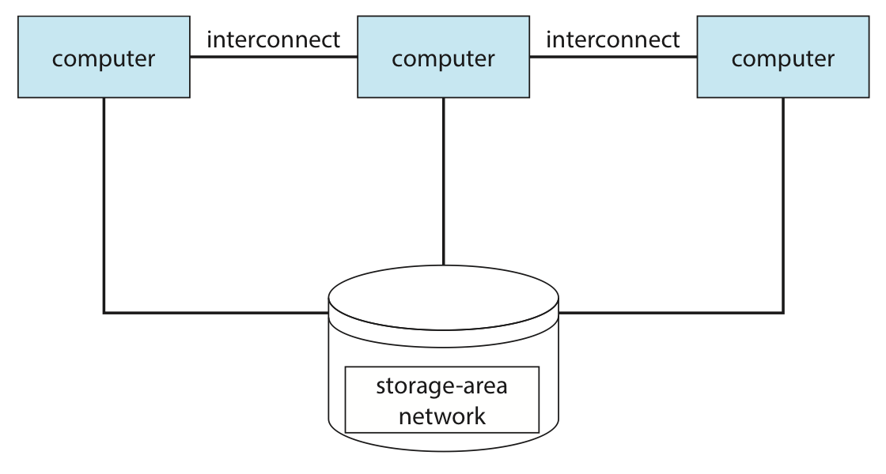

# Unit 0: 总览 | Overview

!!! info "导语"
    本单元主要有两个任务：
    
    1. 对操作系统进行一个较为抽象的介绍，同时建立起整门课程的框架，方便读者在之后的学习过程中能有一个比较总体的认识，能带着目的去学习具体的知识；
    2. 介绍一些比较基础的内容，或是一些比较琐碎、仅需了解的内容；

    由于课本的 Overview 写得非常一言难尽，所以我在啃完后进行了一些整理，你可以在[这里](https://www.yuque.com/isshikixiu/codes/dvlbpqigbod5xcby)找到我整理过程中完成的思维导图，不过这个思维导图更多的是提供框架性的认知，具体到每个叶子节点的内容建议还是以本文为主。此外，本文很多观点具有比较强烈的个人理解色彩，如果你对其中的论断抱有异议，欢迎讨论！

在正式开始核心内容的学习之前，我想先做一点说明，也算是一点关于学习操作系统的经验之谈。

!!! key-point "“定义不存在了”"
    
    区别于自然科学的研究对象，操作系统作为一个彻彻底底的人造物，其很多概念都很难界定一个明确的界限，这也正是我在学习操作系统的过程中遇到的最首要的问题。我会尽力给出我认为更精确的定义，但这个问题仍然存在，所以我们尽量只围绕定义的中心进行学习。


## 操作系统概述

!!! info ""

    本节主要将操作系统当作一个不可拆分的单位，来讨论什么是操作系统。

### 何为操作系统

整门课程我们需要解决的第一个问题，显然是什么是**操作系统(Operating System, OS)**。接下来我将从两个方面简述何为操作系统。

???+ section "① 从职能上看"

    {width=40% align=right}

    <u>从其**职能**上看，我认为操作系统是一个**资源管理系统**</u>。

    右图描述了计算机系统的抽象层级：自上而下，用户通过应用程序解决问题，应用程序向操作系统请求计算机**资源**；自下而上，计算机硬件为软件（包括 OS）提供了物质基础，本质上，硬件提供了计算机**资源**。

    操作系统作为中间层，向上为用户程序分配易用的资源，向下直接操作硬件资源的，在这个过程中，操作系统还需要**公平**、**高效**地解决资源之间的冲突问题等等。

    它就好像药房柜台，各种药品就好像计算机资源，病人提供处方，柜台收到请求（[系统调用](#系统调用)）后处理请求，并千辛万苦（具体会遇到什么问题我们会在之后的内容中学到）替你准备好你需要的资源，完成你的请求。

    具体来说，操作系统管理的**资源**有这些：① CPU，由于 CPU 的一个核(core)在特定时刻只能处理一件事，所以“CPU 能够为我所用”是一个非常重要的资源；② 内存，执行程序离不开内存，用户程序自然也需要占用一定的内存来解决问题；③ I/O 设备，打印机不能同时打印毛概历年卷和转专业申请表；④……
    
    粗略的来说，本课程之后的内容基本上都是围绕要如何维护和操作各种资源而展开的。

???+ section "② 从存在上看"

    <u>从其存在来看，操作系统本质上还是一个**软件程序**，是一个不停运行着的，用来执行用户程序的软件</u>。这个角度的本质同时反应了操作系统最初存在的目的，为了提高计算机资源的利用效率，我们需要一个程序来自动化“让计算机完成一系列特定任务”这件事，而为了实现这个自动化，这个程序也需要成为计算机硬件的“代理人”，掌握硬件的所有资源，并且这个“代理人”还得想方法让自己好好“活着”。

    操作系统中最基础最中央的部分是**内核(kernel)**，要给出 kernel 的精确定义很难，这与操作系统设计的结构有关（参考[宏内核](#mo-kernel)和[微内核](#mi-kernel)），它最明显的一个特点就是自计算机开机后就不停在运行。OS 和 kernel 的关系就好像笔记本电脑和它的主板，如果将 OS 中的其他部分除去，kernel 仍然自洽，仍然具备它应有的内在的功能，比如它仍然具备对资源进行调度的能力，只不过它可能拿不到能让它调度的资源。我在这里避免谈到 OS 和 kernel 的区别，因为这实在难以说清，甚至在之后的内容中，我都会用 OS 来代替 kernel 的概念。

至此，我们从两个方面了解了什么是操作系统，现在用一句课本上的话来做总结。

> The common functions of controlling and allocating resources are then brought together into one piece of software: the operating system. --*Operating System Concepts (10^th^ edition)*

### 操作系统的设计目标

现在我们知道操作系统是什么东西了，那么在此基础上我们挖掘一下，怎样才算一个好的操作系统，也就是操作系统的发展方向，而在这个过程中，我也会简单提及一些我们之后会涉及的内容，以供参考。

!!! note ""

    首先，操作系统本身需要有较好的可靠性和安全性，也就是我们之前提到的，这个“代理人”要尽可能让自己好好“活着”。一方面它需要有良好的异常处理机制（通过[中断机制](#中断)实现），这个“代理人”需要有强健的体魄，不能一刮风它就病倒了；另一方面它需要有权限管理系统（[特权模式](#特权模式)），以屏蔽来自用户程序的危险行为，用户可以向“柜台”索取抗生素，但是用户索取库房钥匙时，合格的“柜台”显然不能答应这个请求。

!!! note ""

    其次，操作系统需要有较好的易用性，它需要向用户提供简便的服务以请求系统资源，毕竟操作系统的目的之一就是方便用户使用系统资源——这意味着我们的“代理人”得是个好交流的人，而用户程序调用操作系统资源的途径是[系统调用](#系统调用)。

    > 宽泛一点来讲，操作系统为我们提供了命令接口和程序接口，有些地方也会提到图形用户接口(Graphical User Interface, GUI)，以及命令行接口(Command Line Interface, CLI)，但是我个人不是很喜欢这个分类。

!!! note ""

    当然，操作系统需要是高效的，从最早的批处理系统到现在的分时系统（[操作系统的任务执行设计](#操作系统的任务执行设计)），CPU 的利用率在不断提升，周转时间也在不断缩短，如今的操作系统通过分时技术也实现了体感上的并行，提高效率的同时也提高了用户体验。

!!! note ""

    还有一点不容忽视的是操作系统的（一定程度上的）**公平性**，在[进程管理这一章](Unit1.md)中我们会了解到，多进程语境下有大量的冲突问题需要解决，而我们在处理这些冲突问题的时候，可能会出现**[饥饿(starvation)](./Unit1.md#算法--priority-scheduling){target="_blank"}**，而操作系统要做的就是避免饥饿的出现，就好像繁忙时段的电梯，我们不能因为二楼流量很大就不管三楼以上的人。

!!! note ""

    上述目标大多是针对使用者而言的，那么对于开发者来说，操作系统的可扩展性、易维护性等也是非常重要的。不同的设计思路造就了不同的操作系统结构，各种设计也各自有各自的主战场，关于这些内容，我们会在[操作系统的结构设计](#操作系统的结构设计)这一部分更详细地介绍。

还有许多，例如操作系统的设计要尽可能利用硬件资源等，但并不是我们在本节想要讨论的重点，所有就掠过了。上述观点并不全面也不一定完全正确，有一大部分都是我的个人理解，请读者辨证地看待，如果有错误请务必告诉我！

## 操作系统的整体设计

!!! info ""

    本节主要就一些关于操作系统整体设计的问题做一些讨论，从一个相对比较高的角度谈一谈一些顶层设计。

### 计算机系统架构

虽然操作系统本身是软件，但是它毕竟是与硬件紧密关联的，所以我们还是会涉及到一些关于硬件的内容，这里简单涉及一些关于计算机系统架构的内容。

???+ extra "概念辨析"
    <center> <table>
        <thead> 
            <tr>    <th>名词</th>               <th>定位</th>                      </tr> 
        </thead>
        <tbody> 
            <tr>    <td>CPU</td>                <td>执行指令的硬件</td>             </tr> 
            <tr>    <td>Core</td>               <td>CPU 的基础计算单元</td>         </tr>
            <tr>    <td>Multi-core</td>         <td>一个 CPU 上有多个 core</td>     </tr> 
            <tr>    <td>Processor</td>          <td>包含一个或多个 CPU 的芯片</td>   </tr>
            <tr>    <td>Multi-processor</td>    <td>多个 processor</td>            </tr> 
        </tbody>
    </table> </center>

根据处理器的数量和组织形式，我们这里介绍三种计算机系统架构：单处理器系统、多处理器系统、集群系统。

???+ section "① 单处理器系统(single-processor system)"

    书中给出的关于单处理器系统的定义是，有且仅有一个**通用处理器(general-purpose processor)**，并且这个 processor 只有一个核(core)。但它可以有若干**专用处理器(special-purpose processor)**，用来执行一些特定的指令，而这些专用处理器并不运行线程。

???+ section "② 多处理器系统(multiprocessor system)"

    多处理器系统是指有多个**单核**通用处理器的系统，这些处理器共享一块主内存，它们通过总线或交换网络连接在一起。

    显而易见的是，增加了处理器的数量能够增加**吞吐量(throughput)**，即单位时间内处理的任务数量，但是这个增加并不是线性的，因为处理器之间的通信也需要时间，而且还会有一些额外的开销。

    ??? quote "相关阅读"
        - [对称多处理(SMP) | Wikipedia](https://en.wikipedia.org/wiki/Symmetric_multiprocessing)；
        - [非一致内存访问(NUMA) | Wikipedia](https://en.wikipedia.org/wiki/Non-uniform_memory_access)；

        但是 multi-core 的设计在速度和效能上都更胜一筹，因为 on-chip 的通信比 between-chip 的通信更快，而且更省电。

???+ section "③ 集群系统(cluster system)"

    <center> { width=60% } </center>

    集群系统通过冗余实现高可用服务，通过并行实现高性能计算，它是由多个各自独立的计算机系统作为节点(node)，通过高速通信网络互相连接形成的。

    集群也分对称和不对称两种，对称集群的各个节点互相监督，而不对称的集群则存在一种类似“替补”的东西，由“替补”去监督工作中的节点，当工作中的节点出现了问题，就由“替补”来接替它的工作。

### 操作系统的任务执行设计

前面我们说过，操作系统被用来「自动化“让计算机完成一系列特定任务”」的。一开始这件事比较简单，只需要像队列一样，一个一个的执行就行，但是慢慢的随着计算机应用范围的扩大以及各种需求的出现，这种设计就不太合理了。按照发展阶段演进，我们划分出两个阶段三个设计：**单道批处理系统(batch processing system)**、**多道批处理系统(multiprogramming batch processing system)**和**分时系统(time sharing systems)**。

<a id="batch-processing"></a>
???+ section "① 批处理系统阶段"
    
    最早操作系统执行任务都需要人工手动干预，但是计算机执行任务的速度与人工干预的速度相差太大，换句话来说人工速度严重限制了计算机的工作效率，于是操作系统开始出现，其中一个比较原始的实现就是批处理系统。（但不是最早，之前还有脱机处理之类的东西。）

    ???+ section "❶ 单道批处理阶段"

        按照操作系统发展进程，我们首先介绍**单道批处理系统(Batch Processing)**。

        单道批处理系统有两个关键词，“批处理”和“单道”。

        “批处理”指的是，系统执行的任务是成批的，若干任务被作为一整批交付给操作系统。在具体执行过程中，操作系统自动按顺序**串行(serial)**执行这些任务。

        而“单道”指的是，一段时间内内存中只有一道程序在运行，系统只处理一项任务，在这个任务结束之前，不会切换到其他任务。

    
    单道批处理系统初步实现了一种“自动化”，极大减少了人工操作速度对操作系统的影响。但它存在一个非常明显的问题：由于当前任务结束之前不会切换到其它任务，所以当当前任务出现 I/O 请求时，CPU 就需要等待 I/O 完成。我们知道 I/O 操作是非常耗时的，更严重的是例如等待键盘输入这种需要人工参与的 I/O，单道批处理系统仍然没法避免这种人工操作对计算机执行效率的影响，这就导致 CPU 会长时间处于空闲状态，而让 CPU 长时间空闲这件事，是不被接受的。

    ???+ section "❷ 多道批处理阶段"
        
        因此，为了不让 CPU 闲下来，一个符合直觉的想法就是让它先去做下一件事，就好像仓库正在收集上一个病人所需要的药品的时候，柜台可以先去处理下一个病人的请求。**多道批处理系统(multiprogramming batch processing system)**应运而生。

        从名字上来看，多道批处理系统厉害在这个“**多道(multiprogramming)**”，即一段时间内内存中同时存在多个进程。
        
        具体来说，在多道批处理系统中，当前任务发生 IO 请求时，CPU 转而去执行其它任务，以此来实现尽量让 CPU 始终在工作状态。因此，宏观上来看，多道批处理系统在一段时间内同时执行若干任务（在任务 A 完成之前任务 B 也可能开始了），我们称之为**并发(concurrency)**（注意，并发与并行的概念并不一致[^1]）；但在微观上，多道批处理系统仍然是顺序串行的，只不过区别于单道批处理系统以完整的任务作为任务单元，多道批处理系统是将完整任务按照 I/O 的发生做划分，以这些划分后的部分任务作为任务单元进行顺序**串行(serial)**。

        我们可以用甘特图来可视化多道批处理系统的策略（一种常见的题型）。以下面的题目为例，我们来实践一下。

        ???+ eg "🌰"

            === "题面"

                现在有两个程序 A 和 B，以及两个分别独立的设备 X 和 Y，且我们只有一个 CPU：
  
                - A 需要顺序使用如下资源：CPU: 10s, X: 5s, CPU: 5s, Y: 10s, CPU: 10s
                - B 需要顺序使用如下资源：X: 10s, CPU: 10s, Y: 5s, CPU: 5s, Y: 10s 

                请讨论：
                
                1. 在单道程序环境下先执行 A 再执行 B，CPU 的利用率是多少？
                2. 在多道程序环境下，CPU 的利用率是多少？请给出甘特图。

            === "解析"

                在单道程序下执行，即按顺序执行 A 和 B，CPU 的利用率即实际 CPU 使用时间除以完成任务的总时间，因此：

                $$
                U = \frac{(10+5+10)+(10+5)}{(10+5+5+10+10)+(10+10+5+5+10)} = \frac{40}{80} = 50\%
                $$

                ---

                而在多道程序环境下，我们得到如下甘特图：

                <figure markdown>
                <center> { width=80% } </center>
                蓝/CPU，绿/X，黄/Y。
                </figure>

                > 要点就是纵向不能同时出现同一个资源，例如 18s 时不能 A 和 B 都用 CPU，所以 A 需要等 B 用完 CPU 再使用。

                现在我们再来统计 CPU 的利用率：

                $$
                U = \frac{10+10+5+5+10}{45} = \frac{40}{45} = 88.89\%
                $$

            通过这道题我们也可以发现，多道程序设计技术对 CPU 利用率的提升有多高，同时也可以从计算过程中的分母看出其对程序吞吐量的提升有多高。

        多道批处理解决了单道批处理系统可能让 CPU 闲置下来的问题（当然前提是有任务让它做），提高了 CPU 等资源的利用率，增加了吞吐量，但是由于涉及到了进程的切换问题，所以实际实现会复杂很多。具体的内容我们会在 [Unit 1: 进程管理](Unit1.md) 中详细介绍。

    但是无论单道还是多道，批处理系统并不适合作为现代计算机系统，其中一个最大的问题就是它的**交互性**非常差。用户给定一定批次的任务，然后系统会自动调整这一批任务的执行顺序，最终完成这批任务，然而在这段时间里，用户就没法再用计算机做其它事情了，同时你也没法控制正在执行的任务，这对现代计算机来说是不可想象的。
    
    > （假设我们忽略关于屏幕显示的 I/O）试想，你希望在跑程序的时候放一个视频，但是由于你的程序还没跑完，你的视频就没法播放，突然你的程序发生了一次 I/O，CPU 转而播放已经完成 I/O 后的那部分视频，但是这个时候你的程序 I/O 很快也完成了，却需要等待缓存中的视频放完才能继续执行，这种用户体验几乎无法接受。

    对于用户来说，最好能同时实现**体感上的并行**，也就是几件事情至少看起来要像是同时发生的，于是出现了**分时系统(Time Sharing Systems)**。

<a id="time-sharing"></a>
???+ section "② 分时系统阶段"
    **分时系统(Time Sharing Systems)**是**多任务(Multitasking)**的一个具体实现，而 Multitasking 是 Multiprogramming 的一个**逻辑**扩展，即 Multitasking 也是 Multiprogramming 的一种，它符合内存中有多个进程，一段时间内有多个任务一起执行的特点。
    
    分时系统通过**频繁**地在多个进程间切换来**近似实现**并行（并不是真正意义上的并行，真正意义上的并行需要通过多核/多处理器实现）。具体来说是按照**时间片(time slice)**，轮流将 CPU 分配给各个进程，这样只要时间片足够短，用户**体感上**就像是多个任务并行执行。

    > 感觉比较像[《十万个冷笑话》超人这一集](https://www.youtube.com/watch?v=uD29J203FFI)的 4:09 - 4:48。

    分时用户允许多个用户同时使用同一台计算机，所有任务之间互相独立，互不干扰、互不阻塞，因此任务的最长周转时间减少，用户的操作也会被及时响应，实现了更方便进行人机对话。

??? quote "相关阅读"
    关于这三个技术的说明也可以看看 xyx 是怎么写的：[🔗](https://xuan-insr.github.io/%E6%A0%B8%E5%BF%83%E7%9F%A5%E8%AF%86/os/I_overview/2_overview/#21-%E6%93%8D%E4%BD%9C%E7%B3%BB%E7%BB%9F%E6%98%AF%E5%95%A5)

    除了这几种系统外，王道里也提到了这些系统：

    - 实时系统(Real-time System)：在特定时间（可能比时间片还小）内完成特定任务的系统，例如航空航天系统、核反应堆控制系统等；
    - 分布式系统(Distributed System)：由多台计算机组成的系统，这些计算机通过通信交换信息，共同完成一个任务，例如云计算、大型网站等；

多道技术出现之后，虽然计算机的表现不断提升，但是多道技术本身的技术特点，各个进程在未完成的情况下需要互相切换，一系列问题接踵而来，这些都是我们在之后的单元里详细讨论的内容。

### 操作系统的结构设计

随着操作系统的功能不断扩展、体量逐渐变大，整个操作系统软件的结构设计就越发重要了。接下来我们介绍若干设计思路。

<a name="mo-kernel"></a>
???+ section "宏内核"

    <center> { width=25% align=right } </center>

    **宏内核(Monolithic-Kernels)**也叫单内核或大内核，它的核心思想十分简单粗暴，将所有主要功能都紧密耦合在一起作为一个完整的整体。

    宏内核带来的好处是操作系统效率极高，从操作系统的发展历程来看，主流操作系统都是从宏内核发展过来的（不过如今的主流操作系统更偏向混合系统）。

    但是宏内核的缺点也是十分明显的，大量复杂的功能互相耦合，导致操作系统的维护十分困难；不仅如此，一旦某个部分出现了严重问题，整个系统都会受到影响，在这方面，宏内核的表现都不如[微内核](#mi-kernel)。

??? section "分层设计"

    **分层设计(layer approach)**的核心思想是将系统分为若干层，底层为硬件，顶层为用户接口，第 $i$ 层只调用 $i-1$ 层提供的接口。每一层都实现良好的封装，于是开发过程中只需要逐步实现并调试验证每一层，再逐级向上开发即可；在维护或扩展过程中，只要修改每一层的内部实现，而不需要修改其它层的代码，这样就大大降低了开发和维护的难度。

    然而，由于每次执行一个功能都需要上下跨越多层，发生多次接口调用，分层设计下的系统效率往往都受到限制；不仅如此，要想真正意义上实现良好的分层设计，就需要对各层有良好的定义，这个设计难度是不小的。

<a name="mi-kernel"></a>
???+ section "微内核"

    <center> { width=50% align=right } </center>
    
    **微内核(Micro-Kernels)**的设计思路与[宏内核](#mo-kernel)相反，主张将不是必要的东西都从内核里拿出去，放到用户空间，以用户态执行。整体形成一种微内核-服务器的结构，此时内核只提供通讯、内存管理、进程管理等基本功能，也只有这些部分直接运行在[内核态](#特权模式)，作为服务器的其它功能部件则通过消息传递机制与内核互动。

    由于内核只提供最基本的功能，所以内核的体积会大大减小，内核的维护和扩展也会变得更加容易，微内核-服务器的结构也使功能扩展更加容易；另外，由于内核只提供最基本的功能，所以内核的效率也会大大提升；不仅如此，由于各个功能之间的耦合降低，且都运行在用户态，功能之间仅使用通信建立链接，即使某个功能部件出现问题，也不会导致整个系统崩溃，相比于[宏内核](#mo-kernel)，系统可靠性大大提升。

??? section "模块化设计"

    **模块化设计(Modules Approach)**指将操作系统划分为若干分立模块，并规定模块之间的接口，甚至单个模块下也可能是由多个模块通过同样的方式组织而成的。这种设计方法也被称为模块-接口法。

    > 模块化的设计与[微内核](#mi-kernel)是不同的，需要注意区分。微内核设计仍然是有中心（微内核）的，但是模块化设计整体是分层网状的。

    理想的模块化设计会让系统设计可以多线并行，只需要事先商量好接口，各个工程师就可以独立地实现、填充模块内容；高内聚低耦合的设计也能让系统的维护和扩展变得更加容易。

    然而模块化的设计十分困难，模块化的设计并没有一个清晰的单向依赖关系，因此无法递进式的推进任务，整个开发过程就好像始终悬在半空；除此之外，如何设计接口使得所有需求都能被很好满足也是个难以解决的问题。

??? section "混合系统"
        
    **混合系统(Hybrid Systems)**是指将[宏内核](#mo-kernel)和[微内核](#mi-kernel)的设计思路结合起来，这种设计模式更现代，也是目前主流的操作系统的模式。

## 操作系统的运行原理

!!! info ""

    本节我们深入到操作系统的一些具体运行过程，探究一些步骤的具体实现。
### 中断

中断（广义）是贯穿现代操作系统的一个重要技术，它使得“计划之外”的事情可以及时的被告知并处理。例如，程序突然出现了致命错误，这时操作系统应该及时察觉并处理；又比如，用户在命令行输入了指令，按下了回车，操作系统应当察觉到 I/O 已经准备好了。但是我们不应当让操作系统不厌其烦地询问你有没有发生错误，又或者这个 I/O 是否就绪，这很不合理。

也就是说，我们不应当让操作系统事无巨细地去负责检查意外是否发生，而是应当提供一个上报意外的接口，让产生意外的人自行上报这些意外。在具体硬件的实现上，会有两条专门表示中断信号的线（稍候会在中断屏蔽中讲到），CPU 会在每一条指令结束后检测是否有中断发生，而在软件上就体现为每当有中断发生时，操作系统就需要去处理。由于中断的强大特性，从最早仅的处理硬件状态，到处理软件错误和作为一种类似函数的手段，中断的应用范围越来越广，它的概念随着应用范围也不断扩大。

!!! key-point "中断向量表"
    由于中断被广泛使用，操作系统需要频繁的处理各种中断，处理每一种中断都需要一个特定的方法，因此，一种快速定位中断处理方法的手段就显得尤为重要。
    
    中断向量表(Interrupt Vector Table)通过中断号来索引中断处理方法，实现了一种“随机访问”，大大加速了中断处理的速度。

根据中断是否由程序产生，中断可以分为**外中断**（狭义的中断，由硬件产生）和**内中断**（异常...，主要由程序产生）。这里有很多概念：instruction, exception, trap, abort, ...，这部分区分请大家自行寻找资料参考，我在这里放几个参考链接。

??? quote "相关阅读"
    - [Difference between TRAP and exceptions | StackOverflow](https://stackoverflow.com/questions/56877451/difference-between-trap-and-exceptions)
    - [Difference between Interrupt and Exception | GeeksForGeeks](https://www.geeksforgeeks.org/difference-between-interrupt-and-exception/)

理想情况下，我们希望中断一旦发生就立刻被解决，但是中断处理也同样需要资源，这意味着中断也有可能产生冲突。于是，我们需要一系列机制来解决这些问题。

1. 显然，中断之间亦有区别，有的程序发生了“致命错误”这件事，显然比打印机就绪更重要，因此，中断需要分级机制，以区分中断的优先级，这样就可以在处理中断时，优先处理优先级高的中断；
2. 中断并不是随时随地都能发生的，“代理人”在走独木桥时不应当暂停去处理药品缺货的问题，对于操作系统来说，有许多原子性的行为是不可被中断的，也有一些重要的任务是不应当被普通的中断打扰的，这就涉及到中断屏蔽问题；

!!! warning "存疑"

    这就需要我们谈到中断的硬件设计，一种比较普通的设计是，准备 maskable interrupt-request line 和 non-maskable interrupt-request line 两条中断请求线，前者用于可屏蔽的中断，后者用于不可屏蔽的中断，操作系统在每个指令后检查这中断线上是否有中断请求，而如果此时操作系统屏蔽了中断，那么就不会检查 maskable interrupt-request line 上的中断请求。

需要注意，操作系统发现中断后并不是二话不说马上去处理中断的，为了保证中断处理完成后仍能继续当前任务，操作系统需要保存当前任务的状态，以便完成中断处理后恢复当前任务的状态。

### 计时器

虽然看起来很不起眼，但**计时器(timer)**在操作系统中是一个非常重要的东西。计时器需要一个固定频率的时钟以及一个计数器，在每个时钟周期令计数器减 1，当计数器归零时产生中断，告诉操作系统定的时已经到了。

它的功能虽然基础但是十分重要，例如分时系统中就需要计数器来控制时间片的长度，又比如操作系统需要定期检查内存中的进程，以防止进程一直占用系统资源，这些都需要计时器的帮助。

### 特权模式

我们前面说过，操作系统的某些操作是危险的，有可能威胁到自身正常运作的（如与硬件直接相关的行为、控制 CPU 运行规则的行为等），而这些操作不应当被用户程序直接执行。一种简单的思路是，我们划分常规操作和危险操作，允许用户程序执行常规操作，而危险操作则需要委托专业人士代为执行。而这就是**特权模式(Privileged Mode)**的基本思路。

工业上的特权模式可能会有多种复杂的实现形式，但是我们这里只讲最简单的一种，即**双模式(Dual-Mode)**。双模式下，CPU 有两种运行模式，一种是**用户态(User Mode)**（目态），一种是**内核态(Kernel Mode)**（管态，核心态）。Mode Bit 为 0，表示 CPU 工作在内核态，Mode Bit 为 1 时，CPU 工作在用户态。

同时，我们将那些“危险”的指令称为**特权指令(privileged instruction)**，例如 I/O 控制，计时器管理，中断管理等。这些指令只能在内核态下执行，而用户态下执行这些指令时会认为这条指令不存在。

!!! bug "问题尚未解决"

    现在我们将危险操作和相对安全的操作隔离开来了，但是这并不意味着用户程序就不需要使用那些危险操作了，单纯的隔离并不能解决问题，用户程序仍然存在需要使用特权指令的需求。

这些需求往往是可以被抽象的、被封装的。就好像*「“用户”向“柜台”索要库房钥匙，以便 ta 能去库房拿缺货的货物」*这件事是不合理的，我们无法控制“用户”实际拿“钥匙”做了什么，而“钥匙”的滥用又会导致“柜台”陷入危险中；但是*「“用户”请求“柜台”去库房拿 ta 需要的货物」*是合理的。

反过来讲，虽然*「“用户”请求“柜台”去库房拿 ta 需要的货物」*这个任务必须使用库房“钥匙”才能进行，但是无论如何这个“钥匙”也只会被“柜台”用来获取库房里的特定货物，而不会发生诸如“用户”带着十八车面包人把库房洗劫一空的情况。

操作系统只需要封装好一系列类似这种的需求-结果的处理方案，让用户在有需要的时候让操作系统执行这些方案，**在执行当前任务的时候将控制权让渡给操作系统，操作系统完成后再还回控制权**，就可以实现将特权指令隔离在内核态，同时用户程序也能完成需求。

而那么在具体实现上，这一步是通过 [trap](#中断) 实现的。

<figure markdown>
<center>{ width=80% }</center>
Transition from user to kernel mode.
</figure>

### 系统调用

!!! note inline end ""
    
    <figure markdown>
    <center>  </center>
    Examples of W&U system calls.
    </figure>

**系统调用(System Call)**是系统向用户程序提供服务的一个接口，它们经常以 C/C++ 函数的形式存在，对于某些比较接近底层的任务，也可能是通过汇编编写的。

但说到底，系统调用还是相对底层的设计，通常的开发并不基于如此底层的设计展开。更常见的是利用各种抽象层级更高的 **Application Programming Interface, API** 进行开发。

API 是一个非常常见的概念，在我看来系统调用本身也是一种 API。API 的核心思想是让调用者只需要知道如何与被调用者交流以实现目的，而不需要关心其具体实现。这同时也暗示着，只要 API 一致，同样的程序在不同的平台上也能直接编译后运行。

显然，API 与编程语言往往是强相关的，特定编程语言在操作系统上运行也是需要一定的“环境”的，也就是我们所说的**运行时环境(run-time environment, RTE)**。RTE 通常包括了编译器(compilers)、解释器(interpreters)、库(libraries)和[装载器(loaders)](#链接器和装载器)等，它们共同组成了一个完整的运行时环境。

??? quote "相关阅读"

    - [ABI | Wiki](https://en.wikipedia.org/wiki/Application_binary_interface)
    - [Difference between API and ABI | StackOverflow](https://stackoverflow.com/questions/3784389/difference-between-api-and-abi)


???+ eg "思考题"

    === "题面"

        辨析**库函数**与**系统调用**？

    === "解析"

        库函数运行在用户空间而系统调用运行在内核空间。大部分库函数可能使用系统调用来实现目的。


### 链接器和装载器

!!! note inline end ""

    <figure markdown>
    <center></center>
    The role of the linker and loader.
    </figure>

说了这么多，那么操作系统到底是如何执行一个程序的呢？以 C 为例，一个写完的代码需要经过编译、链接、装载三个步骤，才能成为一个**在内存中**的，可以被执行的程序。

简单来说，编译器首先将若干 `.c` 源文件编译为若干 `.o` 文件（这里合并了预处理、编译、汇编步骤），这些 `.o` 文件被称为可重定位目标文件(relocatable object file)，其存在形式为机器码；随后链接器将若干 `.o` 文件连带所需要的一些库文件（如 `.a` 文件）链接为一个可执行目标文件(executable object file)。

特别的，链接分为静态链接和动态链接两种。静态链接将库文件的代码直接合并进入最终的可执行文件，而动态链接仅仅将库文件的引用信息写入最终的可执行文件，而在程序运行时再去寻找这些库文件。

```bash
gcc -E main.c -o main.i # pre-process
gcc -S main.i -o main.s # compile to assembly code
gcc -c main.s -o main.o # assemble to object file
gcc main.o -o main      # link
./main                  # (load and) execute
```

??? extra "一些操作"
    - 使用 `gcc -static ...` 来指定使用静态链接；
    - 使用 `ldd <file>` 来查看文件链接了哪些库；

<figure markdown>
<center>  </center>
可以发现，动态链接得到的可执行文件比静态链接得到的可执行文件要小不少。
</figure>

### 引导

在计算机刚刚启动，操作系统还未开始运行之前，需要开机后的第一个程序——引导加载器(bootstrap loader)来一步一步地初始化操作系统。对大多数操作系统来说，bootstrap 都会被存储在 ROM 中，并且需要在一个已知的位置（否则怎么找到它呢）。Bootstrap loader 会载入更加爱复杂的，完整的 bootstrap，而包含 bootstrap 程序的分区就被称为引导分区(bootstrap partition)。

[^1]: 并发是指两个或多个事件在同一时间间隔内发生，而并行是指两个或多个事件在同一时刻发生。逻辑上，并行是并发的子集。