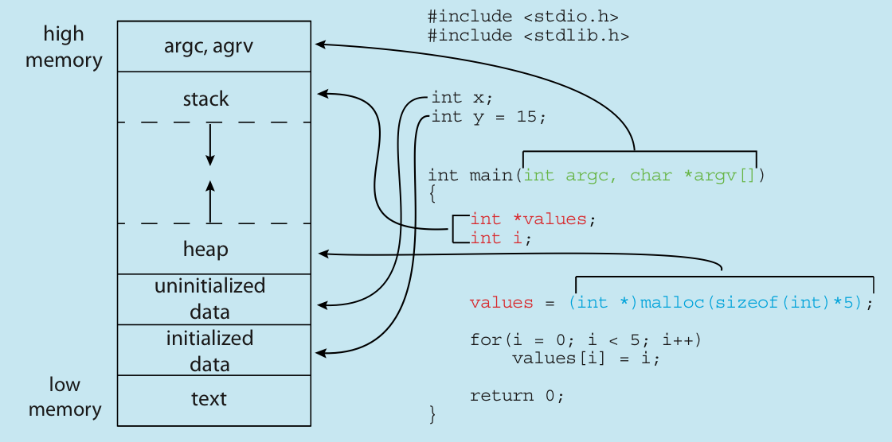
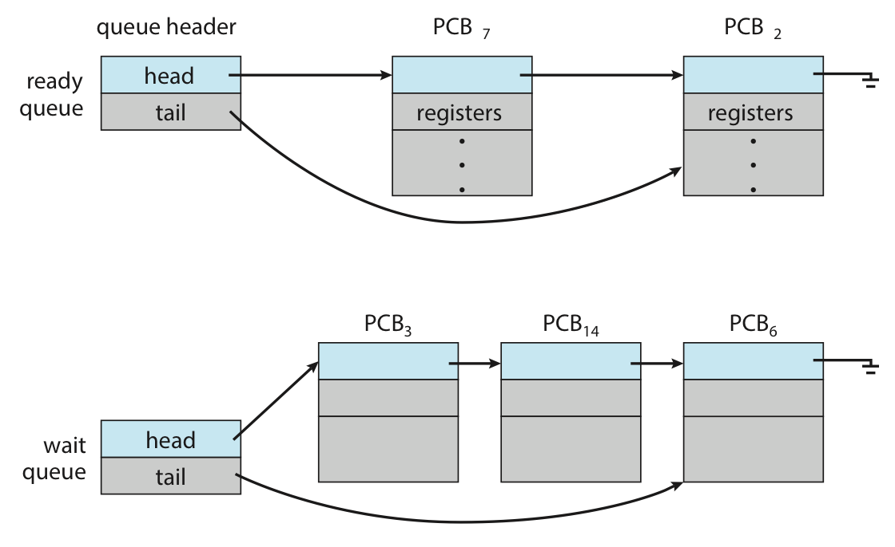
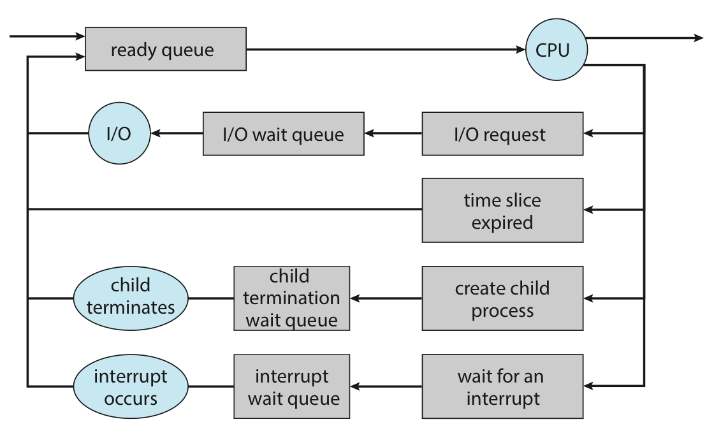
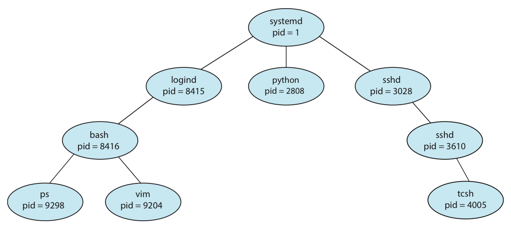
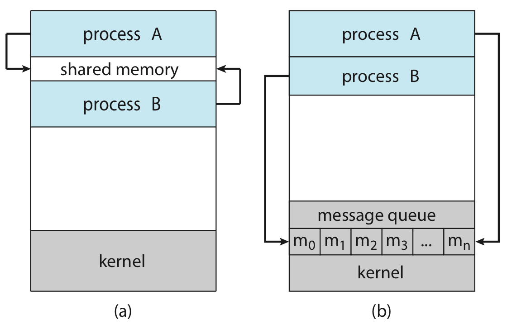
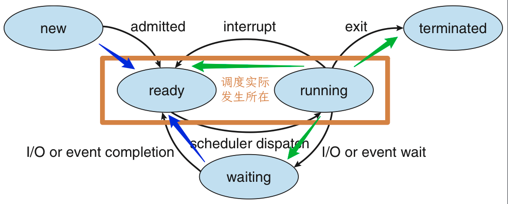
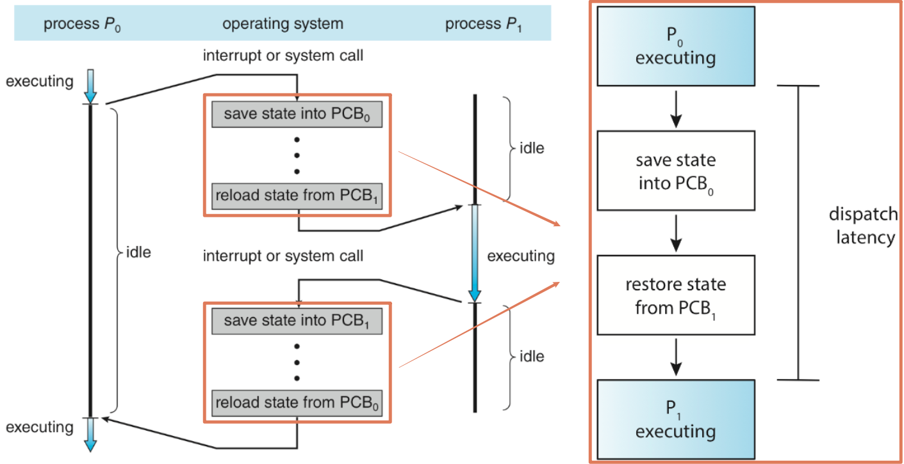
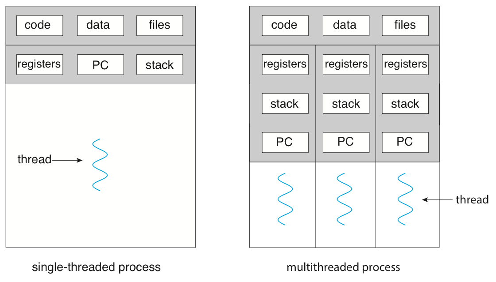

# Unit 1: 进程管理 | Process Management

## 进程

一段本质上程序是静态的、存储在硬盘上的指令数据，而当它附带运行程序所需要的必要信息进入内存，得到相关资源后，它成为一个动态的、与计算机资源互动的实体，这个实体就是**进程(process)**。

进程是是操作系统进行资源分配和调度的一个**独立单位**，它以特定形式存在于内存中，具有一定的封闭性，是多道技术的重要基础。

### 进程的形式

前面我们提到，进程动态地存在于内存中，因此除了命令以外，还包括其运行时的动态信息。抽象来说，主要包含这三个维度：① 用来跑的代码；② 跑的过程中，不断会被更新的数据；③ 用来维护、控制进程的控制信息。

进程在内存中存在需要一块**虚拟的**地址空间以存储上述这些内容。其包含两个部分，即虚拟地址空间中的**用户部分**和虚拟地址空间的**内核部分**。

下图是进程在虚拟地址空间中用户部分的组成：

!!! section "用户部分"

    <center> { align=right width=35% } </center>

    - Text section:
        - 存储代码；
    - Data section:
        - 存储代码中的全局变量、静态变量；
    - Heap section:
        - 常说的“堆”，被动态分配的内存；
    - Stack section:
        - 常说的“栈”，存储一些暂时性的数据，如函数传参、返回值、局部变量等；

    可以发现，Text 和 Data 部分所需要的空间在一开始就被确定，而 Heap 和 Stack 都可能动态的扩展和收缩。观察右图，Heap 和 Stack 是相向扩展的，于是整一块的大小能够固定下来，而在内部进行有限制的动态分配。当然，Heap 和 Stack 的区域并不会交叉。

    ??? eg "memory layout of a C program"

        

        之所以把有初始值的静态变量和没初始值的静态变量分开来，是因为我们可以在一开始只存储没初始值的静态变量的大小，而在真正第一次访问的时候才分配内存，以此来实现减少内存占用。

        通常来说，未初始化的静态变量一般都被放在 `.bss` 段，而在被初始化的时候移动到 `.data` 段。[^1]

<a id="PCB"/>

而放在内核部分的内容，则更侧重于进程的控制信息，具体来说就是**进程控制块(Process Control Block, PCB)**。

!!! section "内核部分"
    **进程控制块(Process Control Block, PCB)**是操作系统中用来描述进程的一种数据结构，它包含了进程的所有信息，是操作系统中最重要的数据结构之一。可以说，PCB 是进程存在的唯一标志。

    通常来说，PCB 可能包含这些内容：

    <center> { align=right width=35% } </center>

    - Process state:
        - [进程的状态](#进程的状态){target="_blank"}；
    - Program counter:
        - 标识该进程跑到了哪里，由于进程是动态的，每一被切换都需要保证下一次能无缝衔接之前的进度，所以需要存储每次的工作状态；
    - CPU registers:
        - 保存进程相关的寄存器信息；
    - CPU-scheduling information:
        - CPU 调度参考的信息，包括优先级、调度队列的指针、调度参数等；
    - Memory-management information:
        - 包括页表、段表等信息，具体与实现的内存系统有关；
    - Accounting information：
        - 一些关于进程的动态数据的统计和记录，比如总共已经跑了多久、时间限制、进程号等；
    - I/O status information:
        - 被分配给进程的 I/O 设备列表、打开的文件列表等；

两个部分在逻辑上的关系是，用户部分划分并实际存储进程所需要的数据资源（包括程序运行的代码），而内核部分存储进程的元数据，包括控制信息与用户部分中各个部分内存的分配和使用情况。

### 进程的状态

在单机语境下，进程调度一个比较核心的部分就是将 CPU 资源给哪个任务用。而并不是任何进程在任何时刻都可以直接获得 CPU 资源并直接开始使用的，因此我们需要对进程的状态进行建模。

<center>  </center>

- `new`:
    - 进程正在创建过程中，包括申请 PCB，分配初始资源等；
- `running`:
    - 进程正在运行，即正在使用 CPU 资源；
    - 有几个核就**最多**有几个进程处于 `running` 状态；
- `ready`:
    - 进程已经准备好了，只差 CPU 资源，一旦有 CPU 资源待分配，就会有就绪态的进程变为运行态；
    - 如果有进程处于就绪态，就一定有进程处于运行态；
    - CPU 调度实际上指的就是若干进程在就绪态和运行态之间的切换；
- `waiting`:
    - 进程正在等待某个事件的发生，比如等待 I/O 完成、等待某个信号量等；
    - 此时即使有空余的 CPU 资源，该进程也无法继续；
    - 一般进程从运行态进入阻塞态是主动的，离开阻塞态进入就绪态是被动的；
- `terminated`:
    - 进程因为某些原因终止，结束运行，需要释放资源；

进程在就绪态需要等待 CPU 资源的**派发(dispatch)**，接受调度；在阻塞态需要等待对应的 I/O 完成或事件完成，因而存在一种结构需要去维护这些“相对静止”的进程。通常使用就绪队列(ready queue)和等待队列(wait queue)来实现，其基本结构如下：



实际实现中，由于等待的 I/O 或事件不同，可能维护多个等待队列，于是实际过程中的情况可能如下：



## 进程管理

现在我们已经讨论了进程的形式和一个个离散的状态，现在我们来讲讲进程在几个阶段的动态过程。

用户进程在操作系统中，总体上来讲遵循一个树状的组织形式，每一个进程都有一个唯一标识符进程号（通常被称为 pid，但在特定语境下可能有不同的含义）。如下图是 Linux 的一个进程树。



你也可以在 Linux 中使用 `pstree` 来查看进程树。
言下之意就是进程之间存在一种父子关系，即 child 进程是由 parent 进程创建的，因此进程除了自己的 `pid` 还有 `ppid` 来标识它的 parent 进程。

### 进程的创建

child 进程的资源可能直接来自操作系统的分配，也可能来自 parent 进程的分配，限制使用后者的好处是能够避免因为创建太多子进程而导致资源不够用。特别的，我们观察到这棵树的根是 `systemd`，历史上也曾叫过 `init`，它是操作系统启动后运行的第一个用户进程，至少在 Linux 中，它的 `pid` 被分配为 1，而它的 `ppid` 是 0，可以理解为这个进程的 parent 是 scheduler 而非一个进程[^2]。

在 Linux 中，我们可以使用 `fork` 来创建一个 child 进程，在这里先引入如何实现是为了引入一个可以借来描述过程的语言，我们以下面的 C 程序为例展开之后的讨论。

```c linenums="1" hl_lines="10 18"
#include <stdio.h>
#include <unistd.h>
#include <sys/wait.h>
#include <sys/types.h>

int main() {
    printf("A process starts!\n");

    pid_t pid;
    pid = fork();

    if (pid < 0) {
        printf("Fork failed!\n");
    } else if (pid == 0) {
        // sleep(1);
        printf("pid is zero, so it's child process!\n");
    } else {
        // wait(NULL);
        // sleep(1);
        printf("pid is nonzero thus it's parent process!\n");
    }
}
```

第 10 行高亮的 `fork()` 语句创建了一个进程，该进程只有进程号与 parent 进程不一样，同时通过检查返回值 `pid` 来判断属于 parent 还是 child。

如果第 18 行仍然被注释，那么 parent 进程诶 child 进程将并发执行，即完成 `fork()` 后两个进程都从 11 行开始继续向下并发的执行，互不阻塞；如果 18 行的注释被取消，那么 parent 进程将等待 child 进程结束后再继续。读者可以尝试排列组合两个注释来观察程序运行的结果会如何变化。

逻辑上创建的新进程有两种情况：

1. 复制 parent 进程的代码数据；
2. 载入新的程序并继续执行；

而实际在 Linux 中，第一种通过 `fork()` 实现，第二种通过 `fork()` 后 `execXX()` 实现，`execXX()` 会覆盖那个进程的地址空间，以实现执行其他程序。[^3] [^4]

### 进程的终止

当进程调用 `exit()` 这个系统调用时，这个进程将被终止，这意味着这个进程将不再执行，其资源将被释放，同时——返回状态值，而这个状态值将被 parent 进程的 `wait()` 接收。特别的，如果 parent 进程尚未调用 `wait()`，则这个 child 进程还不会完全消失，因为要返回的东西还没返回，这种逻辑上已经终止，但仍然占有一部分资源，等待 parent 进程调用 `wait()` 的进程，我们称之为**僵尸进程(zombie)**。一个进程变成僵尸进程是很普通的，关键在于，如果 parent 进程不调用 `wait()`，那等 parent 终止后，这个僵尸进程可能仍然一直存在，此时这个僵尸进程同时是一个**孤儿进程(orphan)**——即没有 parent 进程的进程，这显然是不合理的，UNIX 的解决办法是，让所有孤儿进程都成为 `init`/`systemd` 的 child 进程，由 `init`/`systemd` 来 `wait()` 它们。

在某些系统里，操作系统通过**级联终止(cascading termination)**来避免孤儿进程的出现，即当一个进程被终止时，它的 child 也应当被递归地终止。

??? extra "daemon"
    [守护进程](https://en.wikipedia.org/wiki/Daemon_(computing))是一种特殊的进程，它们在“后台”长期运行，例如某些数据库服务、反代理服务等，而非像普通的用户程序一样依赖于用户交互。

    为了实现“长期运行”，我们需要让它以 `init`/`systemd` 为 parent，因为任何其它进程都有可能在操作系统运行的时候终止。

    那么一种办法就是我们递归地 `fork()` 两次，然后终止第一个进程，即终止第二个进程的 parent，这样它就能成为一个孤儿进程，进而被 `init`/`systemd` 接管。

### 进程间通信

如果一个进程受到其它进程的影响，或会影响其它进程，那么我们称之为协作进程(cooperation process)，而进程间通信(Inter-Process Communication, IPC)支持了进程协作，以实现进程间的数据交换。

- 信号量(semaphores)；
- 共享内存(shared memory)：
    - 更快，需要用到 sys call 的地方只有建立共享内存的时候用的到。
- 消息传递(message passing)：
    - 在分布式系统中更容易实现，对于少量数据通信很有用（因为不需要处理冲突问题）。
- 文件 / 管道(pipe)：
    - 管道本质上也是一种文件，但一个管道只支持单向传输，即只能 A 写 B 读，如果要实现双向需要两个管道。

<figure markdown>
<center></center>
Communications models. (a) Shared memory. (b) Message passing.
</figure>

## 进程调度

多道技术引入后，内存中同时存在多个进程，进程的数量我们称之为多道的度(degree of multiprogramming)。一段时间内若干进程并发执行，因此**调度问题(scheduling)**——CPU scheduler 将决定在何时将 CPU 资源分配给哪一个就绪进程，使之进入运行态——这个问题就很重要了。总体来讲，我们需要实现一个高效、公平的的调度，以此保证 CPU 利用率足够高，同时又保证计算机功能正常运作。

<figure markdown>
<center></center>
Diagram of process state.
</figure>

### 调度的时机

我们再次审视进程状态的 FSM，发现所有状态都是围绕着 `ready`/`running` 展开的，而 CPU 具体资源分配的过程也正是通过这两个状态的转化体现的。而 <font color=green>❶</font> 当运行态的进程由于某些原因需要主动离开运行态时，或 <font color=blue>❷</font> 当就绪态的某个进程需要立刻得到 CPU 资源时，scheduler 会进行调度。上面这句话反应在　FSM 上，就是 <font color=green>❶</font> 进程从运行态转化为其它状态，即箭头从 `running` 出发向外；<font color=blue>❷</font> 进程从其它状态转化为就绪态，即箭头从外指向 `ready`，这里其实还暗含了一个 `ready` 指向 `ready` 的箭头，在例如 priority aging 的情况下，`ready` 中可能突然有一个优先级足够大了就会发生抢占式调度。上面描述的这两种**时机**下产生的调度，就分别定义为**非抢占式调度(non-preemptive scheduling)**和**抢占式调度(preemptive scheduling)**。

<figure markdown>
<center></center>
Diagram of process state.
</figure>

两者本质上的区别就是，非抢占式调度是由已经拥有资源的进程主动释放 CPU 资源引起的，而抢占式调度则是不占有资源的进程索取 CPU 资源成功引起的。

### 调度的过程

由 CPU scheduler 选择哪一个就绪态的将要被执行后，由 dispatcher 来完成具体的切换工作包括：

1. 在两个进程间进行[上下文切换](#context-switch){target="_blank"}；
2. 切换到用户态；
3. 跳转到用户程序中合适的位置以继续进程执行；

而从 dispatcher 停止上一个运行时的进程，完成上下文切换，并启动下一个进程的延时，称为 dispatch latency。


<a id="context-switch"></a>
!!! section "上下文切换"

    切换进程的时候需要保存“现场”，并在下一次拿出这个进程准备执行之前恢复“现场”，以此来保证进程执行的一致性。这里提到的“现场”被称为**上下文(context)**，表示一种“语境”；而保护-恢复的过程，就是上面提到的**上下文切换(context switch)**。

    其中，上下文可能包括 ① CPU 寄存器中的值，② [进程状态](#进程的状态)，③ 内存的管理信息等。

    > 上下文切换的相关内容在 [Lab2](https://zju-sec.github.io/os23fall-stu/lab1/#_11) 里有所涉及，需要实现一个简单的上下文切换。

<figure markdown>
<center></center>
(a) Diagram showing context switch from process to process. (b) Role of dispatcher.
</figure>

### 调度算法

在讨论有哪些调度算法之前，我们首先需要知道怎样算一个好的调度算法。类似于操作系统的评价，调度算法的评价标准也不是单一的；对应的，不同调度算法有各自的优缺点，需要根据实际情况和需求有所选择。通常来说有这些调度算法的指标(scheduling criteria)：

- CPU 使用率(CPU utilization)：
    - CPU 使用时间 / 总时间，从 CPU 是否足够忙碌来看硬件性能是否充分发挥；
- 吞吐量(throughput)：
    - 单位时间内完成的进程数，从结果来看任务完成是否足够高效；
- 周转时间(turnaround time)：
    - 从进程**开始建立**到进程完成的时间，即包括等待进入内存、在各种 queue 中的等待时间、在 CPU 中的运行时间、I/O 时间等，通过观察最大周转时间，能反应调度的效率和“公平性”；
- 等待时间(waiting time)：
    - 进程在 ready queue 中等待的时间的总和，由于任务所需要的 CPU 时间、I/O 时间不受调度算法影响，所以抛开这些只看在 ready queue 中的等待时间，能反应调度算法的效率；
    - 容易发现，等待时间 = 周转时间 - 运行时间；
- 响应时间(response time)：
    - 进程从发出请求到第一次响应的时间，能反应交互式系统中调度算法的“及时性”；

> 上面五个前两个越大越好，后三个越小越好。

接下来我们开始介绍各种调度算法，需要注意的是，如下调度算法中存在一些理想化的建模（例如假设我们知道进程需要使用多久 CPU），而我们重点需要掌握它的思路，做到能画甘特图、能算时间。此外，这里我们以“多道”为语境，即如果不是特别说明，不考虑分时技术。

#### 算法 | First-Come, First-Serve (FCFS)

FCFS 是最基本的**非抢占式**调度方法就是按照进程先来后到的顺序进行调度，可以很简单地通过一个 FIFO 的队列实现。FCFS 最大的优点就是实现简单。

#### 算法 | Shortest-Job-First (SJF) / Shortest-Remaining-Time-First (SRTF)

SJF 的思路是，当有多个进程处于就绪态时，选择需要**运行时间最短**的进程先运行。这种算法的优点是，能够保证平均等待时间最小；但是缺点是，如果有一个进程需要运行时间很长，那么它可能会一直被推迟，从而导致“**饥饿**”现象，此外，我们并不知道进程运行时间有多久。

??? eg "🌰"

    === "题面"

        现在有三个进程，它们将要执行的时间分别如下：

        - P1: 24
        - P2: 3
        - P3: 3

        现在它们按照顺序进入 ready queue，请分别计算 FCFS 下和 SJF 下的平均等待时间。

    === "解析"

        首先看 FCFS，即按照顺序执行，画出甘特图：

        ```mermaid
        gantt
            title FCFS
            dateFormat ss
            axisFormat %S

            section processes
            P1: a, 00, 24
            P2: b, 24, 27
            P3: c, 27, 30
        ```

        于是平均等待时间为 $(0 + 24 + 27) / 3 = 17$。

        ---

        现在按照 SJF 来，顺序变为 P2 和 P3 先执行：

        ```mermaid
        gantt
            title SJF
            dateFormat ss
            axisFormat %S

            section processes
            P2: a, 00, 03
            P3: b, 03, 06
            P1: c, 06, 30
        ```

        于是平均等待时间为 $(0 + 3 + 6) / 3 = 3$。

        ---

        可以发现，使用 SJF 以后对于这种前面放了个大任务的情况平均等待时间大大减少。

这种做法又被称为 Shortest-Next-CPU-Burst，它是一种**非抢占式**调度算法，但假设我们在执行一个进程的过程中，有一个新的进程加入了 ready queue，而且这个进程的执行时间比正在运行的进程的剩余时间还要短，我们仍然需要继续执行完当前的进程才行——因为它是非抢占式的。而显然这个过程是可以通过**抢占式**调度来优化的，于是我们引入了 Shortest-Remaining-Time-First (SRTF)，其表述是：总是执行**剩余**运行时间最短的进程。其优缺点与 SJF 一致。

我们只需要考虑所有抢占式调度和非抢占式调度[时机](#调度的时机){target="_blank"}，并选择此时的剩余运行时间最短的进程进行调度即可。

!!! question "如何得到剩余时间"

    我们知道，一个程序运行所需要的时间是一个无法在运行结束前得到的数据，因此使用这个东西进行调度就显得十分不合理。但我们可以通过预测的方法估计运行的剩余时间，但是既然是预测就会有不准确，所以 SJF/SRTF 并不能实现理论上平均等待时间最优。至于如何预测，书上提供了一个叫 exponential average 的方法，我们在这里不展开。

??? eg "🌰"

    === "题面"

        现在有三个进程，它们将要执行的时间分别如下：

        - P1: 8
        - P2: 4
        - P3: 9
        - P4: 5

        它们到达 ready queue 的时间分别如下：

        - P1: 0
        - P2: 1
        - P3: 2
        - P4: 3

        请分别计算 SJF 下和 SRTF 下的平均等待时间。

    === "解析"

        对于 SJF 来说，在第 0 时刻，只有 P1 可用，所以只能执行 P1；P1 执行结束后所有其它进程都可用了，此时按照正常的 SJF 即可得到结果。

        ```mermaid
        gantt
            title SJF
            dateFormat ss
            axisFormat %S

            section P1
            run: a, 00, 08

            section P2
            ready: b, 01, 08
            run: e, 08, 12
            
            section P3
            ready: c, 02, 17
            run: 17, 26

            section P4
            ready: d, 03, 12
            run: f, 12, 17
        ```

        此时平均等待时间为 $(0 + 7 + 15 + 9) / 4 = 7.75$。

        ---

        对于 SRFT 来说，同样从 P1 开始执行，但是第一秒 P2 进入，发现此时 P1 还剩下 7，而 P2 只需要 4，于是 P2 需要抢占 P1 的资源；之后的过程类似

        ```mermaid
        gantt
            dateFormat ss
            axisFormat %S

            section P1
            run: a, 00, 01
            ready(rest 7): e, 01, 10
            run: g, 10, 17

            section P2
            run: b, 01, 05
            
            section P3
            ready(rest 9): c, 02, 17
            run: h, 17, 26

            section P4
            ready(rest 5): d, 03, 05
            run: f, 05, 10
        ```

        此时平均等待时间为 $((0+9) + 0 + 15 + 2) / 4 = 6.5$。

        ---

        可以发现 SRTF 能够提升 SJF 的效率。


#### 算法 | Round-Robin (RR)

RR 调度就是使用[分时技术](./Unit0.md/time-sharing)后的 FCFS 调度，因此它也是**非抢占式**的。每一个进程最多连续执行一个时间片的长度，完成后被插入到 FIFO ready queue 的末尾，并取出 FIFO ready queue 的队首进行执行。

我们之前提到[分时](./Unit0.md/time-sharing)的时候也说过，分时技术通过优化响应时间解决了用户交互问题，RR 调度虽然相比 SJF 有了更长的等待时间，但是有了更短的响应时间，而实际直接影响用户交互问题的应该是响应时间。

一个需要注意的是，RR 调度有一个“超参数”，即时间片的长度。理论上，时间片约短，响应时间越短；但更短的时间片将带来更频繁的进程切换，从而带来更多的 dispatch latency。

#### 算法 | Priority Scheduling

优先级调度的思路是，每个进程都有一个优先级，当有多个进程处于就绪态时，选择优先级最高的进程先运行。这种算法的优点是，能够保证优先级高的进程优先运行；但是缺点是，如果有一个进程的优先级很高，那么它可能会一直被推迟，从而导致“**饥饿**”现象。

你可能发现了，如果把上面这句话的“优先级最高”改成“运行时间最短”/“剩余运行时间最短”，那就和 [SJF/SRTF](#shortest-job-first-sjf--shortest-remaining-time-first-srtf){target="_blank"} 一模一样了，SJF/SRTF 实际上就是优先级调度的一个特例，因而优先级调度当然是可以实现**抢占式**和**非抢占式**两种的。

此外，优先级的分配可以根据使用需求进行设计，它可能是一些测量数据，也可能具有一些被赋予的意义，甚至可以是一些复合的值；优先级也并不一定是静态的，先前我们提到过的饥饿问题，就可以通过动态的优先级来解决：优先级随着等待时间增加不断增长，等待过久的任务就会被赋予较高的优先级，以此避免饥饿的发生，这种策略叫 priority aging。

#### 设计 | Multilevel Queue Scheduling

既然调度算法多种多样，他们适配不同的需求，那能否只在特定情况下使用特定算法呢？答案是肯定的，我们可以将 ready queue 分成多个队列，每个队列使用不同的调度算法，然后再进行队列间调度，这种方法被称为**多级队列调度(multilevel queue scheduling)**。

!!! eg "🌰"

    一个操作系统按照优先级先后，可能有这么些队列：

    1. Real-time processes
    2. System processes
    3. Interactive processes
    4. Batch processes

    它们的优先级随着 1 -> 4 递减，而当优先级更高的队列中存在任务时，优先级低的队列便不会参与调度。不仅如此，高优先级的队列中出现新的任务时，也会抢占正在运行的低优先级队列的任务。

!!! eg "🌰"

    又比如，一个操作系统可能分前台(foreground)程序队列和后台(background)程序队列，而我们使用时间片来进行队列间调度，但前台占用 80% 的时间，而后台占用 20% 的时间。

    而在队列内部，我们也可以根据需求使用不同的队列内调度算法。在这个例子中，由于前台程序往往要求更好的响应时间表现，所以我们可以使用 RR 调度；而在后台使用 FCFS 调度。

!!! quote "Windows XP Scheduling"
    - [windows-xp-scheduling](http://www.faadooengineers.com/online-study/post/cse/operating-system/256/windows-xp-scheduling)

#### 设计 | Multilevel Feedback Queue Scheduling

更进一步，Multilevel Feedback Queue Scheduling 在 Multilevel Queue Scheduling 的基础上，允许进程在队列间转移，以此实现更灵活更科学的调度。例如，一个进程如果使用了过长的 CPU 时间，它可能被移动到优先级更低的队列；相反，如果一个进程等待了太久，它可能被移动到优先级更高的队列。

当然，相对应的，算法复杂度也会提高不少。

## 线程

线程是一种轻量级的进程，它在进程的基础上进行划分，是进程内的一个可调度的执行单元，以减小进程 folk 和切换的开销为目的。

同一进程的若干线程共享代码、数据等“相对静态”的资源，而各自维护寄存器、栈、PC 等“相对动态”的资源；或者说线程只拥有一些运行中必不可省的资源，而所有其它资源都属于进程，线程与进程中的其它线程共享这些资源，以此来减少进程创建过程中复制代码段等资源时带来的不小开销。



线程天生和同一进程内的其它线程共享资源，因此同进程内线程天生就有线程间通信的能力。同时，由于将进程进行了再划分，一方面在硬件支持的情况下能更好地适配并行，另一方面也能（代价更小地）让任务的粒度变小，此时可以将整个进程的阻塞转移到单个线程的阻塞上，进一步减少响应时间。

当然，由于这里存在一个部分整体的关系，即存在一个“将若干鸡蛋放在同一个篮子里”的问题，虽然将若干任务都放到一个进程的多线程可以提高效率，但是一旦“篮子”坏了，那所有“鸡蛋”都无法幸免；其次，虽然天然的共享属性让线程能更方便地进行线程间通信，但也带来了内存保护的问题。

### 多线程模型

按照线程划分的实现位置，多线程模型分为**用户级多线程(user threads)**和**内核级多线程(kernel threads)**。

用户级多线程在用户空间实现多线程，即使用**线程库(thread library)**利用单个进程的资源，在用户空间维护多个线程；而内核级多线程则是由内核支持多线程操作。两者各有优缺点：

- 用户级多线程 > 内核级多线程
    - 用户级多线程不需要内核支持多线程，不需要进入内核态实现多线程，也不需要占用线程 ID，因此理论上可以比内核级支持更多的线程数；
    - 由于其划分是针对进程的，而不同进程之间的线程实现没有直接关系，而且由于是在用户空间实现算法，所以能够更容易的对单个进程内的多个线程的调度算法进行自定义；
- 用户级多线程 < 内核级多线程
    - 由于对内核来说，用户级多线程仍然是一个普通的进程，所以当用户级的线程出现阻塞时，内核会认为整个进程都被阻塞；内核级线程由于是内核实现，所以单线程的阻塞并不会导致整个进程阻塞；
    - 在多核的情况下，用户级多线程没法利用多核进行线程并行；显然内核多级线程是做得到这一点的；

需要注意的是，用户级多线程和内核级多线程并不冲突，因而排列组合后得到多线程主要有如下三种模型：

<figure markdown>
<center></center>
(a) Many-to-many model. (b) One-to-one model. \(c) Many-to-one model.
</figure>

!!! quote "Linux 线程"
    - [Linux 线程](https://xuan-insr.github.io/%E6%A0%B8%E5%BF%83%E7%9F%A5%E8%AF%86/os/II_process_management/5_thread/#53-linux-%E7%BA%BF%E7%A8%8B)


[^1]: [Where memory will be allocated to "Uninitialized Static variable" upon initialization?](https://stackoverflow.com/a/35799639){target="_blank"}
[^2]: [What process is the parent of the init process in Linux?](https://superuser.com/questions/731223/what-process-is-the-parent-of-the-init-process-in-linux/1331247#1331247){target="_blank"}
[^3]: [Linux CreateProcess?](https://stackoverflow.com/a/5883503){target="_blank"}
[^4]: [Differences between fork and exec?](https://stackoverflow.com/a/1653415){target="_blank"}