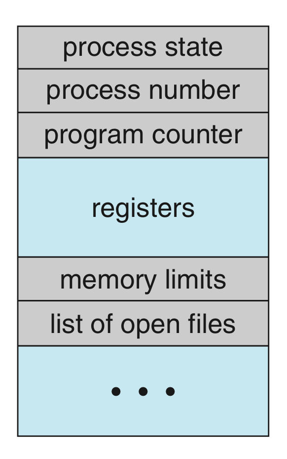
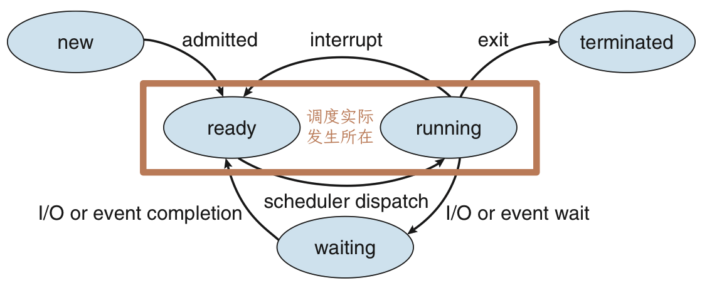

# Unit 1: 进程管理与同步 | Process Management and Synchronization [未完成]


## 进程

!!! info "小节导读"
    
    一段本质上程序是静态的、存储在硬盘上的指令数据，而当它附带运行程序所需要的必要信息进入内存，得到相关资源后，它成为一个动态的、与计算机资源互动的实体，这个实体就是**进程(process)**。

    进程是是操作系统进行资源分配和调度的一个**独立单位**，它以特定形式存在于内存中，具有一定的封闭性，是多道技术的重要基础。

### 进程的形式

前面我们提到，进程动态地存在于内存中，因此除了命令以外，还包括其运行时的动态信息。抽象来说，主要包含这三个维度：① 用来跑的代码；② 跑的过程中，不断会被更新的数据；③ 用来维护、控制进程的控制信息。

进程在内存中存在需要一块**虚拟的**地址空间以存储上述这些内容。其包含两个部分，即虚拟地址空间中的**用户部分**和虚拟地址空间的**内核部分**。

下图是进程在虚拟地址空间中用户部分的组成：

!!! section "用户部分"

    <center> { align=right width=35% } </center>

    - Text section:
        - 存储代码；
    - Data section:
        - 存储代码中的全局变量、静态变量；
    - Heap section:
        - 常说的“堆”，被动态分配的内存；
    - Stack section:
        - 常说的“栈”，存储一些暂时性的数据，如函数传参、返回值、局部变量等；

    可以发现，Text 和 Data 部分所需要的空间在一开始就被确定，而 Heap 和 Stack 都可能动态的扩展和收缩。观察右图，Heap 和 Stack 是相向扩展的，于是整一块的大小能够固定下来，而在内部进行有限制的动态分配。当然，Heap 和 Stack 的区域并不会交叉。

    ??? eg "memory layout of a C program"

        

        之所以把有初始值的静态变量和没初始值的静态变量分开来，是因为我们可以在一开始只存储没初始值的静态变量的大小，而在真正第一次访问的时候才分配内存，以此来实现减少内存占用。

        通常来说，未初始化的静态变量一般都被放在 `.bss` 段，而在被初始化的时候移动到 `.data` 段。[^1]

而放在内核部分的内容，则更侧重于进程的控制信息，具体来说就是**进程控制块(Process Control Block, PCB)**。

!!! section "内核部分"
    **进程控制块(Process Control Block, PCB)**是操作系统中用来描述进程的一种数据结构，它包含了进程的所有信息，是操作系统中最重要的数据结构之一。可以说，PCB 是进程存在的唯一标志。

    通常来说，PCB 可能包含这些内容：

    <center> { align=right width=35% } </center>

    - Process state:
        - [进程的状态](#进程的状态)；
    - Program counter:
        - 标识该进程跑到了哪里，由于进程是动态的，每一被切换都需要保证下一次能无缝衔接之前的进度，所以需要存储每次的工作状态；
    - CPU registers:
        - 保存进程相关的寄存器信息；
    - CPU-scheduling information:
        - CPU 调度参考的信息，包括优先级、调度队列的指针、调度参数等；
    - Memory-management information:
        - 包括页表、段表等信息，具体与实现的内存系统有关；
    - Accounting information：
        - 一些关于进程的动态数据的统计和记录，比如总共已经跑了多久、时间限制、进程号等；
    - I/O status information:
        - 被分配给进程的 I/O 设备列表、打开的文件列表等；

两个部分在逻辑上的关系是，用户部分划分并实际存储进程所需要的数据资源（包括程序运行的代码），而内核部分存储进程的元数据，包括控制信息与用户部分中各个部分内存的分配和使用情况。

### 进程的状态

在单机语境下，进程调度一个比较核心的部分就是将 CPU 资源给哪个任务用。而并不是任何进程在任何时刻都可以直接获得 CPU 资源并直接开始使用的，因此我们需要对进程的状态进行建模。

<center>  </center>

- `new`:
    - 进程正在创建过程中，包括申请 PCB，分配初始资源等；
- `running`:
    - 进程正在运行，即正在使用 CPU 资源；
    - 有几个核就**最多**有几个进程处于 `running` 状态；
- `ready`:
    - 进程已经准备好了，只差 CPU 资源，一旦有 CPU 资源待分配，就会有就绪态的进程变为运行态；
    - 如果有进程处于就绪态，就一定有进程处于运行态；
    - CPU 调度实际上指的就是若干进程在就绪态和运行态之间的切换；
- `waiting`:
    - 进程正在等待某个事件的发生，比如等待 I/O 完成、等待某个信号量等；
    - 此时即使有空余的 CPU 资源，该进程也无法继续；
    - 一般进程从运行态进入阻塞态是主动的，离开阻塞态进入就绪态是被动的；
- `terminated`:
    - 进程因为某些原因终止，结束运行，需要释放资源；

## 进程管理

现在我们已经讨论了进程的形式和一个个离散的状态，现在我们来讲讲进程在几个阶段的动态过程。


用户进程在操作系统中，总体上来讲遵循一个树状的组织形式，每一个进程都有一个唯一标识符进程号（通常被称为 pid，但在特定语境下可能有不同的含义）。如下图是 Linux 的一个进程树。


你也可以在 Linux 中使用 `pstree` 来查看进程树。
言下之意就是进程之间存在一种父子关系，即 child 进程是由 parent 进程创建的，因此进程除了自己的 `pid` 还有 `ppid` 来标识它的 parent 进程。

### 进程的创建

child 进程的资源可能直接来自操作系统的分配，也可能来自 parent 进程的分配，限制使用后者的好处是能够避免因为创建太多子进程而导致资源不够用。特别的，我们观察到这棵树的根是 `systemd`，历史上也曾叫过 `init`，它是操作系统启动后运行的第一个用户进程，至少在 Linux 中，它的 `pid` 被分配为 1，而它的 `ppid` 是 0，可以理解为这个进程的 parent 是 scheduler 而非一个进程[^2]。

在 Linux 中，我们可以使用 `fork` 来创建一个 child 进程，在这里先引入如何实现是为了引入一个可以借来描述过程的语言，我们以下面的 C 程序为例展开之后的讨论。

```c linenums="1" hl_lines="10 18"
#include <stdio.h>
#include <unistd.h>
#include <sys/wait.h>
#include <sys/types.h>

int main() {
    printf("A process starts!\n");

    pid_t pid;
    pid = fork();

    if (pid < 0) {
        printf("Fork failed!\n");
    } else if (pid == 0) {
        // sleep(1);
        printf("pid is zero, so it's child process!\n");
    } else {
        // wait(NULL);
        // sleep(1);
        printf("pid is nonzero thus it's parent process!\n");
    }
}
```

第 10 行高亮的 `fork()` 语句创建了一个进程，该进程只有进程号与 parent 进程不一样，同时通过检查返回值 `pid` 来判断属于 parent 还是 child。

如果第 18 行仍然被注释，那么 parent 进程诶 child 进程将并发执行，即完成 `fork()` 后两个进程都从 11 行开始继续向下并发的执行，互不阻塞；如果 18 行的注释被取消，那么 parent 进程将等待 child 进程结束后再继续。读者可以尝试排列组合两个注释来观察程序运行的结果会如何变化。

逻辑上创建的新进程有两种情况：

1. 复制 parent 进程的代码数据；
2. 载入新的程序并继续执行；

而实际在 Linux 中，第一种通过 `fork()` 实现，第二种通过 `fork()` 后 `execXX()` 实现，`execXX()` 会覆盖那个进程的地址空间，以实现执行其他程序。[^3] [^4]

### 进程的终止

当进程调用 `exit()` 这个系统调用时，这个进程将被终止，这意味着这个进程将不再执行，其资源将被释放，同时——返回状态值，而这个状态值将被 parent 进程的 `wait()` 接收。特别的，如果 parent 进程尚未调用 `wait()`，则这个 child 进程还不会完全消失，因为要返回的东西还没返回，这种逻辑上已经终止，但仍然占有一部分资源，等待 parent 进程调用 `wait()` 的进程，我们称之为**僵尸进程(zombie)**。一个进程变成僵尸进程是很普通的，关键在于，如果 parent 进程不调用 `wait()`，那等 parent 终止后，这个僵尸进程可能仍然一直存在，此时这个僵尸进程同时是一个**孤儿进程(orphan)**——即没有 parent 进程的进程，这显然是不合理的，UNIX 的解决办法是，让所有孤儿进程都成为 `init`/`systemd` 的 child 进程，由 `init`/`systemd` 来 `wait()` 它们。

在某些系统里，操作系统通过**级联终止(cascading termination)**来避免孤儿进程的出现，即当一个进程被终止时，它的 child 也应当被递归地终止。

??? extra "daemon"
    [守护进程](https://en.wikipedia.org/wiki/Daemon_(computing))是一种特殊的进程，它们在“后台”长期运行，例如某些数据库服务、反代理服务等，而非像普通的用户程序一样依赖于用户交互。

    为了实现“长期运行”，我们需要让它以 `init`/`systemd` 为 parent，因为任何其它进程都有可能在操作系统运行的时候终止。

    那么一种办法就是我们递归地 `fork()` 两次，然后终止第一个进程，即终止第二个进程的 parent，这样它就能成为一个孤儿进程，进而被 `init`/`systemd` 接管。

### 进程间通信


## 线程


## 进程同步与死锁


[^1]: [Where memory will be allocated to "Uninitialized Static variable" upon initialization?](hhttps://stackoverflow.com/a/35799639)
[^2]: [What process is the parent of the init process in Linux?](https://superuser.com/questions/731223/what-process-is-the-parent-of-the-init-process-in-linux/1331247#1331247)
[^3]: [Linux CreateProcess?](https://stackoverflow.com/a/5883503)
[^4]: [Differences between fork and exec?](https://stackoverflow.com/a/1653415)