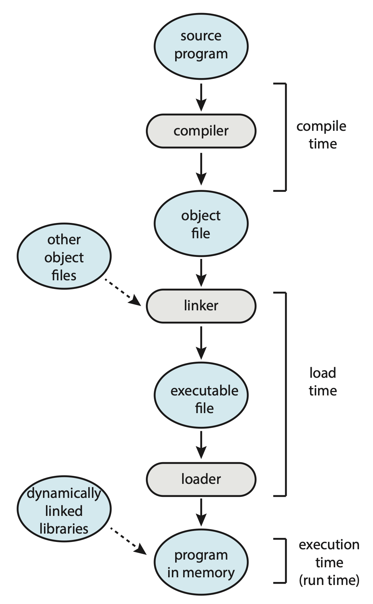
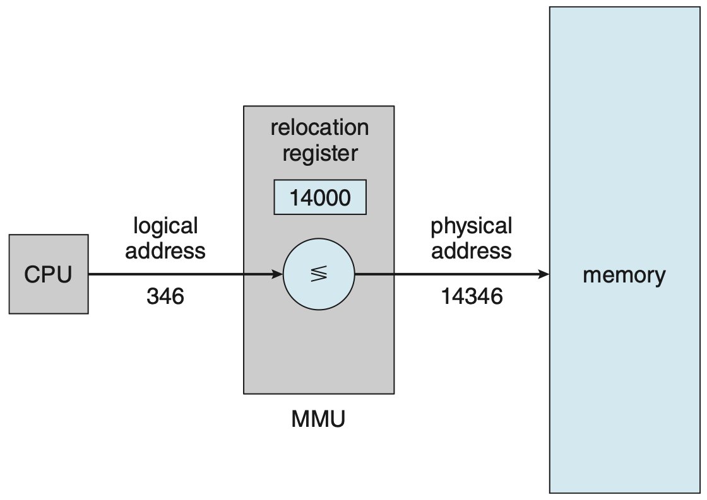

# U3 Part 1: 主存 | Main Memory [未完成]

!!! info "导读"

    内存是计算机中最重要的部件之一，在 Von Neumann 架构中，内存是程序和数据的载体，也是 CPU 访问数据的唯一途径（CPU 能够直接访问的存储结构一般只有寄存器和内存，而在我们引入缓存之前我们也假装缓存不存在）。

    而我们知道，内存 I/O 通常是比较慢的，如果再进一步对内存之外的存储设备做 I/O（内存毕竟也是有限的），则会更慢。因此，就像榨干 CPU 的性能一样，我们也要尽可能地利用好内存。

    除了性能，内存还需要实现一些保护措施，防止程序越界访问内存，或者程序之间互相干扰。

    同时，由于计算机运行程序是一个动态的过程，而我们使用内存往往需要的是连续的、大块的内存，所以在运行过程中如何保证内存的分布是相对完整的，也是一个重要的问题。
    
    本节，我们将以内存分配为主线，来介绍内存设计的发展。

## 基本设计

### 内存保护

每一个进程在内存中都应当有一块连续的内存空间，而单个进程应当只能访问自己的内存空间，而不能访问其他进程的内存空间。这就是内存保护的基本要求。

我们通过引入 base 和 limit 两个寄存器来实现框定进程的内存空间，当前进程的内存空间始于 base 寄存器中存储的地址，终于 base 寄存器和 limit 寄存器的和所对应的地址，即：

<figure markdown>

  

A base and a limit register define a logical address space. (left) 
Hardware address protection with base and limit registers. (right)
</figure>

两个特殊的寄存器只能由内核通过特定的特权指令来修改。而内存的保护，通过**内存管理单元(memory management unit, MMU)**来实现（后面会提到），MMU 会在每次访问内存时，检查访问的地址是否在 base 和 limit 寄存器所定义的范围内，如果不在，则会产生一个异常，中断程序的执行。

### 内存绑定

我们在[总览#链接器和装载器](./Unit0.md#链接器和装载器){target="_blank"}中提到过，静态的代码程序成为动态的进程，可能会需要经过这么几步：

<figure markdown>

 { width=50% } 

Multistep processing of a user program.
</figure>

具体来说有三个阶段：编译时间(compile time)，装载时间(load time)和执行时间(execution time)。而内存也分三种：符号地址(symbolic addresses)，可重定位地址(relocatable addresses)（类似于一种相对量）和绝对地址(absolute addresses)。

- 通常来说，在 compile time，compiler 会将代码中的 symbol 转为 relocatable addresses；而如果在 compile time 就知道了进程最终会被安置在何处，那么在 compile time 就将 symbol 转为 absolute addresses 也是可能的，只不过如果此时起始地址发生改变，就需要重新编译。
- 而一般在 load time，relocatable addresses 会转为 absolute addresses，当进程起始地址发生改变时，我们只需要重新装载即可。
- 如果进程在 execution time 时，允许被移动，那么可能从 relocatable addresses 转为 absolute addresses 这一步就需要延迟到 execution time 来执行。

### 动态装载

由于引入了多道技术，操作系统的内存中可能同时存在多个进程。为了避免对内存的过量使用，我们引入**动态装载(dynamic loading)**机制。

动态装载指的是，如果一个例程还没有被调用，那么它会以**可重定位装载格式(relocatable load format)**存储在磁盘上；当它被调用时，就动态地被装载到内存中。即，例程只有在需要的时候才被载入内存。对于大量但不经常需要访问的代码片段（例如错误处理代码），这种方式可以节省大量的内存空间。

需要注意的是，动态装载并不需要操作系统的支持，而是由开发者来负责实现。

### 动态链接和共享库

我们在[总览#链接器和装载器](./Unit0.md#链接器和装载器){target="_blank"}中已经谈论过动态链接了。而能被动态链接的库就被称为**动态链接库(dynamically linked libraries, DDLs)**，由于它们可以被多个进程共享，所以也被称为**共享库(shared libraries)**。DDLs 

区别于动态装载，动态链接需要操作系统的支持。

### 物理内存和逻辑内存

为了让内存具有更强的灵活性，我们区分内存的**物理地址(physical address)**和**逻辑地址(logical address)**，后者也叫**虚拟地址(virtual address)**。

物理地址实际在内存设备中进行内存寻址，主要反应内存在硬件实现上的属性；而 CPU 所使用的一般指的是虚拟内存，主要反应内存在逻辑上的属性。物理地址和逻辑地址存在映射关系，而实现从逻辑地址到物理地址的映射的硬件，是**内存管理单元(memory management unit, MMU)**，除了是实现逻辑->物理的映射外，MMU 还负责内存访问的[保护](#内存保护){target="_blank"}。

<figure markdown>

 { width=90% } 

Dynamic relocation using a relocation register.
</figure>

物理内存和逻辑内存的区分让使得用户程序不再需要（也不被允许）关注实际的物理内存。

### 连续分配及其问题

包括操作系统本身，内存中能存下多少东西，决定了操作系统能同时运行多少进程。而进程需要的内存需要是连续的，而内存的分配于释放又是个动态的过程，所以我们需要想一个办法高效地利用内存空间。

通常来说，主存会别划分为用户空间和内核空间两个部分，后者用于运行操作系统软件。主流操作系统倾向于将高地址划为给操作系统，所以我们此处的语境也依照主流设计。

在连续内存分配(contiguous memory allocation)问题中，我们认为所有进程都被囊括在一段完整的内存中。而在内存分配的动态过程中，整个内存中空闲的部分将有可能被分配给索取内存的进程，而被分配的内存在释放之前都不能被分配给其它进程。在进程执行完毕后，内存会被释放，切我们对于进程何时释放内存不做假设。

最简单的是一种可变划分(variable partition)的设计，即不对内存中的划分方式做约束，只要是空闲且足够大的连续内存区域都可以被分配。但我们可以想象，在内存被动态使用的过程中，原本完整的内存可能变得支离破碎。如果我们记一块连续的空闲内存为一个 hole，则原先可能只有一个 hole，而在长时间的运行后，内存中可能存在大量较小的，难以利用的 holes。这就是**外部碎片(external fragmentation)**，在最坏的情况下，每个非空闲的内存划分之间都可能有一块不大不小的 hole，而这些 hole 单独来看可能无法利用，但其总和可能并不小，这是个非常严重的问题。

<figure markdown>

  

Variable partition. 1 hole to 2 holes.
</figure>

但是显然我们不能频繁地要求操作系统去重新整理内存，所以我们需要想办法来减少外部碎片的产生。我们考虑三种分配策略：

- First Fit
- Best Fit
- Worst Fit

关于这三个是什么，可以参考[这篇 ADS 笔记](../D2CX_AdvancedDataStructure/Lec11#online-first-fit-ff.md){target="_blank"}。

实验结果表明，FF 和 BF 的速度都比 WF 快，但通常 FF 会更快一些；而看内存的利用效率，两者则没有明显的区别，但是 FF 和 BF 都深受外部碎片之害。

## 分页技术

### 基本设计

### 硬件支持

### 共享页

### 页保护

## 页表设计

### 分层页表

### 哈希页表

### 反转页表

## 交换技术