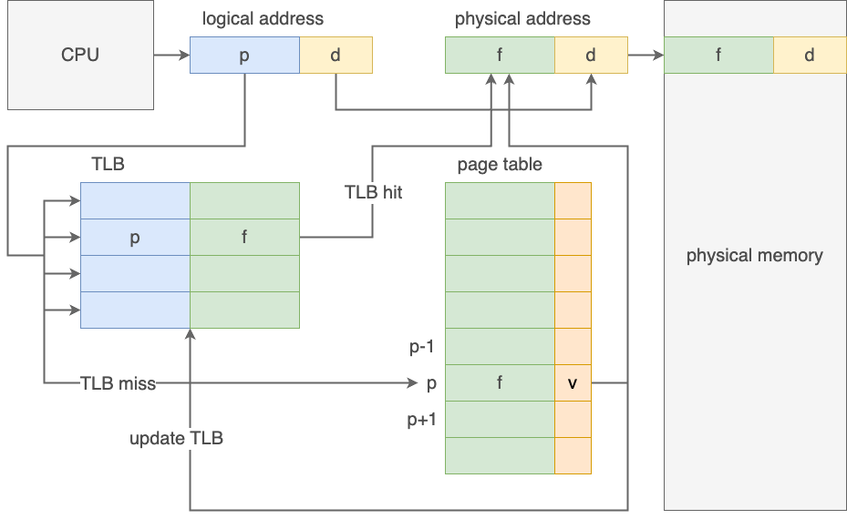

# U3 Part 1: 主存 | Main Memory [未完成]

!!! info "导读"

    内存是计算机中最重要的部件之一，在 Von Neumann 架构中，内存是程序和数据的载体，也是 CPU 访问数据的唯一途径（CPU 能够直接访问的存储结构一般只有寄存器和内存，而在我们引入缓存之前我们也假装缓存不存在）。

    而我们知道，内存 I/O 通常是比较慢的，如果再进一步对内存之外的存储设备做 I/O（内存毕竟也是有限的），则会更慢。因此，就像榨干 CPU 的性能一样，我们也要尽可能地利用好内存。

    除了性能，内存还需要实现一些保护措施，防止程序越界访问内存，或者程序之间互相干扰。

    同时，由于计算机运行程序是一个动态的过程，而我们使用内存往往需要的是连续的、大块的内存，所以在运行过程中如何保证内存的分布是相对完整的，也是一个重要的问题。
    
    本节，我们将以内存分配为主线，来介绍内存设计的发展。

## 基本设计

### 内存保护

每一个进程在内存中都应当有一块连续的内存空间，而单个进程应当只能访问自己的内存空间，而不能访问其他进程的内存空间。这就是内存保护的基本要求。

我们通过引入 base 和 limit 两个寄存器来实现框定进程的内存空间，当前进程的内存空间始于 base 寄存器中存储的地址，终于 base 寄存器和 limit 寄存器的和所对应的地址，即：

<figure markdown>
<center>  </center>
A base and a limit register define a logical address space. (left)<br/>
Hardware address protection with base and limit registers. (right)
</figure>

两个特殊的寄存器只能由内核通过特定的特权指令来修改。而内存的保护，通过**内存管理单元(memory management unit, MMU)**来实现（后面会提到），MMU 会在每次访问内存时，检查访问的地址是否在 base 和 limit 寄存器所定义的范围内，如果不在，则会产生一个异常，中断程序的执行。

### 内存绑定

我们在[总览#链接器和装载器](./Unit0.md#链接器和装载器){target="_blank"}中提到过，静态的代码程序成为动态的进程，可能会需要经过这么几步：

<figure markdown>
<center> { width=50% } </center>
Multistep processing of a user program.
</figure>

具体来说有三个阶段：编译时间(compile time)，装载时间(load time)和执行时间(execution time)。而内存也分三种：符号地址(symbolic addresses)，可重定位地址(relocatable addresses)（类似于一种相对量）和绝对地址(absolute addresses)。

- 通常来说，在 compile time，compiler 会将代码中的 symbol 转为 relocatable addresses；而如果在 compile time 就知道了进程最终会被安置在何处，那么在 compile time 就将 symbol 转为 absolute addresses 也是可能的，只不过如果此时起始地址发生改变，就需要重新编译。
- 而一般在 load time，relocatable addresses 会转为 absolute addresses，当进程起始地址发生改变时，我们只需要重新装载即可。
- 如果进程在 execution time 时，允许被移动，那么可能从 relocatable addresses 转为 absolute addresses 这一步就需要延迟到 execution time 来执行。

### 动态装载

由于引入了多道技术，操作系统的内存中可能同时存在多个进程。为了避免对内存的过量使用，我们引入**动态装载(dynamic loading)**机制。

动态装载指的是，如果一个例程还没有被调用，那么它会以**可重定位装载格式(relocatable load format)**存储在磁盘上；当它被调用时，就动态地被装载到内存中。即，例程只有在需要的时候才被载入内存。对于大量但不经常需要访问的代码片段（例如错误处理代码），这种方式可以节省大量的内存空间。

需要注意的是，动态装载并不需要操作系统的支持，而是由开发者来负责实现。

### 动态链接和共享库

我们在[总览#链接器和装载器](./Unit0.md#链接器和装载器){target="_blank"}中已经谈论过动态链接了。而能被动态链接的库就被称为**动态链接库(dynamically linked libraries, DDLs)**，由于它们可以被多个进程共享，所以也被称为**共享库(shared libraries)**。DDLs 

区别于动态装载，动态链接需要操作系统的支持。

### 连续分配及其问题

包括操作系统本身，内存中能存下多少东西，决定了操作系统能同时运行多少进程。而进程需要的内存需要是连续的，而内存的分配于释放又是个动态的过程，所以我们需要想一个办法高效地利用内存空间。

<a id="why-continuous"/>

!!! question "为什么进程所需要的内存是连续的？"

    请读者思考，为什么装载进程所需要的内存需要是完整、连续的，而不能是东一块而西一块的呢？
    
    或者说，如果你认为它可以不连续，为了实现让它能正常运作，你可能需要哪些措施呢？你的设计相比使用朴素的连续内存分配，有什么优势和劣势呢？

    ??? success "提示"

        Von Neumann 架构中，CPU 和内存是如何互动，从而实现其功能的？关注取指过程和汇编中的地址操作！

        - 参考阅读：[Why does memory necessarily have to be contiguous? If it weren't, wouldn't this solve the issue of memory fragmentation?](https://stackoverflow.com/questions/73197597/why-does-memory-necessarily-have-to-be-contiguous-if-it-werent-wouldnt-this){target="_blank"}

通常来说，主存会别划分为用户空间和内核空间两个部分，后者用于运行操作系统软件。主流操作系统倾向于将高地址划为给操作系统，所以我们此处的语境也依照主流设计。

在连续内存分配(contiguous memory allocation)问题中，我们认为所有进程都被囊括在一段完整的内存中。而在内存分配的动态过程中，整个内存中空闲的部分将有可能被分配给索取内存的进程，而被分配的内存在释放之前都不能被分配给其它进程。在进程执行完毕后，内存会被释放，切我们对于进程何时释放内存不做假设。

最简单的是一种可变划分(variable partition)的设计，即不对内存中的划分方式做约束，只要是空闲且足够大的连续内存区域都可以被分配。但我们可以想象，在内存被动态使用的过程中，原本完整的内存可能变得支离破碎。如果我们记一块连续的空闲内存为一个 hole，则原先可能只有一个 hole，而在长时间的运行后，内存中可能存在大量较小的，难以利用的 holes。这就是**外部碎片(external fragmentation)**，在最坏的情况下，每个非空闲的内存划分之间都可能有一块不大不小的 hole，而这些 hole 单独来看可能无法利用，但其总和可能并不小，这是个非常严重的问题。

<figure markdown>
<center>  </center>
Variable partition. 1 hole to 2 holes.
</figure>

但是显然我们不能频繁地要求操作系统去重新整理内存，所以我们需要想办法来减少外部碎片的产生。我们考虑三种分配策略：

- First Fit
- Best Fit
- Worst Fit

关于这三个是什么，可以参考[这篇 ADS 笔记](../D2CX_AdvancedDataStructure/Lec11#online-first-fit-ff.md){target="_blank"}。

实验结果表明，FF 和 BF 的速度都比 WF 快，但通常 FF 会更快一些；而看内存的利用效率，两者则没有明显的区别，但是 FF 和 BF 都深受外部碎片之害。

除了 variable partition 的设计以外，还有一些别的设计，读者可以通过[这篇文章](https://houbb.github.io/2020/10/04/os-08-memory-malloc#%E5%86%85%E5%AD%98%E8%BF%9E%E7%BB%AD%E5%88%86%E9%85%8D%E7%AE%A1%E7%90%86%E6%96%B9%E5%BC%8F){target="_blank"}的前半部分来做一些了解。

### 物理地址和逻辑地址

为了让内存具有更强的灵活性，我们区分内存的**物理地址(physical address)**和**逻辑地址(logical address)**，后者也叫**虚拟地址(virtual address)**。

物理地址实际在内存设备中进行内存寻址，主要反应内存在硬件实现上的属性；而 CPU 所使用的一般指的是虚拟内存，主要反应内存在逻辑上的属性。物理地址和逻辑地址存在映射关系，而实现从逻辑地址到物理地址的映射的硬件，是**内存管理单元(memory management unit, MMU)**，除了是实现逻辑->物理的映射外，MMU 还负责内存访问的[保护](#内存保护){target="_blank"}。

<figure markdown>
<center> { width=90% } </center>
Dynamic relocation using a relocation register.
</figure>

物理地址和逻辑地址的区分让使得用户程序不再需要（也不被允许）关注物理地址。此外，通过利用逻辑地址和物理地址的灵活映射，我们可以通过分页来实现良好的内存管理。

!!! tip "头脑风暴"
    
    请读者尝试设想，利用逻辑地址和物理地址的映射关系，我们能做到哪些事？
    
    几个提示：⓵ 考虑“映射”分为哪几种，⓶ 考虑如何实现地址连续。

## 分页技术

分页技术想要解决的问题是减轻进程“必须要使用连续内存”这一限制。我们在[前面的思考题](#why-continuous){target="_blank"}中已经提到，需要使用连续内存是一种逻辑上的连续，因此，在[物理地址和逻辑地址](#物理地址和逻辑地址){target="_blank"}的语境下，我们只需要保证逻辑地址是连续的即可。当然，这并不意味着物理地址的连续就是毫无意义的了，物理地址的连续是实际上提供高效内存访问的基础。

### 基本设计

换句话来说，我们不再严格需要物理地址也是完整的、大块的、完全连续的了。听起来 externel fragmentation 的问题就解决了，好像我们只需要每次从里面慢慢捡垃圾，凑出一整块就行了——嘿！想的有点太美了！虽然逻辑上物理地址不需要连续，但过于稀碎的物理地址会导致内存访问缓慢，捡垃圾凑出来的虚拟内存块也像
垃圾一样食之无味。

#### 帧 & 页

因此，我们将两者的优点合并，我们将物理内存划分为固定大小的块，称为**帧(frames)**（类似于 fixed partition），每个帧对应虚拟地址中等大的一块**页(pages)**，用这些帧来作为连续的虚拟地址的物理基础，用虚拟的页号来支持连续逻辑地址（马上就会细说），这样保证了在一定限度内页分配的自由度，利用了虚拟地址的灵活性；又保证了内存相对来说还是成块连续的，提供了物理地址连续的高效性。而帧与页的对应关系，是通过**页表(page table)**来实现的，在页表中，实际上是一个以页号为索引的帧号数组，按照页号顺序排列，因此，页号就是对应的表项在数列中的位次。

显然，每个进程各自维护自己的页表更加合理，所以**每一个进程应当都有自己的页表**，即我们称页表是 per-process data structures。

!!! tip "头脑风暴"

    由于帧和页的大小是固定的，所以虽然理论上我们需要的是每一帧的首地址，但所谓的“首地址”实际上是 $m * FrameSize$，因此，只需要用 $m$ 就可以了（就像数组的 random access）。

    现在，请读者思考，当 $FrameSize = 2^k$ 时，会有怎样良好的性质？考虑地址的二进制表示！

<figure markdown>
<center> { width=50% } </center>
Paging model of logical and physical memory.<br/>
以 page table 中的第一项为例：<font color="blue">0</font>:<font color="green">5</font> 表示虚拟地址中的第 <font color="blue">0</font> 页对应物理地址中的第 <font color="green">5</font> 帧。
</figure>

#### 分页下虚拟地址的结构

我们来看虚拟地址是如何在连续性上发挥作用的：一个程序载入内存可能需要多个页，这些页按顺序被分配了**页号(page number)**，实际使用的地址会落在某一页中，就通过 page number 进行索引。而由于一页中包含一大块内存（page size 常常取 4KB），而我们所需要寻的址总是其中的一个 Byte，所以我们需要一个**页内偏移(page offset)**来索引我们所需要的地址在页中的位置，对于 page size 为 4KB 的页，page offset 需要有 $\log_2{4096} = 12$ 位。

因此，实际在 paging 逻辑中，一个虚拟地址的可以被分为两个部分：

```
┌───────────────┬──────────────┐
│page number    │page offset   │
└───────────────┴──────────────┘
 p: m-n bits     d: n bits
```

显然，由于帧和页是一体两面、一一对应的，所以单个页内的连续内存页对应帧上的连续内存。使用 page offset 来标识页内地址，实际就得到了目标物理地址相对于帧中起始地址的偏移量。而对于页间的地址，假设页末地址是：

```
┌───────────────┬──────────────┐
│page number    │11111111111111│
└───────────────┴──────────────┘
 p: m-n bits     d: n bits
```

由于逻辑地址表现上还是个正常的二进制数，所以其下一个地址就是：

```
┌───────────────┬──────────────┐
│page number + 1│00000000000000│
└───────────────┴──────────────┘
 p: m-n bits     d: n bits
```

而其含义就是下一张页表的 0 号位。而我们知道，相邻页对应的帧不一定是连续的，但这个不连续的性质对逻辑地址是透明的。

#### 总体梳理

稍微对上面的内容做一下总结，我们拥有了**物理的帧**与**逻辑的页**的映射关系，这个映射关系存在**页表**里，实现逻辑上连续、物理上离散的内存**块**索引；而利用 page number + offset 的结构定位了内存块中的具体地址，其中 offset 在帧和页中都表示对于块首地址的偏移，因此可以直接迁移使用。

因此，从虚拟地址到物理地址的映射，实际上就是在页表中查询虚拟地址中的 page number，将其换为 frame number，再直接拼接 offset 就行了。

<center> {width=80%} </center>

> 实际上这是个非常自然的过程：整体地看虚拟地址，就是直接在连续的虚拟内存中找到对应的 Byte；整体地看物理地址，同样也是直接在连续的物理内存中找到对应的 Byte。现在通过置换二进制地址字符串的前缀，实现了一个寻址空间的映射。而这个映射中，表示 offset 的后缀不变，正对应着页和帧中偏移寻址规则的统一。

!!! warning "Protection"

    请注意，使用过程中有些页可能尚未与实际的帧建立映射关系，换句话来说是不可用的。所以我们需要一个手段来标识表项是否有效，于是在页表中引入 valid bit，用来标识页是否有效，如果试图访问 invalid 的地址，则会出现异常，以此实现了 protection。

    <center> {width=80%} </center>

!!! tip "page size 的选择"

    容易理解，page size 较大时，页表项更少，而页更容易被浪费，但对于磁盘来说，单次大量的传输效率更高；page size 较小时，页表项更多，需要更多内存和时间来处理页表，所以具体 page size 的大小要具体问题具体分析、与时俱进。

### 硬件支持

!!! info "导读"

    本节侧重于从硬件实现的角度来看分页技术。

我们前面说过，页表是 per-process data structures，所以页表应当作为一个进程的元信息被维护。显然我们不能直接用大量寄存器来维护页表（理论上很快，但是太贵、设计上也不现实），所以页表实际上应当被放在<u>内存</u>中（进一步的，为了保证效率，我们将页表放在主存中），我们通过用寄存器维护一个指向页表的指针来维护页表，这个特殊的寄存器被称为**页表基址寄存器(page-table base register, PTBR)**，在 [context switch](./Unit1.md#context-switch){target="_blank"} 的过程中，我们也应当对 PTBR 进行交换。

!!! question "嘿！可是内存真的好慢！"
    不仅如此，由于地址映射的实现逻辑，我们首先需要利用页表查询帧号，利用帧号去得到物理地址，再去内存里做查询，这里有足足两次内存访问操作！

    不仅如此，你可能还需要遍历整个页表来达到你的目的！

为了解决这个问题，我们引用计组里学到的八大思想之 make common case fast！引入一个缓存来加速页表的维护：**页表缓存(translation look-aside buffer, TLB)**，它实际上是 MMU 的一部分[^1]，页号和帧号以键值对的形式存储在 TLB 中。除了访问速度快以外，TLB 允许并行地查询所有键值对，这意味着你不再需要一个一个遍历页表中的内容了！从效率上来说，现代的 TLB 已经能够在一个流水线节拍中完成查询操作。

但是这么厉害的东西肯定还是有局限性的，TLB 一般都比较小，往往只能支持 32 - 1024 个表项。而且，作为一个“缓存”，它有可能产生 miss（即没在 TLB 中找到待查的页号），当 TLB miss 出现的时候，就需要访问放在内存中的页表，并做朴素的查询。同时，按照一定策略（如 LRU、round-robin to random 等[^2]）将当前查询的键值对更新到 TLB 中。

<center> {width=80%} </center>

此外，TLB 允许特定的表项被线固(wired down)，<u>被线固的表项不再允许被替换</u>。（~~这个中文是我自己才华横溢出来的，请不要到处用容易被当没见识。~~）

!!! warning "注意"
    
    但是需要注意，页表是 per-process data structures，但 TLB 并不是 per-process hardware。

而正是因为这个性质，所以在 context switch 的时候，需要清空 TLB，否则下一个进程就会访问到上一个进程的页表。还有一种设计是，不需要每次都清空 TLB，而是在 TLB 的表项中加入一个**地址空间标识符(address-space identifier, ASIDs)**字段。在查询页号时，也比较 ASID，只有 ASID 一致才算匹配成功。

<center> {width=80%} </center>

!!! section "定量分析"

    我们使用**击中比例(hit ratio)**来描述我们在 TLB 中成功找到我们需要的页帧键值对的概率，那么假设访问一次内存需要 $t \text{nanoseconds}$，那么使用该 TLB 的**有效内存访问时间(effective memory-access time)**为：

    $$
    \begin{aligned}
        &\text{effective memory-access time} \\
        &= \underbrace{\text{hit ratio} \times \text{memory-access} }_\text{TLB hit}
         +  \underbrace{(1 - \text{hit ratio}) \times 2 \times \text{memory-access}}_\text{TLB miss} \\
        &= p_{\text{hit}} \times t + (1 - p_{\text{hit}}) \times 2t \\
        &= (2 - p_{\text{hit}})t
    \end{aligned} 
    $$

    > 在现代计算机中，TLB 的结构可能会更加复杂（可能有更多层），所以实际的计算可能比上述更加复杂。

### 共享页

逻辑地址与物理地址的映射并非需要是单射，换句话来说，多个页可以对应同一个帧，这就是**共享页(shared page)**。共享页可以用来提高代码重用率，例如，多个进程可能会使用同一个库，那么这个库就可以被共享，而不需要每个进程都各自在物理内存中准备一份。[共享库](#动态链接和共享库){target="_blank"}就通常是使用共享页来实现的。

再比如，我们在[进程管理#进程间通信](./Unit1.md#进程间通信){target="_blank"}中提到过通过共享内存来实现进程间通信，在某些操作系统中，共享内存就是通过共享页来实现的。

## 更多页表设计

### 分层页表

### 哈希页表

### 反转页表

## 交换技术


[^1]: [Translation lookaside buffer | Wikipedia](https://en.wikipedia.org/wiki/Translation_lookaside_buffer){target="_blank"}
[^2]: [Cache replacement policies](https://en.wikipedia.org/wiki/Cache_replacement_policies){target="_blank"}