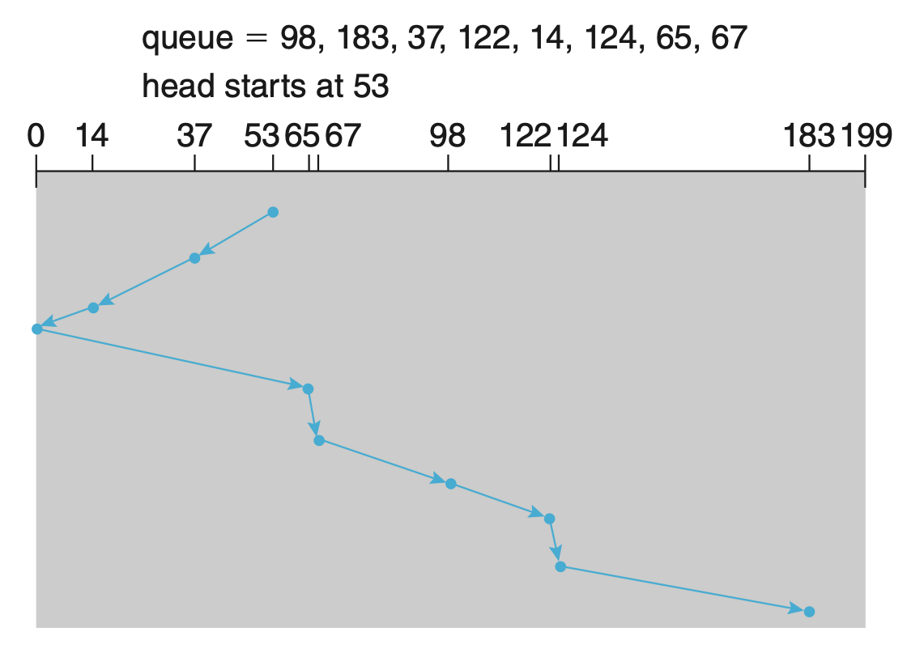

# U4 Part 1: 大容量存储管理 | Mass-Storage Management

!!! info "导读"

    现代计算机的二级存储主要由硬盘驱动(hard disk devices, HDDs)和非易失性内存(nonvolatile memory, NVM)提供。

## 硬盘

### 结构

硬盘(hard disk, HD)是常见的二级存储，其结构按照从小到大分为：扇区(sectors)、磁道(tracks)、柱面(cylinders)，侧面的磁臂(disk arm)会以整体移动上面的所有读写磁头(r/w heads)。

<figure markdown>

 { width=80% } 

HDD moving-head disk mechanism.
</figure>

从硬盘上读写内容的过程如下：

!!! section "steps"

    1. 磁头移动到指定的柱面；
    2. 磁头移动到指定的磁道；
    3. 磁盘旋转到扇区位于磁头下方；
    4. 读写扇区内容；

按照其机械过程，disk I/O 操作的主要时间构成为：

!!! section "components"

    - 定位时间(positioning time / random-access time)：
        - 寻道时间(seek time)：磁头移动到指定柱面的时间；
        - 旋转时延(rotational latency)：目标扇区旋转到磁头下方的时间；
            - 取决于磁盘的转速，一般以 round per minute(rpm) 表示，容易得到，平均旋转时延为 $\frac{1}{2} \cdot \frac{1}{rpm} \cdot 60$ 秒；
    - 传输时间(transfer time)：数据在 disk 和　memory 之间传输的时间；

因此，disk 的平均 I/O 操作时间为：

$$
\begin{aligned}
    \text{Average I/O time} 
    &= \underbrace{\text{average seek time} + \text{rotational latency}}_\text{average access time} \\
    &+ \underbrace{\frac{\text{data to transfer}}{\text{transfer rate}}}_{\text{transfer time}} \\
    &+ \text{controller overhead}
\end{aligned}
$$

???+ eg "🌰"

    > 给出一个包含具体参数的例子来感受 I/O 操作慢在哪里

    一个 7200 rpm 的硬盘（所以旋转时延为 4.17 ms），其平均寻道时间为 5 ms，传输速率为 1 Gb/sec，控制器开销为 0.1 ms，那么读取 4 KB 的数据对应的平均 I/O 操作时间为：

    $$
    5 \text{ms} + 4.17 \text{ms} + \frac{4 \times 1000 \times 8}{1 \times 1000 \times 1000 \times 1000} \text{sec} + 0.1 \text{ms} = 9.302 \text{ms}
    $$

根据上面的分析我们不难得到如下结论：

!!! note "conclusion"

    1. 开销的大头是 access time；
    2. 请求涉及的内存距离越远，具体的 access time 越大；
    3. 我们在不考虑更新硬件能力的情况下，要想降低 I/O 时间，就需要让 I/O 操作的对象尽可能“顺序”；

因此，我们提出 disk scheduling。

### 调度

在开始之前，引入一个度量量：disk bandwidth = 传输数据量 / 请求开始到传输完成的时间间隔。我们想提高 I/O 性能，实际上是想提升 disk bandwidth。

在 I/O 请求十分稀疏的时候，I/O 操作总是空闲，每当出现一个 I/O 请求我们就直接处理，处理过程中也没有其它 I/O 请求出现，此时我们没有办法来加速这个过程。但当 I/O 请求比较密集，我们需要用一个 queue 来维护等待中的请求，此时，我们可以通过 disk scheduling 来调整这些请求被处理的顺序，来提高 disk bandwidth。而 disk scheduling 在这个 queue 存在的情况下才有意义。

> 每一个 I/O 请求可能包括这些信息：⓵ 输入还是输出；⓶ 指代目标文件的文件句柄；⓷ 传输涉及的内存地址；⓸ 传输的数据量……

如今的 disk driver 不在对操作系统暴露操作的 tracks、sectors 等，而是提供与物理地址相关的 logical block address(LBA)，而 logical block 是数据传输的最小单元。虽然不完全等价，但是我们在讨论 disk scheduling 的时候可以认为 LBA 的局部性和顺序性与物理地址的局部性和顺序性是一致的。

#### FCFS

又见 FCFS，仍然一样，先进 queue 的先处理，是最基本的 disk scheduling 算法。由于没有对数据做任何调整，所以也并没有任何优化。

#### SSTF

SSTF 即 shortest seek time first，由于 seek time 基本和物理地址距离正相关，所以就是总是选择距离当前磁头最近的那个请求去处理。

!!! warning "不同于之前提到过的 short xxx first 算法，SSTF 并不是理论最优方案！"

!!! advice "Advantages"

    - 低平均响应时间；
    - 高吞吐量；

!!! not-advice "Disadvantages"

    - 响应时间方差较大；
    - 存在饥饿问题（上面那个问题的极端情况）；
    - 计算 seek time 需要额外开销；

#### SCAN & LOCK

SCAN 算法下磁头在碰到 LBA 边界前只会单向移动，而在移动过程中处理能够处理的请求。这样保证了处理请求的过程中总是顺序的。

<figure markdown>

 { width=80% } 

SCAN disk scheduling.
</figure>

!!! advice "Advantages"

    - 高吞吐量；
    - 响应时间方差低（更均匀地响应）；
    - 平均响应时间低；

!!! not-advice "Disadvantages"

    - 由于移动单向，所以如果请求发生在磁头刚刚经过的地方，那么可能会需要等待较长时间才会被响应；

如果我们不走到底，而是走到最靠近边界的请求对应的 LBA 就提前掉头，那么就是 LOCK 算法。显而易见的，LOCK 算法可以减少一些不必要的 SCAN。

#### C-SCAN & C-LOCK

C-SCAN 即 Circular SCAN，C-SCAN 与 SCAN 的唯一区别是，C-SCAN 的磁头移动是始终单向的，当磁头达到 LBA 的边界时，径直返回到另一端，回程中不响应任何请求，类似于“[首尾相撞](https://www.xiaoyuzhoufm.com/podcast/6291be6c5cf4a5ad60ca0cc5){target="_blank"}”了，所以才叫 “circular”。

<figure markdown>

 { width=80% } 

C-SCAN disk scheduling.
</figure>

!!! advice "Advantages"
    
    - C-SCAN 相比 SCAN 有更均匀的等待时间；

类似的，如果我们不走到底，在处理完最靠近边界的请求后就直接返回；对应的，在返程的时候不是返回到最低 LBA，而是从最靠近边界的请求开始，那么就是 C-LOCK 算法。同样，C-LOCK 可以减少一些不必要的 C-SCAN。

#### 调度算法的选择

Disk scheduling 应当被设计为一个可替换的模块，这样我们可以根据不同的应用场景选择不同的算法。通常，[SSTF](#sstf){target="_blank"} 是比较常见的默认选择；而当 I/O 较为频繁的时候，一般使用 [LOCK](#scan--lock){target="_blank"} 或者 [C-LOCK](#c-scan--c-lock){target="_blank"}。

> 表现本身依赖于请求的模式，而请求本身又依赖于文件分配策略。文件系统如果注重空间局部性，能够提供很好的表现提升。——[xyx 的笔记](https://xuan-insr.github.io/%E6%A0%B8%E5%BF%83%E7%9F%A5%E8%AF%86/os/V_storage_management/11_mass_storage/#1126-selecting-disk-scheduling-algorithm){target="_blank"}

## 非易失性内存

虽然存在其它设计，但是并不常见，所以我们只讨论基于 flash NAND die semiconductor 的 NVM。如果是 disk-like 的 NVM 设备，通常被称作固态硬盘(solid-state disk, SSD)；又或者是以 USB drive 的形式被使用。

由于 NVM 的工作机制是电子的而非机械的，可以想象，NVM 并没有 seek time 和 rotational latency，所以相比 HDDs 更加可靠，更加快速，更加小巧，功耗也更低。不过对应的，NVM 也更加昂贵，不过随着技术的发展，这一劣势也在逐渐被填补。由于这些性质，NVM 也通常以 cache tier 的形式被使用。

同时，由于 NVM 本身的读写效率较高，所以吞吐量的瓶颈可能反而在标准总线接口(standard bus interface)的传输速率上。所以，NVM 通常会直接连到系统总线(system bus)，例如 PCIe^[Wiki](https://en.wikipedia.org/wiki/PCI_Express){target="_blank"}^。

因为 NAND semiconductor 的性质，NVM 的和 HDDs 在使用逻辑上有所不同：

1. 虽然 NVM 支持以 page 的粒度（比 block 更小）进行读写，但并不支持“数据覆盖”，即必须先擦除数据才能写入数据，而擦除的开销相比读写又要大一些。
2. 不过，由于 NVM 由若干个 die 组成，所以可以并行地进行读写，这样就可以提高吞吐量。
3. 此外，NAND semiconductor 在进行一定量的擦除操作之后就不再能存储数据，因此存在使用寿命。

所以，NVM 的读写控制算法应当与 HDDs 有所不同，不过这通常由 NVM controller 负责，与操作系统无关，所以我们不做讨论。

## 存储介质管理

### 格式化 & 分区 & 分卷

崭新的存储设备在被使用之前需要经过低级格式化(low-level formatting or physical formatting)，以将其分为控制器可以读写的扇区，创建逻辑块的映射，以及创建闪存转换层(flash translation layer, FTL)^[Wiki](https://zh.wikipedia.org/wiki/%E5%BF%AB%E9%96%83%E8%A8%98%E6%86%B6%E9%AB%94%E8%BD%89%E6%8F%9B%E5%B1%A4){target="_blank"}^。具体来说，低级格式化的时候会为 sectors 或 pages 维护一些数据结构信息，将数据包装为 header + data + tail 的形式。通常 header 和 tail 中会存储一些元信息，例如扇/页号和校验/纠错码。一个扇区的大小有若干可选的值，通常是 512 B 或 4 KB，由于扇区数量与 header & tail 占用的空间正相关，所以扇区越大一般意味着用户可用空间越大。

在完成低级格式化后，设备实现了自身的结构化管理，但为了能让操作系统使用，还需要在设备上记录一些操作系统所需要的数据结构（~~染上操作系统的颜色~~）。这个过程大致分为三步：

!!! section "steps"

    1. **分区(partitioning)**：将设备的存储空间做划分，每一个都被视为一个单独的存储空间（即一个 logical disk）。分区信息会以固定的格式被写入存储设备的固定位置。
    2. **卷创建与卷管理(volume creating & management)**：卷(volume)是包含一个文件系统(file system)的存储空间[^1]，这一步主要是对下一步做准备，划定文件系统所覆盖的范围。如果直接在一个分区里安装文件系统，那其实这一步已经被隐式地完成；但如果使用比如 [RAID](#RAID){target="_blank"} 技术，就需要显示地做这一步。
    3. **逻辑格式化(logical formatting)**：在卷上创建和初始化文件系统。

    > 同时，如果当前分区包含 OS 镜像，则需要对应初始化引导块(boot sector)。

!!! extra "raw disK"

    一些操作系统允许部分特殊程序绕过文件系统，直接使用一大块连续的逻辑块，这种不包含文件系统数据结构的存储空间被称为 raw disk，对这种存储空间的访问被称为 raw I/O，对 raw disk 的操作一般更高效也更精确，它可以被用来实现 [swap 空间](./Unit3-Part1.md#swap-空间){target="_blank"}，或者是用来存储数据库的数据文件。

### 坏块

前面已经提到 NVM 有使用寿命；以及虽然我们没说，但是 HDDs 的机械结构也必然带来不小的硬件损耗。所以，实际的存储设备中不可避免的会出现由于硬件损坏导致的无法使用的存储空间。这种无法使用的存储空间被称为坏块(bad block)。

刚出厂的硬盘就很可能已经带有一些 bad block，但通常会在做 [low-level formatting](#格式化--分区--分卷){target="_blank"} 的时候做一些处理，low-level formatting 阶段，会维护一些操作系统不可见的备用扇区，专门用于将 bad block 映射到这些可用分区中来保证逻辑空间上的连续性。

## RAID

虽然单独的硬盘便宜，但是它不可靠而且速度慢，所以我们考虑使用**冗余(redundancy)**的方法来解决这些问题。

独立磁盘冗余阵列(redundant array of independent disk, RAID)技术在复数磁盘上创建若干数据的镜像，同时允许在多个磁盘上同时进行数据的读取（并行地读取数据的不同部分），并采用特定的错误校验码来保证数据的可靠性。

按照组合策略，RAID 技术被分为不同的 level，读者可以在[此](https://en.wikipedia.org/wiki/Standard_RAID_levels){target="_blank"}和做详细了解。高 level 的 RAID 对低 level 的 RAID 并不是上位替代的，它们之间各有优劣，需要按需使用。读者可以在[此文文末](https://www.dataplugs.com/en/raid-level-comparison-raid-0-raid-1-raid-5-raid-6-raid-10/){target="_blank"}做了解。

[^1]: [Volume (computing) | Wikipedia](https://en.wikipedia.org/wiki/Volume_(computing)){target="_blank"}