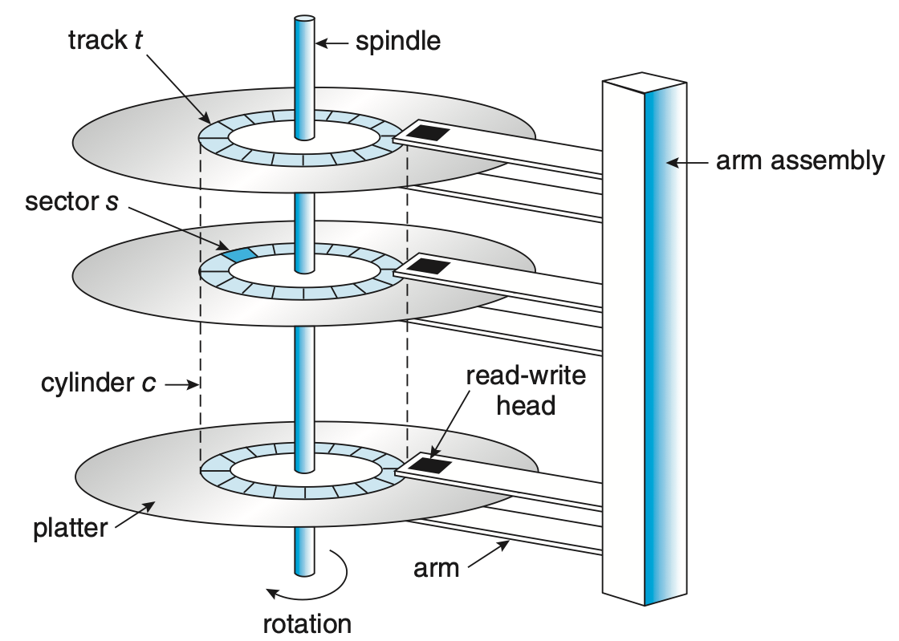
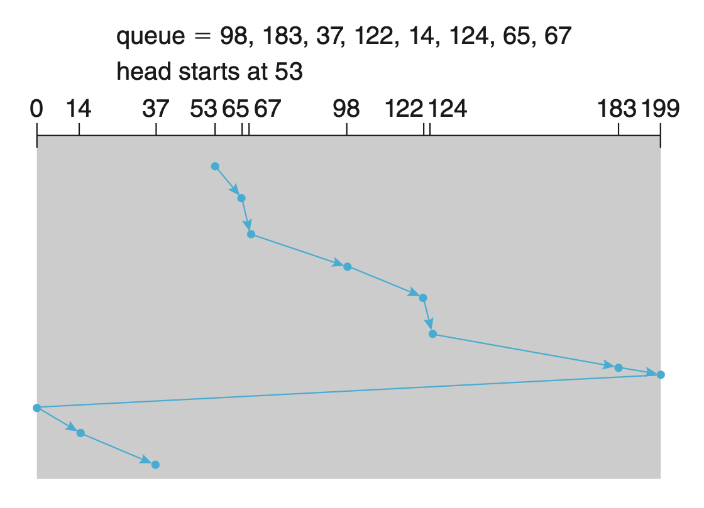

# Mass-Storage Management

!!! info "导读"

## 硬盘

硬盘是常见的二级存储。

### 结构

其结构按照从小到大分为：扇区(sectors)、磁道(tracks)、柱面(cylinders)，侧面的磁臂(disk arm)会以整体移动上面的所有读写磁头(r/w heads)。

<figure markdown>

 { width=100% } 

HDD moving-head disk mechanism.
</figure>

从硬盘上读写内容的过程如下：

1. 磁头移动到指定的柱面；
2. 磁头移动到指定的磁道；
3. 磁盘旋转到扇区位于磁头下方；
4. 读写扇区内容；

按照其机械过程，disk I/O 操作的主要时间构成为：

- 定位时间(positioning time / random-access time)：
    - 寻道时间(seek time)：磁头移动到指定柱面的时间；
    - 旋转时延(rotational latency)：目标扇区旋转到磁头下方的时间；
        - 取决于磁盘的转速，一般以 round per minute(rpm) 表示，容易得到，平均旋转时延为 $\frac{1}{2} \cdot \frac{1}{rpm} \cdot 60$ 秒；
- 传输时间(transfer time)：数据在 disk 和　memory 之间传输的时间；

因此，disk 的平均 I/O 操作时间为：

$$
\begin{aligned}
    \text{Average I/O time} 
    &= \underbrace{\text{average seek time} + \text{rotational latency}}_\text{average access time} \\
    &+ \underbrace{\frac{\text{data to transfer}}{\text{transfer rate}}}_{\text{transfer time}} \\
    &+ \text{controller overhead}
\end{aligned}
$$

??? eg "🌰"

    > 给出一个包含具体参数的例子来感受 I/O 操作慢在哪里

    一个 7200 rpm 的硬盘（所以旋转时延为 4.17 ms），其平均寻道时间为 5 ms，传输速率为 1 Gb/sec，控制器开销为 0.1 ms，那么读取 4 KB 的数据对应的平均 I/O 操作时间为：

    $$
    5 \text{ms} + 4.17 \text{ms} + \frac{4 \times 1000 \times 8}{1 \times 1000 \times 1000 \times 1000} \text{sec} + 0.1 \text{ms} = 9.302 \text{ms}
    $$

根据上面的分析我们不难得到如下结论：

1. 开销的大头是 access time；
2. 请求涉及的内存距离越远，具体的 access time 越大；
3. 我们在不考虑更新硬件能力的情况下，要想降低 I/O 时间，就需要让 I/O 操作的对象尽可能“顺序”；

因此，我们提出 disk scheduling。

### 调度

在开始之前，引入一个度量量：disk bandwidth = 传输数据量 / 请求开始到传输完成的时间间隔。我们想提高 I/O 性能，实际上是想提升 disk bandwidth。

在 I/O 请求十分稀疏的时候，I/O 操作总是空闲，每当出现一个 I/O 请求我们就直接处理，处理过程中也没有其它 I/O 请求出现，此时我们没有办法来加速这个过程。但当 I/O 请求比较密集，我们需要用一个 queue 来维护等待中的请求，此时，我们可以通过 disk scheduling 来调整这些请求被处理的顺序，来提高 disk bandwidth。而 disk scheduling 在这个 queue 存在的情况下才有意义。

> 每一个 I/O 请求可能包括这些信息：⓵ 输入还是输出；⓶ 指代目标文件的文件句柄；⓷ 传输涉及的内存地址；⓸ 传输的数据量……

如今的 disk driver 不在对操作系统暴露操作的 tracks、sectors 等，而是提供与物理地址相关的 logical block address(LBA)，而 logical block 是数据传输的最小单元。虽然不完全等价，但是我们在讨论 disk scheduling 的时候可以认为 LBA 的局部性和顺序性与物理地址的局部性和顺序性是一致的。

#### FCFS

又见 FCFS，仍然一样，先进 queue 的先处理，是最基本的 disk scheduling 算法。由于没有对数据做任何调整，所以也并没有任何优化。

#### SSTF

SSTF 即 shortest seek time first，由于 seek time 基本和物理地址距离正相关，所以就是总是选择距离当前磁头最近的那个请求去处理。

!!! warning "不同于之前提到过的 short xxx first 算法，SSTF 并不是理论最优方案！"

!!! advice "Advantages"

    - 低平均响应时间；
    - 高吞吐量；

!!! not-advice "Disadvantages"

    - 响应时间方差较大；
    - 存在饥饿问题（上面那个问题的极端情况）；
    - 计算 seek time 需要额外开销；

#### SCAN & LOCK

SCAN 算法下磁头在碰到 LBA 边界前只会单向移动，而在移动过程中处理能够处理的请求。这样保证了处理请求的过程中总是顺序的。

<figure markdown>

 { width=80% } 

SCAN disk scheduling.
</figure>

!!! advice "Advantages"

    - 高吞吐量；
    - 响应时间方差低（更均匀地响应）；
    - 平均响应时间低；

!!! not-advice "Disadvantages"

    - 由于单向，所以如果请求发生在磁头刚刚经过的地方，那么可能会需要等待较长时间才会被响应；

如果我们不走到底，而是走到最靠近边界的请求对应的 LBA 就提前掉头，那么就是 LOCK 算法。显而易见的，LOCK 算法可以减少一些不必要的 SCAN。

#### C-SCAN & C-LOCK

C-SCAN 即 Circular SCAN，C-SCAN 与 SCAN 的唯一区别是，C-SCAN 的磁头移动是始终单向的，当磁头达到 LBA 的边界时，径直返回到另一端，回程中不响应任何请求，类似于“[首尾相撞](https://www.xiaoyuzhoufm.com/podcast/6291be6c5cf4a5ad60ca0cc5){target="_blank"}”了，所以才叫“circular”。

<figure markdown>

 { width=80% } 

C-SCAN disk scheduling.
</figure>

!!! advice "Advantages"
    
    - C-SCAN 相比 SCAN 有更均匀的等待时间；

类似的，如果我们不走到底，在处理完最靠近边界的请求后就直接返回；对应的，在返程的时候不是返回到最低 LBA，而是从最靠近边界的请求开始，那么就是 C-LOCK 算法。同样，C-LOCK 可以减少一些不必要的 C-SCAN。

#### 调度算法的选择

