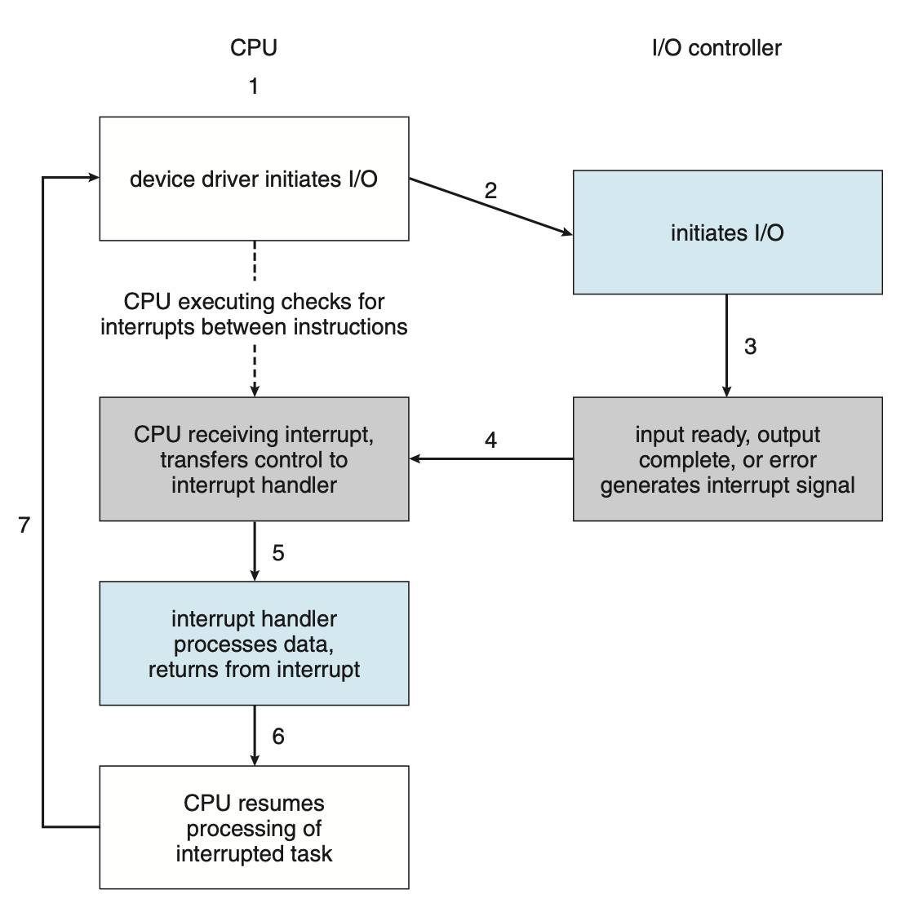
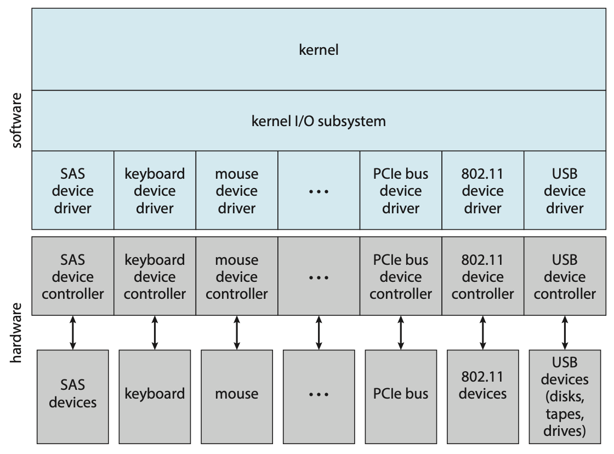

# Unit 4: 输入/输出 | I/O

!!! warning "说明"

    这部分内容（其实也包括之后的内容）写的比较简略，因为说是不太难，主要是期末了我也没心思写太细了，如果有好人可以帮我完善一下。

## I/O 概述

I/O 是计算机系统中的重要组成部分，它是计算机系统与外部世界交换信息的通道。I/O 设备的种类很多，如磁盘、打印机、键盘、鼠标、显示器、网卡等，承担了存储、通信、人机交互等若干功能。而我们知道 I/O 又是 CPU 的重要瓶颈，所以 I/O 系统的设计是一个很重要的问题。（~~但不是一个重要的考点？~~）

> 在 Linux 中，受 “[everything is a file](https://en.wikipedia.org/wiki/Everything_is_a_file){target="_blank"}” 思想的指导，I/O 设备也被看作一个特殊的文件。

!!! definition "concepts"

    - **总线(bus)**：连接各个硬件组成的“抽象”内部通信线路，更侧重于如何规范化地传输数据，是硬件与协议的统一[^1]；
    - **端口(port)**：设备与总线的连接点；
    - **控制器(controller)**：控制设备的硬件组成；
        - 集成在设备上或单独在电路板上；
        - 通常包括处理器、私有内存、微代码（小量代码）、总线控制器等；

### I/O 访问方式

当计算机需要设备做某些事的时候，发出请求，此时计算机需要等待设备的响应，按照等待方式的不同，分为轮询(polling)、中断(interrupt)两种。

!!! section "polling"

    轮询是操作系统与 I/O 设备交互的最简单方式。通常设备会用某种方式来标识设备是否可用或空闲，轮询指的是 CPU 不断向设备控制器查询设备状态，直到设备就绪，然后进行数据传输。这种方式的缺点是需要进行 busy wait，在设备比较缓慢的情况下会降低 CPU 的利用率。

!!! section "interrupt"

    > 我们已经在 [Overview](./Unit0.md#中断){target="_blank"} 讲过中断了，所以有关中断的具体技术细节就不再展开。
    
    现代计算机系统中，中断是操作系统与 I/O 设备交互的主要方式，计算机向设备发出请求以后，可以将当前进程调度走，等到设备处理完成后会向 CPU 发送中断，此时计算机再对结果做处理。中断的优点是 CPU 不需要进行 busy wait，在设备处理时间远大于上下文交换的情况下可以提高 CPU 的利用率。

    <figure markdown>
    
 { width=80% } 

    Interrupt-driven I/O cycle.
    </figure>

实际上使用哪种方案，其实与 “busy wait” 的优劣这个问题是等价的，我们已经在[同步](./Unit2-Part1.md#忙等待){target="_blank"}中有所涉及。

!!! section "DMA"

    上面提到的两种方法都是基于 CPU 全权负责 I/O 与内存交互的假设。在某些情况下，这些事情可能并不需要必须由 CPU 来负责。DMA(direct memory access)允许内存和 I/O 设备之间直接交互，不经过 CPU，这样可以减少 CPU 的负担，提高 I/O 性能。DMA 通常由独立的硬件设备 DMA controller 来实现。

    容易想象，DMA 有一定限制，通常 DMA 只负责做大量的、以 blocks 为单位的数据传输，而不是单个字节的传输。CPU 需要向 DMA controller 发出对应的命令，之后的事情就交给 DMA 来完成。命令通常包括操作类型、起始地址、数据长度等，传输方式一般是把要执行的指令的地址存到 DMA controller 的寄存器中，以这种方式委托 DMA controller 进行作业，有点像回调函数。

    当操作完成后，DMA controller 会向 CPU 发送中断信号，表示任务完成。

    磁盘就是典型的，通常使用 DMA 来实现 I/O 的设备。

## 应用程序 I/O 接口

随着技术发展，操作系统对标准化、通用化的 I/O 方式的需求与市场多元化、差异化的 I/O 设备之间的矛盾日益突出。因此，一套通用的、标准化的 I/O 接口是十分必要的。

于是，操作系统能够使用系统调用封装 I/O 操作，将不同操作的差异性透明化，在 UNIX 中，这个系统调用是 `ioctl`^[Wiki](https://en.wikipedia.org/wiki/Ioctl){target="_blank"}^。

<figure markdown>

 { width=80% } 

A kernel I/O structure.
</figure>

具体来说，不同设备可能在这些方面有区别：

!!! section "dimensions"

    - 数据传输模式(data transfer mode)：
        - 逐个字节传输，如 terminal；
        - 以块为单位传输，如 disk；
    - 访问方法(access method)：
        - 需要顺序访问，如 modem^[Wiki](https://en.wikipedia.org/wiki/Modem){target="_blank"}^；
        - 可以随机访问，如 CD-ROM；
    - 传输方法(transfer method)：
        - 同步的，需要按预计的响应时间进行传输并和系统的其他方面相协调，如 keyboard；
            - 阻塞式：一直等待直到 I/O 完成；
            - 非阻塞式：返回尽可能多的数据，不管是否完成；
        - 异步的，响应时间不需要规则或者可预测，不需要与其他计算机事件协调，如网络 I/O；
    - 共享(sharing)：
        - 可共享：可以被多个进程或线程并发使用，如 keyboard；
        - 独占的：不能被共享，如 tape；
    - 设备速度(device speed)
        - 这里的速度强调的是设备间的速度，而使用 buffer 技术可以同时统一 I/O 设备之间以及 CPU 和 I/O 设备之间的速度差异；
    - I/O 方向(I/O direction)：
        - `R-`，如 CD-ROM；
        - `-W`，如 graphics controller^[Wiki](https://en.wikipedia.org/wiki/Professional_Graphics_Controller){target="_blank"}^；
        - `RW` 如 disk；
    
    > 修改自 [xyx 的操作系统笔记](https://xuan-insr.github.io/%E6%A0%B8%E5%BF%83%E7%9F%A5%E8%AF%86/os/V_storage_management/12_io_systems/){target="_blank"}。

[^1]: [Bus (computing) | Wikipedia](https://en.wikipedia.org/wiki/Bus_(computing)){target="_blank"}