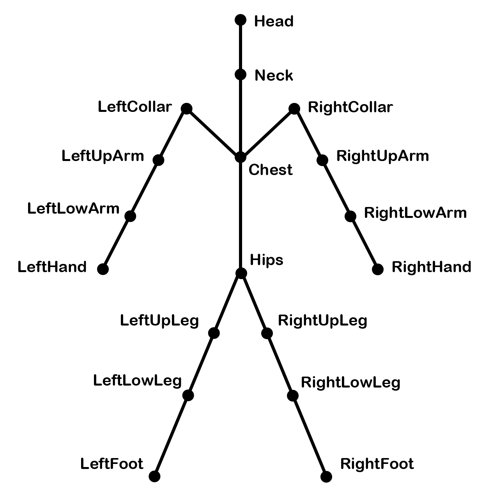
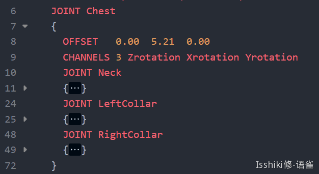

# BVH 格式详解

## 简介

BVH 表示 Biovision Hierarchy Data，是 Biovision 动捕设备的数据输出格式，是 BVA 格式的改进，广泛应用于动画制作软件。而该格式以文本形式储存，所以便于开发。
从需求的角度来讲，为了优雅地解决动画制作问题，它被分为了“蒙皮”和“骨骼”两个部分。而 BVH 就负责存储 **骨骼架结构** 和 **动作信息**。
BVH 格式总体来说比较优秀，但是缺乏对运动时的骨架姿势的完整解释。因为 BVH 是通过 **偏移(Offset)** 来描述运动的，即保存的是每一帧关键节点对于父节点的相对位移。

##  文件解析
> A BVH file has two parts, a header section which describes the hierarchy and initial pose of the skeleton; and a data section which contains the motion data. 

BVH 文件数据分为两个部分：

- **骨架信息(header section)**：定义了骨架的组织结构，指导如何解析数据块。
- **数据块(data section)**：包含了每一帧各部分的数据信息。

并且以递归的形式给出定义。
下面给出一个示例文件，然后做进一步分析。

??? summary
	```json
	HIERARCHY
	ROOT Hips
	{
		OFFSET	0.00	0.00	0.00
		CHANNELS 6 Xposition Yposition Zposition Zrotation Xrotation Yrotation
		JOINT Chest
		{
			OFFSET	 0.00	 5.21	 0.00
			CHANNELS 3 Zrotation Xrotation Yrotation
			JOINT Neck
			{
				OFFSET	 0.00	 18.65	 0.00
				CHANNELS 3 Zrotation Xrotation Yrotation
				JOINT Head
				{
					OFFSET	 0.00	 5.45	 0.00
					CHANNELS 3 Zrotation Xrotation Yrotation
					End Site 
					{
						OFFSET	 0.00	 3.87	 0.00
					}
				}
			}
			JOINT LeftCollar
			{
				OFFSET	 1.12	 16.23	 1.87
				CHANNELS 3 Zrotation Xrotation Yrotation
				JOINT LeftUpArm
				{
					OFFSET	 5.54	 0.00	 0.00
					CHANNELS 3 Zrotation Xrotation Yrotation
					JOINT LeftLowArm
					{
						OFFSET	 0.00	-11.96	 0.00
						CHANNELS 3 Zrotation Xrotation Yrotation
						JOINT LeftHand
						{
							OFFSET	 0.00	-9.93	 0.00
							CHANNELS 3 Zrotation Xrotation Yrotation
							End Site 
							{
								OFFSET	 0.00	-7.00	 0.00
							}
						}
					}
				}
			}
			JOINT RightCollar
			{
				OFFSET	-1.12	 16.23	 1.87
				CHANNELS 3 Zrotation Xrotation Yrotation
				JOINT RightUpArm
				{
					OFFSET	-6.07	 0.00	 0.00
					CHANNELS 3 Zrotation Xrotation Yrotation
					JOINT RightLowArm
					{
						OFFSET	 0.00	-11.82	 0.00
						CHANNELS 3 Zrotation Xrotation Yrotation
						JOINT RightHand
						{
							OFFSET	 0.00	-10.65	 0.00
							CHANNELS 3 Zrotation Xrotation Yrotation
							End Site 
							{
								OFFSET	 0.00	-7.00	 0.00
							}
						}
					}
				}
			}
		}
		JOINT LeftUpLeg
		{
			OFFSET	 3.91	 0.00	 0.00
			CHANNELS 3 Zrotation Xrotation Yrotation
			JOINT LeftLowLeg
			{
				OFFSET	 0.00	-18.34	 0.00
				CHANNELS 3 Zrotation Xrotation Yrotation
				JOINT LeftFoot
				{
					OFFSET	 0.00	-17.37	 0.00
					CHANNELS 3 Zrotation Xrotation Yrotation
					End Site 
					{
						OFFSET	 0.00	-3.46	 0.00
					}
				}
			}
		}
		JOINT RightUpLeg
		{
			OFFSET	-3.91	 0.00	 0.00
			CHANNELS 3 Zrotation Xrotation Yrotation
			JOINT RightLowLeg
			{
				OFFSET	 0.00	-17.63	 0.00
				CHANNELS 3 Zrotation Xrotation Yrotation
				JOINT RightFoot
				{
					OFFSET	 0.00	-17.14	 0.00
					CHANNELS 3 Zrotation Xrotation Yrotation
					End Site 
					{
						OFFSET	 0.00	-3.75	 0.00
					}
				}
			}
		}
	}
	MOTION
	Frames:    2
	Frame Time: 0.033333
	8.03	 35.01	 88.36	-3.41	 14.78	-164.35	 13.09	 40.30	-24.60	 7.88	 43.80	 0.00	-3.61	-41.45	 5.82	 10.08	 0.00	 10.21	 97.95	-23.53	-2.14	-101.86	-80.77	-98.91	 0.69	 0.03	 0.00	-14.04	 0.00	-10.50	-85.52	-13.72	-102.93	 61.91	-61.18	 65.18	-1.57	 0.69	 0.02	 15.00	 22.78	-5.92	 14.93	 49.99	 6.60	 0.00	-1.14	 0.00	-16.58	-10.51	-3.11	 15.38	 52.66	-21.80	 0.00	-23.95	 0.00	
	7.81	 35.10	 86.47	-3.78	 12.94	-166.97	 12.64	 42.57	-22.34	 7.67	 43.61	 0.00	-4.23	-41.41	 4.89	 19.10	 0.00	 4.16	 93.12	-9.69	-9.43	 132.67	-81.86	 136.80	 0.70	 0.37	 0.00	-8.62	 0.00	-21.82	-87.31	-27.57	-100.09	 56.17	-61.56	 58.72	-1.63	 0.95	 0.03	 13.16	 15.44	-3.56	 7.97	 59.29	 4.97	 0.00	 1.64	 0.00	-17.18	-10.02	-3.08	 13.56	 53.38	-18.07	 0.00	-25.93	 0.00	
	```

该样例给出了这样一个骨架：

!!! info ""
	

$$
vR = vYXZ\\
vM= vM_{child}M_{parent}M_{grandparent}...
$$

### header section

`HIERARCHY`关键字标识`header section`的开始，随后在下一行定义了根节点`ROOT`，而`Hips`则是该节点的名称。观察上方给出的骨架示意图，`Hips`节点作为整个骨架的根节点，保证了整个树形图的最大深度相对较小，减小误差。

其后给出了`OFFSET`和`CHANNELS`两个属性。

- `OFFSET`表示相对与父节点，该节点的偏移；
   - 对于 **根节点** 来说，它一般是`0 0 0`；
- ·`CHANNELS`后有两个部分，首先是一个数字表示后面有几个通道。
   - 一般来说，**根节点** 会有 6 个通道，如上示例有`Xposition Yposition Zposition Zrotation Yrotation Xrotation`，分别代表在`data section`中，帧序列的数据按这样的方式存储，前三个代表的是 **位移** 下每个分量的顺序（此处表示：依次为 x 坐标， y 坐标， z 坐标，一般只有根节点有这三个通道，用来表示骨架的位移），后三个代表的是 **旋转角度** 顺序；
   - 而对于 **非根节点**，一般有 3 个通道，代表的 **旋转角度** 顺序；
   - 注意，这里使用的 **角度制** 而非弧度制；

而在其后，以`JOINT`为关键字又表示了其子节点的定义，即以 **递归** 的形式给出定义。



- 在这张图中，`Neck``LeftCollar``RightCollar`是`Chest`的子节点，则`Neck``LeftCollar``RightCollar`的相对位置应当不变，之后的变换仅仅通过它们整体相对于`Chest`的旋转实现。

可以这么理解：

- `ROOT`和`JOINT`在语法上基本一致，
   - 只不过第一个出现的节点需要用`ROOT`索引，且它有6个通道；
   - 而之后的子节点通过`JOINT`索引，且有3个通道。

而在递归定义的末端，你会发现一个`End Site`，它只有`OFFSET`属性而没有`CHANNELS`属性，这是因为：

- 骨架是有若干“骨棒”组成的，这个“骨棒”称为`segment`，而定义一个`segment`需要两个端点，而`End Site`就是这个`segment`链的末端，它不具备旋转信息，因为它没有子节点，仅仅用来通过坐标表达最后一个`segment`的长度。

> One last note about the BVH hierarchy, the world space is defined as **a right handed coordinate system** with the **Y axis as the world up vector.** Thus you will typically find that BVH skeletal segments are aligned along the Y or negative Y axis (since the characters are often have a **zero pose** where the character **stands straight up with the arms straight down to the side**).

即世界坐标系一般是一个$y$**轴朝上的右手系**，并且骨架的初始姿势总是 T-Pose ，即人打开双手，像字母`T`一样站在地上。

### data section

`MOTION`关键字标识`data section`的开始，之后两行分别是`Frames`和`Frame Time`，表示 **帧数** 和 **帧数长度**（即帧率倒数，0.033333就是30帧）。
而再之后，则是真正的动画数据，根据`header section`给出的通道定义依次来给出每一帧的相对变化数据。 

## 理解

根据我的个人理解，`header section`类似于将一根根棒焊接在能够自由旋转的节点上，并规定数据的组织顺序，即解决了骨架“长什么样”的问题，并指导如何描述骨架“怎么动”；
而`data section`则类似于按照`header section`给出的定义，具体该如何改变各个节点的状态。
除了发送给`ROOT`的位置坐标来表示骨架的位移（平移矩阵），之后的一系列数据都表示该节点该如何旋转（旋转矩阵），那么理所当然的，这个节点的所有子节点都会以这个节点为中心进行相应的旋转；每次递归都重复这样的操作，最终指挥整个骨架的变换。
那么，实际上，每一个节点相对于根节点的变化就可以通过这些变换矩阵按照顺序累乘得到。

## 参考资料

- [https://en.wikipedia.org/wiki/Biovision_Hierarchy](https://en.wikipedia.org/wiki/Biovision_Hierarchy)
- [**https://research.cs.wisc.edu/graphics/Courses/cs-838-1999/Jeff/BVH.html**](https://research.cs.wisc.edu/graphics/Courses/cs-838-1999/Jeff/BVH.html)
- [https://blog.csdn.net/u012336923/article/details/50972968](https://blog.csdn.net/u012336923/article/details/50972968)
- [https://blog.csdn.net/u012336923/article/details/50979894](https://blog.csdn.net/u012336923/article/details/50979894)
- [https://zhuanlan.zhihu.com/p/71818887](https://zhuanlan.zhihu.com/p/71818887)
- [http://www.4k8k.xyz/article/one_2_one/97963901](http://www.4k8k.xyz/article/one_2_one/97963901)
- [http://www.youizone.com/2015/06/04/bvh-files.html](http://www.youizone.com/2015/06/04/bvh-files.html)
